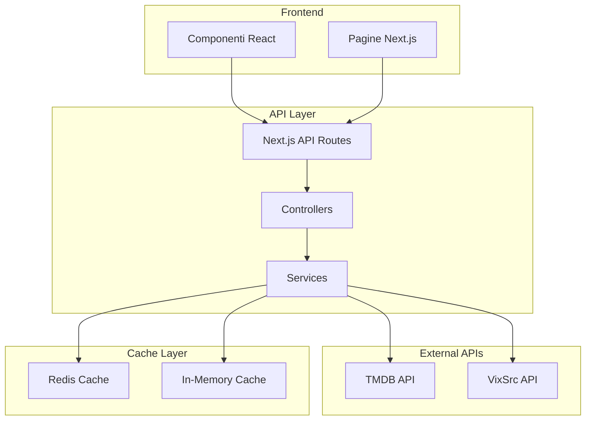
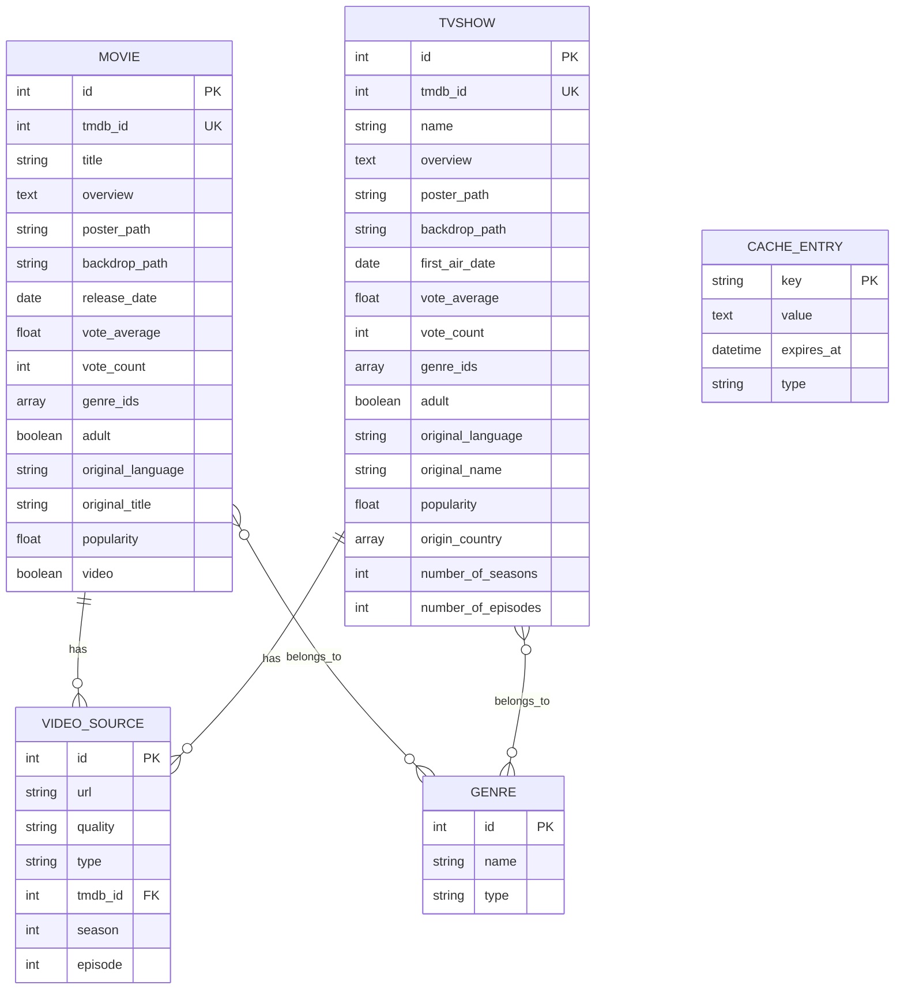
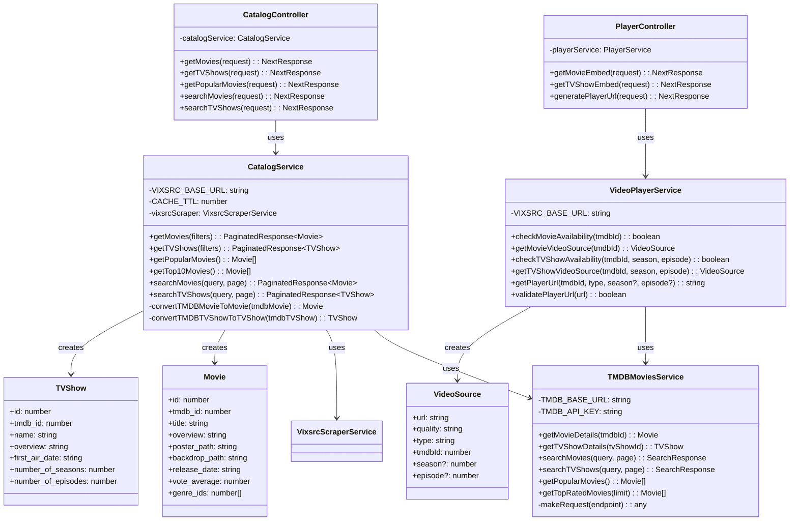
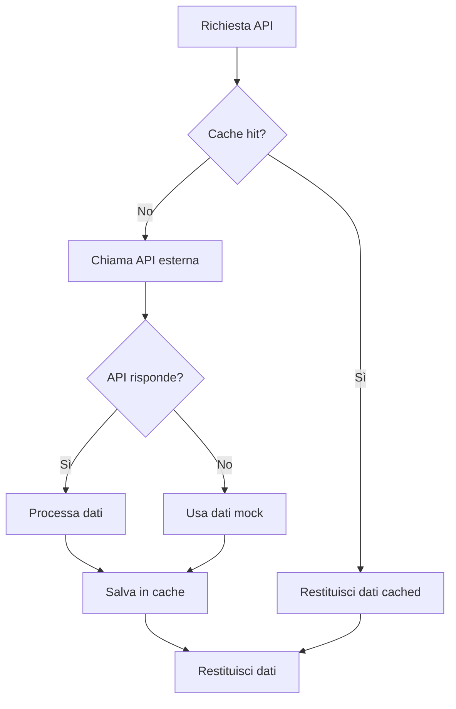
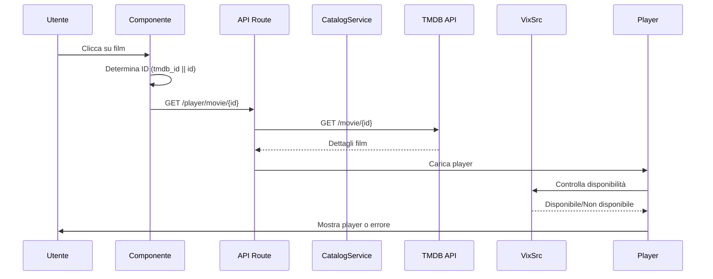
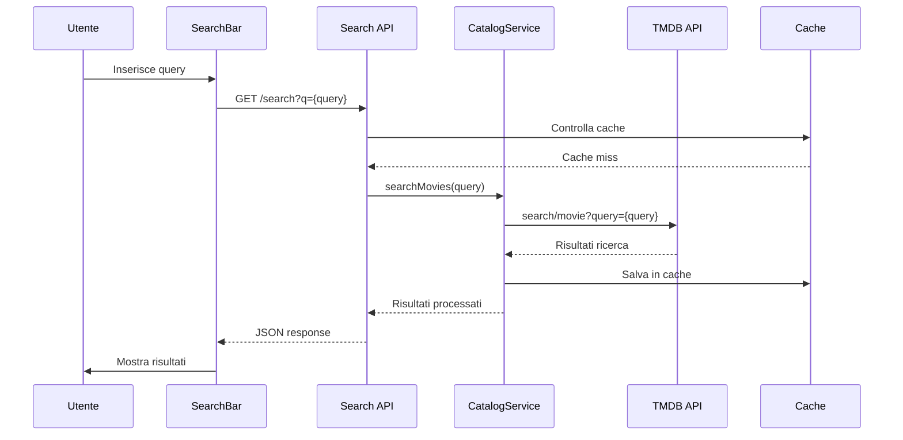
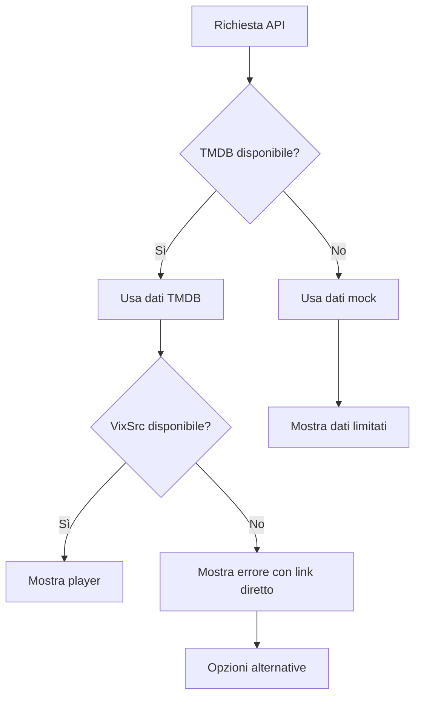
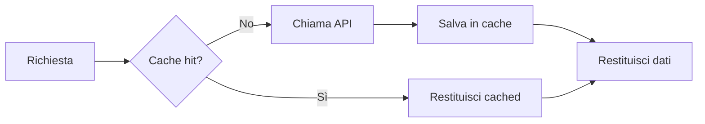

# API Film e Serie TV - Documentazione Tecnica

## Indice
1. [Panoramica del Sistema](#panoramica-del-sistema)
2. [Architettura delle API](#architettura-delle-api)
3. [Diagrammi ER](#diagrammi-er)
4. [Class Diagram](#class-diagram)
5. [Flowchart delle API](#flowchart-delle-api)
6. [Sequence Diagram](#sequence-diagram)
7. [API Endpoints](#api-endpoints)
8. [Gestione degli Errori](#gestione-degli-errori)
9. [Configurazione](#configurazione)

## Panoramica del Sistema

Il sistema di gestione film e serie TV di TheHustlePlace è basato su un'architettura Next.js con integrazione di multiple API esterne:

- **TMDB (The Movie Database)**: Per metadati e informazioni sui contenuti
- **VixSrc**: Per lo streaming dei contenuti
- **Redis**: Per la cache (opzionale)
- **Next.js API Routes**: Per l'astrazione e la gestione delle chiamate

## Architettura delle API



## Diagrammi ER

### Entità Principali



## Class Diagram

### Struttura delle Classi Principali



## Flowchart delle API

### Flusso di Ricerca e Riproduzione Film

```mermaid
flowchart TD
    A[Utente clicca su film] --> B{ID disponibile?}
    B -->|Sì| C[Usa tmdb_id]
    B -->|No| D[Usa id]
    C --> E[Naviga a /player/movie/{id}]
    D --> E
    
    E --> F[Carica dettagli da TMDB API]
    F --> G{TMDB risponde?}
    G -->|Sì| H[Mostra dettagli film]
    G -->|No| I[Usa dati fallback]
    
    H --> J[Controlla disponibilità VixSrc]
    I --> J
    J --> K{Disponibile su VixSrc?}
    K -->|Sì| L[Carica iframe player]
    K -->|No| M[Mostra errore con ID]
    
    L --> N[Player pronto]
    M --> O[Opzioni alternative]
```

### Flusso di Gestione Cache



## Sequence Diagram

### Sequenza di Caricamento Film



### Sequenza di Ricerca Contenuti



## API Endpoints

### Catalogo Film

| Endpoint | Metodo | Descrizione | Parametri |
|----------|--------|-------------|-----------|
| `/api/catalog/movies` | GET | Lista film con filtri | `genre`, `year`, `language`, `sortBy`, `page` |
| `/api/catalog/popular/movies` | GET | Film popolari | `page` |
| `/api/catalog/latest/movies` | GET | Ultimi film | `page` |
| `/api/catalog/top-rated/movies` | GET | Film meglio valutati | `page` |
| `/api/catalog/now-playing` | GET | Film al cinema | - |
| `/api/catalog/top-10` | GET | Top 10 mista | - |

### Catalogo Serie TV

| Endpoint | Metodo | Descrizione | Parametri |
|----------|--------|-------------|-----------|
| `/api/catalog/tv` | GET | Lista serie TV | `genre`, `year`, `language`, `sortBy`, `page` |
| `/api/catalog/popular/tv` | GET | Serie TV popolari | `page` |
| `/api/catalog/latest/tv` | GET | Ultime serie TV | `page` |
| `/api/catalog/top-rated/tv` | GET | Serie TV meglio valutate | `page` |

### Ricerca

| Endpoint | Metodo | Descrizione | Parametri |
|----------|--------|-------------|-----------|
| `/api/catalog/search/movies` | GET | Ricerca film | `query`, `page` |
| `/api/catalog/search/tv` | GET | Ricerca serie TV | `query`, `page` |

### Player

| Endpoint | Metodo | Descrizione | Parametri |
|----------|--------|-------------|-----------|
| `/api/player/movie/{id}` | GET | Video source film | `id` (TMDB ID) |
| `/api/player/tv/{id}` | GET | Video source serie TV | `id`, `season`, `episode` |
| `/api/player/check-availability` | GET | Controlla disponibilità | `tmdbId`, `type` |

### TMDB

| Endpoint | Metodo | Descrizione | Parametri |
|----------|--------|-------------|-----------|
| `/api/tmdb/movies/{id}` | GET | Dettagli film TMDB | `id` |
| `/api/tmdb/tv/{id}` | GET | Dettagli serie TV TMDB | `id` |

## Gestione degli Errori

### Codici di Errore

| Codice | Messaggio | Descrizione |
|--------|-----------|-------------|
| 400 | ID non valido | L'ID fornito non è un numero valido |
| 404 | Contenuto non trovato | Il film/serie TV non esiste su TMDB |
| 500 | Errore interno | Errore del server o API esterna |

### Fallback Strategy



## Configurazione

### Variabili d'Ambiente

```env
# TMDB Configuration
TMDB_API_KEY=your_tmdb_api_key_here

# VixSrc Configuration  
VIXSRC_BASE_URL=https://vixsrc.to

# Cache Configuration
REDIS_URL=redis://localhost:6379
CACHE_TTL=3600

# Next.js Configuration
NEXT_PUBLIC_APP_URL=http://localhost:3000
```

### Rate Limiting

- **TMDB API**: 40 richieste ogni 10 secondi
- **VixSrc**: 100 richieste ogni minuto
- **Cache**: 1000 richieste ogni secondo

### Cache Strategy



## Monitoraggio e Logging

### Metriche Chiave

- **Tempo di risposta API**: < 500ms per cache hit, < 2s per API call
- **Tasso di successo**: > 95% per richieste valide
- **Utilizzo cache**: > 80% hit rate

### Log Levels

- **INFO**: Operazioni normali (caricamento film, cache hit)
- **WARN**: Situazioni anomale (API timeout, dati mancanti)
- **ERROR**: Errori critici (API down, configurazione errata)

## Conclusioni

Il sistema API per film e serie TV di TheHustlePlace è progettato per essere:

- **Scalabile**: Architettura modulare con cache intelligente
- **Resiliente**: Fallback multipli e gestione errori robusta
- **Performante**: Cache Redis e ottimizzazioni Next.js
- **Manutenibile**: Separazione delle responsabilità e logging dettagliato

La documentazione completa con diagrammi Mermaid fornisce una visione chiara dell'architettura e del flusso dei dati, facilitando la manutenzione e l'estensione del sistema.
