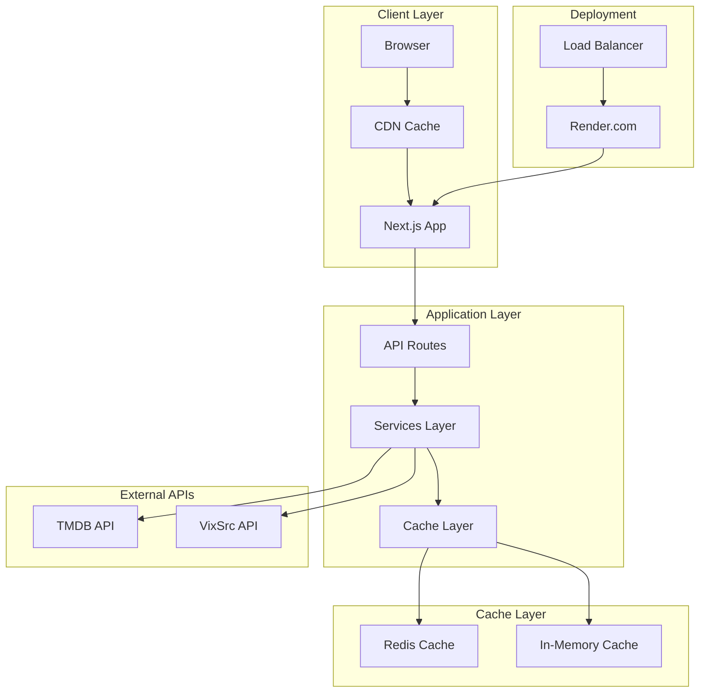
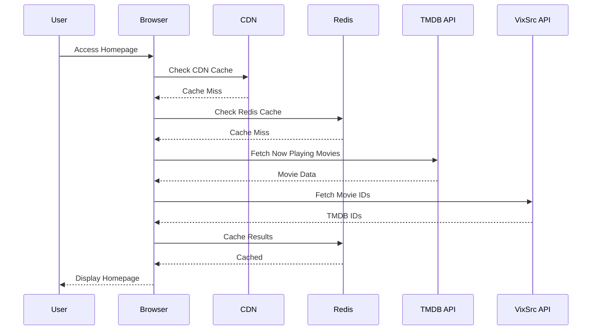
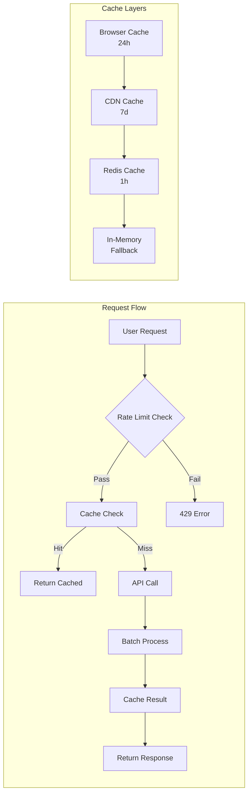
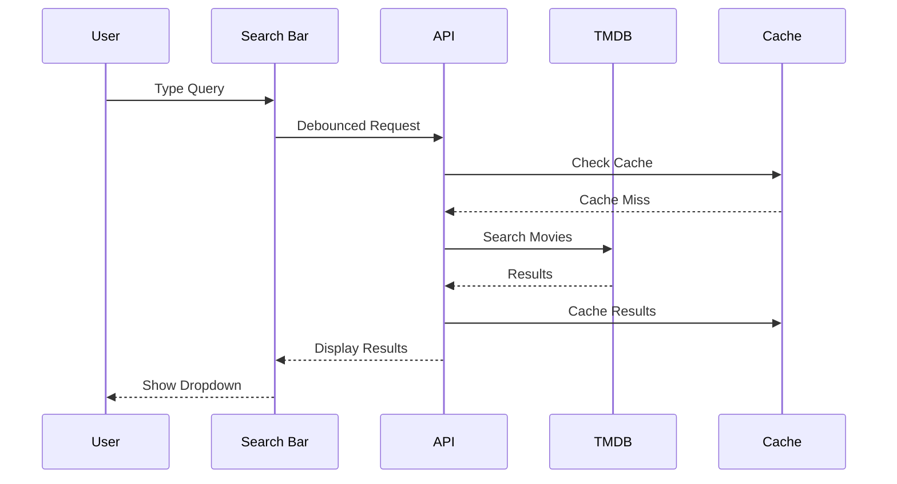
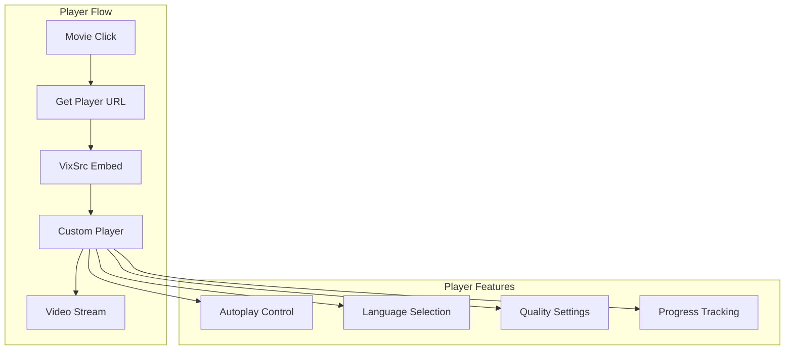
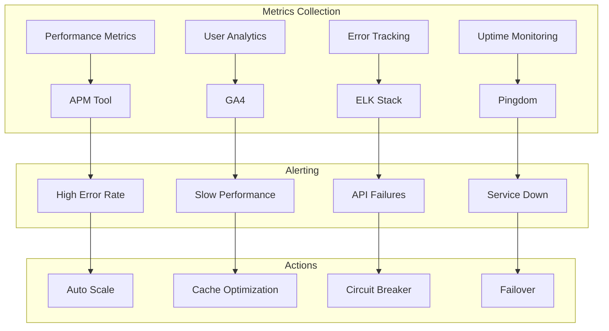
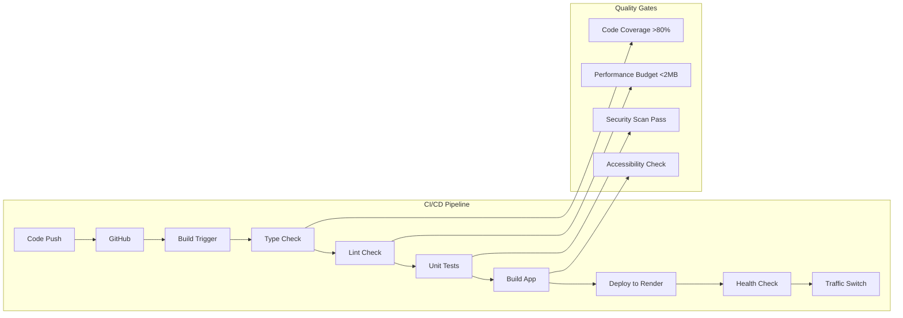
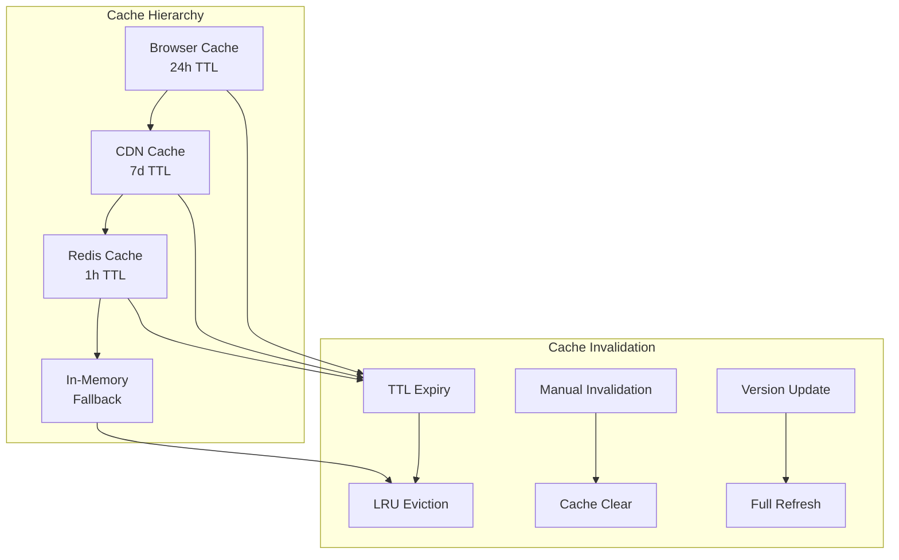
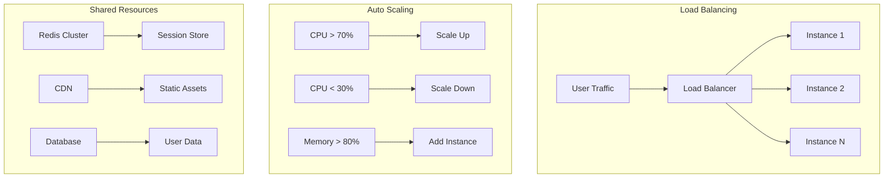

# 🏗️ Diagrammi Architettura TheHustlePlace

## 📊 Architettura Generale

## 🔄 Flusso dei Dati - Homepage

## 🎯 Performance Optimization Flow

## 🔍 Search Flow

## 🎬 Video Playback Flow

## 📊 Monitoring Dashboard

## 🚀 Deployment Pipeline

## 🔧 Cache Strategy

## 📈 Scalability Architecture

---

**Nota**: Questi diagrammi rappresentano l'architettura target di TheHustlePlace. Per visualizzarli, copia il codice Mermaid in un editor che supporta la sintassi Mermaid (come Obsidian, GitHub, o Mermaid Live Editor).
