# 🏗️ Diagrammi Architettura TheHustlePlace

## 📋 Panoramica

Questi diagrammi mostrano l'architettura completa del sistema TheHustlePlace, inclusi i flussi di dati, le integrazioni API e l'architettura dei componenti.

## 🎯 Architettura Generale


## 🔄 Flusso Dati Homepage

```mermaid
sequenceDiagram
    participant U as User
    participant H as Homepage
    participant T as TMDB API
    participant V as VixSrc API
    participant P as Player
    
    U->>H: Visita homepage
    H->>T: Richiedi film popolari
    T-->>H: Lista film + metadati
    H->>T: Richiedi trailer per film hero
    T-->>H: URL trailer YouTube
    H->>V: Verifica disponibilità streaming
    V-->>H: URL streaming disponibile
    H->>U: Mostra homepage completa
    
    U->>H: Click su film
    H->>P: Naviga al player
    P->>V: Carica URL streaming
    V-->>P: Iframe VixSrc
    P->>U: Mostra player
```



## 🎬 Sistema Player


## 🔍 Sistema di Ricerca


## 🎨 Architettura Componenti


## 🔧 Integrazione API

```mermaid
graph LR
    subgraph "External APIs"
        A[TMDB API] --> B[Movie Data]
        A --> C[TV Data]
        A --> D[Images]
        A --> E[Videos]
        
        F[VixSrc] --> G[Streaming URLs]
        F --> H[Availability Check]
        
        I[Trakt.tv] --> J[Popular Content]
        I --> K[Trending Data]
    end
    
    subgraph "Internal APIs"
        L[/api/tmdb/movies] --> M[Movie Details]
        N[/api/player/movie] --> O[Streaming Data]
        P[/api/catalog] --> Q[Combined Data]
    end
    
    subgraph "Frontend"
        R[Homepage] --> L
        R --> N
        R --> P
        S[Player] --> N
        T[Search] --> L
    end
    
    A --> L
    F --> N
    I --> P
```

## 🚀 Flusso Performance


## 🎯 Sistema di Stati


## 🔐 Sistema di Autenticazione (Futuro)


## 📊 Monitoraggio e Analytics


## 🎨 Design System


## 🔄 Deployment Pipeline


---

**🎯 Questi diagrammi forniscono una visione completa dell'architettura di TheHustlePlace, mostrando come tutti i componenti interagiscono per creare un'esperienza di streaming fluida e performante.**
