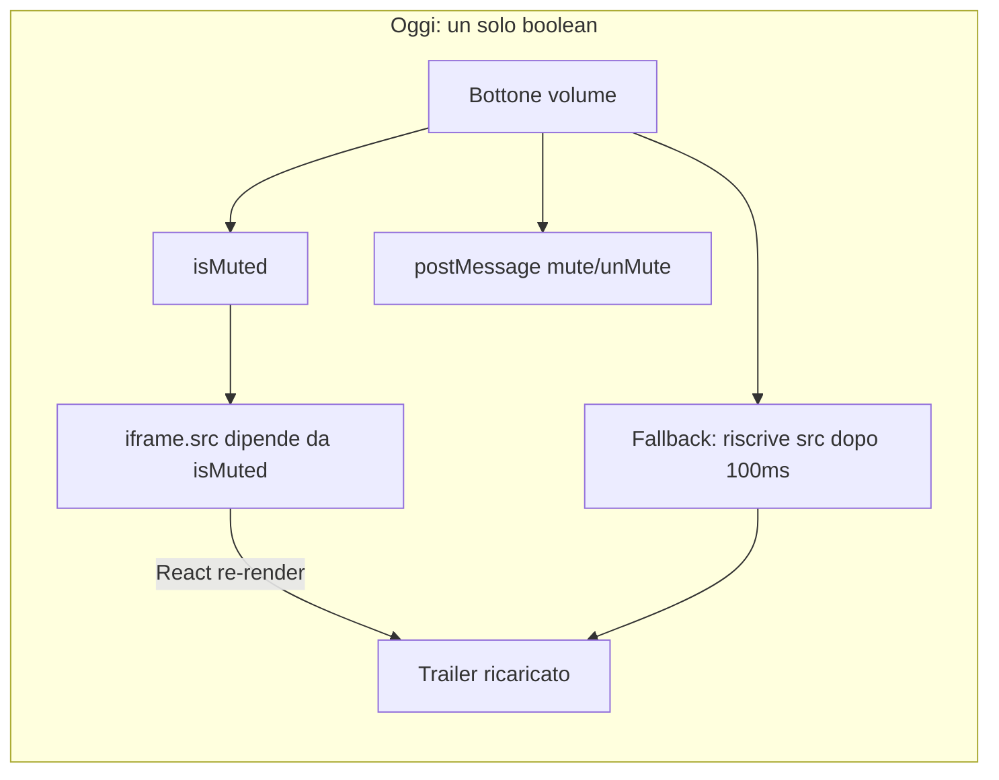
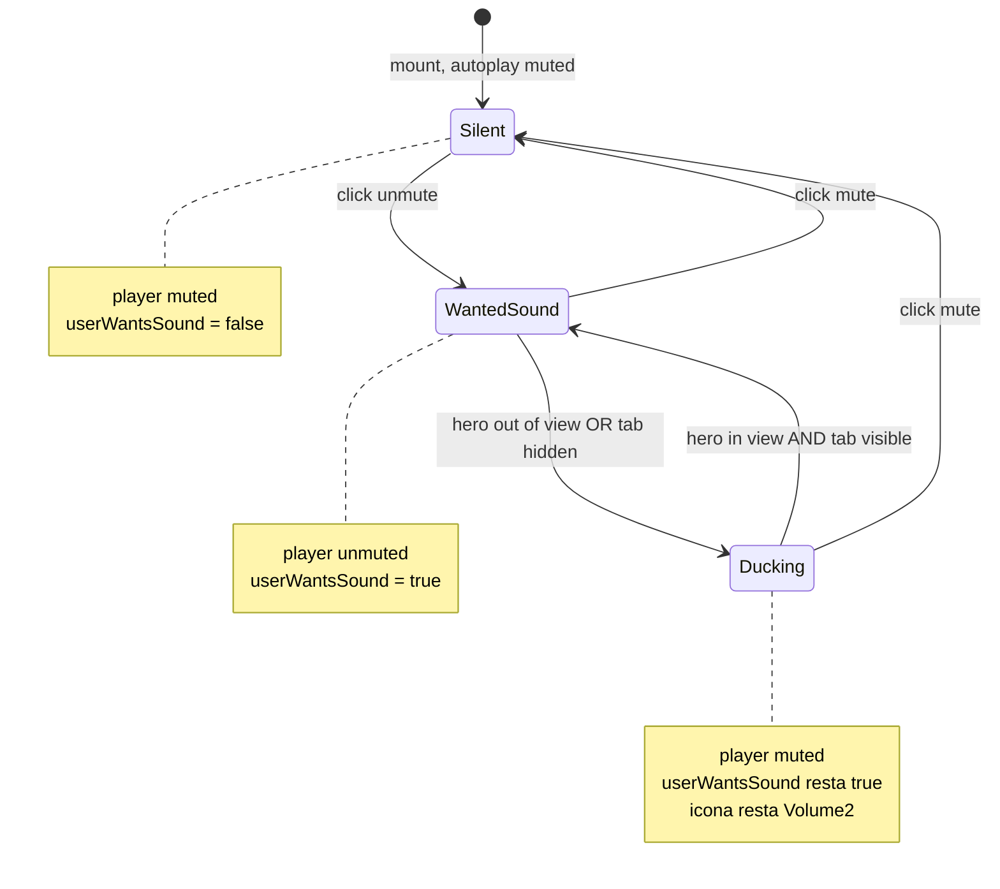
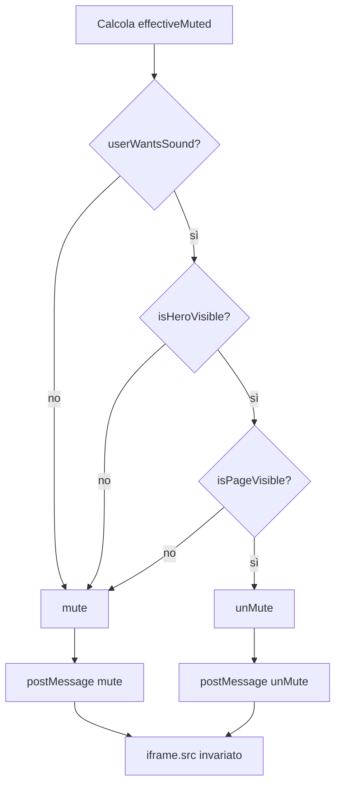
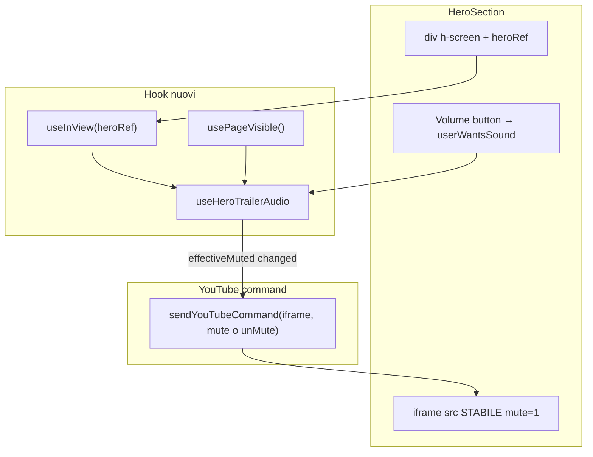
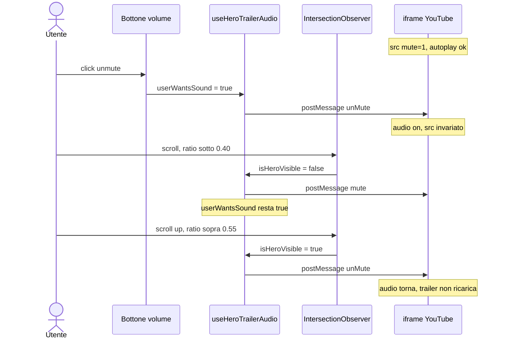
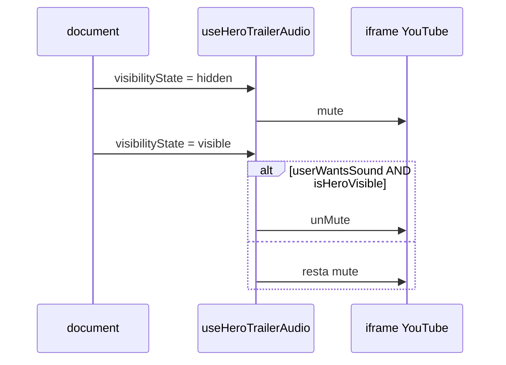
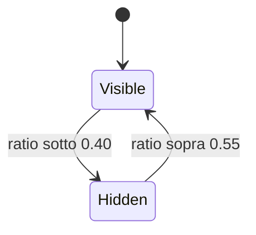
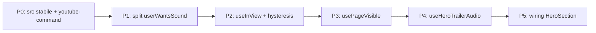

# Blueprint — Audio hero al cambio visibilità

- **Stato:** proposto
- **Area:** `HeroSection` trailer YouTube
- **Codice attuale:** `components/hero-section.tsx`, `lib/tmdb.ts` (`getYouTubeEmbedUrl`)
- **Fuori scope v1:** `ContentHoverCard`, `useTrailerPreview`, `useYouTubePlayer`

Mute e unmute automatici del trailer hero quando l’utente scorre via dalla sezione e quando ci torna. Il video resta in play; cambia solo l’audio.

---

## 1. Contratto

**Comportamento**

- Audio hero **spento** (default): lo scroll non cambia nulla. Resta muto.
- L’utente **accende** l’audio e **esce** dalla hero: il suono si ferma, il video **continua** muted.
- L’utente **torna** sulla hero: l’audio riparte **solo** se lo aveva acceso.
- Il bottone volume riflette la **preferenza**, non il mute transitorio da scroll. Altrimenti, uscendo, l’icona diventa “muto” e sembra che l’utente l’abbia spento.

**Non fare in v1**

- Non mettere in pausa il video. Cambia il visual, e `useTrailerTimer` è a orologio, non sul progresso YouTube.
- Non riusare `useYouTubePlayer`: è agganciato a `getElementById('youtube-player')`, non all’iframe della hero.
- Non usare `scrollY` di `useParallax`: è polling visivo, non visibilità.

---

## 2. Perché non attaccare lo scroll allo stato attuale

Oggi `HeroSection` confonde tre cose in un solo `isMuted`: preferenza utente, mute del player, e `src` dell’iframe.



Due bug da chiudere **prima** dello scroll:

1. `src={getYouTubeEmbedUrl(trailer, true, isMuted)}` — ogni cambio di mute ricarica il trailer.
2. Fallback in `toggleAudio` che riassegna `iframe.src` dopo 100ms — stesso reload, già oggi.

`IntersectionObserver` emette molti eventi. Se ognuno tocca `src`, la hero ricarica il trailer a ogni soglia.

---

## 3. Modello: preferenza ≠ mute effettivo

Tre input indipendenti, un solo output verso YouTube.

| Input | Chi lo decide | Default |
|---|---|---|
| `userWantsSound` | click sul volume | `false` |
| `isHeroVisible` | `IntersectionObserver` | `true` al mount |
| `isPageVisible` | `document.visibilityState` | `true` |

```
effectiveMuted = !userWantsSound || !isHeroVisible || !isPageVisible
```



`Ducking` è mute tecnico, non preferenza. Al rientro si torna a `WantedSound` senza un secondo click.



---

## 4. Architettura

Tre pezzi piccoli. Nessuno “smart” quanto tutta la hero.



`useYouTubePlayer` resta fuori. Eventuale migrazione è un ticket separato.

### File

| File | Azione | Ruolo |
|---|---|---|
| `hooks/useInView.ts` | nuovo | visibilità elemento, hysteresis, cleanup observer |
| `hooks/usePageVisible.ts` | nuovo | `visibilitychange` |
| `lib/youtube-command.ts` | nuovo | un `postMessage` ben formato, mai riscrivere `src` |
| `hooks/useHeroTrailerAudio.ts` | nuovo | riduce i tre input e comanda mute/unMute |
| `components/hero-section.tsx` | modifica | `heroRef`, split di `isMuted`, `src` fisso `mute=1` |
| `toggleAudio` attuale | da rimuovere | src rewrite + quattro payload duplicati |

`useTrailerPreview` e `ContentHoverCard` non si toccano in v1. La hero è `h-screen`: sulle card è già fuori viewport, quindi l’observer copre anche il conflitto audio con le card. Un `AudioFocus` globale è v2, solo se un viewport altissimo lascia vedere entrambi.

---

## 5. Sequenze

### Accendi audio, scendi, risali



### Tab in background



---

## 6. Visibilità: hysteresis

La hero è `h-screen`. Un threshold unico a `0.5` fa chatter se l’utente si ferma sul bordo.



Firma prevista:

```ts
useInView(heroRef, {
  threshold: [0, 0.25, 0.4, 0.55, 0.75, 1],
  enterAt: 0.55,
  leaveAt: 0.40,
})
```

- `root` = viewport.
- Observer sul contenitore `h-screen`, non sull’iframe (è scalato e centrato; l’intersezione mente).
- Non usare `useParallax` / `scrollY`: costano re-render a ogni frame e non dicono quanto è visibile la hero.

---

## 7. Contratto YouTube

### Montaggio iframe

- `src` calcolato **una volta** per chiave `trailer`: `getYouTubeEmbedUrl(trailer, true, true)` → sempre `mute=1`.
- Autoplay resta legale.
- Dipendenza React: `[trailer]`, non `[isMuted]` e non `[userWantsSound]`.

### Comando

Un payload, origin esplicito:

```ts
iframe.contentWindow.postMessage(
  JSON.stringify({ event: 'command', func: 'mute' /* o 'unMute' */, args: [] }),
  'https://www.youtube.com'
)
```

`enablejsapi=1` è già in `getYouTubeEmbedUrl`.

### Quando comandare

Solo se `effectiveMuted` **cambia**, e solo se l’iframe esiste. Idempotenza: se sei già muted e lo scroll ribatte, niente secondo `postMessage`.

### Cosa non fare

- `iframe.src = ...` per mutare.
- `setIsMuted` (o `userWantsSound`) nelle dipendenze dello `src`.
- Quattro stringhe di comando “per sicurezza”. Una corretta basta.

### Safari / autoplay

`unMute` programmatico dopo un unmute fatto dall’utente, **sulla stessa istanza iframe**, di solito passa. Se Safari lo rifiuta al rientro: resta muto, **non** ricaricare lo `src`. Il prossimo click sul volume è il recovery. Non mentire sul bottone: `userWantsSound` resta `true`.

---

## 8. API hook

```ts
useHeroTrailerAudio({
  iframeRef,
  userWantsSound: boolean,
  isHeroVisible: boolean,
  isPageVisible: boolean,
})
```

Dentro: `useEffect` su `effectiveMuted` → `sendYouTubeCommand`. Ref sull’iframe e sull’ultimo valore inviato, così non si comanda due volte lo stesso mute.

Bottone:

```ts
const [userWantsSound, setUserWantsSound] = useState(false)

const toggleAudio = () => setUserWantsSound((v) => !v)
// icona: userWantsSound ? Volume2 : VolumeX
```

Niente `setTimeout`, niente riscrittura URL.

---

## 9. Piano di implementazione



| Step | Cosa | Perché è in quest’ordine |
|---|---|---|
| **P0** | Togliere il fallback `src` da `toggleAudio`. Introdurre `sendYouTubeCommand`. | Senza questo, P2 è inutilizzabile. |
| **P1** | Iframe `src` sempre muted all’avvio; unmute solo via command. | Autoplay policy. |
| **P2–P4** | Hook isolati. | Testabili senza montare tutta la home. |
| **P5** | `heroRef` sul `div.relative.h-screen`, wiring, icona sulla preferenza. | Ultimo passo, non il primo. |

Non gonfiare `HeroSection`. L’audio-on-scroll è un hook, non altri ottanta righe nel JSX.

---

## 10. Casi limite

Da coprire come test, non come `if` sparsi nel componente.

1. **Mai unmuteato** → scroll down/up → zero `unMute`.
2. **Unmute + scroll via** → un `mute`. Rientro → un `unMute`. Nessun cambio `src`.
3. **Oscillazione sul bordo** (ratio 0.47–0.52) → hysteresis, non un comando ogni pixel.
4. **Cambio film** (`featuredMovie`) → nuovo iframe/src, `userWantsSound` reset a `false`. Il nuovo embed deve ripartire muto.
5. **Trailer assente** (solo backdrop) → observer può restare, i command no-op se manca iframe.
6. **Tab hidden** con audio on → mute; tab visible + hero visibile + preferenza on → unMute.
7. **`prefers-reduced-motion`** → irrilevante per l’audio. Non accoppiarlo.
8. **Touch / iOS** → stesso observer. Se `unMute` al rientro fallisce, il click volume resta il piano B.
9. **`ContentHoverCard` aperta** → in v1 coperta dallo scroll (hero già fuori). Se un giorno la preview si apre con hero ancora visibile, allora serve Audio Focus.

---

## 11. Fuori scope

- Pause/play. Mute tiene il motion e non litiga col timer da 90s.
- Context globale. Un observer locale basta.
- `setVolume(0)`. YouTube `mute` è l’API giusta.
- Rifare il player con l’IFrame API ufficiale. `postMessage` sull’iframe attuale basta se si smette di sparare comandi a raffica e di ricaricare lo `src`.

**v2 (non questo ticket)**

- Audio Focus condiviso tra hero e `ContentHoverCard` se entrambi visibili.
- Pausa del video fuori viewport, con timer agganciato allo stato YouTube invece che a un timeout.

---

## 12. Criterio di fatto

La feature è pronta quando:

- Accendi audio, scendi sulle righe: silenzio, trailer hero ancora in play se torni a guardarla.
- Risali: stesso punto del trailer, audio di nuovo on.
- Non accendi mai l’audio: scroll completo della home, sempre silenzio.
- In DOM: lo `src` dell’iframe **non cambia** durante lo scroll.
- Bottone: se lo avevi acceso, resti con l’icona volume anche mentre sei in basso.

---

## Collegamenti

- Indice blueprint: [README](README.md)
- Reference: [`HeroSection`](../studio/reference/components/hero-section.md)
- Hook da non riusare in v1: [`useYouTubePlayer`](../studio/reference/hooks/useYouTubePlayer.md)
- Helper URL: `lib/tmdb.ts` → `getYouTubeEmbedUrl`
- Timer (non accoppiarlo al mute): `hooks/useTrailerTimer.ts`
