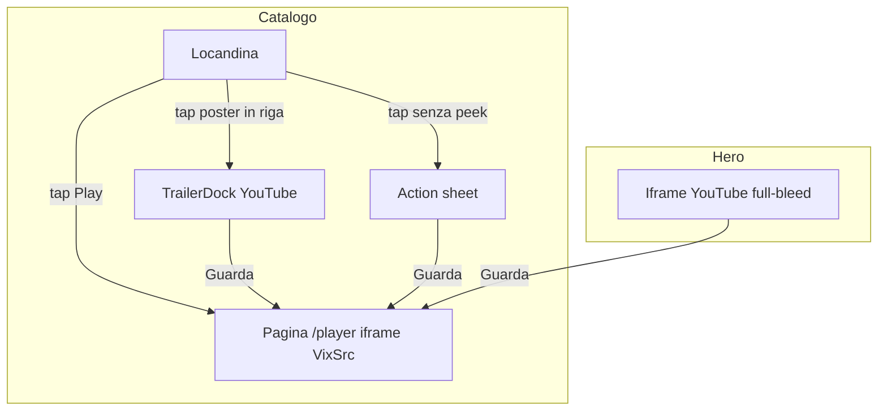

# Blueprint — Interazioni telefono (catalogo, trailer, player)

- **Stato:** implementato
- **Area:** pointer coarse / `hover: none`
- **Fork:** `useIsCoarsePointer()` in `hooks/useMediaQuery.ts`
- **Fuori scope:** Chromecast, skip intro, comandi parent→iframe VixSrc

Sul telefono non esiste hover. Desktop e telefono **non condividono** l’overlay trailer né la chrome del player. Se in produzione non vedi la card trailer enorme al centro, non è un commit mancato: quel pezzo è solo desktop.

---

## 1. Contratto

**Rilevamento**

- Telefono = `(pointer: coarse)` **oppure** `(hover: none)`.
- Non usiamo la larghezza dello schermo come fonte di verità (un iPad con mouse è desktop).

**Catalogo**

| Tap | Effetto |
|---|---|
| Cerchio Play | Apre `/player/...` (VixSrc) |
| Poster in una riga (Top 10, caroselli) | Peek: anello sulla card + `TrailerDock` **a schermo intero**, parte dal poster e si anima al centro |
| Stesso poster di nuovo | Chiude il dock |
| Poster senza peek di riga | `ContentActionSheet` dal basso (Guarda / Dettagli) |

Una sola peek alla volta in pagina (`TrailerPeekProvider`). Cambio route chiude.

**Trailer (YouTube, non il film)**

- Desktop: dopo 1s di hover, overlay centrale (`ContentHoverCard` portal).
- Telefono: overlay fullscreen (`TrailerDock` in portal). Parte dalla locandina e si anima al centro, muted di default, volume nel dock, swipe-down sulla barretta per chiudere.
- Hero: trailer YouTube in pagina su entrambi; sul telefono CTA compatte, niente tap fantasma sulle meta.

**Player (VixSrc, il film / la puntata)**

- Iframe `vixsrc.to`. I tap nel video **non** arrivano all’app (cross-origin).
- Telefono: `Indietro` / titolo / `Prossima` in una **riga sopra** l’iframe (`.player-stage` grid), sempre visibili, safe-area.
- Desktop: stessa chrome a overlay, si nasconde dopo 2,5s se non è fine puntata.
- `Prossima` c’è se esiste l’episodio successivo (non aspetta gli eventi VixSrc).
- Uscita TV: `replace` sulla lista episodi. Ingresso dalla serie: `push`, così lo swipe del browser torna alla serie.

**Resume**

- Continua a guardare e lista episodi passano `?startAt=`.
- Ogni puntata ha il proprio minutaggio in `localStorage` (`episodes[]`).

---

## 2. Perché due “player”

YouTube = anteprima. VixSrc = visione. Non si mescolano nello stesso iframe.

---

## 3. File

| Pezzo | File |
|---|---|
| Fork touch | `hooks/useMediaQuery.ts` |
| Tap card | `components/content-hover-card.tsx` |
| Dock trailer | `components/trailer-dock.tsx` |
| Peek una alla volta | `contexts/trailer-peek-context.tsx` |
| Righe | `components/movie-grid.tsx`, `top-10-row.tsx` |
| Sheet | `components/ui/content-action-sheet.tsx` |
| Chrome player | `components/player-shell.tsx`, `app/globals.css` (`.player-stage`) |
| Embed film | `components/vixsrc-embed-player.tsx` |

---

## 4. Commit di riferimento (main)

- `946b184` — sheet dal basso + trailer sotto la riga
- `677e2ee` / `4994ff4` — hero telefono
- `4172044` — chrome player fuori dall’iframe
- `ed4e6dc` / `c8f2627` — resume Continua a guardare e lista episodi

Produzione attesa: `https://the-hustle-place.vercel.app` (non `thehustleplace.com`).
