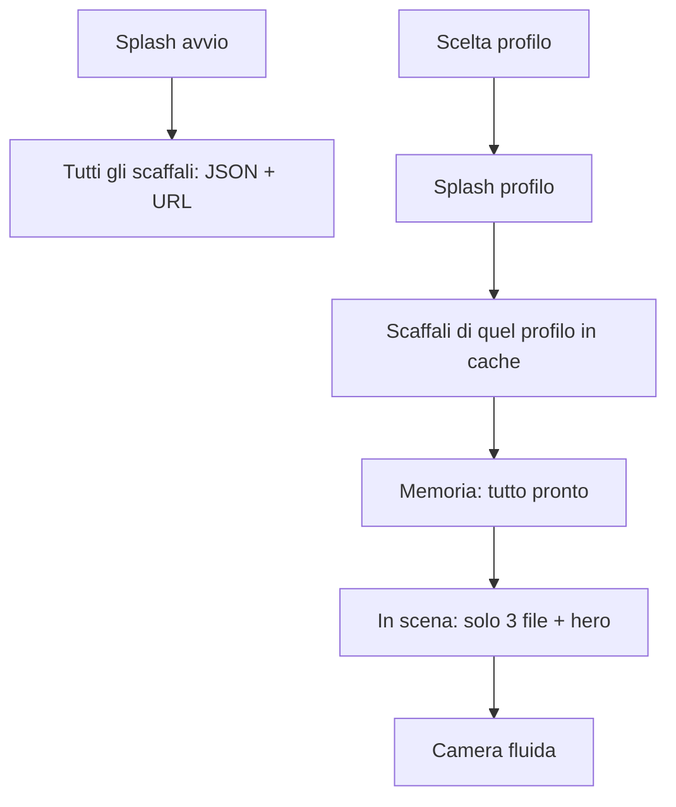
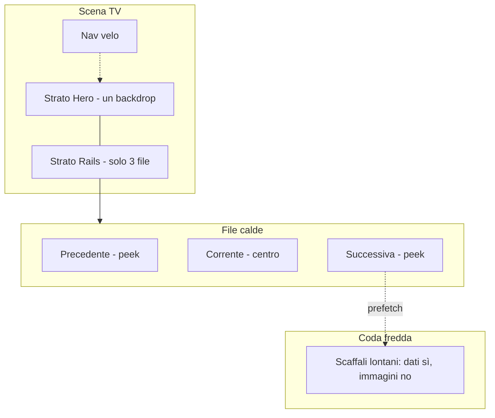
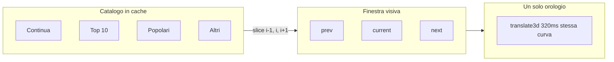
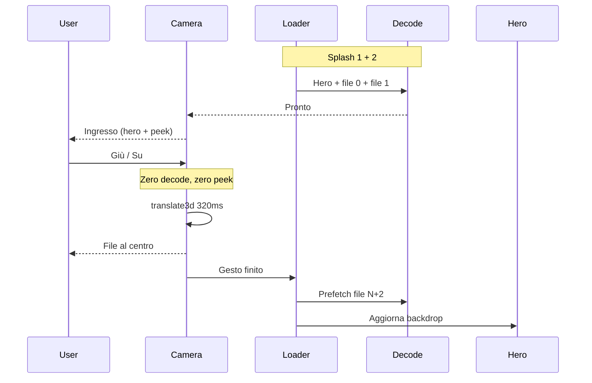
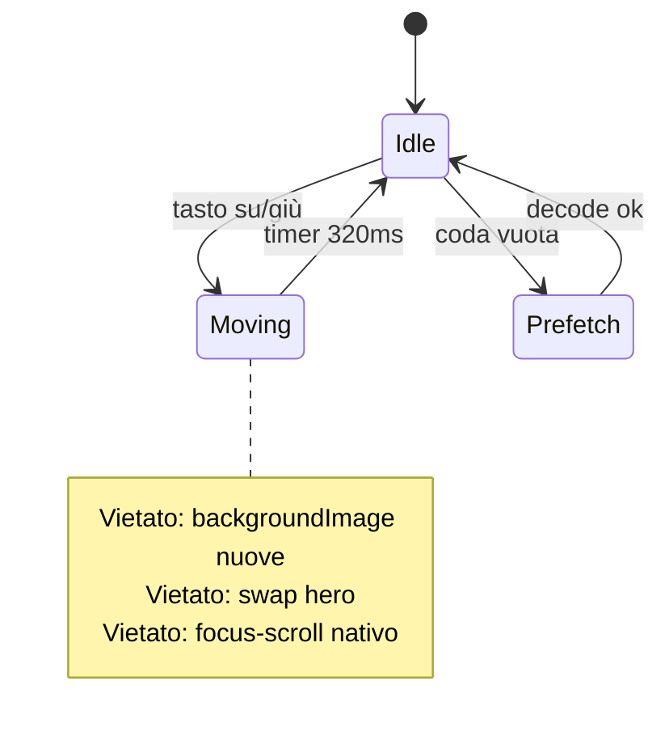

# Blueprint — Splash catalogo e camera a 3 scaffali

- **Stato:** implementato
- **Area:** TV living (`public/tv-os.html`)
- **Codice attuale:** `public/tv-os.html` (middleware riscrive `/living*` su questo file)
- **Fuori scope:** app React in `tv/` (non serve `/living`), player, ProfileGate visuale

Lo splash riempie il magazzino. La camera muove solo tre file già pronte. Caricare e mettere in scena restano due lavori distinti.

---

## 1. Contratto

**Comportamento**

- Splash 1 (avvio, H nera): scarica **tutti** gli scaffali condivisi come dati (JSON + URL), in parallelo alla household.
- Splash 2 (dopo la scelta profilo): ricalcola gli scaffali di quella persona (Continua a guardare, scelti per te, tesori) e decodifica **hero + primi due scaffali**.
- Home: in scena restano tre file calde (locandine attaccate). Le altre esistono in memoria, senza bitmap sulla camera.
- Tasto su/giù: un solo `translate3d` da 320ms. Zero rete, zero decode, zero swap hero **durante** il gesto.
- Hero e locandine della file nuova: solo **dopo** il settle. Prefetch della file a distanza 2 in idle.

**Non fare**

- Non agganciiare tutte le locandine al DOM come `background-image` nello splash.
- Non ripetere `paintBrowse` quando arrivano rail ritardate: cambia layout e fa scattare la camera.
- Non usare tre orologi (camera 320 / scale 180 / peek 340). Peek = settle.

---

## 2. Perché

Prima la home era un unico documento: tutti gli scaffali nel DOM, decode durante il gesto, backdrop hero a 340ms (in arrivo). Ogni scaffale nuovo si sarebbe agganciato allo stesso ingorgo.

Caricare ≠ mettere in scena. Lo splash fa aspettare **una volta**. Il tasto non aspetta più niente.

---

## 3. Tre strati

---

## 4. Quando si carica

| Cosa | Quando | Come |
|---|---|---|
| JSON catalogo condiviso | Splash 1 | `warmSharedCatalog` — top, film, serie, latest, coming, editorial |
| JSON del profilo | Splash 2 | `warmPersonalCatalog` — history + `/api/catalog/personal` |
| Backdrop hero + locandine file 0 e 1 | Fine splash 2 | `warmupUrls` / `new Image()` |
| Locandine file N e N+1 | Già in scena | `setRailHot` solo `dist <= 1` |
| File a distanza 2 | Idle dopo settle | `prefetchNeighbor` — decode, non attach |
| Hero peek sul titolo a fuoco | Dopo settle | `flushPeek` — mai in `Moving` |

Regola: **il tasto non carica niente.**

---

## 5. Implementazione

File unico: `public/tv-os.html`.

- `catalogShared` / `catalogPersonal`: magazzino. `railsOf` costruisce l’ordine degli scaffali dal magazzino, non dalla rete.
- `route` aspetta household + catalogo condiviso prima del gate (splash 1).
- `enterProfile` invalida il personale, tiene lo splash, attende personale + decode della prima finestra, poi va in home (splash 2).
- `syncRailWeights` attacca le locandine solo a distanza ≤ 1 e **non** gira mentre `cameraMoving`.
- `startCameraMove` / `onCameraSettle`: un token per i tasti ripetuti; peek e prefetch solo a terra.
- Focus sulle card browse: transizione `none` (scala istantanea). L’unico orologio visivo è la camera.

Nuova rail in futuro = item in `railsOf`. Stesso loader, stessa camera.
