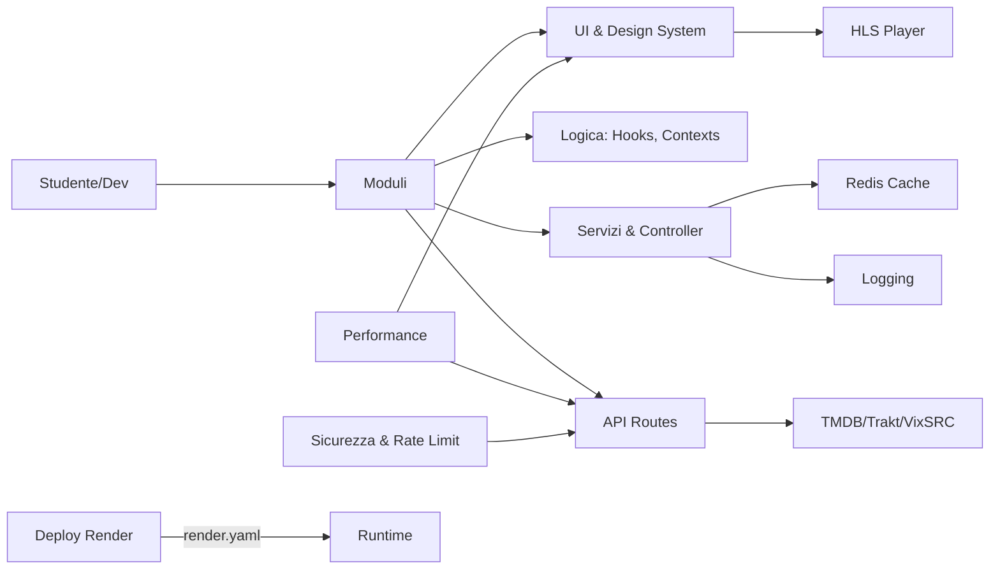

# Programma di Studio — Progetto Next.js (App Router)

Benvenuto nel percorso di studio strutturato per comprendere, progettare e riprodurre integralmente questo progetto. Il percorso è organizzato in moduli teorico-pratici, reference esaustiva (1:1 con il codice), esercizi, capstone e rubriche di valutazione.

## Percorso consigliato
1. Moduli fondamentali: setup → architettura → routing/layouts
2. UI e design system: Tailwind, componenti base → avanzati
3. Stato e logica: contexts, hooks, servizi e controller
4. API e integrazioni: route handlers, TMDB/Trakt/VixSRC
5. Player e media: HLS, UX e resilienza
6. Qualità: caching/Redis, logging, sicurezza, performance
7. Testing, debugging e deploy su Render
8. Esercizi progressivi e Capstone

## Come usare questo programma
- Ogni modulo contiene: Obiettivi, Teoria, Esempi dal progetto, Domande guida, Esercizi con hint, Collegamenti.
- Le reference mappano ogni file del codice con scopo, dipendenze, input/output, casi bordo, estensioni.
- Le rubriche offrono checklist di qualità per autovalutazione.

## Mappa ad alto livello (Mermaid)

## Indice dei contenuti
- metodologia.md — metodo di studio e valutazione
- moduli/ — lezioni progressione completa
- reference/ — mappa 1:1 del codice
- esercizi/ — esercitazioni guidate
- capstone/ — progetti finali
- rubriche/ — criteri valutativi
- glossario/ — termini tecnici
- faq/ — errori comuni e troubleshooting
