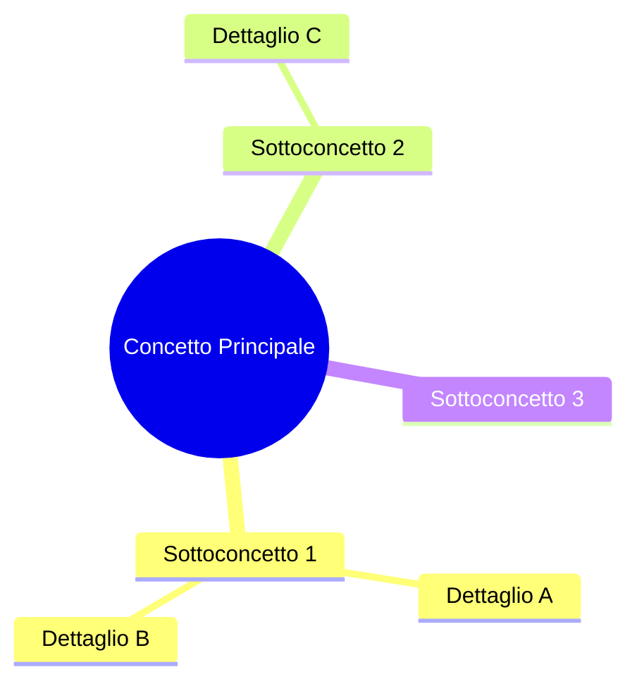
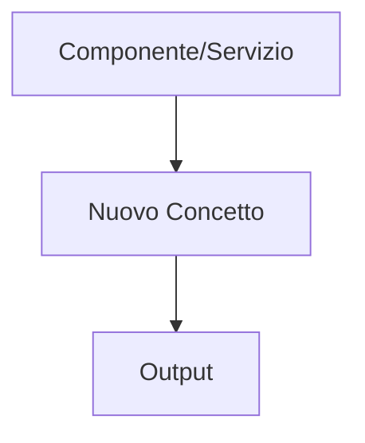

# XX — Titolo Modulo — Sottotitolo

## 🎯 Obiettivi del Modulo

Alla fine di questo modulo, sarai in grado di:
- **Obiettivo 1** concreto e misurabile
- **Obiettivo 2** concreto e misurabile
- **Obiettivo 3** concreto e misurabile

**⏱️ Tempo stimato**: X-Y ore di studio e pratica

**📋 Prerequisiti**: Aver completato il modulo XX-1

---

## 📚 Struttura del Modulo

Questo modulo è organizzato in sezioni **progressive**:

1. **Sezione 1** - Descrizione breve
2. **Sezione 2** - Descrizione breve
3. **Sezione 3** - Descrizione breve

### Mappa Concettuale



---

## 1. Sezione 1: Teoria e Concetti

> **🎯 Obiettivo**: Comprensione profonda del concetto

### 1.0 Introduzione: Il Problema

**Scenario reale:**
```javascript
// Problema da risolvere
const problem = "..."

// ❌ Approccio sbagliato
badApproach()

// ✅ Approccio corretto
goodApproach()
```

**Analisi:**
- Perché l'approccio sbagliato non funziona
- Perché l'approccio corretto risolve il problema
- Trade-offs da considerare

---

### 1.1 Concetto Chiave

#### 💡 Teoria Fondamentale

**Definizione:**

Il concetto X è...
- Caratteristica 1
- Caratteristica 2
- Caratteristica 3

**Come funziona:**

```typescript
// Esempio di codice chiaro
function example() {
    return "spiegazione"
}
```

**Vantaggi:**
- ✅ Beneficio 1
- ✅ Beneficio 2

**Svantaggi:**
- ❌ Limitazione 1
- ❌ Limitazione 2

---

#### 📚 Pattern di Utilizzo

**Pattern 1: Caso d'uso comune**

```typescript
// Implementazione pattern
class PatternExample {
    // ...
}
```

**Quando usare:**
- Situazione A
- Situazione B

**Quando NON usare:**
- Situazione C
- Situazione D

---

#### 🔬 Esempio dal Progetto

**Riferimento**: `path/to/file.ts`

```typescript
// Estrai codice reale con line numbers
// type:path/to/file.ts

export function example() {
    // ...
}
```

**🔍 Analisi guidata:**

- **Linea X**: Perché si fa questo?
- **Linea Y**: Cosa succede se...
- **Linea Z**: Alternativa possibile?

---

#### 🧠 Esercizio di Ragionamento X.X.X

**Domanda**: Perché...

**Pensa alla risposta prima di procedere...**

<details>
<summary>💭 Hint 1</summary>

Suggerimento iniziale
</details>

<details>
<summary>💭 Hint 2</summary>

Suggerimento più specifico
</details>

<details>
<summary>✅ Risposta Guidata</summary>

Spiegazione completa con reasoning
</details>

---

#### ✏️ Esercizio Pratico X.X.X

Crea un componente/funzione/modulo che:
- Requisito 1
- Requisito 2
- Requisito 3

**💡 Suggerimenti:**

<details>
<summary>Hint Livello 1</summary>

Suggerimento generale
</details>

<details>
<summary>Hint Livello 2</summary>

Suggerimento specifico
</details>

<details>
<summary>✅ Soluzione Guidata Passo-Passo</summary>

```typescript
// Passo 1: Inizia con...
function step1() {}

// Passo 2: Aggiungi...
function step2() {}

// Passo 3: Completa con...
function step3() {}
```

**Verifica la tua soluzione** con...
</details>

---

### 1.2 Concetto Avanzato

#### 💡 Approfondimento

Teoria più avanzata...

**Esempio:**

```typescript
// Codice esempio
```

---

#### ⚠️ Errori Comuni

**Errore 1:**

```typescript
// ❌ SBAGLIATO
badCode()

// ✅ CORRETTO
goodCode()
```

**Perché è sbagliato:** Spiegazione

**Come risolvere:** Spiegazione

---

## 2. Sezione 2: Implementazione Pratica

### 2.1 Hands-On

**Obiettivo pratico:**

Implementa...

**Step-by-step:**

1. Step 1
2. Step 2
3. Step 3

---

### 2.2 Integrazione con Progetto

Come questo concetto si integra nell'architettura esistente:



---

## 3. Sezione 3: Best Practices e Pattern

### 3.1 Pattern Architetturali

Pattern comunemente usati...

### 3.2 Performance

Considerazioni di performance...

### 3.3 Sicurezza

Considerazioni di sicurezza...

---

## 📝 Esercizi Finali del Modulo

### Esercizio 1: Fondamentale

**Obiettivo:** Implementare X base

**Requisiti:**
- [ ] Requisito 1
- [ ] Requisito 2
- [ ] Requisito 3

**Rubrica di valutazione:**
- Funzionalità: ✅/❌
- Codice pulito: ✅/❌
- Gestione errori: ✅/❌

---

### Esercizio 2: Avanzato

**Obiettivo:** Implementare Y avanzato

**Requisiti:**
- [ ] Requisito 1
- [ ] Requisito 2
- [ ] Requisito 3

---

## ✅ Checklist Finale

Verifica di aver compreso:

- [ ] Concetto fondamentale 1
- [ ] Concetto fondamentale 2
- [ ] Come implementare X
- [ ] Quando usare Y
- [ ] Errori da evitare

---

## 📚 Risorse Aggiuntive

- **Documentazione ufficiale**: [link]
- **Articoli correlati**: [link]
- **Video tutorial**: [link]

---

## 🔍 Domande Guida per l'Apprendimento

1. Domanda che stimola il ragionamento
2. Domanda che verifica la comprensione
3. Domanda che collega a altri concetti

---

## 🔗 Collegamenti

- **Reference**: `doc/studio/reference/path/`
- **Altri moduli**: Modulo X, Modulo Y
- **Capstone**: [Link capstone correlati]

---

**Congratulazioni!** 🎉

Hai completato il modulo XX. Ora sei pronto per il modulo XX+1!


