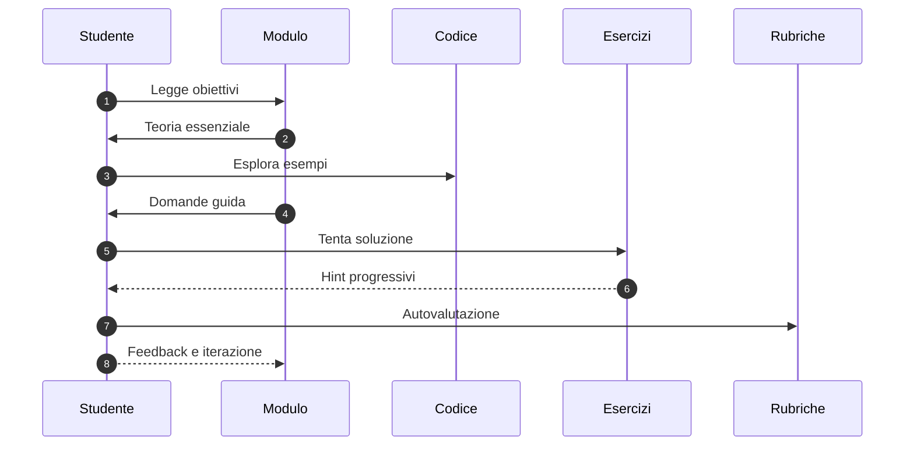

# Metodologia Didattica

Questo programma adotta un approccio accademico-pratico: teoria essenziale, esempi reali dal codice, domande guida (stile socratico) e esercizi progressivi. L’obiettivo è allenare il ragionamento e la progettazione, non solo la memoria.

## Principi
- Progressione a spirale: ogni modulo riprende concetti precedenti con maggiore profondità.
- Domande prima delle risposte: si guida all’intuizione, poi si verifica con esempi.
- Esplorazione del codice: link a reference 1:1 per abituare alla lettura di codice esistente.
- Valutazione formativa: rubriche e checklist per autonomia.

## Struttura di ogni modulo
- Obiettivi misurabili
- Teoria (schema, concetti, alternative)
- Esempi contestualizzati (estratti dal repo)
- Domande guida (hint progressivi)
- Esercizi (senza soluzioni immediate; 3 livelli di hint)
- Collegamenti e letture correlate

## Come studiare
1. Leggi gli obiettivi e prova a riformularli con parole tue.
2. Studia la teoria cercando analogie con sistemi già noti.
3. Analizza gli esempi nel codice (apri i file indicati in reference).
4. Rispondi alle domande guida prima di vedere gli hint.
5. Svolgi l’esercizio e confrontati con la rubrica.

## Diagramma del ciclo di apprendimento

## Valutazione
- Progetti capstone valutati per: chiarezza architetturale, robustezza, performance, sicurezza, UX.
- Esercizi valutati per: correttezza, leggibilità, coerenza con il design system, gestione edge cases.
