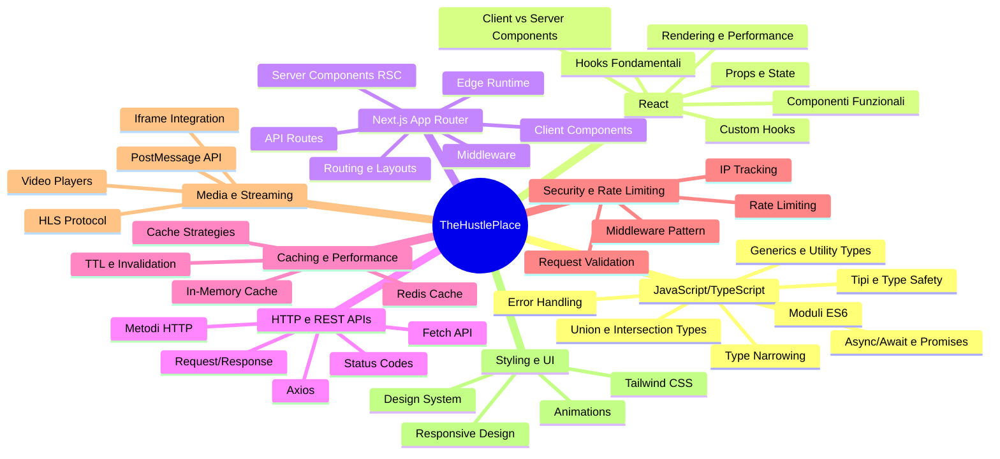
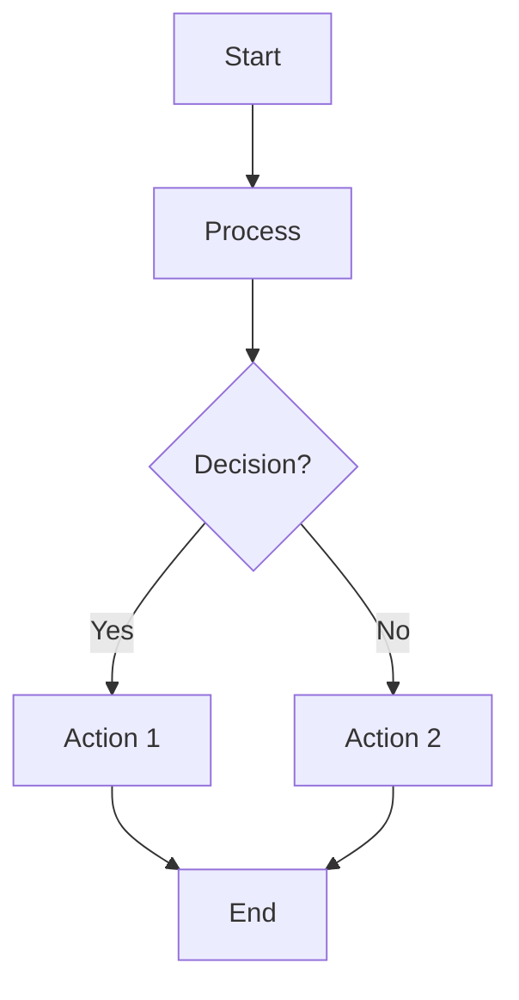
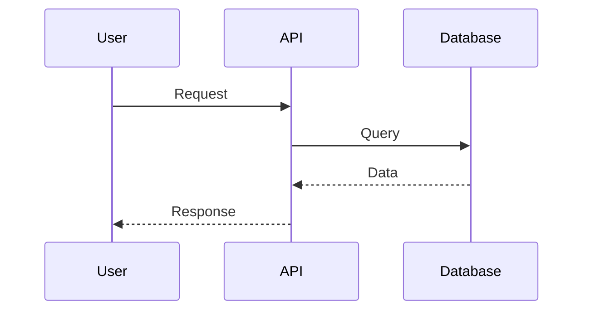
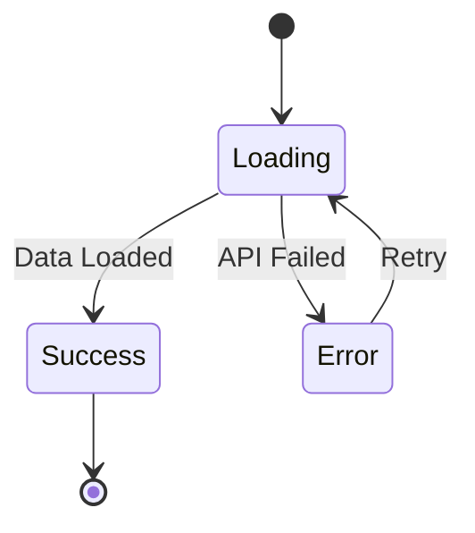
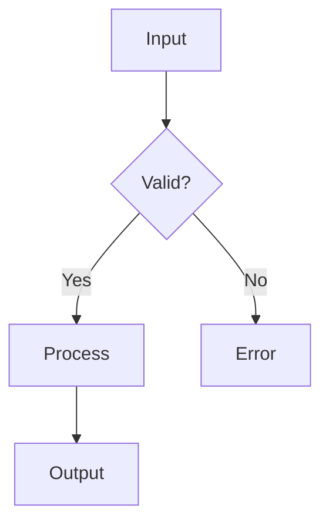

# 00 — Prerequisiti — Corso Completo

## 🎯 Obiettivi del Modulo

Alla fine di questo modulo, sarai in grado di:
- **Comprendere** tutti gli elementi tecnici utilizzati nel progetto TheHustlePlace
- **Programmare** con sicurezza utilizzando TypeScript, React e Next.js
- **Leggere e interpretare** i diagrammi Mermaid dell'architettura
- **Scrivere** codice seguendo i pattern utilizzati nel progetto
- **Debug** e risolvere problemi comuni

---

## 📚 Struttura del Corso

Questo modulo è organizzato in sezioni progressive che costruiscono una base solida per comprendere l'intero progetto.

### Mappa Concettuale Completa



---

## 1. JavaScript/TypeScript: Fondamenta Solide

> **🤔 Pensa prima di procedere**: Perché JavaScript non è sufficiente? Cosa aggiunge TypeScript che ci aiuta a scrivere codice migliore?

### 1.1 TypeScript: Sistema di Tipi Avanzato

#### 💡 Introduzione: Il Problema che Risolve

Immagina di scrivere una funzione per calcolare la media dei voti di un film:

```typescript
// JavaScript (senza tipi)
function calculateAverage(votes) {
    return votes.reduce((sum, vote) => sum + vote, 0) / votes.length
}
```

**Problema**: Cosa succede se qualcuno chiama `calculateAverage("invalid")`? L'errore appare solo a runtime, quando l'utente usa l'app!

**Soluzione TypeScript**: Con i tipi, l'errore viene catturato durante lo sviluppo:

```typescript
// TypeScript (con tipi)
function calculateAverage(votes: number[]): number {
    return votes.reduce((sum, vote) => sum + vote, 0) / votes.length
}

// ❌ Errore a compile-time, non a runtime!
calculateAverage("invalid") // TypeScript: "string non è assegnabile a number[]"
```

#### 📚 Teoria: Perché TypeScript?

1. **Type Safety**: Errori catturati prima del deploy
2. **Auto-completamento**: L'IDE suggerisce proprietà e metodi
3. **Documentazione**: I tipi documentano il codice
4. **Refactoring Sicuro**: Modifiche guidate con verifica dei tipi

**Esempio pratico** - Vediamo come nel progetto definiamo un film:

```1:19:types/index.ts
// Tipi comuni per l'applicazione

export interface Movie {
    id: number;
    title: string;
    overview: string;
    poster_path?: string;
    backdrop_path?: string;
    release_date: string;
    vote_average: number;
    vote_count: number;
    genre_ids: number[];
    adult: boolean;
    original_language: string;
    original_title: string;
    popularity: number;
    video: boolean;
    tmdb_id?: number;
}
```

**🎓 Analisi guidata**:
- Cosa significa `?:` dopo `poster_path`? → Proprietà opzionale (può essere `undefined`)
- Perché `id: number` invece di `id: string`? → TMDB usa numeri per gli ID
- `genre_ids: number[]` → Array di numeri (gli ID dei generi)

#### 🧠 Esercizio di Ragionamento 1.1.1

**Domanda**: Perché `poster_path` è opzionale mentre `title` non lo è?

**Pensa alla risposta prima di procedere...**

**Risposta guidata**:
1. `title` è **sempre disponibile** → ogni film DEVE avere un titolo
2. `poster_path` può mancare → alcuni film potrebbero non avere un poster ancora
3. TypeScript ci costringe a gestire il caso `undefined`:

```typescript
function displayMovie(movie: Movie) {
    console.log(movie.title) // ✅ Sempre disponibile
    
    // ❌ Errore TypeScript se non controlliamo
    console.log(movie.poster_path.toUpperCase())
    
    // ✅ Corretto: gestiamo il caso undefined
    if (movie.poster_path) {
        console.log(movie.poster_path.toUpperCase())
    }
}
```

#### ✏️ Esercizio Pratico 1.1.1

Crea un'interfaccia `TVShow` basandoti su `Movie`, ma considera:
- Le serie TV hanno `name` invece di `title`
- Hanno `first_air_date` invece di `release_date`
- Hanno `origin_country: string[]` (un film no)

**Soluzione guidata passo-passo**:

```typescript
// Passo 1: Parti da Movie come base
interface TVShow {
    id: number  // Stesso
    // ...
}

// Passo 2: Sostituisci title con name
interface TVShow {
    id: number
    name: string  // ← Cambiato da title
    // ...
}

// Passo 3: Sostituisci release_date con first_air_date
interface TVShow {
    id: number
    name: string
    overview: string
    poster_path?: string
    first_air_date: string  // ← Cambiato da release_date
    // ...
}

// Passo 4: Aggiungi campi specifici per serie TV
interface TVShow {
    // ... campi comuni ...
    origin_country: string[]  // ← Nuovo campo
    // ...
}
```

**📝 Verifica la tua soluzione** guardando `types/index.ts` nel progetto per vedere come è stata implementata realmente!

#### Tipi Primitivi e Base

#### Union Types e Discriminated Unions

> **🤔 Domanda di ragionamento**: Hai mai scritto codice come questo?
> ```typescript
> function processContent(content) {
>     if (content.title) {
>         return content.title
>     } else {
>         return content.name
>     }
> }
> ```
> **Problema**: Come fai a sapere se `content` ha `title` o `name`? TypeScript non può aiutarti!

##### 💡 Union Types: "Questo O Quello"

```typescript
// Union type semplice
type ContentType = 'movie' | 'tv'

// Utilizzo nel progetto - `components/movie-card.tsx`:
```38:42:components/movie-card.tsx
        const url = type === 'movie'
            ? `/player/movie/${itemId}`
            : `/series/${itemId}`
        window.location.href = url
    }
```

**Perché funziona?** TypeScript sa che `type` può essere SOLO `'movie'` o `'tv'`, quindi può controllare il tipo durante la compilazione.

##### 🧠 Discriminated Unions: Il Pattern "Tag"

**Problema reale**: Come rappresentare un film O una serie TV in modo sicuro?

**Soluzione sbagliata**:
```typescript
// ❌ TypeScript non può sapere quale campo esiste
type Content = {
    title?: string
    name?: string
    release_date?: string
    first_air_date?: string
}
```

**Soluzione corretta (Discriminated Union)**:
```typescript
// ✅ TypeScript sa esattamente quali campi sono disponibili
type Content = 
    | { type: 'movie'; title: string; release_date: string }
    | { type: 'tv'; name: string; first_air_date: string }

function getContentTitle(content: Content): string {
    // TypeScript "narrowing" automatico dopo il check
    if (content.type === 'movie') {
        // ✅ Qui TypeScript sa che content.type === 'movie'
        // ✅ Quindi sa che content.title esiste!
        return content.title
    }
    // ✅ Qui TypeScript sa che content.type === 'tv'
    // ✅ Quindi sa che content.name esiste!
    return content.name
}
```

##### 🧠 Esercizio di Ragionamento 1.1.2

**Domanda**: Perché nella funzione sopra non serve il controllo `if (content.name)`? 

**Pensa alla risposta...**

**Risposta**: Perché TypeScript ha fatto **type narrowing**: dopo aver verificato `content.type === 'movie'`, sa che siamo nel branch `true`, quindi `content` è del tipo `{ type: 'movie'; ... }`. Nel branch `else`, sa che è del tipo `{ type: 'tv'; ... }`.

##### ✏️ Esercizio Pratico 1.1.2

Crea una funzione `getContentDate(content: Content)` che restituisce la data corretta (release_date per film, first_air_date per serie TV).

<details>
<summary>💡 Suggerimento</summary>

Usa lo stesso pattern della funzione `getContentTitle`: controlla `content.type` e TypeScript farà il narrowing automatico!
</details>

<details>
<summary>✅ Soluzione</summary>

```typescript
function getContentDate(content: Content): string {
    if (content.type === 'movie') {
        return content.release_date // ✅ TypeScript sa che esiste
    }
    return content.first_air_date // ✅ TypeScript sa che esiste
}
```
</details>

#### Generics: Tipi Parametrici

I generics permettono di creare componenti riutilizzabili che funzionano con diversi tipi.

```typescript
// Generic interface
interface ApiResponse<T> {
    success: boolean
    data?: T
    error?: string
}

// Utilizzo con tipi specifici
type MovieResponse = ApiResponse<Movie>
type TVShowResponse = ApiResponse<TVShow>
```

**Esempio dal progetto** - `types/index.ts`:
```70:75:types/index.ts
export interface ApiResponse<T> {
    success: boolean;
    data?: T;
    error?: string;
    message?: string;
}
```

#### Utility Types

TypeScript fornisce utility types per manipolare i tipi esistenti.

```typescript
// Partial: rende tutte le proprietà opzionali
type PartialMovie = Partial<Movie>

// Pick: seleziona solo alcune proprietà
type MovieSummary = Pick<Movie, 'id' | 'title' | 'poster_path'>

// Omit: rimuove alcune proprietà
type MovieWithoutDates = Omit<Movie, 'release_date' | 'first_air_date'>
```

### 1.2 Moduli ES6 e Path Aliases

Il progetto usa import/export ES6 modules e path aliases configurati in `tsconfig.json`.

**Configurazione Path Aliases** - `tsconfig.json`:
```25:56:tsconfig.json
    "baseUrl": ".",
    "paths": {
      "@/*": [
        "./*"
      ],
      "@/components/*": [
        "./components/*"
      ],
      "@/lib/*": [
        "./lib/*"
      ],
      "@/app/*": [
        "./app/*"
      ],
      "@/types/*": [
        "./types/*"
      ],
      "@/utils/*": [
        "./utils/*"
      ],
      "@/services/*": [
        "./services/*"
      ],
      "@/repositories/*": [
        "./repositories/*"
      ],
      "@/middlewares/*": [
        "./middlewares/*"
      ],
      "@/controllers/*": [
        "./controllers/*"
      ]
    }
```

**Esempio di utilizzo**:
```typescript
// Import con path alias (preferito)
import { Movie } from '@/types'
import { MovieCard } from '@/components/movie-card'

// Import relativo (evitare)
import { Movie } from '../../../types'
```

### 1.3 Async/Await e Gestione Errori

> **🤔 Domanda iniziale**: Perché non possiamo semplicemente fare `const movie = fetch('/api/movies/123')` e usare `movie` immediatamente?

#### 💡 Il Problema: Operazioni Asincrone

Pensa a questo scenario:

```typescript
// ❌ NON funziona così!
function loadMovie(id: number) {
    const movie = fetch(`/api/movies/${id}`) // Richiesta di rete
    console.log(movie.title) // ❌ movie è una Promise, non un oggetto!
}
```

**Il problema**: Le chiamate di rete richiedono TEMPO. JavaScript non può fermarsi ad aspettare!

**Soluzione storica: Callbacks** (non usiamo più questo pattern):
```typescript
// Vecchio modo (callback hell)
fetch(`/api/movies/${id}`, (error, response) => {
    if (error) {
        // gestisci errore
    } else {
        response.json((error, data) => {
            if (error) {
                // gestisci errore
            } else {
                console.log(data.title) // ✅ Finalmente!
            }
        })
    }
})
```

**Problema**: Codice difficile da leggere e mantenere!

#### 📚 Promises: "Prometto che ti darò i dati... prima o poi"

```typescript
// Promise: un oggetto che rappresenta un valore futuro
function fetchMovie(id: number): Promise<Movie> {
    return fetch(`/api/movies/${id}`)
        .then(response => response.json())
        .then(data => data.movie)
        // .catch() per gestire errori
}

// Utilizzo
fetchMovie(123)
    .then(movie => console.log(movie.title))
    .catch(error => console.error(error))
```

**Vantaggi**: Codice più lineare, ma ancora con annidamenti.

#### 🎯 Async/Await: "Aspetta che finisca, poi continua"

```typescript
// Async/Await: codice che sembra sincrono!
async function fetchMovie(id: number): Promise<Movie> {
    const response = await fetch(`/api/movies/${id}`)
    // ⏸️ JavaScript aspetta qui finché la fetch non termina
    const data = await response.json()
    // ⏸️ E aspetta anche qui
    return data.movie
    // ✅ Ora possiamo usare movie come se fosse sincrono!
}
```

**Perché è migliore?**
1. **Leggibilità**: Sembra codice normale, non annidato
2. **Error handling**: Usa try/catch normale
3. **Debugging**: Più facile seguire il flusso

#### 🧠 Esercizio di Ragionamento 1.3.1

**Domanda**: Cosa succede se la fetch fallisce? Il codice si blocca per sempre?

<details>
<summary>💭 Pensa alla risposta...</summary>

No! Se una Promise viene rifiutata (rejected), il `await` lancerà un'eccezione. Dobbiamo gestirla con try/catch!
</details>

**Esempio con error handling**:
```typescript
async function fetchMovie(id: number): Promise<Movie | null> {
    try {
        const response = await fetch(`/api/movies/${id}`)
        
        // ⚠️ ATTENZIONE: fetch non lancia errori per HTTP errors!
        if (!response.ok) {
            throw new Error(`HTTP ${response.status}`)
        }
        
        const data = await response.json()
        return data.movie
    } catch (error) {
        console.error('Errore caricamento film:', error)
        return null // O gestisci diversamente
    }
}
```

#### ✏️ Esercizio Pratico 1.3.1

Scrivi una funzione `fetchMultipleMovies(ids: number[])` che:
1. Carica tutti i film in parallelo (non sequenziale!)
2. Gestisce gli errori per ogni film
3. Restituisce solo i film caricati con successo

<details>
<summary>💡 Suggerimento 1</summary>

Usa `Promise.all()` per eseguire le fetch in parallelo.
</details>

<details>
<summary>💡 Suggerimento 2</summary>

`Promise.all()` fallisce se QUALSIASI promise fallisce. Usa `Promise.allSettled()` per avere tutti i risultati, anche quelli falliti.
</details>

<details>
<summary>✅ Soluzione Guidata</summary>

```typescript
async function fetchMultipleMovies(ids: number[]): Promise<Movie[]> {
    // Passo 1: Crea array di Promises
    const promises = ids.map(id => fetchMovie(id))
    
    // Passo 2: Esegui tutte in parallelo con allSettled
    const results = await Promise.allSettled(promises)
    
    // Passo 3: Filtra solo i successi
    const successfulMovies = results
        .filter(result => result.status === 'fulfilled')
        .map(result => (result as PromiseFulfilledResult<Movie>).value)
    
    return successfulMovies
}
```
</details>

#### Error Handling Robusto

```typescript
async function getMovieWithRetry(id: number, maxRetries = 3): Promise<Movie> {
    let lastError: Error | null = null
    
    for (let attempt = 1; attempt <= maxRetries; attempt++) {
        try {
            const response = await fetch(`/api/movies/${id}`)
            if (!response.ok) {
                throw new Error(`HTTP ${response.status}`)
            }
            return await response.json()
        } catch (error) {
            lastError = error as Error
            if (attempt < maxRetries) {
                // Wait before retry (exponential backoff)
                await new Promise(resolve => 
                    setTimeout(resolve, 1000 * attempt)
                )
            }
        }
    }
    
    throw lastError || new Error('Failed after all retries')
}
```

**Esempio dal progetto** - `services/tmdb.service.ts`:
```26:45:services/tmdb.service.ts
    // Retry logic helper
    private async makeRequestWithRetry<T>(requestFn: () => Promise<T>): Promise<T> {
        let lastError: Error | null = null

        for (let attempt = 1; attempt <= this.MAX_RETRIES; attempt++) {
            try {
                await this.rateLimit()
                return await requestFn()
            } catch (error) {
                lastError = error as Error
                logger.warn(`TMDB API request failed (attempt ${attempt}/${this.MAX_RETRIES})`, { error })

                if (attempt < this.MAX_RETRIES) {
                    await new Promise(resolve => setTimeout(resolve, this.RETRY_DELAY * attempt))
                }
            }
        }

        throw lastError || new Error('TMDB API request failed after all retries')
    }
```

#### Promise.all per Operazioni Parallele

```typescript
// Esecuzione sequenziale (lenta)
async function fetchSequential() {
    const movie1 = await fetchMovie(1)
    const movie2 = await fetchMovie(2)
    const movie3 = await fetchMovie(3)
    return [movie1, movie2, movie3]
}

// Esecuzione parallela (veloce)
async function fetchParallel() {
    const [movie1, movie2, movie3] = await Promise.all([
        fetchMovie(1),
        fetchMovie(2),
        fetchMovie(3)
    ])
    return [movie1, movie2, movie3]
}
```

---

## 2. React: Componenti e Hooks

> **🤔 Domanda fondamentale**: Perché React si chiama "Reactive"? Cosa significa che l'interfaccia "reagisce" ai cambiamenti?

### 2.1 Componenti Funzionali: Funzioni che Restituiscono UI

#### 💡 Il Concetto Chiave

React pensa ai componenti come **funzioni pure** che trasformano dati (props) in UI.

```typescript
// Componente = Funzione che mappa props → UI
function MovieCard({ movie }: { movie: Movie }) {
    // Input: dati (props)
    // Output: UI (JSX)
    return (
        <div className="movie-card">
            <h2>{movie.title}</h2>
            <p>{movie.overview}</p>
        </div>
    )
}
```

**Perché funzioni?**
- **Riutilizzabili**: Chiama la funzione con dati diversi
- **Testabili**: Puoi testare una funzione facilmente
- **Prevedibili**: Stessi input → stessi output

**Esempio nel progetto** - `components/movie-card.tsx`:
```18:25:components/movie-card.tsx
export function MovieCard({
    movie,
    rank,
    showRank = false,
    showReleaseDate = false,
    className = '',
    type = 'movie'
}: MovieCardProps) {
    const [isHovered, setIsHovered] = useState(false)
```

#### 🧠 Esercizio di Ragionamento 2.1.1

**Domanda**: Perché sopra usiamo `const [isHovered, setIsHovered] = useState(false)` invece di `let isHovered = false`?

<details>
<summary>💭 Pensa...</summary>

Se usiamo `let`, quando cambiamo `isHovered`, React **non sa** che deve ri-renderizzare il componente!
</details>

**Risposta**: `useState` dice a React "quando questo valore cambia, ri-renderizza il componente". Senza `useState`, React non saprebbe quando aggiornare la UI.

### 2.2 Props: Passaggio Dati ai Componenti

#### 💡 Props = Parametri della Funzione

```typescript
// Props definiscono i "parametri" del componente
interface MovieCardProps {
    movie: Movie          // Obbligatorio
    rank?: number         // Opzionale (?)
    showRank?: boolean    // Opzionale con default
    className?: string
    type?: 'movie' | 'tv'
}

function MovieCard({ 
    movie,                // ⚠️ Obbligatorio: errore se manca
    rank,                 // ✅ Opzionale: può essere undefined
    showRank = false,     // ✅ Opzionale con default
    className = '',
    type = 'movie' 
}: MovieCardProps) {
    // Component body
}
```

**Perché TypeScript qui?**
- **Sicurezza**: TypeScript verifica che passi le props corrette
- **Auto-completamento**: L'IDE suggerisce le props disponibili
- **Refactoring**: Se cambi `MovieCardProps`, TypeScript mostra tutti i posti da aggiornare

#### ✏️ Esercizio Pratico 2.2.1

Crea un componente `Rating` che:
- Accetta una prop `value: number` (obbligatorio)
- Accetta una prop opzionale `max: number` (default: 10)
- Mostra `value / max` come "8.5/10"

<details>
<summary>✅ Soluzione</summary>

```typescript
interface RatingProps {
    value: number
    max?: number
}

function Rating({ value, max = 10 }: RatingProps) {
    return <span>{value}/{max}</span>
}

// Utilizzo
<Rating value={8.5} />        // Mostra "8.5/10"
<Rating value={8.5} max={5} /> // Mostra "8.5/5"
```
</details>

### 2.3 useState: Stato Reattivo

#### 💡 Il Problema che Risolve

Immagina questo componente:

```typescript
function Counter() {
    let count = 0  // ❌ Problema: React non vede i cambiamenti!
    
    return (
        <div>
            <p>Count: {count}</p>
            <button onClick={() => count++}>
                Incrementa
            </button>
        </div>
    )
}
```

**Problema**: Quando clicchi il pulsante, `count` cambia in memoria, ma React **non sa** che deve aggiornare la UI!

**Soluzione con useState**:

```typescript
function Counter() {
    const [count, setCount] = useState(0)
    // ✅ Ora React sa di dover ri-renderizzare quando count cambia!
    
    return (
        <div>
            <p>Count: {count}</p>
            <button onClick={() => setCount(count + 1)}>
                Incrementa
            </button>
        </div>
    )
}
```

**Come funziona `useState`?**
1. **Inizializzazione**: `useState(0)` → restituisce `[0, setCount]`
2. **Chiamata setter**: `setCount(5)` → React aggiorna lo stato e ri-renderizza
3. **Nuovo valore**: Al prossimo render, `count` sarà `5`

#### 🧠 Esercizio di Ragionamento 2.3.1

**Domanda**: Perché non possiamo fare `count++` direttamente? Perché dobbiamo usare `setCount(count + 1)`?

<details>
<summary>💭 Pensa...</summary>

Perché React ha bisogno di sapere **quando** lo stato cambia. Se modifichi direttamente la variabile, React non viene notificato e non ri-renderizza!
</details>

#### Pattern Comuni con useState

```typescript
// Pattern 1: Stato booleano (toggle)
const [isOpen, setIsOpen] = useState(false)
const toggle = () => setIsOpen(!isOpen)

// Pattern 2: Stato con array
const [movies, setMovies] = useState<Movie[]>([])

// Aggiungere elemento (IMPORTANTE: nuovo array!)
setMovies([...movies, newMovie])
// ❌ SBAGLIATO: setMovies(movies.push(newMovie)) - muta l'array!

// Pattern 3: Stato con oggetto
const [formData, setFormData] = useState({ name: '', email: '' })

// Aggiornare una proprietà
setFormData({ ...formData, name: 'Nuovo nome' })
// ❌ SBAGLIATO: formData.name = 'Nuovo nome' - muta l'oggetto!
```

**🎓 Regola d'oro**: In React, **non mutare mai** lo stato direttamente! Crea sempre nuovi oggetti/array.

#### ✏️ Esercizio Pratico 2.3.1

Crea un componente `MovieList` con:
1. Stato `selectedMovie: Movie | null`
2. Bottone "Aggiungi film" che aggiunge un film alla lista
3. Click su un film lo seleziona

<details>
<summary>💡 Suggerimento</summary>

Usa due `useState`: uno per l'array dei film, uno per il film selezionato.
</details>

<details>
<summary>✅ Soluzione Guidata</summary>

```typescript
function MovieList() {
    const [movies, setMovies] = useState<Movie[]>([])
    const [selectedMovie, setSelectedMovie] = useState<Movie | null>(null)
    
    const addMovie = () => {
        const newMovie: Movie = { /* dati film */ }
        setMovies([...movies, newMovie]) // ✅ Nuovo array
    }
    
    return (
        <div>
            <button onClick={addMovie}>Aggiungi film</button>
            {movies.map(movie => (
                <div 
                    key={movie.id}
                    onClick={() => setSelectedMovie(movie)}
                >
                    {movie.title}
                </div>
            ))}
            {selectedMovie && <p>Selezionato: {selectedMovie.title}</p>}
        </div>
    )
}
```
</details>

**Esempio dal progetto** - `components/movie-card.tsx`:
```26:27:components/movie-card.tsx
    const [isHovered, setIsHovered] = useState(false)
    const [isMounted, setIsMounted] = useState(false)
```

### 2.4 useEffect: Effetti Collaterali e Ciclo di Vita

> **🤔 Domanda fondamentale**: Quando e perché eseguire codice che NON è il rendering stesso? Cosa sono gli "effetti collaterali"?

#### 💡 Il Problema: Operazioni che Non Sono Rendering

Pensa a questo componente:

```typescript
function MovieDetails({ id }: { id: number }) {
    const [movie, setMovie] = useState<Movie | null>(null)
    
    // ❌ PROBLEMA: Quando chiamare fetchMovie?
    // Non possiamo farlo durante il rendering puro!
    
    return <div>{movie?.title}</div>
}
```

**Il problema**: Il rendering deve essere **puro** (stessi input → stessi output). Ma spesso dobbiamo:
- Caricare dati da API
- Sottoscriversi a eventi
- Fare cleanup quando il componente scompare
- Sincronizzare con sistemi esterni

**Soluzione**: `useEffect` - "esegui questo codice DOPO il rendering"

#### 📚 Teoria: Il Ciclo di Vita del Componente

```
1. Mount (primo render)
   ↓
2. Render (calcolo JSX)
   ↓
3. Effect Execution (useEffect esegue)
   ↓
4. Update (se cambia stato/props)
   ↓
5. Re-render
   ↓
6. Effect Execution (se dipendenze cambiano)
   ↓
7. Unmount (componente rimosso)
   ↓
8. Cleanup (se useEffect ha return)
```

#### 🎯 Pattern 1: Eseguire Solo al Mount

```typescript
useEffect(() => {
    // Questo codice esegue SOLO una volta: quando il componente appare
    fetchMovies()
}, []) // ⚠️ Array vuoto = nessuna dipendenza = solo al mount
```

**Quando usarlo?**
- Caricamento dati iniziali
- Setup iniziale (es: `setIsMounted(true)`)
- Event listeners che si attivano una sola volta

**Esempio nel progetto**:
```29:31:hooks/useMoviesWithTrailers.ts
    useEffect(() => {
        setIsMounted(true)
    }, [])
```

**🔍 Analisi**: Perché `setIsMounted(true)` va in useEffect? Perché è un "effetto collaterale" - modifica lo stato dopo il primo render.

#### 🎯 Pattern 2: Eseguire Quando Cambia una Dipendenza

```typescript
const [movieId, setMovieId] = useState(1)

useEffect(() => {
    // Esegue ogni volta che movieId cambia
    fetchMovieDetails(movieId)
}, [movieId]) // ⚠️ Dipendenza: quando movieId cambia, esegui di nuovo
```

**🧠 Esercizio di Ragionamento 2.4.1**

**Domanda**: Cosa succede se mettiamo `movieId` nell'array ma non lo usiamo dentro useEffect? E cosa succede se lo usiamo ma NON lo mettiamo nell'array?

<details>
<summary>💭 Pensa...</summary>

1. **movieId in array ma non usato**: useEffect esegue quando movieId cambia, ma non fa nulla con esso (waste)
2. **movieId usato ma NON in array**: React Warning! useEffect potrebbe usare un valore "stale" (vecchio). Lint warning!
</details>

**Regola d'oro**: Tutte le variabili/props usate dentro useEffect DEVONO essere nell'array delle dipendenze (esclusi: setState functions, refs).

#### 🎯 Pattern 3: Cleanup - Pulire Dopo di Noi

```typescript
useEffect(() => {
    const interval = setInterval(() => {
        updateTime()
    }, 1000)
    
    // ⚠️ PROBLEMA: Se il componente viene rimosso, l'interval continua!
    
    return () => {
        // ✅ Cleanup: esegue quando:
        // - Componente viene rimosso (unmount)
        // - Dipendenze cambiano (prima del prossimo effect)
        clearInterval(interval)
    }
}, []) // Solo al mount, cleanup al unmount
```

**Quando serve cleanup?**
- Intervalli (`setInterval`)
- Timeout (`setTimeout`)
- Event listeners
- Sottoscrizioni (WebSocket, subscriptions)
- Cancellazione di fetch in corso

**🧠 Esercizio di Ragionamento 2.4.2**

**Scenario**: Hai un componente che carica dati da API, ma l'utente naviga via prima che la fetch finisca.

```typescript
useEffect(() => {
    fetch('/api/movies').then(setMovies)
}, [])
```

**Domanda**: Cosa succede se il componente viene rimosso mentre la fetch è ancora in corso? C'è un problema?

<details>
<summary>💭 Pensa...</summary>

Sì! Se setMovies viene chiamato quando il componente non esiste più → **Memory leak** e warning React!
</details>

**Soluzione corretta**:
```typescript
useEffect(() => {
    let cancelled = false
    
    fetch('/api/movies')
        .then(res => res.json())
        .then(data => {
            if (!cancelled) { // ✅ Controlla se ancora montato
                setMovies(data)
            }
        })
    
    return () => {
        cancelled = true // ✅ Segna come cancellato
    }
}, [])
```

#### 🎯 Pattern 4: useEffect con Più Dipendenze

```typescript
const [userId, setUserId] = useState(1)
const [filter, setFilter] = useState('popular')

useEffect(() => {
    // Esegue quando userId O filter cambiano
    fetchUserMovies(userId, filter)
}, [userId, filter]) // ⚠️ Tutte le dipendenze usate
```

**Esempio nel progetto**:
```149:151:hooks/useMoviesWithTrailers.ts
    useEffect(() => {
        loadMovies()
    }, [loadMovies])
```

**🔍 Analisi avanzata**: Perché `loadMovies` è nelle dipendenze? Perché è una funzione definita con `useCallback` che potrebbe cambiare. Più avanti vedremo perché è necessario.

#### ⚠️ Errori Comuni con useEffect

**Errore 1: Dimenticare le dipendenze**
```typescript
// ❌ SBAGLIATO
useEffect(() => {
    fetchMovie(movieId) // Usa movieId ma non lo mette in dependencies
}, []) // ❌ Missing dependency warning!

// ✅ CORRETTO
useEffect(() => {
    fetchMovie(movieId)
}, [movieId])
```

**Errore 2: Infinite Loop**
```typescript
// ❌ SBAGLIATO: loop infinito!
const [count, setCount] = useState(0)

useEffect(() => {
    setCount(count + 1) // Cambia count
    // count cambia → useEffect esegue → setCount → count cambia → ...
}, [count]) // count è dipendenza

// ✅ CORRETTO: usa funzione di update
useEffect(() => {
    setCount(prev => prev + 1)
}, []) // Esegue solo una volta al mount
```

**Errore 3: Effetto che esegue sempre**
```typescript
// ❌ SBAGLIATO: esegue AD OGNI RENDER
useEffect(() => {
    expensiveOperation()
}) // ⚠️ Manca array = esegue sempre!

// ✅ CORRETTO
useEffect(() => {
    expensiveOperation()
}, []) // Solo al mount
```

#### ✏️ Esercizio Pratico 2.4.1

Scrivi un componente `LiveClock` che:
1. Mostra l'ora corrente aggiornata ogni secondo
2. Si pulisce correttamente quando il componente viene rimosso
3. Non crea memory leak

<details>
<summary>💡 Suggerimento</summary>

Usa `setInterval` dentro useEffect con cleanup.
</details>

<details>
<summary>✅ Soluzione Guidata</summary>

```typescript
function LiveClock() {
    const [time, setTime] = useState(new Date())
    
    useEffect(() => {
        // Crea interval che aggiorna ogni secondo
        const interval = setInterval(() => {
            setTime(new Date())
        }, 1000)
        
        // Cleanup: rimuovi interval quando componente viene rimosso
        return () => {
            clearInterval(interval)
        }
    }, []) // Solo al mount
    
    return <div>{time.toLocaleTimeString()}</div>
}
```
</details>

**Esempio dal progetto** - `hooks/useMoviesWithTrailers.ts`:
```29:31:hooks/useMoviesWithTrailers.ts
    useEffect(() => {
        setIsMounted(true)
    }, [])
```

E:

```149:151:hooks/useMoviesWithTrailers.ts
    useEffect(() => {
        loadMovies()
    }, [loadMovies])
```

### 2.5 useCallback e useMemo: Ottimizzazione delle Performance

> **🤔 Domanda cruciale**: Quando React ri-renderizza un componente, ricrea TUTTO? Anche le funzioni? Questo è un problema?

#### 💡 Il Problema: Ricreazione Inutile di Funzioni

Immagina questo componente:

```typescript
function MovieList({ movies }: { movies: Movie[] }) {
    const handleClick = (id: number) => {
        navigate(`/movie/${id}`)
    }
    
    return (
        <div>
            {movies.map(movie => (
                <MovieCard 
                    key={movie.id}
                    movie={movie}
                    onClick={handleClick} // ❌ Nuova funzione ad ogni render!
                />
            ))}
        </div>
    )
}
```

**Il problema**: Ad ogni render, `handleClick` è una **NUOVA funzione** (anche se fa la stessa cosa). Se `MovieCard` è memoizzato con `React.memo`, vedrà una nuova prop ogni volta → ri-renderizza inutilmente!

**Visualizza il problema**:
```typescript
render 1: handleClick = function handleClick_1() { ... }
render 2: handleClick = function handleClick_2() { ... } // ⚠️ Nuova funzione!
render 3: handleClick = function handleClick_3() { ... } // ⚠️ Altra nuova funzione!
```

**Soluzione con useCallback**:

```typescript
const handleClick = useCallback((id: number) => {
    navigate(`/movie/${id}`)
}, [navigate]) // ✅ Stessa funzione se navigate non cambia
```

**Come funziona?**
- `useCallback` memorizza la funzione
- Restituisce la STESSA funzione se le dipendenze non cambiano
- Se le dipendenze cambiano, crea una nuova funzione

#### 📚 Teoria: Quando Usare useCallback

**Usa useCallback quando**:
1. ✅ Passi funzione come prop a componente memoizzato (`React.memo`)
2. ✅ La funzione è dipendenza di `useEffect`, `useMemo` o altri hooks
3. ✅ La funzione è callback di un componente che si ri-renderizza spesso

**NON usare useCallback quando**:
1. ❌ La funzione non viene passata come prop
2. ❌ Il componente figlio non è memoizzato
3. ❌ Non c'è problema di performance misurato

**🎓 Regola pratica**: Usa `useCallback` quando React DevTools mostra re-render non necessari!

#### 🧠 Esercizio di Ragionamento 2.5.1

**Scenario**: Hai questa funzione senza useCallback:

```typescript
const calculateTotal = (movies: Movie[]) => {
    return movies.reduce((sum, m) => sum + m.vote_average, 0)
}
```

**Domanda**: Serve `useCallback` qui? Perché sì o perché no?

<details>
<summary>💭 Analizza...</summary>

**Dipende!**
- Se `calculateTotal` è passata come prop a componente memoizzato → **SÌ**
- Se `calculateTotal` è usata solo internamente → **NO** (non serve)
- Se `calculateTotal` è dipendenza di `useEffect` → **SÌ** (per evitare loop)
</details>

#### ⚠️ Errore Comune: useCallback Ovunque

```typescript
// ❌ SBAGLIATO: useCallback non necessario
function SimpleButton({ text }: { text: string }) {
    const handleClick = useCallback(() => {
        console.log(text)
    }, [text])
    // ⚠️ Nessun beneficio! Non passato come prop, componente non memoizzato
    
    return <button onClick={handleClick}>{text}</button>
}

// ✅ CORRETTO: useCallback solo se necessario
function SimpleButton({ text }: { text: string }) {
    const handleClick = () => {
        console.log(text)
    }
    
    return <button onClick={handleClick}>{text}</button>
}
```

**Esempio dal progetto**:
```22:91:hooks/useMoviesWithTrailers.ts
    const loadMovies = useCallback(async () => {
        try {
            setLoading(true)
            setError(null)
            
            console.log('🎬 Caricamento film con trailer...')
            const response = await fetch('/api/catalog/popular/movies-with-trailers')
            const data = await response.json()
            
            if (data.success && data.data?.length > 0) {
                console.log(`📊 Ricevuti ${data.data.length} film con trailer dall'API`)
                
                // Verifica che il primo film abbia effettivamente un trailer
                const firstMovie = data.data[0]
                console.log(`🔍 Verifico trailer per: ${firstMovie.title}`)
                
                const trailerResponse = await fetch(`/api/tmdb/movies/${firstMovie.id}/videos`)
                const trailerData = await trailerResponse.json()
                
                if (trailerData.success && trailerData.data?.results?.length > 0) {
                    // Verifica che ci sia un trailer YouTube (meno restrittivo)
                    const hasYouTubeTrailer = trailerData.data.results.some((video: any) => 
                        video.site === 'YouTube' && 
                        (video.type === 'Trailer' || video.type === 'Teaser')
                    )
                    
                    if (hasYouTubeTrailer) {
                        console.log(`✅ ${firstMovie.title} ha trailer YouTube`)
                        setMovies(data.data)
                        setCurrentIndex(0)
                    } else {
                        console.log(`⚠️ ${firstMovie.title} non ha trailer YouTube, cerco il prossimo...`)
                        await loadNextMovieWithTrailer(data.data, 1)
                    }
                } else {
                    console.log(`⚠️ ${firstMovie.title} non ha video disponibili, cerco il prossimo...`)
                    await loadNextMovieWithTrailer(data.data, 1)
                }
            } else {
                throw new Error('Nessun film con trailer disponibile')
            }
        } catch (err) {
            console.error('❌ Errore caricamento film:', err)
            setError(err instanceof Error ? err.message : 'Errore sconosciuto')
            
            // Fallback con film hardcoded solo se API completamente fallisce
            const fallbackMovies: TMDBMovie[] = [
                {
                    id: 157336,
                    title: 'Interstellar',
                    original_title: 'Interstellar',
                    overview: 'In seguito alla scoperta di un cunicolo spazio-temporale, un gruppo di esploratori si avventura in una eroica missione per tentare di superare i limiti della conquista spaziale.',
                    poster_path: '/bMKiLh0mES4Uiococ240lbbTGXQ.jpg',
                    backdrop_path: '/rSPw7tgCH9c6NqICZef4kZjFOQ5.jpg',
                    release_date: '2014-11-05',
                    vote_average: 8.46,
                    vote_count: 37772,
                    popularity: 46.5648,
                    adult: false,
                    video: false,
                    genre_ids: [18, 878],
                    original_language: 'en'
                }
            ]
            setMovies(fallbackMovies)
            setCurrentIndex(0)
        } finally {
            setLoading(false)
        }
    }, [])
```

**🔍 Analisi**: Perché `loadMovies` usa `useCallback`? Perché viene usata come dipendenza di `useEffect` più sotto. Senza `useCallback`, `loadMovies` sarebbe una nuova funzione ad ogni render → `useEffect` si riattiverebbe sempre → loop infinito!

### 2.5.1 useMemo: Memoizzazione di Valori Computati

#### 💡 Il Problema: Calcoli Costosi a Ogni Render

```typescript
function MovieList({ movies, filter }: { movies: Movie[]; filter: string }) {
    // ❌ PROBLEMA: Questo calcolo viene rifatto AD OGNI RENDER!
    const filteredMovies = movies.filter(m => 
        m.title.toLowerCase().includes(filter.toLowerCase())
    )
    
    // Se movies.length = 10000, questo è LENTO!
    
    return <div>{/* render filteredMovies */}</div>
}
```

**Il problema**: Anche se `movies` e `filter` non cambiano tra render, il filtro viene ricalcolato!

**Soluzione con useMemo**:

```typescript
const filteredMovies = useMemo(() => {
    // ✅ Questo calcolo viene rifatto SOLO se movies o filter cambiano
    return movies.filter(m => 
        m.title.toLowerCase().includes(filter.toLowerCase())
    )
}, [movies, filter]) // Dipendenze: ricalcola solo se queste cambiano
```

**Come funziona?**
- `useMemo` memorizza il risultato del calcolo
- Restituisce il valore memorizzato se le dipendenze non sono cambiate
- Ricalcola solo quando le dipendenze cambiano

#### 📚 Quando Usare useMemo

**Usa useMemo quando**:
1. ✅ Il calcolo è **costoso** (filtri complessi, sorting, trasformazioni)
2. ✅ Il valore è passato come prop a componente memoizzato
3. ✅ Il valore è dipendenza di altri hooks

**NON usare useMemo quando**:
1. ❌ Il calcolo è semplice/svelto
2. ❌ Il valore cambia sempre (non ha senso memoizzarlo)
3. ❌ Non c'è problema di performance misurato

**🧠 Esercizio di Ragionamento 2.5.2**

**Domanda**: Questo useMemo è necessario?

```typescript
const doubleCount = useMemo(() => count * 2, [count])
```

<details>
<summary>💭 Pensa...</summary>

**NO!** Moltiplicare per 2 è un calcolo banale. Il costo di `useMemo` (memorizzazione, controllo dipendenze) è maggiore del calcolo stesso!

**Regola**: useMemo solo se il calcolo costa più del controllo delle dipendenze.
</details>

#### ✏️ Esercizio Pratico 2.5.1

Ottimizza questo componente:

```typescript
function TopRatedMovies({ movies }: { movies: Movie[] }) {
    const sorted = movies.sort((a, b) => b.vote_average - a.vote_average)
    const top10 = sorted.slice(0, 10)
    const average = top10.reduce((sum, m) => sum + m.vote_average, 0) / top10.length
    
    return <div>Media voti top 10: {average}</div>
}
```

Problemi da risolvere:
1. `sort` muta l'array originale!
2. Calcoli costosi a ogni render

<details>
<summary>✅ Soluzione</summary>

```typescript
function TopRatedMovies({ movies }: { movies: Movie[] }) {
    // ✅ useMemo per calcoli costosi
    const top10 = useMemo(() => {
        // ✅ Spread per non mutare originale
        const sorted = [...movies].sort((a, b) => b.vote_average - a.vote_average)
        return sorted.slice(0, 10)
    }, [movies])
    
    const average = useMemo(() => {
        return top10.reduce((sum, m) => sum + m.vote_average, 0) / top10.length
    }, [top10])
    
    return <div>Media voti top 10: {average}</div>
}
```
</details>

**Esempio dal progetto** - `hooks/useMoviesWithTrailers.ts`:
```22:91:hooks/useMoviesWithTrailers.ts
    const loadMovies = useCallback(async () => {
        try {
            setLoading(true)
            setError(null)
            
            console.log('🎬 Caricamento film con trailer...')
            const response = await fetch('/api/catalog/popular/movies-with-trailers')
            const data = await response.json()
            
            if (data.success && data.data?.length > 0) {
                console.log(`📊 Ricevuti ${data.data.length} film con trailer dall'API`)
                
                // Verifica che il primo film abbia effettivamente un trailer
                const firstMovie = data.data[0]
                console.log(`🔍 Verifico trailer per: ${firstMovie.title}`)
                
                const trailerResponse = await fetch(`/api/tmdb/movies/${firstMovie.id}/videos`)
                const trailerData = await trailerResponse.json()
                
                if (trailerData.success && trailerData.data?.results?.length > 0) {
                    // Verifica che ci sia un trailer YouTube (meno restrittivo)
                    const hasYouTubeTrailer = trailerData.data.results.some((video: any) => 
                        video.site === 'YouTube' && 
                        (video.type === 'Trailer' || video.type === 'Teaser')
                    )
                    
                    if (hasYouTubeTrailer) {
                        console.log(`✅ ${firstMovie.title} ha trailer YouTube`)
                        setMovies(data.data)
                        setCurrentIndex(0)
                    } else {
                        console.log(`⚠️ ${firstMovie.title} non ha trailer YouTube, cerco il prossimo...`)
                        await loadNextMovieWithTrailer(data.data, 1)
                    }
                } else {
                    console.log(`⚠️ ${firstMovie.title} non ha video disponibili, cerco il prossimo...`)
                    await loadNextMovieWithTrailer(data.data, 1)
                }
            } else {
                throw new Error('Nessun film con trailer disponibile')
            }
        } catch (err) {
            console.error('❌ Errore caricamento film:', err)
            setError(err instanceof Error ? err.message : 'Errore sconosciuto')
            
            // Fallback con film hardcoded solo se API completamente fallisce
            const fallbackMovies: TMDBMovie[] = [
                {
                    id: 157336,
                    title: 'Interstellar',
                    original_title: 'Interstellar',
                    overview: 'In seguito alla scoperta di un cunicolo spazio-temporale, un gruppo di esploratori si avventura in una eroica missione per tentare di superare i limiti della conquista spaziale.',
                    poster_path: '/bMKiLh0mES4Uiococ240lbbTGXQ.jpg',
                    backdrop_path: '/rSPw7tgCH9c6NqICZef4kZjFOQ5.jpg',
                    release_date: '2014-11-05',
                    vote_average: 8.46,
                    vote_count: 37772,
                    popularity: 46.5648,
                    adult: false,
                    video: false,
                    genre_ids: [18, 878],
                    original_language: 'en'
                }
            ]
            setMovies(fallbackMovies)
            setCurrentIndex(0)
        } finally {
            setLoading(false)
        }
    }, [])
```

### 2.6 Custom Hooks: Estrarre e Riutilizzare Logica

> **🤔 Domanda fondamentale**: Quando noti che scrivi la stessa logica in più componenti, come la riutilizzi? Come evitare copia-incolla?

#### 💡 Il Problema: Logica Duplicata

Immagina di avere due componenti:

```typescript
// Componente 1
function MovieList() {
    const [movies, setMovies] = useState<Movie[]>([])
    const [loading, setLoading] = useState(true)
    const [error, setError] = useState<string | null>(null)
    
    useEffect(() => {
        fetch('/api/movies')
            .then(r => r.json())
            .then(setMovies)
            .catch(err => setError(err.message))
            .finally(() => setLoading(false))
    }, [])
    
    return <div>{/* render movies */}</div>
}

// Componente 2 - STESSA LOGICA!
function PopularMovies() {
    const [movies, setMovies] = useState<Movie[]>([])
    const [loading, setLoading] = useState(true)
    const [error, setError] = useState<string | null>(null)
    
    useEffect(() => {
        fetch('/api/movies/popular') // Solo URL diverso
            .then(r => r.json())
            .then(setMovies)
            .catch(err => setError(err.message))
            .finally(() => setLoading(false))
    }, [])
    
    return <div>{/* render movies */}</div>
}
```

**Problema**: Codice duplicato! Violazione del principio DRY (Don't Repeat Yourself).

**Soluzione: Custom Hook** - Estrai la logica in una funzione riutilizzabile:

```typescript
// Custom hook: logica estratta e riutilizzabile
function useMovies(url: string) {
    const [movies, setMovies] = useState<Movie[]>([])
    const [loading, setLoading] = useState(true)
    const [error, setError] = useState<string | null>(null)
    
    useEffect(() => {
        fetch(url)
            .then(r => r.json())
            .then(setMovies)
            .catch(err => setError(err.message))
            .finally(() => setLoading(false))
    }, [url])
    
    return { movies, loading, error }
}

// Utilizzo nei componenti
function MovieList() {
    const { movies, loading, error } = useMovies('/api/movies')
    // Logica pulita, solo rendering!
}

function PopularMovies() {
    const { movies, loading, error } = useMovies('/api/movies/popular')
    // Stessa logica, URL diverso!
}
```

#### 📚 Regole per i Custom Hooks

1. **Nome inizia con "use"**: `useMovies`, `useAuth`, `useToggle`
2. **Possono usare altri hooks**: `useState`, `useEffect`, ecc.
3. **Restituiscono valori/funzioni**: Quello che serve ai componenti
4. **Seguono le regole degli hooks**: Non dentro condizionali, loop, ecc.

#### 🧠 Esercizio di Ragionamento 2.6.1

**Domanda**: Perché un custom hook DEVE iniziare con "use"?

<details>
<summary>💭 Pensa...</summary>

**Convenzione React**: React usa questa convenzione per applicare le regole degli hooks. Se non inizia con "use", React non sa che è un hook e le regole non si applicano → potresti usarlo male.
</details>

#### 🎯 Pattern: Custom Hook per Fetching

**Esempio avanzato dal progetto** - `hooks/useMoviesWithTrailers.ts`:

Questo hook è più complesso perché:
- Gestisce stato multiplo (movies, currentIndex, loading, error)
- Ha logica di business (cercare film con trailer)
- Usa `useCallback` per ottimizzazione
- Gestisce errori e fallback

**🔍 Analisi del pattern**:
```typescript
export const useMoviesWithTrailers = (): UseMoviesWithTrailersReturn => {
    // 1. Stato multiplo
    const [movies, setMovies] = useState<TMDBMovie[]>([])
    const [currentIndex, setCurrentIndex] = useState(0)
    const [loading, setLoading] = useState(true)
    const [error, setError] = useState<string | null>(null)
    
    // 2. Funzione memoizzata (per evitare ri-creazioni)
    const loadMovies = useCallback(async () => {
        // Logica complessa...
    }, [])
    
    // 3. Effect che usa la funzione
    useEffect(() => {
        loadMovies()
    }, [loadMovies])
    
    // 4. Restituisce tutto ciò che serve
    return {
        movies,
        currentIndex,
        setCurrentIndex,
        loading,
        error,
        changeToNextMovie,
        changeToMovie
    }
}
```

#### ✏️ Esercizio Pratico 2.6.1

Crea un custom hook `useToggle` che gestisce uno stato booleano con una funzione toggle.

**Requisiti**:
- Stato iniziale configurabile
- Funzione `toggle` per invertire lo stato
- Funzione `setValue` per impostare direttamente

<details>
<summary>💡 Suggerimento</summary>

Usa `useState` per il booleano, restituisci `[value, toggle, setValue]`.
</details>

<details>
<summary>✅ Soluzione</summary>

```typescript
function useToggle(initialValue = false) {
    const [value, setValue] = useState(initialValue)
    
    const toggle = useCallback(() => {
        setValue(prev => !prev)
    }, [])
    
    return [value, toggle, setValue] as const
}

// Utilizzo
function Modal() {
    const [isOpen, toggle, setIsOpen] = useToggle(false)
    
    return (
        <div>
            <button onClick={toggle}>Toggle</button>
            {isOpen && <div>Contenuto modale</div>}
        </div>
    )
}
```
</details>

**Esempio dal progetto** - `hooks/useMoviesWithTrailers.ts`:
```16:161:hooks/useMoviesWithTrailers.ts
export const useMoviesWithTrailers = (): UseMoviesWithTrailersReturn => {
    const [movies, setMovies] = useState<TMDBMovie[]>([])
    const [currentIndex, setCurrentIndex] = useState(0)
    const [loading, setLoading] = useState(true)
    const [error, setError] = useState<string | null>(null)

    const loadMovies = useCallback(async () => {
        try {
            setLoading(true)
            setError(null)
            
            console.log('🎬 Caricamento film con trailer...')
            const response = await fetch('/api/catalog/popular/movies-with-trailers')
            const data = await response.json()
            
            if (data.success && data.data?.length > 0) {
                console.log(`📊 Ricevuti ${data.data.length} film con trailer dall'API`)
                
                // Verifica che il primo film abbia effettivamente un trailer
                const firstMovie = data.data[0]
                console.log(`🔍 Verifico trailer per: ${firstMovie.title}`)
                
                const trailerResponse = await fetch(`/api/tmdb/movies/${firstMovie.id}/videos`)
                const trailerData = await trailerResponse.json()
                
                if (trailerData.success && trailerData.data?.results?.length > 0) {
                    // Verifica che ci sia un trailer YouTube (meno restrittivo)
                    const hasYouTubeTrailer = trailerData.data.results.some((video: any) => 
                        video.site === 'YouTube' && 
                        (video.type === 'Trailer' || video.type === 'Teaser')
                    )
                    
                    if (hasYouTubeTrailer) {
                        console.log(`✅ ${firstMovie.title} ha trailer YouTube`)
                        setMovies(data.data)
                        setCurrentIndex(0)
                    } else {
                        console.log(`⚠️ ${firstMovie.title} non ha trailer YouTube, cerco il prossimo...`)
                        await loadNextMovieWithTrailer(data.data, 1)
                    }
                } else {
                    console.log(`⚠️ ${firstMovie.title} non ha video disponibili, cerco il prossimo...`)
                    await loadNextMovieWithTrailer(data.data, 1)
                }
            } else {
                throw new Error('Nessun film con trailer disponibile')
            }
        } catch (err) {
            console.error('❌ Errore caricamento film:', err)
            setError(err instanceof Error ? err.message : 'Errore sconosciuto')
            
            // Fallback con film hardcoded solo se API completamente fallisce
            const fallbackMovies: TMDBMovie[] = [
                {
                    id: 157336,
                    title: 'Interstellar',
                    original_title: 'Interstellar',
                    overview: 'In seguito alla scoperta di un cunicolo spazio-temporale, un gruppo di esploratori si avventura in una eroica missione per tentare di superare i limiti della conquista spaziale.',
                    poster_path: '/bMKiLh0mES4Uiococ240lbbTGXQ.jpg',
                    backdrop_path: '/rSPw7tgCH9c6NqICZef4kZjFOQ5.jpg',
                    release_date: '2014-11-05',
                    vote_average: 8.46,
                    vote_count: 37772,
                    popularity: 46.5648,
                    adult: false,
                    video: false,
                    genre_ids: [18, 878],
                    original_language: 'en'
                }
            ]
            setMovies(fallbackMovies)
            setCurrentIndex(0)
        } finally {
            setLoading(false)
        }
    }, [])

    // Funzione per cercare il prossimo film con trailer
    const loadNextMovieWithTrailer = useCallback(async (movies: TMDBMovie[], startIndex: number) => {
        for (let i = startIndex; i < Math.min(movies.length, startIndex + 5); i++) {
            const movie = movies[i]
            console.log(`🔍 Verifico trailer per: ${movie.title} (${i + 1}/${movies.length})`)
            
            try {
                const trailerResponse = await fetch(`/api/tmdb/movies/${movie.id}/videos`)
                const trailerData = await trailerResponse.json()
                
                if (trailerData.success && trailerData.data?.results?.length > 0) {
                    const hasYouTubeTrailer = trailerData.data.results.some((video: any) => 
                        video.site === 'YouTube' && 
                        (video.type === 'Trailer' || video.type === 'Teaser')
                    )
                    
                    if (hasYouTubeTrailer) {
                        console.log(`✅ ${movie.title} ha trailer YouTube - IMPOSTATO COME FEATURED`)
                        setMovies(movies)
                        setCurrentIndex(i)
                        return
                    } else {
                        console.log(`⚠️ ${movie.title} non ha trailer YouTube`)
                    }
                } else {
                    console.log(`⚠️ ${movie.title} non ha video disponibili`)
                }
            } catch (error) {
                console.log(`❌ Errore verifica trailer per ${movie.title}:`, error)
            }
        }
        
        // Se nessun film ha trailer, usa il primo disponibile
        console.log(`⚠️ Nessun film con trailer trovato, uso il primo disponibile`)
        setMovies(movies)
        setCurrentIndex(0)
    }, [])

    const changeToNextMovie = useCallback(() => {
        if (movies.length === 0) return

        const nextIndex = (currentIndex + 1) % movies.length
        setCurrentIndex(nextIndex)
        console.log(`🔄 Cambiato a film ${nextIndex}: ${movies[nextIndex]?.title}`)
    }, [movies, currentIndex])

    const changeToMovie = useCallback((index: number) => {
        if (movies.length === 0 || index < 0 || index >= movies.length) {
            console.warn(`⚠️ Indice ${index} non valido per ${movies.length} film`)
            return
        }

        setCurrentIndex(index)
        console.log(`🔄 Cambiato a film ${index}: ${movies[index]?.title}`)
    }, [movies])

    useEffect(() => {
        loadMovies()
    }, [loadMovies])

    return {
        movies,
        currentIndex,
        setCurrentIndex,
        loading,
        error,
        changeToNextMovie,
        changeToMovie
    }
}
```

---

## 3. Next.js App Router: Architettura Moderna

> **🤔 Domanda rivoluzionaria**: E se potessi eseguire React sul server? Cosa cambierebbe per performance, SEO e UX?

### 3.1 Server Components vs Client Components: La Rivoluzione

#### 💡 Il Problema: Tutto sul Client

**React tradizionale (Create React App, Vite)**:
```typescript
// Tutto viene eseguito nel browser (client)
function MoviesPage() {
    const [movies, setMovies] = useState([])
    
    useEffect(() => {
        // ❌ Fetch nel browser = più lento per l'utente
        fetch('/api/movies').then(setMovies)
    }, [])
    
    return <div>{/* render */}</div>
}
```

**Problemi**:
1. ⏱️ **Lentezza**: L'utente vede loading, poi dati
2. 🔍 **SEO**: Motori di ricerca vedono HTML vuoto
3. 📦 **Bundle**: Tutto il codice React va al client
4. 🔐 **Sicurezza**: API keys esposte (se nel client)

#### 📚 La Soluzione: Server Components (RSC)

Next.js 13+ esegue componenti **sul server** per default!

```typescript
// app/movies/page.tsx - Server Component (default)
// ✅ Eseguito SUL SERVER, poi HTML inviato al browser
async function MoviesPage() {
    // ✅ Fetch SUL SERVER = più veloce!
    const movies = await fetch('https://api.example.com/movies', {
        cache: 'force-cache' // Caching automatico
    }).then(r => r.json())
    
    // ✅ HTML completo già pronto quando arriva al browser!
    return (
        <div>
            {movies.map(movie => (
                <MovieCard key={movie.id} movie={movie} />
            ))}
        </div>
    )
}
```

**Vantaggi**:
1. ✅ **Performance**: Dati già pronti nell'HTML
2. ✅ **SEO**: Contenuto completo per i motori di ricerca
3. ✅ **Bundle più piccolo**: Logica server non va al client
4. ✅ **Sicurezza**: API keys solo sul server

#### 🎯 Quando Serve il Client?

Ma cosa succede se serve interattività?

```typescript
// ❌ NON funziona in Server Component!
function MovieCard({ movie }: { movie: Movie }) {
    const [isHovered, setIsHovered] = useState(false) // ❌ useState solo nel client!
    
    return (
        <div onMouseEnter={...}> {/* ❌ Event handlers solo nel client! */}
            {movie.title}
        </div>
    )
}
```

**Soluzione: Client Component** con `'use client'`:

```typescript
// components/movie-card.tsx - Client Component
'use client' // ✅ Direttiva: questo componente va nel browser

import { useState } from 'react'

export function MovieCard({ movie }: { movie: Movie }) {
    const [isHovered, setIsHovered] = useState(false)
    // ✅ Ora possiamo usare hooks e eventi!
    
    return (
        <div 
            onMouseEnter={() => setIsHovered(true)}
            onMouseLeave={() => setIsHovered(false)}
        >
            {movie.title}
        </div>
    )
}
```

#### 🧠 Esercizio di Ragionamento 3.1.1

**Domanda**: Un Server Component può importare e usare un Client Component? E viceversa?

<details>
<summary>💭 Pensa...</summary>

**Server → Client**: ✅ SÌ! Un Server Component può renderizzare Client Components.

**Client → Server**: ❌ NO! Un Client Component NON può importare Server Components (perché il client non può eseguire codice server).

**Pattern corretto**:
```
Server Component (page.tsx)
  └── Client Component (MovieCard.tsx)
      └── Server Component NON può essere qui!
```
</details>

#### 📊 Decision Tree: Server o Client?

```
Hai bisogno di:
├─ useState/useEffect? → Client Component ('use client')
├─ onClick/onChange? → Client Component ('use client')
├─ localStorage/window? → Client Component ('use client')
├─ fetch dati? → Server Component (default)
├─ Rendering semplice? → Server Component (default)
└─ Niente di sopra? → Server Component (default) ✅
```

**🎓 Regola d'oro**: 
1. Inizia sempre con **Server Component** (default)
2. Aggiungi `'use client'` SOLO quando serve interattività
3. Metti Client Components il più in basso possibile nell'albero (solo dove servono)

#### ⚠️ Errori Comuni

**Errore 1: 'use client' inutile**
```typescript
// ❌ SBAGLIATO: 'use client' non necessario
'use client'
function SimpleTitle({ text }: { text: string }) {
    return <h1>{text}</h1> // Nessun hook o evento!
}

// ✅ CORRETTO: Server Component
function SimpleTitle({ text }: { text: string }) {
    return <h1>{text}</h1>
}
```

**Errore 2: Hook in Server Component**
```typescript
// ❌ SBAGLIATO: useState in Server Component
async function MoviesPage() {
    const [movies, setMovies] = useState([]) // ❌ Errore!
}

// ✅ CORRETTO: Fetch in Server Component
async function MoviesPage() {
    const movies = await fetchMovies() // ✅ OK!
}
```

#### ✏️ Esercizio Pratico 3.1.1

Decidi se questi componenti devono essere Server o Client:

1. Componente che mostra una lista di film (solo render)
2. Componente con bottone che apre un modale
3. Componente che carica dati da database
4. Componente che usa localStorage per salvare preferenze

<details>
<summary>✅ Risposte</summary>

1. **Server Component** - Solo rendering, nessuna interattività
2. **Client Component** - Serve onClick per aprire modale
3. **Server Component** - Fetch dati sul server è perfetto
4. **Client Component** - localStorage è API del browser (solo client)
</details>

### 3.2 Routing e File System

Next.js App Router usa il file system per il routing.

```
app/
  page.tsx              → /
  movies/
    page.tsx            → /movies
  player/
    [id]/
      page.tsx          → /player/:id
  api/
    movies/
      route.ts          → /api/movies
```

```typescript
// app/movies/page.tsx
export default function MoviesPage() {
    return <div>Movies Page</div>
}

// app/player/[id]/page.tsx
export default function PlayerPage({ params }: { params: { id: string } }) {
    return <div>Player: {params.id}</div>
}
```

### 3.3 API Routes

Le API Routes sono Serverless Functions che creano endpoint API.

```typescript
// app/api/catalog/popular/movies/route.ts
import { NextRequest, NextResponse } from 'next/server'

export async function GET(request: NextRequest) {
    try {
        // Logica del server
        const movies = await fetchMoviesFromTMDB()
        
        return NextResponse.json({
            success: true,
            data: movies
        })
    } catch (error) {
        return NextResponse.json({
            success: false,
            error: error.message
        }, { status: 500 })
    }
}
```

**Esempio dal progetto** - `app/api/catalog/popular/movies/route.ts`:
```1:6:app/api/catalog/popular/movies/route.ts
import { NextRequest } from 'next/server'
import { getPopularMoviesHandler } from '@/controllers/catalog.controller'

export async function GET(request: NextRequest) {
    return getPopularMoviesHandler(request)
}
```

### 3.4 Middleware

Il middleware esegue codice prima che una richiesta sia completata.

```typescript
// middleware.ts (root level)
import { NextResponse } from 'next/server'
import type { NextRequest } from 'next/server'

export function middleware(request: NextRequest) {
    // Eseguito su ogni richiesta
    const response = NextResponse.next()
    
    // Aggiungi headers
    response.headers.set('X-Custom-Header', 'value')
    
    return response
}

export const config = {
    matcher: '/api/:path*' // Esegui solo su /api/*
}
```

---

## 4. HTTP/REST APIs: Comunicazione Client-Server

> **🤔 Domanda fondamentale**: Come fanno il browser e il server a "parlare" tra loro? Qual è il protocollo di comunicazione?

### 4.1 Metodi HTTP: Il Linguaggio del Web

#### 💡 Introduzione: Il Protocollo HTTP

**HTTP** (HyperText Transfer Protocol) è il protocollo che permette la comunicazione tra client (browser) e server.

**Elementi di una richiesta HTTP**:
```
Method (GET, POST, etc.)
    ↓
URL (endpoint)
    ↓
Headers (metadata)
    ↓
Body (dati opzionali)
```

#### 📚 I Metodi HTTP: Quando Usarli?

**GET - Lettura** (Idempotente, senza body):
```typescript
// Leggi un film
fetch('/api/movies/123')
```
**Caratteristiche**: Solo lettura, non modifica dati, può essere cachato

**POST - Creazione** (Non idempotente, con body):
```typescript
// Crea un nuovo film
fetch('/api/movies', {
    method: 'POST',
    body: JSON.stringify({ title: 'New Movie' })
})
```
**Caratteristiche**: Crea nuove risorse, ha body con dati

**PUT - Aggiornamento Completo** (Idempotente):
```typescript
// Sostituisci TUTTO il film
fetch('/api/movies/123', {
    method: 'PUT',
    body: JSON.stringify({ title: 'Updated Movie', overview: '...' })
})
```
**Caratteristiche**: Sostituisce l'intera risorsa, non parziale

**PATCH - Aggiornamento Parziale** (Non idempotente):
```typescript
// Aggiorna solo il titolo
fetch('/api/movies/123', {
    method: 'PATCH',
    body: JSON.stringify({ title: 'Updated Title Only' })
})
```
**Caratteristiche**: Modifica solo campi specificati

**DELETE - Eliminazione** (Idempotente):
```typescript
// Elimina un film
fetch('/api/movies/123', { method: 'DELETE' })
```
**Caratteristiche**: Rimuove risorsa, senza body

#### 🧠 Esercizio di Ragionamento 4.1.1

**Domanda**: Quale metodo usi per ottenere la lista dei film popolari? E quale per aggiungere un film ai preferiti?

<details>
<summary>💭 Pensa...</summary>

- **Lista film popolari**: GET (è lettura di dati)
- **Aggiungere ai preferiti**: POST (crea una nuova relazione preferiti)
</details>

#### 🎓 Regola d'oro: Idempotenza

**Idempotente**: Chiamare N volte ha lo stesso effetto di chiamarlo 1 volta
- ✅ GET: sempre stesso risultato
- ✅ PUT: stesso effetto anche se chiamato 10 volte
- ✅ DELETE: eliminato già al primo tentativo
- ❌ POST: crea una nuova risorsa OGNI volta
- ❌ PATCH: può dare risultati diversi

**Perché è importante?** Consente retry sicuri delle richieste!

### 4.2 Status Codes: Il Linguaggio delle Risposte

> **🤔 Domanda**: Come fa il client a sapere se la richiesta è andata a buon fine? Come distingue tra "film non trovato" e "errore server"?

#### 💡 Introduzione: Codici di Stato HTTP

Gli **HTTP Status Codes** sono numeri a 3 cifre che comunicano il risultato della richiesta:

```
1xx - Informativo (rare)
2xx - Successo ✅
3xx - Redirect
4xx - Errore Client ❌
5xx - Errore Server 🔥
```

#### 📚 Status Codes Comuni nel Progetto

**Success Codes (2xx)**:

```typescript
// 200 OK - Tutto a posto!
{ status: 200, data: movies }

// 201 Created - Risorsa creata con successo
{ status: 201, data: newMovie }

// 204 No Content - Successo ma senza body
{ status: 204 } // Eliminazione completata
```

**Client Errors (4xx)**:

```typescript
// 400 Bad Request - Richiesta malformata
{ status: 400, error: 'Parametri non validi' }

// 401 Unauthorized - Non autenticato
{ status: 401, error: 'Login richiesto' }

// 403 Forbidden - Non autorizzato
{ status: 403, error: 'Operazione non permessa' }

// 404 Not Found - Risorsa non esistente
{ status: 404, error: 'Film non trovato' }

// 429 Too Many Requests - Rate limit superato
{ status: 429, error: 'Troppe richieste, riprova più tardi' }
```

**Server Errors (5xx)**:

```typescript
// 500 Internal Server Error - Errore interno
{ status: 500, error: 'Errore server' }
```

**Esempio dal progetto** - Rate Limiting con status 429:
```97:132:middlewares/rate-limit.middleware.ts
export function withRateLimit(
    handler: (req: NextRequest) => Promise<NextResponse>,
    config?: Partial<RateLimitConfig>
) {
    return async (req: NextRequest): Promise<NextResponse> => {
        const limitCheck = rateLimitService.checkLimit(req, config)
        
        if (!limitCheck.allowed) {
            return NextResponse.json(
                { 
                    success: false, 
                    error: config?.message || 'Troppe richieste, riprova più tardi',
                    retryAfter: Math.ceil((limitCheck.resetTime - Date.now()) / 1000)
                },
                { 
                    status: 429, // ✅ Status code specifico per rate limit
                    headers: {
                        'X-RateLimit-Limit': config?.maxRequests?.toString() || '100',
                        'X-RateLimit-Remaining': limitCheck.remaining.toString(),
                        'X-RateLimit-Reset': new Date(limitCheck.resetTime).toISOString(),
                        'Retry-After': Math.ceil((limitCheck.resetTime - Date.now()) / 1000).toString()
                    }
                }
            )
        }

        const response = await handler(req)
        
        // Add rate limit headers to successful responses
        response.headers.set('X-RateLimit-Limit', config?.maxRequests?.toString() || '100')
        response.headers.set('X-RateLimit-Remaining', limitCheck.remaining.toString())
        response.headers.set('X-RateLimit-Reset', new Date(limitCheck.resetTime).toISOString())
        
        return response
    }
}
```

#### 🧠 Esercizio di Ragionamento 4.2.1

**Scenario**: Il server riceve una richiesta GET a `/api/movies/99999`, ma quel film non esiste.

**Domanda**: Quale status code restituiresti?

<details>
<summary>💭 Pensa...</summary>

**404 Not Found** - La risorsa richiesta (film 99999) non esiste. Non è un errore di validazione (400) o di permessi (403), ma semplicemente la risorsa non c'è.
</details>

#### ✏️ Esercizio Pratico 4.2.1

Implementa una funzione che gestisce diversi casi d'errore:

```typescript
async function handleApiError(response: Response) {
    // TODO: Gestisci status codes appropriati
    // - 404 → "Not found"
    // - 401 → "Unauthorized"
    // - 500 → "Server error"
    // - Altro → "Unknown error"
}
```

<details>
<summary>✅ Soluzione</summary>

```typescript
async function handleApiError(response: Response) {
    switch (response.status) {
        case 404:
            throw new Error('Not found')
        case 401:
            throw new Error('Unauthorized - please login')
        case 403:
            throw new Error('Forbidden - insufficient permissions')
        case 429:
            throw new Error('Too many requests - please wait')
        case 500:
            throw new Error('Server error - please try later')
        default:
            throw new Error(`Unknown error: ${response.status}`)
    }
}
```
</details>

### 4.3 Fetch API vs Axios: Quale Scegliere?

> **🤔 Domanda pratica**: Devo usare `fetch` (nativo) o `axios` (libreria)? Quali sono le differenze?

#### 💡 Fetch API: Nativo del Browser

**Vantaggi**:
- ✅ **Zero dipendenze**: È già nel browser
- ✅ **Standard**: Supportato ovunque
- ✅ **Promise-based**: Async/await built-in

**Svantaggi**:
- ❌ **NO error handling automatico**: Dev gestirlo manualmente
- ❌ **NO timeout automatico**
- ❌ **NO request cancellation** (senza AbortController)

**Esempio base**:
```typescript
// Fetch semplice
const response = await fetch('/api/movies')
const data = await response.json()
```

**⚠️ PROBLEMA: Fetch non lancia errori per HTTP errors!**

```typescript
// ❌ NON lancia errore anche se status 404!
const response = await fetch('/api/movies/99999')
const data = await response.json() // Solo quando response.ok è false!
```

**✅ Soluzione corretta con Fetch**:

```typescript
async function fetchMovie(id: number) {
    const response = await fetch(`/api/movies/${id}`)
    
    // ⚠️ IMPORTANTE: Controlla manualmente response.ok
    if (!response.ok) {
        throw new Error(`HTTP ${response.status}`)
    }
    
    return await response.json()
}

// Fetch con configurazione completa
const response = await fetch('/api/movies', {
    method: 'POST',
    headers: {
        'Content-Type': 'application/json',
        'Authorization': 'Bearer token'
    },
    body: JSON.stringify({ title: 'New Movie' }),
    cache: 'no-store'
})
```

#### 📚 Axios: Libreria Potente

**Vantaggi**:
- ✅ **Error handling automatico**: Lancia errori per status 4xx/5xx
- ✅ **Timeout configurato**
- ✅ **Request/Response interceptors**
- ✅ **Automatic request body parsing**

**Svantaggi**:
- ❌ **Dipendenza esterna**: Aggiunge al bundle (~10KB)
- ❌ **Da importare**

**Esempio base con Axios**:
```typescript
import axios from 'axios'

// GET semplice
const response = await axios.get('/api/movies')
const movies = response.data // ✅ Data già estratta

// POST
await axios.post('/api/movies', {
    title: 'New Movie'
}) // ✅ Body serializzato automaticamente

// ⚠️ Errori gestiti automaticamente: lancia error per 4xx/5xx!
```

**Configurazione avanzata nel progetto**:
```typescript
// Crea un client configurato
const apiClient = axios.create({
    baseURL: 'https://api.themoviedb.org/3',
    headers: {
        'Authorization': `Bearer ${API_KEY}`
    },
    timeout: 10000 // ✅ Timeout automatico
})

// Interceptors per logging/errori globali
apiClient.interceptors.response.use(
    response => response, // ✅ Successo: passa
    error => {            // ❌ Errore: gestisci
        console.error('API Error:', error)
        throw error
    }
)

// Utilizzo
try {
    const movies = await apiClient.get('/movie/popular')
} catch (error) {
    // ✅ Errori 4xx/5xx catturati automaticamente
    console.error('Failed to fetch movies')
}
```

**Esempio dal progetto** - `services/tmdb.service.ts`:
```47:80:services/tmdb.service.ts
    // Metodo per ottenere film "now playing" (appena usciti al cinema)
    async getNowPlayingMovies(): Promise<Movie[]> {
        try {
            const response = await this.makeRequestWithRetry(() =>
                axios.get(`${this.TMDB_BASE_URL}/movie/now_playing`, {
                    params: {
                        api_key: this.TMDB_API_KEY,
                        language: 'it-IT',
                        region: 'IT',
                        page: 1
                    }
                })
            )

            if (response.status === 200 && response.data.results) {
                return response.data.results.map((movie: any) => ({
                    id: movie.id,
                    title: movie.title || `Film ${movie.id}`,
                    overview: movie.overview || 'Descrizione non disponibile',
                    release_date: movie.release_date || '',
                    vote_average: movie.vote_average || 0,
                    vote_count: movie.vote_count || 0,
                    genre_ids: movie.genre_ids || [],
                    adult: movie.adult || false,
                    backdrop_path: movie.backdrop_path || '/placeholder-movie.svg',
                    original_language: movie.original_language || 'en',
                    original_title: movie.original_title || movie.title,
                    popularity: movie.popularity || 0,
                    poster_path: movie.poster_path || '/placeholder-movie.svg',
                    video: movie.video || false,
                    tmdb_id: movie.id
                }))
            }
            return []
```

**🔍 Analisi**: Perché il progetto usa Axios? Per gestire automaticamente errori, timeout e retry logic con gli interceptors.

#### 🧠 Esercizio di Ragionamento 4.3.1

**Domanda**: Quando conviene usare `fetch` e quando `axios`?

<details>
<summary>💭 Pensa...</summary>

**Usa Fetch quando**:
- Progetto semplice, poche chiamate API
- Vuoi zero dipendenze
- Hai bisogno del controllo totale

**Usa Axios quando**:
- API complesse con retry, timeout, interceptor
- Vuoi error handling automatico
- Progetto enterprise con molte API calls
</details>

#### 📊 Confronto Pratico

| Caratteristica | Fetch | Axios |
|----------------|-------|-------|
| Error handling 4xx/5xx | ❌ Manuale | ✅ Automatico |
| Timeout | ❌ Manuale | ✅ Configurabile |
| Interceptors | ❌ No | ✅ Sì |
| Request cancellation | ⚠️ Con AbortController | ✅ Built-in |
| Bundle size | ✅ 0KB | ❌ ~10KB |
| Browser support | ✅ Moderno | ✅ Tutti |
| TypeScript | ✅ Built-in | ✅ Built-in |

#### 🎓 Regola d'oro

**Nel progetto TheHustlePlace**: Usiamo **Axios** per:
1. **Error handling robusto** (automatico per API esterne TMDB)
2. **Retry logic** con interceptors
3. **Timeout configuration** (evitare richieste pendenti infinite)
4. **Request/Response transformation** automatizzato

**Fetch** è adeguato per API interne semplici dove vogliamo controllo totale.

**Esempio dal progetto** - `services/tmdb.service.ts`:
```47:80:services/tmdb.service.ts
    // Metodo per ottenere film "now playing" (appena usciti al cinema)
    async getNowPlayingMovies(): Promise<Movie[]> {
        try {
            const response = await this.makeRequestWithRetry(() =>
                axios.get(`${this.TMDB_BASE_URL}/movie/now_playing`, {
                    params: {
                        api_key: this.TMDB_API_KEY,
                        language: 'it-IT',
                        region: 'IT',
                        page: 1
                    }
                })
            )

            if (response.status === 200 && response.data.results) {
                return response.data.results.map((movie: any) => ({
                    id: movie.id,
                    title: movie.title || `Film ${movie.id}`,
                    overview: movie.overview || 'Descrizione non disponibile',
                    release_date: movie.release_date || '',
                    vote_average: movie.vote_average || 0,
                    vote_count: movie.vote_count || 0,
                    genre_ids: movie.genre_ids || [],
                    adult: movie.adult || false,
                    backdrop_path: movie.backdrop_path || '/placeholder-movie.svg',
                    original_language: movie.original_language || 'en',
                    original_title: movie.original_title || movie.title,
                    popularity: movie.popularity || 0,
                    poster_path: movie.poster_path || '/placeholder-movie.svg',
                    video: movie.video || false,
                    tmdb_id: movie.id
                }))
            }
            return []
```

### 4.4 Request/Response Pattern: Standardizzazione

> **🤔 Domanda**: Come standardizzare le risposte API per gestire sempre successi ed errori nello stesso modo?

#### 💡 Il Problema: Risposte Inconsistenti

Immagina API che restituiscono formati diversi:

```typescript
// API 1: Restituisce solo dati
/api/movies → [movie1, movie2, ...]

// API 2: Restituisce con wrapper
/api/movies/popular → { results: [movie1, ...], total: 100 }

// API 3: Restituisce con success flag
/api/movies/search → { success: true, data: [...], error: null }

// ❌ Inconsistenza! Come gestirli tutti?
```

**Problema**: Ogni API ha un formato diverso → codice difficile da mantenere!

#### 📚 Soluzione: Pattern Standardizzato

**Definiamo un'interfaccia comune per tutte le risposte**:

```typescript
// Tutte le risposte API seguono questo pattern
interface ApiResponse<T> {
    success: boolean      // ✅ Sempre presente
    data?: T             // ✅ Dati se successo
    error?: string        // ❌ Messaggio errore se fallimento
    message?: string      // ℹ️ Messaggio informativo
    statusCode?: number   // 📊 HTTP status code
}
```

#### 🎯 Implementazione nel Progetto

**Esempio pratico**:

```typescript
async function fetchMovies(): Promise<ApiResponse<Movie[]>> {
    try {
        const response = await fetch('/api/movies')
        const data = await response.json()
        
        // ✅ Wrapper standardizzato
        return {
            success: response.ok,
            data: data.movies,      // Dati solo se successo
            statusCode: response.status
        }
    } catch (error) {
        // ❌ Errore standardizzato
        return {
            success: false,
            error: error.message,
            statusCode: 500
        }
    }
}

// Utilizzo standardizzato nel client
const { success, data, error } = await fetchMovies()

if (success && data) {
    // ✅ Gestione successo
    console.log('Films:', data)
} else {
    // ❌ Gestione errore
    console.error('Error:', error)
}
```

#### 🧠 Esercizio di Ragionamento 4.4.1

**Domanda**: Perché `data` e `error` sono opzionali (`?`)? Perché non sempre presenti?

<details>
<summary>💭 Pensa...</summary>

**Mutualmente esclusivi**: Se `success === true`, ci sarà `data` ma NON `error`. Se `success === false`, ci sarà `error` ma NON `data`. Usare `?` rende esplicito che non saranno mai entrambi presenti.
</details>

#### ✏️ Esercizio Pratico 4.4.1

Standardizza questa API con il pattern `ApiResponse`:

```typescript
// API attuale (inconsistente)
async function getMovie(id: number) {
    const response = await fetch(`/api/movies/${id}`)
    return await response.json() // Restituisce direttamente Movie | Error
}
```

<details>
<summary>✅ Soluzione</summary>

```typescript
async function getMovie(id: number): Promise<ApiResponse<Movie>> {
    try {
        const response = await fetch(`/api/movies/${id}`)
        
        if (!response.ok) {
            return {
                success: false,
                error: `HTTP ${response.status}`,
                statusCode: response.status
            }
        }
        
        const movie = await response.json()
        
        return {
            success: true,
            data: movie,
            statusCode: response.status
        }
    } catch (error) {
        return {
            success: false,
            error: error.message,
            statusCode: 500
        }
    }
}
```
</details>

#### 🎓 Vantaggi del Pattern Standardizzato

1. ✅ **Consistenza**: Tutte le API rispondono nello stesso formato
2. ✅ **Type Safety**: TypeScript garantisce tipo corretto
3. ✅ **Error Handling**: Gestione errori uniforme
4. ✅ **Developer Experience**: Semplice da usare

**Regola d'oro**: Usa SEMPRE `ApiResponse<T>` per tutte le API nel progetto!

---

## 5. Caching: Performance e Ottimizzazione

> **🤔 Domanda**: Perché richiamare TMDB ogni volta quando le informazioni sui film popolari cambiano solo ogni giorno? Come ridurre le chiamate API?

### 5.1 Strategie di Caching: Velocizzare l'App

#### 💡 Il Problema: Chiamate API Ridondanti

Immagina 1000 utenti che visitano la homepage:

```
Utente 1: GET /api/movies/popular → Chiama TMDB API (2s)
Utente 2: GET /api/movies/popular → Chiama TMDB API (2s)
Utente 3: GET /api/movies/popular → Chiama TMDB API (2s)
...
Utente 1000: GET /api/movies/popular → Chiama TMDB API (2s)

⚠️ PROBLEMA: 1000 chiamate API, 2000s totali!
```

**La soluzione**: **Cache** - Salva i risultati e riutilizzali!

#### 📚 Cache In-Memory: Il Più Veloce

**Come funziona**: Salva dati in memoria RAM del server:

```typescript
// Cache semplice: Map JavaScript
const cache = new Map<string, any>()

function getCached(key: string) {
    return cache.get(key) // O(1) - istantaneo!
}

function setCached(key: string, value: any) {
    cache.set(key, value)
}

// Utilizzo
const movies = getCached('movies:popular')
if (!movies) {
    movies = await fetchMovies() // Solo se non in cache
    setCached('movies:popular', movies)
}
```

**Problema**: Cosa succede se i dati diventano **stale** (vecchi)?

#### 🎯 Cache con TTL (Time To Live)

**TTL**: Dopo quanto tempo la cache diventa invalida

```typescript
// Cache con expiration
interface CacheEntry<T> {
    value: T
    expires: number // Timestamp di scadenza
}

class TTLCache<T> {
    private cache = new Map<string, CacheEntry<T>>()
    
    set(key: string, value: T, ttl: number) {
        // ✅ Salva valore + tempo di scadenza
        this.cache.set(key, {
            value,
            expires: Date.now() + ttl * 1000 // TTL in secondi
        })
    }
    
    get(key: string): T | null {
        const entry = this.cache.get(key)
        if (!entry) return null // Cache miss
        
        // ⚠️ Controlla se è scaduto
        if (Date.now() > entry.expires) {
            this.cache.delete(key) // ✅ Rimuovi se scaduto
            return null
        }
        
        // ✅ Cache hit: restituisci valore valido
        return entry.value
    }
}
```

**Utilizzo**:
```typescript
const cache = new TTLCache<Movie[]>()

// Salva con TTL di 1 ora
cache.set('movies:popular', movies, 3600)

// Recupera
const cached = cache.get('movies:popular')

if (cached) {
    // ✅ Cache hit: usa dati dalla cache (istantaneo!)
    return cached
} else {
    // ❌ Cache miss: fetch da API
    const movies = await fetchMovies()
    cache.set('movies:popular', movies, 3600) // Salva per prossima volta
    return movies
}
```

#### 🧠 Esercizio di Ragionamento 5.1.1

**Domanda**: Quale TTL impostare per questi dati?
1. Film popolari del giorno
2. Dettagli di un film specifico (es: Interstellar del 2014)
3. Dati utente in sessione

<details>
<summary>💭 Pensa...</summary>

1. **Film popolari**: TTL breve (15-60 min) - cambiano durante il giorno
2. **Dettagli film**: TTL lungo (24h+) - dati storici che non cambiano
3. **Dati utente**: TTL molto breve (5 min) o nessun TTL - cambiano spesso
</details>

### 5.2 Redis Cache: Cache Distribuita

> **🤔 Domanda**: E se avessi più server? Come condividi la cache tra loro?

#### 💡 Il Problema: Cache In-Memory Monolita

Con cache in-memory normale, ogni istanza del server ha la sua cache:

```
Server 1 → Cache { movies: [...] }
Server 2 → Cache { movies: [...] }  // ❌ Cache diversa!
```

**Problema**: 
- Se Server 1 aggiorna cache, Server 2 non lo sa
- Se utente va su Server 2, fa fetch anche se era in cache su Server 1

**Soluzione**: **Redis** - Cache condivisa tra tutti i server!

#### 📚 Cos'è Redis?

**Redis** (Remote Dictionary Server) è un database in-memory che:
- ✅ Salva dati in RAM (velocissimo!)
- ✅ Persiste su disco (non perde dati)
- ✅ Condiviso tra server (cache distribuita)
- ✅ Supporta TTL nativo

#### 🎯 Implementazione Base

```typescript
import { createClient } from 'redis'

class RedisCache {
    private client
    
    async connect() {
        this.client = createClient({
            host: process.env.REDIS_HOST,
            port: parseInt(process.env.REDIS_PORT || '6379')
        })
        await this.client.connect()
    }
    
    async get<T>(key: string): Promise<T | null> {
        const value = await this.client.get(key)
        return value ? JSON.parse(value) : null
    }
    
    async set(key: string, value: any, ttl: number = 3600) {
        // ✅ setEx = set + expiration in un comando
        await this.client.setEx(
            key,
            ttl,
            JSON.stringify(value)
        )
    }
    
    async delete(key: string) {
        await this.client.del(key)
    }
}
```

**Utilizzo**:
```typescript
const redisCache = new RedisCache()
await redisCache.connect()

// Salva con TTL automatico
await redisCache.set('movies:popular', movies, 3600)

// Recupera
const cached = await redisCache.get<Movie[]>('movies:popular')
```

**Esempio dal progetto** - `utils/redis-cache.ts`:
```96:121:utils/redis-cache.ts
    async get<T>(key: string): Promise<T | null> {
        try {
            if (this.isRedisAvailable && this.redis) {
                const value = await this.redis.get(key)
                return value ? JSON.parse(value) : null
            }
            
            // Fallback a cache in-memory
            const entry = this.fallbackCache.get(key)
            if (!entry) return null
            
            if (Date.now() > entry.expires) {
                this.fallbackCache.delete(key)
                return null
            }
            
            return entry.value as T
        } catch (error) {
            logger.error('Redis get error', { error, key })
            // Fallback a cache in-memory
            const entry = this.fallbackCache.get(key)
            if (!entry) return null
            
            if (Date.now() > entry.expires) {
                this.fallbackCache.delete(key)
                return null
            }
            
            return entry.value as T
        }
    }
```

### 5.3 Cache Patterns: Strategie di Utilizzo

> **🤔 Domanda**: Quando salvare nella cache? Prima o dopo aver fatto fetch? Come gestire dati che cambiano?

#### 💡 Pattern 1: Cache-Aside (Lazy Loading)

**Più comune**: Controlla cache PRIMA, fetch dopo se manca.

```typescript
async function getMovie(id: number): Promise<Movie> {
    // 1. Controlla cache PRIMA
    const cached = await cache.get(`movie:${id}`)
    if (cached) return cached // ✅ Cache hit: veloce!
    
    // 2. Cache miss: fetch da API
    const movie = await fetchMovieFromAPI(id)
    
    // 3. Salva in cache per prossima volta
    await cache.set(`movie:${id}`, movie, 3600)
    
    return movie
}
```

**Vantaggi**:
- ✅ Semplice da implementare
- ✅ Funziona anche se cache fallisce
- ✅ Cache popolata lazy (solo quando richiesta)

**Quando usarlo**: Query di lettura frequenti (es: film popolari)

#### 💡 Pattern 2: Write-Through

**Scritta sincrona**: Scrive SEMPRE in cache quando salvi dati.

```typescript
async function createMovie(movie: Movie): Promise<Movie> {
    // 1. Salva nel database
    const saved = await db.movies.create(movie)
    
    // 2. Aggiorna cache IMMEDIATAMENTE (sincrono)
    await cache.set(`movie:${saved.id}`, saved, 3600)
    
    return saved
}
```

**Vantaggi**:
- ✅ Cache sempre sincronizzata con database
- ✅ Dati disponibili subito dopo creazione

**Svantaggi**:
- ❌ Scritture più lente (devono aggiornare cache + db)

#### 💡 Pattern 3: Cache Invalidation

**Invalidazione**: Rimuovi cache quando dati cambiano.

```typescript
async function updateMovie(id: number, updates: Partial<Movie>) {
    // 1. Aggiorna nel database
    const updated = await db.movies.update(id, updates)
    
    // 2. Invalida cache (o aggiorna)
    await cache.delete(`movie:${id}`) // Rimuovi versione vecchia
    // Oppure:
    await cache.set(`movie:${id}`, updated, 3600) // Aggiorna
    
    return updated
}
```

**Vantaggi**:
- ✅ Dati sempre freschi dopo aggiornamenti
- ✅ Evita inconsistency

#### 🧠 Esercizio di Ragionamento 5.3.1

**Scenario**: Hai un sistema che mostra "film visti dall'utente". Quando un utente guarda un film, salvi nel database.

**Domanda**: Quale pattern usi e perché?

<details>
<summary>💭 Pensa...</summary>

**Write-Through**: Quando salvi "film visto", aggiorna subito la cache dell'utente. Così quando l'utente ricarica la pagina, vede immediatamente il film nella lista "visti".
</details>

---

## 6. Rate Limiting e Sicurezza

> **🤔 Domanda**: Cosa succede se qualcuno fa 1000 richieste al secondo alla tua API? Come proteggersi?

### 6.1 Rate Limiting: Protezione dagli Abusi

**Il problema**: Attacchi DDoS o API abuse possono sovraccaricare il server.

```typescript
class RateLimiter {
    private requests = new Map<string, { count: number; resetTime: number }>()
    
    checkLimit(ip: string, maxRequests: number, windowMs: number): boolean {
        const now = Date.now()
        const clientData = this.requests.get(ip)
        
        // Nuovo client o finestra scaduta
        if (!clientData || clientData.resetTime <= now) {
            this.requests.set(ip, {
                count: 1,
                resetTime: now + windowMs
            })
            return true
        }
        
        // Limite superato
        if (clientData.count >= maxRequests) {
            return false
        }
        
        // Incrementa contatore
        clientData.count++
        return true
    }
}
```

**Esempio dal progetto** - `middlewares/rate-limit.middleware.ts`:
```10:93:middlewares/rate-limit.middleware.ts
class RateLimitService {
    private requests = new Map<string, { count: number; resetTime: number }>()
    private readonly DEFAULT_CONFIG: RateLimitConfig = {
        windowMs: 15 * 60 * 1000, // 15 minutes
        maxRequests: 100, // 100 requests per 15 minutes
        message: 'Troppe richieste, riprova più tardi'
    }

    private getClientIP(request: NextRequest): string {
        const forwarded = request.headers.get('x-forwarded-for')
        const realIP = request.headers.get('x-real-ip')
        const remoteAddr = request.headers.get('x-vercel-forwarded-for')
        
        return forwarded?.split(',')[0] || realIP || remoteAddr || 'unknown'
    }

    private cleanup(): void {
        const now = Date.now()
        const keysToDelete: string[] = []
        
        this.requests.forEach((data, key) => {
            if (data.resetTime <= now) {
                keysToDelete.push(key)
            }
        })
        
        keysToDelete.forEach(key => {
            this.requests.delete(key)
        })
    }

    checkLimit(request: NextRequest, config: Partial<RateLimitConfig> = {}): {
        allowed: boolean
        remaining: number
        resetTime: number
    } {
        const finalConfig = { ...this.DEFAULT_CONFIG, ...config }
        const clientIP = this.getClientIP(request)
        const now = Date.now()
        
        // Cleanup expired entries
        this.cleanup()

        const clientData = this.requests.get(clientIP)
        
        if (!clientData || clientData.resetTime <= now) {
            // New window or expired
            this.requests.set(clientIP, {
                count: 1,
                resetTime: now + finalConfig.windowMs
            })
            
            return {
                allowed: true,
                remaining: finalConfig.maxRequests - 1,
                resetTime: now + finalConfig.windowMs
            }
        }

        if (clientData.count >= finalConfig.maxRequests) {
            logger.warn('Rate limit exceeded', { 
                clientIP, 
                count: clientData.count,
                maxRequests: finalConfig.maxRequests 
            })
            
            return {
                allowed: false,
                remaining: 0,
                resetTime: clientData.resetTime
            }
        }

        // Increment counter
        clientData.count++
        this.requests.set(clientIP, clientData)

        return {
            allowed: true,
            remaining: finalConfig.maxRequests - clientData.count,
            resetTime: clientData.resetTime
        }
    }
}
```

### 6.2 IP Tracking e Identificazione Client

> **🤔 Domanda**: Come identifichi un utente specifico se tutti passano attraverso proxy o load balancer?

**Il problema**: Dietro proxy/load balancer, l'IP client è negli header HTTP, non in `request.ip`.

**Soluzione**: Controlla header multipli in ordine di priorità:

```typescript
function getClientIP(request: NextRequest): string {
    // Prova vari header (proxy/load balancer)
    const forwarded = request.headers.get('x-forwarded-for')
    const realIP = request.headers.get('x-real-ip')
    const cfConnectingIP = request.headers.get('cf-connecting-ip') // Cloudflare
    
    return forwarded?.split(',')[0] ||  // Primo IP nella lista
           realIP || 
           cfConnectingIP || 
           'unknown'
}
```

**Perché serve**: Rate limiting basato su IP richiede l'IP reale del client, non quello del proxy!

### 6.3 Validation e Sanitizzazione

> **🤔 Domanda**: Come ti proteggi da dati malevoli o formattati male inviati dagli utenti?

**Il problema**: Gli utenti possono inviare qualsiasi cosa: SQL injection, XSS, dati malformati.

**Soluzione**: **Validazione con Zod** - Definisci schema e valida prima di processare.

```typescript
import { z } from 'zod'

// Schema di validazione STRICTO
const movieSchema = z.object({
    title: z.string().min(1).max(200),        // Min 1 char, max 200
    overview: z.string().max(2000),           // Max 2000 caratteri
    release_date: z.string().regex(/^\d{4}-\d{2}-\d{2}$/), // Formato YYYY-MM-DD
    vote_average: z.number().min(0).max(10)   // Tra 0 e 10
})

// Validazione
function validateMovie(data: unknown) {
    try {
        return movieSchema.parse(data) // ✅ Lancia errore se invalido
    } catch (error) {
        throw new Error('Validation failed')
    }
}

// Utilizzo
const movie = validateMovie(request.body) // ✅ Garantisce formato corretto
```

**Vantaggi di Zod**:
- ✅ **Type-safe**: TypeScript deduce i tipi dallo schema
- ✅ **Runtime validation**: Valida a runtime, non solo compile-time
- ✅ **Messaggi di errore chiari**: Dice esattamente cosa è sbagliato

---

## 7. Video Streaming e HLS

> **🤔 Domanda**: Come gestisci lo streaming di video lunghi? Perché non caricare tutto il video in una volta?

### 7.1 HLS (HTTP Live Streaming): Streaming Intelligente

**Il problema**: Video lunghi (2h) richiederebbero download completo prima di vedere il primo frame.

**HLS** (HTTP Live Streaming) risolve suddividendo il video in **segmenti** di pochi secondi ciascuno.

```
# playlist.m3u8
#EXTM3U
#EXT-X-VERSION:3
#EXT-X-STREAM-INF:BANDWIDTH=800000,RESOLUTION=640x360
stream_360.m3u8
#EXT-X-STREAM-INF:BANDWIDTH=1400000,RESOLUTION=854x480
stream_480.m3u8
#EXT-X-STREAM-INF:BANDWIDTH=2800000,RESOLUTION=1280x720
stream_720.m3u8
```

**Caratteristiche**:
- **Adaptive Bitrate**: Si adatta alla connessione dell'utente
- **Segmenti**: Video diviso in chunk di pochi secondi
- **Recovery**: Gestione automatica degli errori di rete
- **Compatibility**: Supportato da tutti i browser moderni

### 7.2 Video Player Integration: Player Personalizzato

> **🤔 Domanda**: Come integri un player HLS nel tuo sito React?

**Caratteristiche**:
- **Ref per accesso al DOM**: `useRef<HTMLVideoElement>`
- **HLS.js**: Libreria per supporto HLS nei browser moderni

```typescript
'use client'

import { useRef, useEffect } from 'react'

function VideoPlayer({ src }: { src: string }) {
    const videoRef = useRef<HTMLVideoElement>(null)
    
    useEffect(() => {
        if (videoRef.current && src) {
            // Carica sorgente HLS
            if (src.endsWith('.m3u8')) {
                if (Hls.isSupported()) {
                    const hls = new Hls()
                    hls.loadSource(src)
                    hls.attachMedia(videoRef.current)
                }
            } else {
                videoRef.current.src = src
            }
        }
    }, [src])
    
    return <video ref={videoRef} controls />
}
```

### 7.3 Iframe e PostMessage API: Comunicazione Cross-Origin

> **🤔 Domanda**: Come comunichi con un player esterno embedded in un iframe senza violare la Same-Origin Policy?

**Il problema**: Browsers bloccano accesso al contenuto di iframe con dominio diverso (Same-Origin Policy).

**Soluzione**: **PostMessage API** permette comunicazione sicura cross-origin.

```typescript
'use client'

import { useRef, useEffect, useCallback } from 'react'

function ExternalPlayer({ url }: { url: string }) {
    const iframeRef = useRef<HTMLIFrameElement>(null)
    
    // Ascolta messaggi dall'iframe
    useEffect(() => {
        const handleMessage = (event: MessageEvent) => {
            // Verifica origine per sicurezza
            if (!event.origin.includes('vixsrc.to')) {
                return
            }
            
            const { type, data } = event.data
            
            switch (type) {
                case 'play':
                    console.log('Video started')
                    break
                case 'pause':
                    console.log('Video paused')
                    break
                case 'timeupdate':
                    console.log('Time:', data.currentTime)
                    break
            }
        }
        
        window.addEventListener('message', handleMessage)
        
        return () => {
            window.removeEventListener('message', handleMessage)
        }
    }, [])
    
    // Invia comandi all'iframe
    const sendCommand = useCallback((command: string) => {
        iframeRef.current?.contentWindow?.postMessage(
            { type: command },
            'https://vixsrc.to'
        )
    }, [])
    
    return (
        <iframe
            ref={iframeRef}
            src={url}
            allowFullScreen
        />
    )
}
```

**Esempio dal progetto** - `components/video-player.tsx`:
```71:80:components/video-player.tsx
    // Gestisce gli eventi del player
    const handlePlayerEvent = useCallback((event: MessageEvent) => {
        try {
            // Verifica che l'evento provenga da vixsrc.to
            if (!event.origin || !event.origin.includes('vixsrc.to')) {
                return
            }

            if (!event.data || typeof event.data !== 'object') {
                return
            }
```

---

## 8. Tailwind CSS e Styling

> **🤔 Domanda**: Come stilizzi un'applicazione moderna senza scrivere CSS personalizzato per ogni componente?

### 8.1 Utility-First CSS: Styling con Classi

**Il paradigma**: Invece di CSS custom, usa classi utility predefinite.

```tsx
// Senza Tailwind (CSS custom)
<div className="movie-card">
    <h2 className="movie-title">Title</h2>
</div>

// Con Tailwind (utility classes)
<div className="bg-gray-900 rounded-lg p-4 shadow-lg">
    <h2 className="text-xl font-bold text-white mb-2">Title</h2>
</div>
```

### 8.2 Responsive Design: Mobile-First

> **🤔 Domanda**: Come fai un design che si adatta a mobile, tablet e desktop?

**Approccio Mobile-First**: Stilizza prima per mobile, poi aggiungi breakpoint per schermi più grandi.

```tsx
// Mobile-first approach
<div className="
    grid 
    grid-cols-1      // Mobile: 1 colonna
    md:grid-cols-2    // Tablet: 2 colonne
    lg:grid-cols-3    // Desktop: 3 colonne
    xl:grid-cols-4     // Large: 4 colonne
">
```

### 8.3 Hover e State Variants: Interattività

> **🤔 Domanda**: Come gestisci stati hover, focus, active, disabled?

**Varianti di stato**: Tailwind permette modificatori di stato con prefisso (es: `hover:`, `focus:`).

```tsx
<button className="
    bg-blue-500 
    hover:bg-blue-600 
    active:bg-blue-700
    focus:outline-none 
    focus:ring-2 
    focus:ring-blue-500
    disabled:opacity-50 
    disabled:cursor-not-allowed
">
    Click me
</button>
```

**Esempio dal progetto** - `components/movie-card.tsx`:
```44:50:components/movie-card.tsx
    if (!isMounted) {
        return (
            <div className={`relative bg-gray-900 rounded-lg overflow-hidden shadow-lg animate-pulse ${className}`}>
                <div className="aspect-[2/3] bg-gray-800"></div>
                <div className="p-4">
                    <div className="h-4 bg-gray-700 rounded mb-2"></div>
                    <div className="h-3 bg-gray-700 rounded w-2/3"></div>
```

### 8.4 Design System e Token: Personalizzazione

> **🤔 Domanda**: Come personalizzi colori, font, spacing per il tuo brand?

**Tailwind Config**: Definisci custom token che restano consistenti in tutta l'app.

```typescript
// tailwind.config.js
module.exports = {
  theme: {
    extend: {
      colors: {
        primary: {
          50: '#f0f9ff',
          500: '#3b82f6',
          900: '#1e3a8a'
        }
      },
      spacing: {
        '18': '4.5rem',
        '88': '22rem'
      }
    }
  }
}
```

---

## 9. Pattern e Best Practices

> **🤔 Domanda**: Come organizzi il codice in modo mantenibile e scalabile?

### 9.1 Service Layer Pattern: Separazione delle Responsabilità

**Il principio**: Separa la logica di business dalla logica di presentazione.

**Problema senza Service Layer**:
```typescript
// ❌ Componente con logica di business mescolata
function MovieCard() {
    const [movie, setMovie] = useState()
    
    useEffect(() => {
        fetch('https://api.tmdb.org/3/movie/123?api_key=...')
            .then(r => r.json())
            .then(data => setMovie(data)) // Logica business nel componente!
    }, [])
}
```

**Soluzione**: Service Layer separato.

```typescript
// services/tmdb.service.ts
export class TMDBService {
    private baseURL = 'https://api.themoviedb.org/3'
    
    async getMovie(id: number): Promise<Movie> {
        // Logica di fetching e trasformazione
    }
}

// components/movie-card.tsx
import { TMDBService } from '@/services/tmdb.service'

const service = new TMDBService()
const movie = await service.getMovie(123)
```

**Esempio dal progetto** - `services/tmdb.service.ts`:
```5:12:services/tmdb.service.ts
export class TMDBService {
    private readonly TMDB_BASE_URL = 'https://api.themoviedb.org/3'
    private readonly TMDB_API_KEY = process.env.TMDB_API_KEY || 'demo'
    private readonly TMDB_IMAGE_BASE_URL = 'https://image.tmdb.org/t/p'
    private readonly MAX_RETRIES = 3
    private readonly RETRY_DELAY = 1000 // 1 second
    private readonly RATE_LIMIT_DELAY = 200 // 200ms between requests
    private lastRequestTime = 0
```

### 9.2 Controller Pattern: Orchestrazione API

> **🤔 Domanda**: Come gestisci le richieste HTTP senza mettere tutto nella route handler?

**Responsabilità del Controller**:
- Gestisce HTTP (request/response)
- Delega logica business ai Service
- Gestisce errori e status codes

**Vantaggi**:
- ✅ Route handlers puliti e leggibili
- ✅ Logica riutilizzabile tra endpoint
- ✅ Testing più facile

```typescript
// controllers/catalog.controller.ts
export async function getPopularMoviesHandler(
    request: NextRequest
): Promise<NextResponse> {
    try {
        const movies = await catalogService.getPopularMovies()
        return NextResponse.json({ success: true, data: movies })
    } catch (error) {
        return NextResponse.json(
            { success: false, error: error.message },
            { status: 500 }
        )
    }
}

// app/api/catalog/popular/movies/route.ts
import { getPopularMoviesHandler } from '@/controllers/catalog.controller'

export async function GET(request: NextRequest) {
    return getPopularMoviesHandler(request)
}
```

### 9.3 Error Boundaries: Gestione Errori UI

> **🤔 Domanda**: Come previeni che un singolo errore crasha tutta l'applicazione React?

**Error Boundary**: Componente React che cattura errori nei children e mostra UI di fallback.

```typescript
'use client'

import { Component, ReactNode } from 'react'

interface Props {
    children: ReactNode
}

interface State {
    hasError: boolean
}

class ErrorBoundary extends Component<Props, State> {
    state: State = { hasError: false }
    
    static getDerivedStateFromError(): State {
        return { hasError: true }
    }
    
    render() {
        if (this.state.hasError) {
            return <div>Something went wrong</div>
        }
        
        return this.props.children
    }
}
```

---

## 10. Interpretazione Diagrammi Mermaid

> **🤔 Domanda**: Come comunichi visivamente l'architettura e il flusso dell'applicazione?

**Mermaid** è un linguaggio per creare diagrammi testuali interpretabili come grafici.

### 10.1 Graph TB (Top to Bottom): Flusso Verticale



**Interpretazione**: Flusso verticale da Start a End, con un punto di decisione.

### 10.2 Sequence Diagram: Interazioni Temporali

> **🤔 Domanda**: Come mostri l'ordine temporale delle comunicazioni tra componenti?



**Interpretazione**: Interazione temporale tra componenti, mostra l'ordine delle comunicazioni.

### 10.3 State Diagram: Stati del Sistema

> **🤔 Domanda**: Come rappresenti i possibili stati dell'applicazione e le transizioni?



**Interpretazione**: Stati possibili del sistema e transizioni tra essi.

### 10.4 Flowchart: Decisioni e Flussi

> **🤔 Domanda**: Come visualizzi la logica decisionale e i percorsi di esecuzione?



**Interpretazione**: Flusso decisionale con condizioni e percorsi multipli.

---

## 📝 Esercizi Pratici

### Esercizio 1: Componente MovieCard

Crea un componente `MovieCard` che:
- Mostra immagine, titolo, overview
- Gestisce hover state
- Naviga al player al click

**Soluzione di riferimento**: `components/movie-card.tsx`

### Esercizio 2: Custom Hook

Crea un hook `useMovie(id)` che:
- Fetcha i dati del film
- Gestisce loading e error states
- Implementa caching

### Esercizio 3: API Route con Rate Limiting

Crea una route API `/api/movies/[id]` che:
- Valida l'input
- Applica rate limiting
- Restituisce dati dal cache o da TMDB

**Soluzione di riferimento**: Vedi `middlewares/rate-limit.middleware.ts` e `app/api/`

### Esercizio 4: Service con Retry Logic

Crea un service che:
- Implementa retry automatico
- Gestisce rate limiting
- Usa exponential backoff

**Soluzione di riferimento**: `services/tmdb.service.ts`

---

## 🎯 Checklist Prerequisiti

Completa questa checklist per verificare la tua preparazione:

- [ ] **TypeScript**: Comprendi tipi, generics, utility types
- [ ] **React**: Padronanza di hooks (useState, useEffect, useCallback, useMemo)
- [ ] **Next.js**: Differenza tra Server e Client Components
- [ ] **HTTP/REST**: Metodi, status codes, fetch/axios
- [ ] **Async/Await**: Gestione di Promises e error handling
- [ ] **Caching**: Concetti di cache, TTL, invalidation
- [ ] **Rate Limiting**: Come funziona e perché è importante
- [ ] **HLS/Streaming**: Concetti base di video streaming
- [ ] **Tailwind CSS**: Utility classes e responsive design
- [ ] **Mermaid**: Capacità di leggere diagrammi di architettura

---

## 📚 Risorse Aggiuntive

- **TypeScript Handbook**: https://www.typescriptlang.org/docs/
- **React Documentation**: https://react.dev/
- **Next.js Documentation**: https://nextjs.org/docs
- **Tailwind CSS**: https://tailwindcss.com/docs
- **Mermaid Syntax**: https://mermaid.js.org/

---

## 🔍 Domande Guida per l'Apprendimento

Rispondi a queste domande per consolidare i concetti:

1. **Server vs Client Components**: Quando usare 'use client' e perché?
2. **Memoization**: Quando `useMemo` e `useCallback` migliorano realmente le performance?
3. **Caching Strategy**: Quale strategia di cache per dati che cambiano frequentemente?
4. **Error Handling**: Come gestisci errori in una catena di operazioni async?
5. **Rate Limiting**: Come bilanci sicurezza e user experience?

---

**Congratulazioni!** 🎉

Hai completato il modulo prerequisiti. Ora sei pronto per comprendere e lavorare con l'intero progetto TheHustlePlace. Prosegui con il modulo 01 per iniziare l'implementazione pratica!
