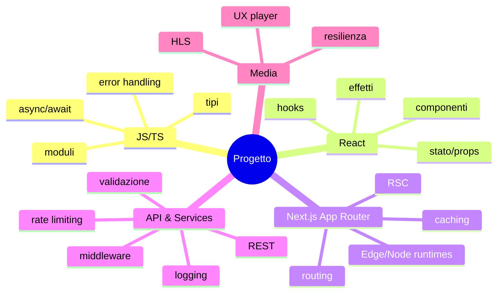

# 00 — Prerequisiti

Obiettivi: allineare le basi teorico-pratiche necessarie per comprendere, estendere e riprodurre il progetto.

## Obiettivi
- Comprendere gli elementi chiave di JavaScript/TypeScript usati nel progetto
- Ripassare i fondamenti di React (hooks, componenti, rendering)
- Conoscere Next.js App Router e il modello RSC
- Familiarizzare con REST/HTTP, caching, rate-limiting e integrazioni esterne
- Capire HLS e il player video

## Mappa concettuale

## Teoria essenziale
- TypeScript: tipi di base, union/intersection, tipi generici, narrowing, utility types.
- React: funzione come mappatura (props → UI), useState/useEffect/useMemo/useCallback.
- Next.js App Router: server components vs client components, segmenti e layout.
- HTTP/REST: metodi, idempotenza, codici di stato, cache-control.
- HLS: segmenti, playlist, ABR (adaptive bitrate), latenze, recovery.

## Domande guida
- Quali decisioni ti fanno preferire un Server Component ad un Client Component?
- Come riconosci un call-site che beneficia di memoization?
- Dove collocheresti validazione e rate limiting: middleware, handler o servizio?
- Come dimensioneresti il caching per dati volatili vs stabili?

## Esercizio
- Elenca gli argomenti su cui ti senti meno sicuro e crea un piano di ripasso; usa il glossario per definizioni operative.
