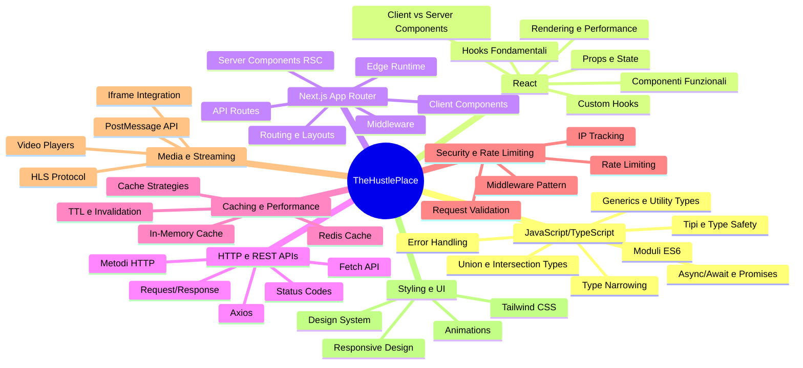
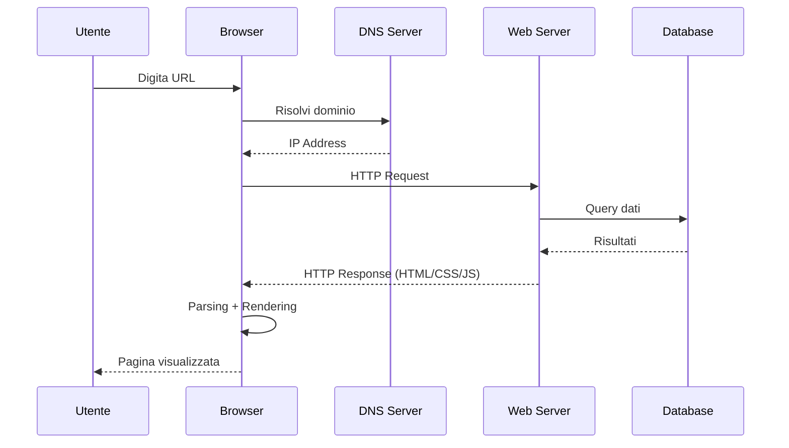
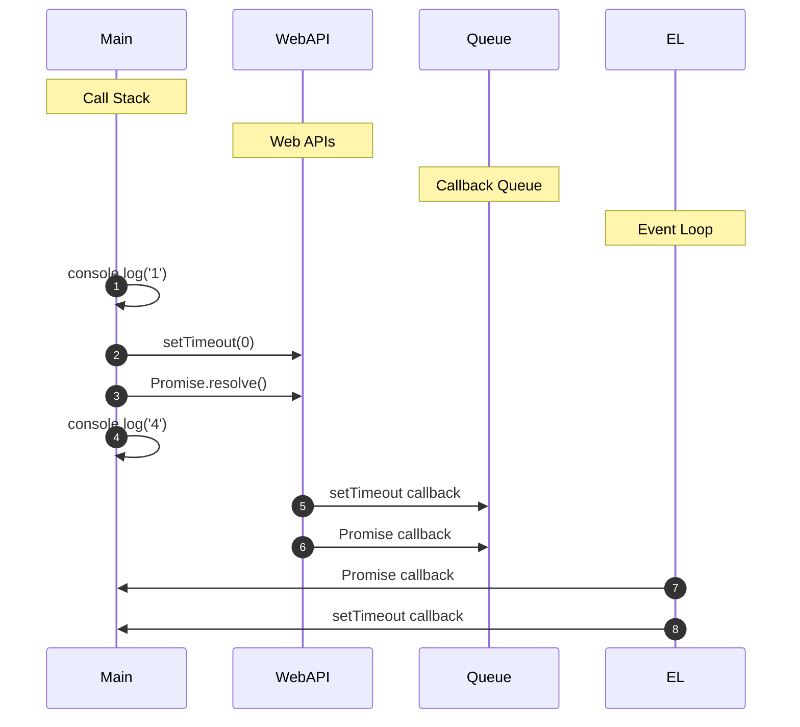
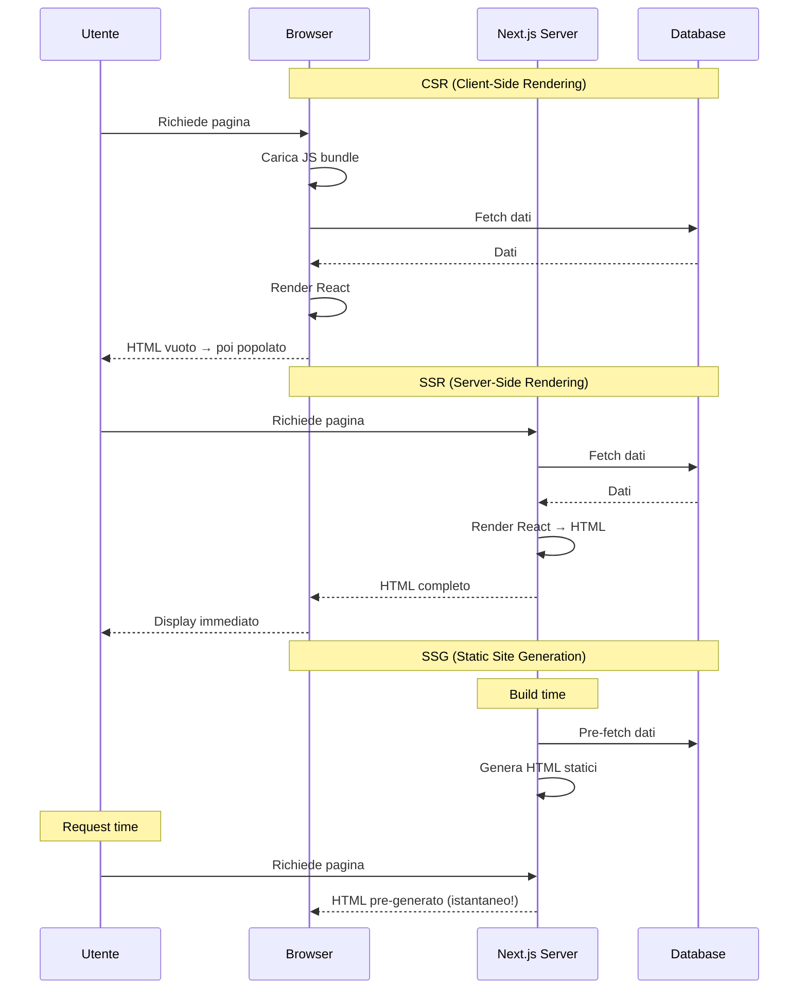
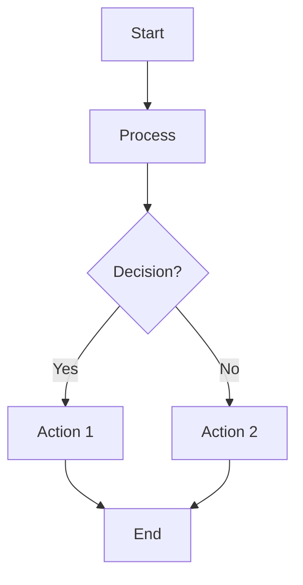
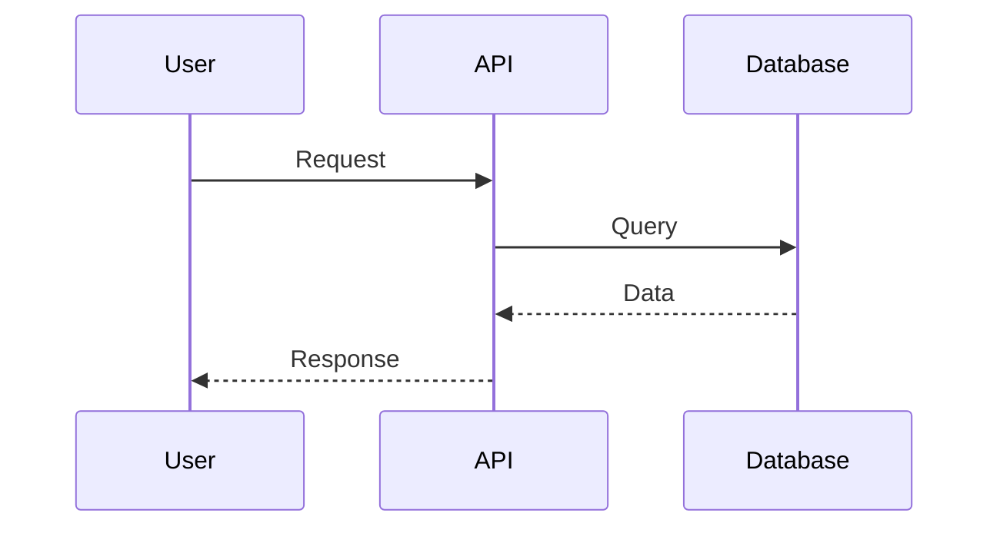
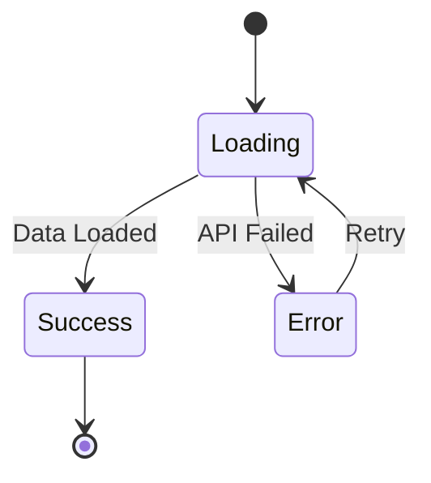
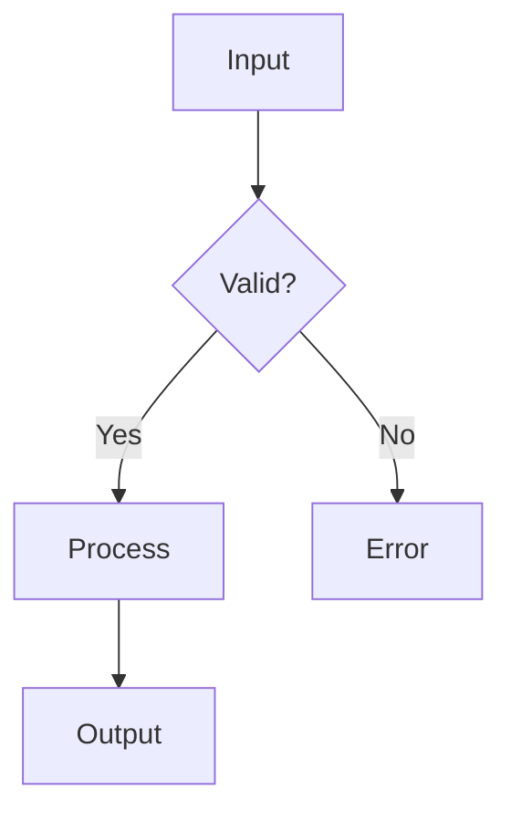

# 00 — Prerequisiti — Corso Completo

## 🎯 Obiettivi del Modulo

Alla fine di questo modulo, sarai in grado di:
- **Comprendere** tutti gli elementi tecnici utilizzati nel progetto TheHustlePlace
- **Programmare** con sicurezza utilizzando TypeScript, React e Next.js
- **Leggere e interpretare** i diagrammi Mermaid dell'architettura
- **Scrivere** codice seguendo i pattern utilizzati nel progetto
- **Debug** e risolvere problemi comuni

**⏱️ Tempo stimato**: 40-50 ore di studio e pratica

---

## 📚 Struttura del Corso

Questo modulo è organizzato in sezioni **progressive** che costruiscono una base solida partendo da zero:
1. **Teoria Fondamentale** - Come funziona il Web, Browser, JavaScript Engine, HTTP
2. **Setup Ambiente** - Primi passi pratici
3. **Fondamenti Web** - HTML, CSS, JavaScript base (espanso)
4. **TypeScript** - Sistema di tipi avanzato con teoria approfondita
5. **React** - Libreria UI con Virtual DOM, Fiber, Reconciliation
6. **Next.js** - Framework full-stack con SSR, SSG, ISR, Hydration
7. **HTTP/REST/APIs** - Protocolli completi, WebSockets, GraphQL
8. **Concetti Avanzati** - Caching, Sicurezza, Streaming (espanso)
9. **Pattern Architetturali** - Clean Architecture, DI, Design Patterns
10. **Tools e Best Practices** - Testing, Debugging, CI/CD

### Mappa Concettuale Completa



---

## 0. Teoria Fondamentale: Come Funziona il Web

> **🎯 Obiettivo**: Comprendere i meccanismi interni del web prima di programmare

### 0.0 Il Browser: Un Sandbox Complesso

**Come il browser esegue il tuo codice:**



**Componenti principali del browser:**

1. **Rendering Engine** (Blink/Gecko/WebKit)
   - Parse HTML → DOM Tree
   - Parse CSS → CSSOM Tree
   - Combine → Render Tree
   - Layout → Paint → Display

2. **JavaScript Engine** (V8/SpiderMonkey/JavaScriptCore)
   - Interpretazione e compilazione JIT
   - Memory management (Garbage Collection)
   - Call Stack e Event Loop

3. **Network Layer**
   - Gestione HTTP/HTTPS
   - Caching intelligente
   - WebSocket per connessioni persistenti

4. **Security Sandbox**
   - Isolamento tra tab
   - Same-Origin Policy
   - Content Security Policy (CSP)

**🧠 Esercizio**: Apri Chrome DevTools → Network Tab → Ricarica la pagina. Analizza:
- Quanti file vengono scaricati?
- Quali sono più pesanti?
- Quanto tempo impiega il rendering totale?

---

### 0.1 JavaScript Engine: Call Stack, Event Loop, Heap

#### Call Stack (Pila delle Chiamate)

Il **Call Stack** tiene traccia delle funzioni in esecuzione:

```javascript
function a() {
    console.log('a started')
    b()
    console.log('a finished')
}

function b() {
    console.log('b started')
    c()
    console.log('b finished')
}

function c() {
    console.log('c executed')
}

a()

// Output:
// a started
// b started
// c executed
// b finished
// a finished
```

**Visualizzazione Call Stack:**

```
┌──────────┐
│    c()   │  ← Top: funzione in esecuzione
├──────────┤
│    b()   │
├──────────┤
│    a()   │  ← Base
└──────────┘
```

#### Memory Heap (Mucchio di Memoria)

Lo **Heap** è lo spazio di memoria per oggetti e array allocati dinamicamente:

```javascript
// Heap storage:
const movie = { title: 'Interstellar', year: 2014 }  // Oggetto in heap
const actors = ['McConaughey', 'Chastain']           // Array in heap

// Stack storage:
const count = 100  // Primitivo nello stack
```

#### Event Loop: Asincronia in JavaScript

**Il problema**: JavaScript è single-threaded (un solo thread), ma deve gestire I/O asincrono!

**Soluzione**: Event Loop con Callback Queue

```javascript
console.log('1')

setTimeout(() => console.log('2'), 0)

Promise.resolve().then(() => console.log('3'))

console.log('4')

// Output: 1, 4, 3, 2
```

**Spiegazione:**



**🔬 Microtasks vs Macrotasks:**

```javascript
console.log('Start')

setTimeout(() => console.log('Macrotask 1'), 0)
Promise.resolve().then(() => console.log('Microtask 1'))
setTimeout(() => console.log('Macrotask 2'), 0)
Promise.resolve().then(() => console.log('Microtask 2'))

console.log('End')

// Output:
// Start
// End
// Microtask 1
// Microtask 2
// Macrotask 1
// Macrotask 2
```

**Regola**: L'Event Loop esaurisce TUTTE le microtasks prima di processare i macrotasks!

---

### 0.2 HTTP/HTTPS: Protocollo Client-Server

#### Struttura Richiesta HTTP

```
GET /api/movies HTTP/1.1              ← Request Line
Host: api.example.com                  ← Headers
User-Agent: Mozilla/5.0
Accept: application/json
Authorization: Bearer token123
Content-Type: application/json

(body opzionale)
```

**Elementi chiave:**

1. **Request Line**: `METODO URI VERSIONE`
   - Metodi: GET, POST, PUT, DELETE, PATCH, etc.
   - URI: percorso della risorsa
   - Versione: HTTP/1.1 o HTTP/2 o HTTP/3

2. **Headers**: metadati della richiesta
   ```
   Host: dominio target
   User-Agent: client che fa la richiesta
   Accept: formato dati accettato
   Authorization: credenziali per autenticazione
   Content-Type: formato del body
   ```

3. **Body**: dati opzionali (solo POST, PUT, PATCH)

#### Struttura Risposta HTTP

```
HTTP/1.1 200 OK                       ← Status Line
Content-Type: application/json
Cache-Control: max-age=3600
ETag: "33a64df551425fcc55e4d42a148795d9f25f89d4"

{
  "success": true,
  "data": [...]
}
```

**Status Line**: `VERSIONE CODICE_STATO MESSAGGIO`

**Headers importanti nelle risposte:**

- **Cache-Control**: `max-age=3600` → cache per 1 ora
- **ETag**: validazione cache (304 Not Modified)
- **Content-Type**: `application/json`, `text/html`, etc.
- **Set-Cookie**: invio cookie al browser
- **Access-Control-Allow-Origin**: CORS

#### HTTPS: HTTP Sicuro

**Differenza chiave:**

```
HTTP:  Plain text → ❌ Vulnerabile a man-in-the-middle
HTTPS: Encrypted  → ✅ Sicuro grazie a TLS/SSL
```

**Handshake TLS:**


**🔒 Certificati SSL/TLS:**
- Certificati emessi da CA (Certificate Authority)
- Browser verifica catena di certificati
- Crittografia asimmetrica per lo scambio chiavi
- Crittografia simmetrica per i dati

---

### 0.3 Architetture Web: Client-Side, Server-Side, Hybrid

#### 1. Single Page Application (SPA)

**Architettura:**

```
┌─────────────────────────────────┐
│  Browser (React/Vue/Angular)   │  ← Tutto il rendering client-side
│                                 │
│  ┌───────────────────────────┐ │
│  │  Virtual DOM              │ │
│  │  State Management         │ │
│  │  Routing                  │ │
│  └───────────────────────────┘ │
└─────────────────────────────────┘
            ↕ HTTP/REST API (JSON)
┌─────────────────────────────────┐
│  Backend API Server            │  ← Solo dati, nessun rendering
│  - Node.js                     │
│  - Express/Nest.js             │
│  - Database                    │
└─────────────────────────────────┘
```

**Caratteristiche:**
- ✅ UI reattiva e fluida
- ✅ Routing client-side senza refresh
- ✅ Esperienza moderna simile alle app native

- ❌ SEO difficile (contenuto vuoto al load)
- ❌ Bundle JavaScript grande (lentezza iniziale)
- ❌ Problemi con JavaScript disabilitato

**Quando usare:**
- Dashboard amministrative
- App interne aziendali
- Social media (Twitter, Facebook)

---

#### 2. Server-Side Rendering (SSR)

**Architettura:**

```
┌─────────────────────────────────┐
│  Browser                        │
│  ┌───────────────────────────┐ │
│  │  HTML già renderizzato    │ │  ← Contenuto completo
│  └───────────────────────────┘ │
└─────────────────────────────────┘
            ↕ Richiesta full HTML
┌─────────────────────────────────┐
│  Next.js Server                │
│  ┌───────────────────────────┐ │
│  │  Render React component   │ │  ← Rendering server-side
│  │  Fetch dati da DB         │ │
│  │  Genera HTML completo     │ │
│  └───────────────────────────┘ │
└─────────────────────────────────┘
```

**Caratteristiche:**
- ✅ SEO ottimale (HTML completo ai bot)
- ✅ Performance iniziale buona
- ✅ Funziona senza JavaScript

- ❌ Costo computazionale server alto
- ❌ Latency (ogni request = render completo)
- ❌ TTFB (Time To First Byte) più lento

**Quando usare:**
- Siti e-commerce
- Blog e news
- Landing pages
- Contenuto che cambia frequentemente

---

#### 3. Static Site Generation (SSG)

**Architettura:**

```
┌─────────────────────────────────┐
│  Browser                        │
└─────────────────────────────────┘
            ↕ Richiesta HTML pre-generato
┌─────────────────────────────────┐
│  CDN (Content Delivery Network) │  ← Cache globale
│  - HTML già pronto              │
│  - CSS/JS minificati            │
│  - Immagini ottimizzate         │
└─────────────────────────────────┘
            ↕ Build time
┌─────────────────────────────────┐
│  Static Site Generator         │
│  - Next.js Build               │
│  - Genera HTML per ogni page   │
│  - Pre-renderizza tutto        │
└─────────────────────────────────┘
```

**Caratteristiche:**
- ✅ Performance massima (file statici)
- ✅ Costo hosting basso (solo storage)
- ✅ Scalabilità infinita (CDN)
- ✅ Sicurezza (nessun server da proteggere)

- ❌ Contenuto statico (no dati dinamici real-time)
- ❌ Rebuild necessaria per aggiornamenti

**Quando usare:**
- Documentazione tecnica
- Portfolio personali
- Landing pages corporate
- Blog con contenuto statico

---

#### 4. Hybrid: Il Meglio di Tutto

**Next.js offre approccio ibrido:**

```typescript
// app/page.tsx - SSG (build time)
export default async function HomePage() {
    const movies = await getPopularMovies() // Fetch build time
    return <div>{movies.map(...)}</div>
}

// app/movies/[id]/page.tsx - SSR (runtime)
export default async function MoviePage({ params }) {
    const movie = await getMovie(params.id) // Fetch runtime
    return <MovieDetails movie={movie} />
}

// app/dashboard/page.tsx - CSR (client)
'use client'
export default function Dashboard() {
    const [data, setData] = useState(null)
    useEffect(() => {
        fetch('/api/dashboard').then(...)
    }, [])
    return <DashboardUI data={data} />
}
```

**Riepilogo Trade-offs:**

| Architettura | SEO | Performance | Costo | Scalabilità | Dati Dinamici |
|-------------|-----|-------------|-------|-------------|---------------|
| SPA         | ❌  | ⚠️         | 💰   | ⚠️          | ✅            |
| SSR         | ✅  | ✅          | 💰💰 | ⚠️          | ✅            |
| SSG         | ✅  | ✅✅        | 🟢   | ✅✅         | ❌            |
| Hybrid      | ✅  | ✅✅        | 💰💰 | ✅          | ✅            |

**🎓 Decisione architetturale:**

```
Hai bisogno di dati real-time? → SSR o Hybrid
Contenuto statico? → SSG
Dashboard interattiva? → SPA o Hybrid
Alto traffico, budget limitato? → SSG + ISR
```

---

## 0. Setup Ambiente e Primi Passi

> **🎯 Obiettivo di questa sezione**: Fare il setup completo del tuo ambiente di sviluppo

### 0.1 Prerequisiti Hardware/Software

**Cosa ti serve per iniziare**:

✅ **Hardware**:
- Computer con Windows, macOS o Linux
- Connessione internet
- Almeno 4GB di RAM (8GB consigliato)

✅ **Software**:
- Browser moderno (Chrome, Firefox, Edge, Safari)
- Editor di codice (VS Code consigliato)
- Git per controllo versione

#### 🔧 Installazione Node.js

**Node.js** è necessario per eseguire JavaScript sul server e utilizzare npm (Node Package Manager).

**Passi**:
1. Vai su [nodejs.org](https://nodejs.org/)
2. Scarica la versione LTS (Long Term Support)
3. Installa seguendo la procedura guidata
4. Verifica l'installazione aprendo il terminale e digitando:

```bash
node --version
npm --version
```

**✅ Checkpoint**: Dovresti vedere numeri di versione come `v20.x.x` e `10.x.x`

#### 🔧 Installazione Git

**Git** è necessario per:
- Controllo versione del codice
- Clonare il repository del progetto

**Passi**:
1. Vai su [git-scm.com](https://git-scm.com/)
2. Scarica per il tuo sistema operativo
3. Installa con opzioni predefinite
4. Verifica:

```bash
git --version
```

**✅ Checkpoint**: Dovresti vedere `git version 2.x.x`

#### 🔧 Installazione VS Code

**VS Code** è l'editor di codice consigliato con:
- Syntax highlighting
- Auto-completion
- Debugging integrato
- Estensioni utili

**Passi**:
1. Vai su [code.visualstudio.com](https://code.visualstudio.com/)
2. Scarica per il tuo sistema operativo
3. Installa
4. Apri VS Code e installa estensioni consigliate:
   - **ESLint** - Linting JavaScript/TypeScript
   - **Prettier** - Formattazione codice
   - **GitLens** - Visualizzazione Git
   - **Tailwind CSS IntelliSense** - Autocomplete Tailwind

**✅ Checkpoint**: VS Code installato con estensioni attive

#### 🔧 Clonare il Progetto

```bash
# Clona il repository
git clone https://github.com/elteo003/TheHustlePlace.git

# Entra nella cartella
cd TheHustlePlace

# Installa dipendenze
npm install
```

**✅ Checkpoint**: Cartella `node_modules` creata e nessun errore durante `npm install`

---

### 0.2 Verifica Setup Completo

**Comando di verifica**:

```bash
node --version && npm --version && git --version && echo "✅ Setup completo!"
```

**Dovresti vedere**:
```
v20.x.x
10.x.x
git version 2.x.x
✅ Setup completo!
```

**🔴 Se non funziona**: Controlla di aver installato correttamente Node.js e Git, e di aver riavviato il terminale dopo l'installazione.

---

### 0.3 Struttura del Progetto

**Ecco la struttura principale di TheHustlePlace**:

```
TheHustlePlace/
├── app/              # Pagine e API routes (Next.js App Router)
├── components/       # Componenti React riutilizzabili
├── services/         # Logica business (API calls)
├── controllers/      # Orchestrazione API routes
├── hooks/            # Custom React hooks
├── utils/            # Funzioni utility
├── types/            # Definizioni TypeScript
├── middlewares/      # Middleware per API
├── public/           # File statici (immagini, etc.)
├── doc/              # Documentazione
└── package.json      # Dipendenze e script
```

**🎓 Termini da ricordare**:
- **app/**: Contiene le pagine web e le API
- **components/**: Pezzi di UI riutilizzabili
- **services/**: Logica per chiamate API esterne
- **hooks/**: Logica React condivisa tra componenti

---

### 0.4 Primo Script e Verifica Funzionamento

**Testa che tutto funzioni**:

```bash
# Avvia il server di sviluppo
npm run dev
```

**Dovresti vedere**:
```
▲ Next.js 14.x.x
- Local:        http://localhost:3000
- Ready in X ms
```

**Apri il browser** e vai su `http://localhost:3000`

**✅ Checkpoint Finale**: Il sito si apre nel browser senza errori

**🔴 Risoluzione problemi comuni**:
- **Errore "port 3000 già in uso"**: Cambia porta con `PORT=3001 npm run dev`
- **Errore durante install**: Cancella `node_modules` e `package-lock.json`, poi `npm install` di nuovo

---

### 0.5 Familiarizzazione con il Codice

**Esercizio**: Esplora il progetto

1. **Apri VS Code** nella cartella del progetto
2. **Esplora** i file principali:
   - `app/page.tsx` - Homepage
   - `components/movie-card.tsx` - Card film
   - `services/tmdb.service.ts` - Chiamate API TMDB
3. **Leggi** il codice senza modificarli (per ora)

**🎓 Nota**: Non ti preoccupare se non capisci tutto subito! Questo modulo ti insegnerà ogni concetto.

**✅ Obiettivo sezione completato**: Ambiente funzionante e progetto avviato

---

## 1. Fondamenti Web: HTML, CSS e JavaScript Base

> **🎯 Obiettivo**: Conoscere le basi del web prima di affrontare React e Next.js

### 1.1 HTML: Struttura delle Pagine Web

> **🤔 Domanda**: Come è strutturata una pagina web?

**HTML** (HyperText Markup Language) definisce la **struttura** e il **contenuto** delle pagine web.

**Esempio base**:

```html
<!DOCTYPE html>
<html>
<head>
    <title>Il Mio Film</title>
</head>
<body>
    <header>
        <h1>The Hustle Place</h1>
        <nav>
            <a href="/">Home</a>
            <a href="/movies">Film</a>
        </nav>
    </header>
    
    <main>
        <article>
            <h2>Interstellar</h2>
            <p>Un film di fantascienza...</p>
            
        </article>
    </main>
    
    <footer>
        <p>© 2024 The Hustle Place</p>
    </footer>
</body>
</html>
```

**🎓 Termini chiave**:
- **Tag**: `<>` che definiscono elementi (`<h1>`, `<p>`, ``)
- **Attributi**: Proprietà degli elementi (`href`, `src`, `alt`)
- **Struttura semantica**: `<header>`, `<main>`, `<article>`, `<footer>` descrivono il significato

**⚠️ Importante**: HTML definisce COSA è sulla pagina, non come appare visivamente (quello è CSS).

---

### 1.2 CSS: Styling e Presentazione

> **🤔 Domanda**: Come controllo l'aspetto visivo degli elementi HTML?

**CSS** (Cascading Style Sheets) controlla **colori, layout, font, spaziatura**.

**Esempio**:

```css
/* Selezione per tag */
h1 {
    color: white;
    font-size: 2rem;
    margin-bottom: 1rem;
}

/* Selezione per classe */
.movie-card {
    background: #1a1a1a;
    border-radius: 8px;
    padding: 1rem;
    display: flex;
    flex-direction: column;
}

/* Selezione per id */
#main-title {
    font-weight: bold;
}
```

**Come applicarlo**:

```html
<!-- Metodo 1: Inline (non consigliato) -->
<h1 style="color: white;">Titolo</h1>

<!-- Metodo 2: Tag <style> -->
<style>
    h1 { color: white; }
</style>

<!-- Metodo 3: File esterno (consigliato) -->
<link rel="stylesheet" href="styles.css">
```

**🎓 Concept chiave**: **Cascading** significa che CSS applica stili in cascata (ereditarietà), perciò `body { font-family: Arial }` si applica a tutti i figli se non sovrascritto.

---

### 1.3 JavaScript Base: Variabili, Funzioni e Oggetti

> **🤔 Domanda**: Come aggiungo interattività alle pagine?

**JavaScript** aggiunge **logica, interattività e manipolazione DOM**.

#### 1.3.1 Variabili

```javascript
// let: variabile modificabile
let userName = "Mario"
userName = "Luigi" // ✅ Ok, modificabile

// const: variabile costante
const maxMovies = 100
maxMovies = 200 // ❌ Errore! Costante non modificabile

// var: vecchio modo (evitare)
```

#### 1.3.2 Funzioni

```javascript
// Funzione normale
function greetUser(name) {
    return `Ciao, ${name}!`
}

// Arrow function (moderna)
const greetUser = (name) => {
    return `Ciao, ${name}!`
}

// Uso
greetUser("Mario") // "Ciao, Mario!"
```

#### 1.3.3 Array e Oggetti

```javascript
// Array: lista ordinata
const movies = ["Interstellar", "Inception", "Dunkirk"]
movies[0] // "Interstellar"
movies.push("Oppenheimer") // Aggiunge elemento
movies.length // 4

// Oggetto: chiave-valore
const movie = {
    title: "Interstellar",
    year: 2014,
    rating: 8.6,
    watched: true
}

movie.title // "Interstellar"
movie.year = 2015 // Modifica valore
movie.genre = "Sci-Fi" // Aggiunge proprietà
```

---

### 1.4 JavaScript: Eventi e Interattività

> **🤔 Domanda**: Come rispondo ai click, submit form e altri eventi utente?

**Event Listeners** permettono di reagire a azioni utente:

```javascript
// Selezione elemento
const button = document.getElementById('myButton')

// Aggiungi listener per evento click
button.addEventListener('click', (event) => {
    console.log('Button cliccato!')
    alert('Ciao!')
})
```

**Eventi comuni**:
- `click` - Click su elemento
- `submit` - Invio form
- `change` - Cambio input/select
- `load` - Pagina caricata
- `keydown` - Tasto premuto

**Esempio pratico - Search bar**:

```javascript
const searchInput = document.getElementById('search')
const searchButton = document.getElementById('search-btn')

searchButton.addEventListener('click', () => {
    const query = searchInput.value
    console.log('Cercando:', query)
    // Logica di ricerca...
})

searchInput.addEventListener('keydown', (event) => {
    if (event.key === 'Enter') {
        searchButton.click() // Invia ricerca
    }
})
```

---

### 1.5 JavaScript: Fetch API e Dati asincroni

> **🤔 Domanda**: Come ottengo dati da un server (API)?

**Fetch** permette di fare richieste HTTP per ottenere dati:

```javascript
// Richiesta GET
fetch('https://api.example.com/movies')
    .then(response => response.json())
    .then(data => {
        console.log('Film ricevuti:', data)
    })
    .catch(error => {
        console.error('Errore:', error)
    })
```

**Moderno con async/await**:

```javascript
async function getMovies() {
    try {
        const response = await fetch('https://api.example.com/movies')
        const data = await response.json()
        console.log('Film:', data)
        return data
    } catch (error) {
        console.error('Errore:', error)
    }
}
```

**🎓 Async/await rende il codice più leggibile** - sembra codice sincrono ma è asincrono.

---

### 1.6 JavaScript: Manipolazione DOM

> **🤔 Domanda**: Come modifico dinamicamente elementi HTML con JavaScript?

**DOM** (Document Object Model) rappresenta l'HTML come oggetti JavaScript modificabili.

```javascript
// Selezione elementi
const title = document.querySelector('h1')
const allCards = document.querySelectorAll('.movie-card')

// Modifica contenuto
title.textContent = 'Nuovo Titolo'
title.innerHTML = '<span>Nuovo</span> <em>Titolo</em>' // HTML

// Modifica CSS
title.style.color = 'red'
title.classList.add('highlight')

// Creare nuovo elemento
const newCard = document.createElement('div')
newCard.textContent = 'Nuovo Film'
newCard.className = 'movie-card'
document.body.appendChild(newCard) // Aggiunge al DOM
```

### ✏️ Esercizio Pratico 1.1: Creare una Pagina HTML Semantica

> **🎯 Obiettivo:** Padroneggiare la creazione di una struttura HTML semantica con elementi header, nav, main, article e footer.

**[Passo 1: Enunciato]**
Crea un file HTML completo per una pagina che mostra i dettagli di un film, includendo:
1. Un header con titolo del sito e nav per navigazione
2. Una sezione main con article contenente titolo film, immagine poster, descrizione
3. Un footer con copyright
4. Usa TUTTI elementi semantici: `<header>`, `<nav>`, `<main>`, `<article>`, `<footer>`, `<section>`

<br/>

**🧠 Ragionamento Guidato (Il "Come Pensare")**
* Quale elemento semantico HTML rappresenta il contenuto principale della pagina?
* Come struttureresti il layout per avere navigazione in cima e info copyright in basso?
* Quale attributo HTML è essenziale per immagini accessibilità?

<br/>

**⌨️ Template Iniziale**

```html
<!DOCTYPE html>
<html lang="it">
<head>
    <meta charset="UTF-8">
    <meta name="viewport" content="width=device-width, initial-scale=1.0">
    <title>Il Tuo Film</title>
</head>
<body>
    <!-- Inserisci qui la tua struttura semantica -->
</body>
</html>

<details>
<summary>✅ Mostra Soluzione Guidata</summary>

**Spiegazione della Logica**: Gli elementi semantici (`<header>`, `<nav>`, `<main>`, ecc.) danno significato alla struttura HTML, rendendo la pagina più accessibile per screen reader e motori di ricerca. Il tag `<article>` identifica contenuto indipendente e riutilizzabile.

**Soluzione Completa:**

```html
<!DOCTYPE html>
<html lang="it">
<head>
    <meta charset="UTF-8">
    <meta name="viewport" content="width=device-width, initial-scale=1.0">
    <title>The Hustle Place - Interstellar</title>
</head>
<body>
    <header>
        <h1>The Hustle Place</h1>
        <nav>
            <a href="/">Home</a>
            <a href="/movies">Film</a>
            <a href="/tv">Serie TV</a>
        </nav>
    </header>
    
    <main>
        <article>
            <section>
                <h2>Interstellar</h2>
                
            </section>
            <section>
                <p>Un gruppo di esploratori viaggia attraverso un wormhole nello spazio per salvare l'umanità...</p>
                <p><strong>Anno:</strong> 2014</p>
                <p><strong>Rating:</strong> 8.6/10</p>
            </section>
        </article>
    </main>
    
    <footer>
        <p>&copy; 2024 The Hustle Place. Tutti i diritti riservati.</p>
    </footer>
</body>
</html>
```
</details>

---

### ✏️ Esercizio Pratico 1.2: Stilizzare con CSS Selettori e Proprietà

> **🎯 Obiettivo:** Applicare CSS usando selettori tag, classi e ID per controllare layout, colori e spaziatura.

**[Passo 1: Enunciato]**
Aggiungi uno stile CSS alla pagina HTML dell'esercizio 1.1 che:
1. Rende sfondo scuro e testo bianco
2. Stilizza `.movie-card` con bordo arrotondato, padding, sfondo scuro
3. Centra contenuti con flexbox
4. Stilizza header con sfondo degradato

<br/>

**🧠 Ragionamento Guidato (Il "Come Pensare")**
* Quale proprietà CSS controlla lo sfondo della pagina?
* Come usi flexbox per centrare elementi verticalmente e orizzontalmente?
* Quale proprietà CSS crea bordi arrotondati?

<br/>

**⌨️ Template Iniziale**

```css
/* Scrivi qui il tuo CSS */

<details>
<summary>✅ Mostra Soluzione Guidata</summary>

**Spiegazione della Logica**: I selettori CSS permettono targeting preciso degli elementi. Flexbox (`display: flex`, `justify-content`, `align-items`) è lo strumento moderno per layout responsive. Border-radius crea design moderni senza immagini.

**Soluzione Completa:**

```css
/* Reset e base */
* {
    margin: 0;
    padding: 0;
    box-sizing: border-box;
}

body {
    background: #000;
    color: #fff;
    font-family: Arial, sans-serif;
}

/* Header styling */
header {
    background: linear-gradient(135deg, #667eea 0%, #764ba2 100%);
    padding: 2rem;
    display: flex;
    justify-content: space-between;
    align-items: center;
}

header h1 {
    font-size: 2rem;
    font-weight: bold;
}

nav a {
    color: #fff;
    text-decoration: none;
    margin-left: 1rem;
}

/* Main content */
main {
    padding: 2rem;
    display: flex;
    justify-content: center;
    align-items: center;
    min-height: 80vh;
}

article {
    max-width: 800px;
}

/* Movie card styling */
.movie-card {
    background: #1a1a1a;
    border-radius: 12px;
    padding: 2rem;
    display: flex;
    flex-direction: column;
    gap: 1rem;
    box-shadow: 0 4px 6px rgba(0, 0, 0, 0.3);
}

.movie-card img {
    width: 100%;
    border-radius: 8px;
}

/* Footer */
footer {
    text-align: center;
    padding: 1rem;
    background: #111;
    margin-top: 2rem;
}
```
</details>

---

### ✏️ Esercizio Pratico 1.3: Manipolazione DOM con JavaScript

> **🎯 Obiettivo:** Usare JavaScript per selezionare elementi DOM, modificare contenuto e aggiungere interattività.

**[Passo 1: Enunciato]**
Crea uno script JavaScript che:
1. Seleziona un bottone `<button id="toggle-details">Mostra Dettagli</button>`
2. Aggiunge event listener che mostra/nasconde una sezione al click
3. Cambia testo bottone tra "Mostra Dettagli" e "Nascondi Dettagli"
4. Usa `querySelector`, `addEventListener`, `classList.toggle`

<br/>

**🧠 Ragionamento Guidato (Il "Come Pensare")**
* Quale metodo DOM seleziona un elemento per ID?
* Come aggiungi un listener per evento click a un elemento?
* Quale metodo `classList` alterna presenza classe CSS?

<br/>

**⌨️ Template Iniziale**

```javascript
// Seleziona elemento bottone

// Aggiungi event listener

// Toggle visibilità contenuto

<details>
<summary>✅ Mostra Soluzione Guidata</summary>

**Spiegazione della Logica**: `querySelector` e `getElementById` selezionano elementi DOM. `addEventListener` iscrive callback ad eventi. `classList.toggle` aggiunge/rimuove classe CSS se è già presente/assente. Il DOM rappresenta HTML come oggetti JavaScript modificabili.

**Soluzione Completa:**

```javascript
// Aspetta che DOM sia pronto
document.addEventListener('DOMContentLoaded', () => {
    // Seleziona elementi
    const button = document.getElementById('toggle-details');
    const detailsSection = document.querySelector('.movie-details');
    
    if (button && detailsSection) {
        // Aggiungi event listener
        button.addEventListener('click', () => {
            // Toggle visibilità
            detailsSection.classList.toggle('hidden');
            
            // Cambia testo bottone
            const isHidden = detailsSection.classList.contains('hidden');
            button.textContent = isHidden ? 'Mostra Dettagli' : 'Nascondi Dettagli';
        });
    }
});
```

Con CSS corrispondente:

```css
.movie-details.hidden {
    display: none;
}
```
</details>

---

### ✏️ Esercizio Pratico 1.4: Fetch API per Caricare Dati

> **🎯 Obiettivo:** Usare Fetch API con async/await per caricare dati da API REST e gestire errori.

**[Passo 1: Enunciato]**
Scrivi una funzione `loadMovies()` che:
1. Usa `async/await` per fetch API
2. Carica dati da `https://api.example.com/movies` (endpoint mock)
3. Gestisce errori con try/catch
4. Ritorna array film o array vuoto su errore
5. Mostra loading state durante fetch

<br/>

**🧠 Ragionamento Guidato (Il "Come Pensare")**
* Come dichiari funzione asincrona in JavaScript moderno?
* Quale metodo di response object converte JSON in oggetto JavaScript?
* Dove posizioni errore handling in codice asincrono?

<br/>

**⌨️ Template Iniziale**

```javascript
async function loadMovies() {
    // Scrivi qui la tua implementazione
}

<details>
<summary>✅ Mostra Soluzione Guidata</summary>

**Spiegazione della Logica**: `async/await` rende codice asincrono più leggibile. `fetch()` ritorna Promise che si risolve in Response. `.json()` parse JSON response body. Try/catch gestisce network errors e parse errors. Async functions sempre ritornano Promise.

**Soluzione Completa:**

```javascript
async function loadMovies() {
    try {
        // Mostra loading state
        console.log('⏳ Caricamento film...');
        
        // Fetch data
        const response = await fetch('https://api.example.com/movies');
        
        // Verifica response OK
        if (!response.ok) {
            throw new Error(`HTTP error! status: ${response.status}`);
        }
        
        // Parse JSON
        const data = await response.json();
        
        console.log('✅ Film caricati:', data);
        return data;
        
    } catch (error) {
        console.error('❌ Errore caricamento film:', error);
        return []; // Ritorna array vuoto su errore
    }
}

// Uso
loadMovies().then(movies => {
    console.log('Totale film:', movies.length);
});

// O con async/await
(async () => {
    const movies = await loadMovies();
    displayMovies(movies);
})();
```
</details>

---

## 2. TypeScript: Sistema di Tipi Avanzato

> **🤔 Pensa prima di procedere**: Perché JavaScript non è sufficiente? Cosa aggiunge TypeScript che ci aiuta a scrivere codice migliore?

### 2.1 TypeScript: Sistema di Tipi Avanzato

#### 💡 Introduzione: Il Problema che Risolve

Immagina di scrivere una funzione per calcolare la media dei voti di un film:

```typescript
// JavaScript (senza tipi)
function calculateAverage(votes) {
    return votes.reduce((sum, vote) => sum + vote, 0) / votes.length
}
```

**Problema**: Cosa succede se qualcuno chiama `calculateAverage("invalid")`? L'errore appare solo a runtime, quando l'utente usa l'app!

**Soluzione TypeScript**: Con i tipi, l'errore viene catturato durante lo sviluppo:

```typescript
// TypeScript (con tipi)
function calculateAverage(votes: number[]): number {
    return votes.reduce((sum, vote) => sum + vote, 0) / votes.length
}

// ❌ Errore a compile-time, non a runtime!
calculateAverage("invalid") // TypeScript: "string non è assegnabile a number[]"
```

#### 📚 Teoria: Perché TypeScript?

1. **Type Safety**: Errori catturati prima del deploy
2. **Auto-completamento**: L'IDE suggerisce proprietà e metodi
3. **Documentazione**: I tipi documentano il codice
4. **Refactoring Sicuro**: Modifiche guidate con verifica dei tipi

**Esempio pratico** - Vediamo come nel progetto definiamo un film:

```1:19:types/index.ts
// Tipi comuni per l'applicazione

export interface Movie {
    id: number;
    title: string;
    overview: string;
    poster_path?: string;
    backdrop_path?: string;
    release_date: string;
    vote_average: number;
    vote_count: number;
    genre_ids: number[];
    adult: boolean;
    original_language: string;
    original_title: string;
    popularity: number;
    video: boolean;
    tmdb_id?: number;
}
```

**🎓 Analisi guidata**:
- Cosa significa `?:` dopo `poster_path`? → Proprietà opzionale (può essere `undefined`)
- Perché `id: number` invece di `id: string`? → TMDB usa numeri per gli ID
- `genre_ids: number[]` → Array di numeri (gli ID dei generi)

#### 🧠 Esercizio di Ragionamento 1.1.1

**Domanda**: Perché `poster_path` è opzionale mentre `title` non lo è?

**Pensa alla risposta prima di procedere...**

**Risposta guidata**:
1. `title` è **sempre disponibile** → ogni film DEVE avere un titolo
2. `poster_path` può mancare → alcuni film potrebbero non avere un poster ancora
3. TypeScript ci costringe a gestire il caso `undefined`:

```typescript
function displayMovie(movie: Movie) {
    console.log(movie.title) // ✅ Sempre disponibile
    
    // ❌ Errore TypeScript se non controlliamo
    console.log(movie.poster_path.toUpperCase())
    
    // ✅ Corretto: gestiamo il caso undefined
    if (movie.poster_path) {
        console.log(movie.poster_path.toUpperCase())
    }
}
```

#### ✏️ Esercizio Pratico 1.1.1

Crea un'interfaccia `TVShow` basandoti su `Movie`, ma considera:
- Le serie TV hanno `name` invece di `title`
- Hanno `first_air_date` invece di `release_date`
- Hanno `origin_country: string[]` (un film no)

**Soluzione guidata passo-passo**:

```typescript
// Passo 1: Parti da Movie come base
interface TVShow {
    id: number  // Stesso
    // ...
}

// Passo 2: Sostituisci title con name
interface TVShow {
    id: number
    name: string  // ← Cambiato da title
    // ...
}

// Passo 3: Sostituisci release_date con first_air_date
interface TVShow {
    id: number
    name: string
    overview: string
    poster_path?: string
    first_air_date: string  // ← Cambiato da release_date
    // ...
}

// Passo 4: Aggiungi campi specifici per serie TV
interface TVShow {
    // ... campi comuni ...
    origin_country: string[]  // ← Nuovo campo
    // ...
}
```

**📝 Verifica la tua soluzione** guardando `types/index.ts` nel progetto per vedere come è stata implementata realmente!

#### Tipi Primitivi e Base

#### Union Types e Discriminated Unions

> **🤔 Domanda di ragionamento**: Hai mai scritto codice come questo?
> ```typescript
> function processContent(content) {
>     if (content.title) {
>         return content.title
>     } else {
>         return content.name
>     }
> }
> ```
> **Problema**: Come fai a sapere se `content` ha `title` o `name`? TypeScript non può aiutarti!

##### 💡 Union Types: "Questo O Quello"

```typescript
// Union type semplice
type ContentType = 'movie' | 'tv'

// Utilizzo nel progetto - `components/movie-card.tsx`:
```38:42:components/movie-card.tsx
        const url = type === 'movie'
            ? `/player/movie/${itemId}`
            : `/series/${itemId}`
        window.location.href = url
    }
```

**Perché funziona?** TypeScript sa che `type` può essere SOLO `'movie'` o `'tv'`, quindi può controllare il tipo durante la compilazione.

##### 🧠 Discriminated Unions: Il Pattern "Tag"

**Problema reale**: Come rappresentare un film O una serie TV in modo sicuro?

**Soluzione sbagliata**:
```typescript
// ❌ TypeScript non può sapere quale campo esiste
type Content = {
    title?: string
    name?: string
    release_date?: string
    first_air_date?: string
}
```

**Soluzione corretta (Discriminated Union)**:
```typescript
// ✅ TypeScript sa esattamente quali campi sono disponibili
type Content = 
    | { type: 'movie'; title: string; release_date: string }
    | { type: 'tv'; name: string; first_air_date: string }

function getContentTitle(content: Content): string {
    // TypeScript "narrowing" automatico dopo il check
    if (content.type === 'movie') {
        // ✅ Qui TypeScript sa che content.type === 'movie'
        // ✅ Quindi sa che content.title esiste!
        return content.title
    }
    // ✅ Qui TypeScript sa che content.type === 'tv'
    // ✅ Quindi sa che content.name esiste!
    return content.name
}
```

##### 🧠 Esercizio di Ragionamento 1.1.2

**Domanda**: Perché nella funzione sopra non serve il controllo `if (content.name)`? 

**Pensa alla risposta...**

**Risposta**: Perché TypeScript ha fatto **type narrowing**: dopo aver verificato `content.type === 'movie'`, sa che siamo nel branch `true`, quindi `content` è del tipo `{ type: 'movie'; ... }`. Nel branch `else`, sa che è del tipo `{ type: 'tv'; ... }`.

##### ✏️ Esercizio Pratico 1.1.2

Crea una funzione `getContentDate(content: Content)` che restituisce la data corretta (release_date per film, first_air_date per serie TV).

<details>
<summary>💡 Suggerimento</summary>

Usa lo stesso pattern della funzione `getContentTitle`: controlla `content.type` e TypeScript farà il narrowing automatico!
</details>

<details>
<summary>✅ Soluzione</summary>

```typescript
function getContentDate(content: Content): string {
    if (content.type === 'movie') {
        return content.release_date // ✅ TypeScript sa che esiste
    }
    return content.first_air_date // ✅ TypeScript sa che esiste
}
```
</details>

#### Generics: Tipi Parametrici

I generics permettono di creare componenti riutilizzabili che funzionano con diversi tipi.

```typescript
// Generic interface
interface ApiResponse<T> {
    success: boolean
    data?: T
    error?: string
}

// Utilizzo con tipi specifici
type MovieResponse = ApiResponse<Movie>
type TVShowResponse = ApiResponse<TVShow>
```

**Esempio dal progetto** - `types/index.ts`:
```70:75:types/index.ts
export interface ApiResponse<T> {
    success: boolean;
    data?: T;
    error?: string;
    message?: string;
}
```

#### Utility Types

TypeScript fornisce utility types per manipolare i tipi esistenti.

```typescript
// Partial: rende tutte le proprietà opzionali
type PartialMovie = Partial<Movie>

// Pick: seleziona solo alcune proprietà
type MovieSummary = Pick<Movie, 'id' | 'title' | 'poster_path'>

// Omit: rimuove alcune proprietà
type MovieWithoutDates = Omit<Movie, 'release_date' | 'first_air_date'>
```

### 1.2 Moduli ES6 e Path Aliases

Il progetto usa import/export ES6 modules e path aliases configurati in `tsconfig.json`.

**Configurazione Path Aliases** - `tsconfig.json`:
```25:56:tsconfig.json
    "baseUrl": ".",
    "paths": {
      "@/*": [
        "./*"
      ],
      "@/components/*": [
        "./components/*"
      ],
      "@/lib/*": [
        "./lib/*"
      ],
      "@/app/*": [
        "./app/*"
      ],
      "@/types/*": [
        "./types/*"
      ],
      "@/utils/*": [
        "./utils/*"
      ],
      "@/services/*": [
        "./services/*"
      ],
      "@/repositories/*": [
        "./repositories/*"
      ],
      "@/middlewares/*": [
        "./middlewares/*"
      ],
      "@/controllers/*": [
        "./controllers/*"
      ]
    }
```

**Esempio di utilizzo**:
```typescript
// Import con path alias (preferito)
import { Movie } from '@/types'
import { MovieCard } from '@/components/movie-card'

// Import relativo (evitare)
import { Movie } from '../../../types'
```

### 1.3 Async/Await e Gestione Errori

> **🤔 Domanda iniziale**: Perché non possiamo semplicemente fare `const movie = fetch('/api/movies/123')` e usare `movie` immediatamente?

#### 💡 Il Problema: Operazioni Asincrone

Pensa a questo scenario:

```typescript
// ❌ NON funziona così!
function loadMovie(id: number) {
    const movie = fetch(`/api/movies/${id}`) // Richiesta di rete
    console.log(movie.title) // ❌ movie è una Promise, non un oggetto!
}
```

**Il problema**: Le chiamate di rete richiedono TEMPO. JavaScript non può fermarsi ad aspettare!

**Soluzione storica: Callbacks** (non usiamo più questo pattern):
```typescript
// Vecchio modo (callback hell)
fetch(`/api/movies/${id}`, (error, response) => {
    if (error) {
        // gestisci errore
    } else {
        response.json((error, data) => {
            if (error) {
                // gestisci errore
            } else {
                console.log(data.title) // ✅ Finalmente!
            }
        })
    }
})
```

**Problema**: Codice difficile da leggere e mantenere!

#### 📚 Promises: "Prometto che ti darò i dati... prima o poi"

```typescript
// Promise: un oggetto che rappresenta un valore futuro
function fetchMovie(id: number): Promise<Movie> {
    return fetch(`/api/movies/${id}`)
        .then(response => response.json())
        .then(data => data.movie)
        // .catch() per gestire errori
}

// Utilizzo
fetchMovie(123)
    .then(movie => console.log(movie.title))
    .catch(error => console.error(error))
```

**Vantaggi**: Codice più lineare, ma ancora con annidamenti.

#### 🎯 Async/Await: "Aspetta che finisca, poi continua"

```typescript
// Async/Await: codice che sembra sincrono!
async function fetchMovie(id: number): Promise<Movie> {
    const response = await fetch(`/api/movies/${id}`)
    // ⏸️ JavaScript aspetta qui finché la fetch non termina
    const data = await response.json()
    // ⏸️ E aspetta anche qui
    return data.movie
    // ✅ Ora possiamo usare movie come se fosse sincrono!
}
```

**Perché è migliore?**
1. **Leggibilità**: Sembra codice normale, non annidato
2. **Error handling**: Usa try/catch normale
3. **Debugging**: Più facile seguire il flusso

#### 🧠 Esercizio di Ragionamento 1.3.1

**Domanda**: Cosa succede se la fetch fallisce? Il codice si blocca per sempre?

<details>
<summary>💭 Pensa alla risposta...</summary>

No! Se una Promise viene rifiutata (rejected), il `await` lancerà un'eccezione. Dobbiamo gestirla con try/catch!
</details>

**Esempio con error handling**:
```typescript
async function fetchMovie(id: number): Promise<Movie | null> {
    try {
        const response = await fetch(`/api/movies/${id}`)
        
        // ⚠️ ATTENZIONE: fetch non lancia errori per HTTP errors!
        if (!response.ok) {
            throw new Error(`HTTP ${response.status}`)
        }
        
        const data = await response.json()
        return data.movie
    } catch (error) {
        console.error('Errore caricamento film:', error)
        return null // O gestisci diversamente
    }
}
```

#### ✏️ Esercizio Pratico 1.5: Caricamento Parallelo con Gestione Errori

> **🎯 Obiettivo:** Padroneggiare l'uso di `Promise.allSettled` per eseguire richieste asincrone in parallelo e gestire individualmente successi e fallimenti.

**[Passo 1: Enunciato]**
Scrivi una funzione `fetchMultipleMovies(ids: number[])` che:
1. Carica tutti i film in parallelo chiamando una funzione `fetchMovie(id: number)`.
2. Restituisce **solo** i film caricati con successo, ignorando quelli che falliscono.

<br/>

**🧠 Ragionamento Guidato (Il "Come Pensare")**
* Quale metodo di `Promise` (tra `all` e `allSettled`) ti permette di ottenere i risultati di *tutte* le richieste, anche se alcune falliscono?
* Come puoi mappare l'array di ID in un array di `Promise<Movie>`?
* Dopo aver risolto la Promise principale, quale proprietà del risultato ti indica se la richiesta è `fulfilled` o `rejected`?

<br/>

**⌨️ Template Iniziale**

```typescript
async function fetchMultipleMovies(ids: number[]): Promise<Movie[]> {
    // Definisci qui la tua funzione
}

<details>
<summary>✅ Mostra Soluzione Guidata</summary>

**Spiegazione della Logica**: Abbiamo utilizzato `Promise.allSettled` per assicurarci che l'esecuzione continui anche se una o più chiamate falliscono. Il `.filter()` rimuove i fallimenti, e il `.map()` estrae il `value` (il film) solo dai risultati di tipo `'fulfilled'`.

**Soluzione Completa:**

```typescript
// Assumi che fetchMovie sia definito e ritorni Promise<Movie>
async function fetchMultipleMovies(ids: number[]): Promise<Movie[]> {
    const promises = ids.map(id => fetchMovie(id))
    
    // Esegui tutte in parallelo
    const results = await Promise.allSettled(promises)
    
    // Filtra e mappa solo i successi
    const successfulMovies = results
        .filter(result => result.status === 'fulfilled')
        .map(result => (result as PromiseFulfilledResult<Movie>).value)
    
    return successfulMovies
}
```
</details>

#### Error Handling Robusto

```typescript
async function getMovieWithRetry(id: number, maxRetries = 3): Promise<Movie> {
    let lastError: Error | null = null
    
    for (let attempt = 1; attempt <= maxRetries; attempt++) {
        try {
            const response = await fetch(`/api/movies/${id}`)
            if (!response.ok) {
                throw new Error(`HTTP ${response.status}`)
            }
            return await response.json()
        } catch (error) {
            lastError = error as Error
            if (attempt < maxRetries) {
                // Wait before retry (exponential backoff)
                await new Promise(resolve => 
                    setTimeout(resolve, 1000 * attempt)
                )
            }
        }
    }
    
    throw lastError || new Error('Failed after all retries')
}
```

**Esempio dal progetto** - `services/tmdb.service.ts`:
```26:45:services/tmdb.service.ts
    // Retry logic helper
    private async makeRequestWithRetry<T>(requestFn: () => Promise<T>): Promise<T> {
        let lastError: Error | null = null

        for (let attempt = 1; attempt <= this.MAX_RETRIES; attempt++) {
            try {
                await this.rateLimit()
                return await requestFn()
            } catch (error) {
                lastError = error as Error
                logger.warn(`TMDB API request failed (attempt ${attempt}/${this.MAX_RETRIES})`, { error })

                if (attempt < this.MAX_RETRIES) {
                    await new Promise(resolve => setTimeout(resolve, this.RETRY_DELAY * attempt))
                }
            }
        }

        throw lastError || new Error('TMDB API request failed after all retries')
    }
```

#### Promise.all per Operazioni Parallele

```typescript
// Esecuzione sequenziale (lenta)
async function fetchSequential() {
    const movie1 = await fetchMovie(1)
    const movie2 = await fetchMovie(2)
    const movie3 = await fetchMovie(3)
    return [movie1, movie2, movie3]
}

// Esecuzione parallela (veloce)
async function fetchParallel() {
    const [movie1, movie2, movie3] = await Promise.all([
        fetchMovie(1),
        fetchMovie(2),
        fetchMovie(3)
    ])
    return [movie1, movie2, movie3]
}
```

---

## 3. React: Componenti e Hooks

> **🤔 Domanda fondamentale**: Perché React si chiama "Reactive"? Cosa significa che l'interfaccia "reagisce" ai cambiamenti?

### 3.0 Virtual DOM: Perché React È Veloce

#### 💡 Il Problema del DOM Nativo

Modificare il DOM browser per elementi complessi è lento:

```javascript
// Modifica semplice ma costosa:
document.getElementById('list').innerHTML += '<li>Item 3</li>'

// Il browser deve eseguire:
// 1. Parse HTML string
// 2. Create DOM nodes
// 3. Recalculate layout (Reflow)
// 4. Repaint (ridisegna pixel)
// Con 1000 elementi: lento! 🐌
```

**Performanza DOM nativo:**
- **1 modifica**: ~1ms
- **100 modifice**: ~100ms (bloccante!)
- **1000 modifice**: ~1s (lag UI evidente!)

---

#### 📚 Virtual DOM: Rappresentazione Virtimale

React crea una rappresentazione leggera del DOM:

```javascript
// Virtual DOM: oggetto JavaScript puro
const virtualTree = {
    type: 'ul',
    props: { id: 'list' },
    children: [
        { type: 'li', props: {}, children: ['Item 1'] },
        { type: 'li', props: {}, children: ['Item 2'] }
    ]
}

// Modifica Virtual DOM:
const newVirtualTree = {
    ...virtualTree,
    children: [
        ...virtualTree.children,
        { type: 'li', props: {}, children: ['Item 3'] }
    ]
}

// React confronta (diffing):
// TROVA solo le differenze → Applica SOLO quelle al DOM reale
// Risultato: Veloce! ⚡
```

**Velocità Virtual DOM:**
- **1 modifica**: ~0.1ms
- **100 modifice**: ~10ms (non bloccante)
- **1000 modifice**: ~100ms (UI responsive!)

---

#### 🔬 Diffing Algorithm: Come React Confronta

React usa algoritmo **diff** ottimizzato:

```javascript
// Before (Virtual DOM):
<div id="list">
    <span>Item 1</span>
    <span>Item 2</span>
    <span>Item 3</span>
</div>

// After (Virtual DOM):
<div id="list">
    <span>Item 1</span>
    <span>Item X</span>  ← Cambiato!
    <span>Item 3</span>
</div>

// React diffing:
// - <div> → Same, no change
// - <span> index 0 → Same, no change
// - <span> index 1 → Changed! Apply update
// - <span> index 2 → Same, no change

// DOM update:
div.children[1].textContent = 'Item X'  // 1 sola modifica!
```

**Heuristic del diffing:**
1. **Stesso tipo elemento**: Aggiorna attributi, non ricrea
2. **Diverso tipo elemento**: Distrugge e ricrea
3. **Key prop**: Evita riordinamenti costosi

```javascript
// ❌ SBAGLIATO: senza key, React non sa cosa è cambiato
{items.map(item => <Item data={item} />)}

// ✅ CORRETTO: React usa key per tracking
{items.map(item => <Item key={item.id} data={item} />)}
```

---

#### 🎓 Limiti del Virtual DOM

**Overhead:**
- Virtual DOM ha costo di memoria (oggetti JS extra)
- Algoritmo diff ha costo computazionale O(n)
- Per animazioni 60fps, Vanilla JS batte React

**Quando React VINCE:**
- App con molti componenti interattivi
- State management complesso
- Code splitting e lazy loading
- Developer experience superiore

**🔬 Esercizio**: Implementa mini Virtual DOM
```javascript
// TODO: Crea render() e diff() functions
// Test con 1000 elementi
```

---

### 3.1 React Fiber: Scheduler Intelligente

#### 💡 Il Problema Pre-Fiber (React 15)

Prima di React 16, il rendering era **sincrono e bloccante**:

```javascript
// React 15 behavior:
function App() {
    return <List items={Array(1000).fill(0).map((_, i) => i)} />
}

// Problema:
// 1. Render tutti 1000 item
// 2. Blocca UI per ~16ms
// 3. Lag percepibile dall'utente!
```

**Stack Reconciler (React 15):**
- Usa stack JavaScript nativo
- Rendering profondo = blocco lungo
- Nessun modo di interrompere
- 60fps → Impossible con molti componenti

---

#### 📚 Fiber Reconciler: Rendering Interruptibile

React 16+ introduce **Fiber**: scheduler cooperativo che può interrompere il rendering:

```javascript
// React Fiber behavior:
// 1. Render Item 1 (5ms chunk)
// 2. Check: user clicked? → Pause rendering
// 3. Handle click event (responsive!)
// 4. Resume rendering
// 5. Render Item 2-50 (5ms chunk)
// 6. Repeat...

// Risultato: UI sempre responsive! ⚡
```

**Fiber Data Structure:**

```javascript
// Fiber è linked list invece di tree:
fiber = {
    type: Component,
    props: { ... },
    state: { ... },
    
    // Links a altri Fiber nodes:
    child: firstChildFiber,    // Primo figlio
    sibling: nextSiblingFiber, // Prossimo fratello
    return: parentFiber,       // Genitore
    alternate: previousFiber   // Doppio buffering
    
    // Status tracking:
    effectTag: 'UPDATE' | 'PLACEMENT' | 'DELETION',
    expirationTime: priority
}
```

---

#### 🔬 Work Phases: Render vs Commit

Fiber divide il lavoro in **due fasi**:

**1. Render Phase (interrompibile):**
```javascript
// Funzioni pure, nessun side-effect
- calculate diff
- mark changes
- schedule updates
```

**2. Commit Phase (atomica):**
```javascript
// Side effects, non interrompibile
- apply DOM changes
- run lifecycle methods
- update refs
```

**Vantaggi:**
- **Prioritization**: Urgenti updates (click) prima di low priority (fetch)
- **Batching**: Raggruppa updates multipli
- **Suspense**: Pausa rendering durante data fetching

---

#### 🎓 Concurrent Features

React 18 introduce **Concurrent Rendering**:

```javascript
// Automatic batching:
setCount(c => c + 1)
setFlag(f => !f)
// React batches both in 1 single re-render!

// Transitions:
startTransition(() => {
    setSearchQuery(input)  // Low priority
})
// Urgent updates (click) interrompono!

// Suspense:
<Suspense fallback={<Skeleton />}>
    <DataComponent />  // Can suspend!
</Suspense>
```

**🔬 Demo**: Confronto React 15 vs React 18
[Test con 1000 componenti]

---

### 3.2 Reconciliation: Cosa Cambia nel DOM

#### 💡 Reconciliation Process

Reconciliation = confronto tra Virtual DOM old e new:

```javascript
// Step 1: Render phase
// - Genera nuovo Virtual DOM tree
// - Confronta con prev tree
// - Marca cambiamenti

// Step 2: Commit phase
// - Applica cambiamenti al DOM reale
// - Esegue side effects
// - Attiva lifecycle hooks
```

**Ottimizzazioni:**
- **Skip unchanged trees**: Se props invariati, skip render
- **Lazy reconciliation**: Child components chiamati solo se necessario
- **Memoization**: `React.memo`, `useMemo`, `useCallback`

---

### 3.3 Componenti Funzionali: Funzioni che Restituiscono UI

#### 💡 Il Concetto Chiave

React pensa ai componenti come **funzioni pure** che trasformano dati (props) in UI.

```typescript
// Componente = Funzione che mappa props → UI
function MovieCard({ movie }: { movie: Movie }) {
    // Input: dati (props)
    // Output: UI (JSX)
    return (
        <div className="movie-card">
            <h2>{movie.title}</h2>
            <p>{movie.overview}</p>
        </div>
    )
}
```

**Perché funzioni?**
- **Riutilizzabili**: Chiama la funzione con dati diversi
- **Testabili**: Puoi testare una funzione facilmente
- **Prevedibili**: Stessi input → stessi output

**Esempio nel progetto** - `components/movie-card.tsx`:
```18:25:components/movie-card.tsx
export function MovieCard({
    movie,
    rank,
    showRank = false,
    showReleaseDate = false,
    className = '',
    type = 'movie'
}: MovieCardProps) {
    const [isHovered, setIsHovered] = useState(false)
```

#### 🧠 Esercizio di Ragionamento 2.1.1

**Domanda**: Perché sopra usiamo `const [isHovered, setIsHovered] = useState(false)` invece di `let isHovered = false`?

<details>
<summary>💭 Pensa...</summary>

Se usiamo `let`, quando cambiamo `isHovered`, React **non sa** che deve ri-renderizzare il componente!
</details>

**Risposta**: `useState` dice a React "quando questo valore cambia, ri-renderizza il componente". Senza `useState`, React non saprebbe quando aggiornare la UI.

### 2.2 Props: Passaggio Dati ai Componenti

#### 💡 Props = Parametri della Funzione

```typescript
// Props definiscono i "parametri" del componente
interface MovieCardProps {
    movie: Movie          // Obbligatorio
    rank?: number         // Opzionale (?)
    showRank?: boolean    // Opzionale con default
    className?: string
    type?: 'movie' | 'tv'
}

function MovieCard({ 
    movie,                // ⚠️ Obbligatorio: errore se manca
    rank,                 // ✅ Opzionale: può essere undefined
    showRank = false,     // ✅ Opzionale con default
    className = '',
    type = 'movie' 
}: MovieCardProps) {
    // Component body
}
```

**Perché TypeScript qui?**
- **Sicurezza**: TypeScript verifica che passi le props corrette
- **Auto-completamento**: L'IDE suggerisce le props disponibili
- **Refactoring**: Se cambi `MovieCardProps`, TypeScript mostra tutti i posti da aggiornare

#### ✏️ Esercizio Pratico 3.1: Componente Rating

> **🎯 Obiettivo:** Creare un componente React type-safe che gestisce props obbligatorie e opzionali con default values.

**[Passo 1: Enunciato]**
Crea un componente `Rating` che:
1. Accetta una prop `value: number` (obbligatorio)
2. Accetta una prop opzionale `max: number` (default: 10)
3. Mostra `value / max` come "8.5/10"

<br/>

**🧠 Ragionamento Guidato (Il "Come Pensare")**
* Come definisci interface TypeScript per props obbligatorie vs opzionali?
* Quale sintassi assegna valore di default quando destrutturi props?
* Come funziona rendering condizionale in JSX?

<br/>

**⌨️ Template Iniziale**

```typescript
// Definisci interface RatingProps

function Rating({ value, max }: RatingProps) {
    // Scrivi qui il rendering
}

<details>
<summary>✅ Mostra Soluzione Guidata</summary>

**Spiegazione della Logica**: Le interfacce TypeScript documentano le props. Il destructuring con `max = 10` assegna default se la prop manca. JSX renderizza espressioni JavaScript con `{}`, permettendo calcoli inline.

**Soluzione Completa:**

```typescript
interface RatingProps {
    value: number
    max?: number
}

function Rating({ value, max = 10 }: RatingProps) {
    return <span>{value}/{max}</span>
}

// Utilizzo
<Rating value={8.5} />        // Mostra "8.5/10"
<Rating value={8.5} max={5} /> // Mostra "8.5/5"
```
</details>

### 2.3 useState: Stato Reattivo

#### 💡 Il Problema che Risolve

Immagina questo componente:

```typescript
function Counter() {
    let count = 0  // ❌ Problema: React non vede i cambiamenti!
    
    return (
        <div>
            <p>Count: {count}</p>
            <button onClick={() => count++}>
                Incrementa
            </button>
        </div>
    )
}
```

**Problema**: Quando clicchi il pulsante, `count` cambia in memoria, ma React **non sa** che deve aggiornare la UI!

**Soluzione con useState**:

```typescript
function Counter() {
    const [count, setCount] = useState(0)
    // ✅ Ora React sa di dover ri-renderizzare quando count cambia!
    
    return (
        <div>
            <p>Count: {count}</p>
            <button onClick={() => setCount(count + 1)}>
                Incrementa
            </button>
        </div>
    )
}
```

**Come funziona `useState`?**
1. **Inizializzazione**: `useState(0)` → restituisce `[0, setCount]`
2. **Chiamata setter**: `setCount(5)` → React aggiorna lo stato e ri-renderizza
3. **Nuovo valore**: Al prossimo render, `count` sarà `5`

#### 🧠 Esercizio di Ragionamento 2.3.1

**Domanda**: Perché non possiamo fare `count++` direttamente? Perché dobbiamo usare `setCount(count + 1)`?

<details>
<summary>💭 Pensa...</summary>

Perché React ha bisogno di sapere **quando** lo stato cambia. Se modifichi direttamente la variabile, React non viene notificato e non ri-renderizza!
</details>

#### Pattern Comuni con useState

```typescript
// Pattern 1: Stato booleano (toggle)
const [isOpen, setIsOpen] = useState(false)
const toggle = () => setIsOpen(!isOpen)

// Pattern 2: Stato con array
const [movies, setMovies] = useState<Movie[]>([])

// Aggiungere elemento (IMPORTANTE: nuovo array!)
setMovies([...movies, newMovie])
// ❌ SBAGLIATO: setMovies(movies.push(newMovie)) - muta l'array!

// Pattern 3: Stato con oggetto
const [formData, setFormData] = useState({ name: '', email: '' })

// Aggiornare una proprietà
setFormData({ ...formData, name: 'Nuovo nome' })
// ❌ SBAGLIATO: formData.name = 'Nuovo nome' - muta l'oggetto!
```

**🎓 Regola d'oro**: In React, **non mutare mai** lo stato direttamente! Crea sempre nuovi oggetti/array.

#### ✏️ Esercizio Pratico 3.2: Gestire Stato con useState

> **🎯 Obiettivo:** Padroneggiare useState per gestire stato locale e aggiornamenti immutabili di array e valori complessi.

**[Passo 1: Enunciato]**
Crea un componente `MovieList` con:
1. Stato `selectedMovie: Movie | null` per tracciare il film selezionato
2. Bottone "Aggiungi film" che aggiunge un nuovo film all'array
3. Click su un film lo seleziona (aggiorna `selectedMovie`)

<br/>

**🧠 Ragionamento Guidato (Il "Come Pensare")**
* Come inizializzi stato con `useState` per array e valore nullabile?
* Come aggiungi elemento ad array senza mutare lo stato esistente?
* Come renderizzi condizionalmente UI basata su stato?

<br/>

**⌨️ Template Iniziale**

```typescript
function MovieList() {
    // Definisci qui i tuoi useState
    // Implementa addMovie
    // Implementa rendering condizionale
}

<details>
<summary>✅ Mostra Soluzione Guidata</summary>

**Spiegazione della Logica**: useState ritorna `[value, setter]`. Il setter accetta nuovo valore che sostituisce quello precedente. Array spread `[...movies, newMovie]` crea nuovo array immutabile. Rendering condizionale `{selectedMovie && ...}` mostra componente se `selectedMovie` è truthy.

**Soluzione Completa:**

```typescript
function MovieList() {
    const [movies, setMovies] = useState<Movie[]>([])
    const [selectedMovie, setSelectedMovie] = useState<Movie | null>(null)
    
    const addMovie = () => {
        const newMovie: Movie = { 
            id: Date.now(), // ID temporaneo
            title: 'Nuovo Film',
            // ... altre props
        }
        setMovies([...movies, newMovie]) // ✅ Nuovo array
    }
    
    return (
        <div>
            <button onClick={addMovie}>Aggiungi film</button>
            {movies.map(movie => (
                <div 
                    key={movie.id}
                    onClick={() => setSelectedMovie(movie)}
                >
                    {movie.title}
                </div>
            ))}
            {selectedMovie && <p>Selezionato: {selectedMovie.title}</p>}
        </div>
    )
}
```
</details>

**Esempio dal progetto** - `components/movie-card.tsx`:
```26:27:components/movie-card.tsx
    const [isHovered, setIsHovered] = useState(false)
    const [isMounted, setIsMounted] = useState(false)
```

### 2.4 useEffect: Effetti Collaterali e Ciclo di Vita

> **🤔 Domanda fondamentale**: Quando e perché eseguire codice che NON è il rendering stesso? Cosa sono gli "effetti collaterali"?

#### 💡 Il Problema: Operazioni che Non Sono Rendering

Pensa a questo componente:

```typescript
function MovieDetails({ id }: { id: number }) {
    const [movie, setMovie] = useState<Movie | null>(null)
    
    // ❌ PROBLEMA: Quando chiamare fetchMovie?
    // Non possiamo farlo durante il rendering puro!
    
    return <div>{movie?.title}</div>
}
```

**Il problema**: Il rendering deve essere **puro** (stessi input → stessi output). Ma spesso dobbiamo:
- Caricare dati da API
- Sottoscriversi a eventi
- Fare cleanup quando il componente scompare
- Sincronizzare con sistemi esterni

**Soluzione**: `useEffect` - "esegui questo codice DOPO il rendering"

#### 📚 Teoria: Il Ciclo di Vita del Componente

```
1. Mount (primo render)
   ↓
2. Render (calcolo JSX)
   ↓
3. Effect Execution (useEffect esegue)
   ↓
4. Update (se cambia stato/props)
   ↓
5. Re-render
   ↓
6. Effect Execution (se dipendenze cambiano)
   ↓
7. Unmount (componente rimosso)
   ↓
8. Cleanup (se useEffect ha return)
```

#### 🎯 Pattern 1: Eseguire Solo al Mount

```typescript
useEffect(() => {
    // Questo codice esegue SOLO una volta: quando il componente appare
    fetchMovies()
}, []) // ⚠️ Array vuoto = nessuna dipendenza = solo al mount
```

**Quando usarlo?**
- Caricamento dati iniziali
- Setup iniziale (es: `setIsMounted(true)`)
- Event listeners che si attivano una sola volta

**Esempio nel progetto**:
```29:31:hooks/useMoviesWithTrailers.ts
    useEffect(() => {
        setIsMounted(true)
    }, [])
```

**🔍 Analisi**: Perché `setIsMounted(true)` va in useEffect? Perché è un "effetto collaterale" - modifica lo stato dopo il primo render.

#### 🎯 Pattern 2: Eseguire Quando Cambia una Dipendenza

```typescript
const [movieId, setMovieId] = useState(1)

useEffect(() => {
    // Esegue ogni volta che movieId cambia
    fetchMovieDetails(movieId)
}, [movieId]) // ⚠️ Dipendenza: quando movieId cambia, esegui di nuovo
```

**🧠 Esercizio di Ragionamento 2.4.1**

**Domanda**: Cosa succede se mettiamo `movieId` nell'array ma non lo usiamo dentro useEffect? E cosa succede se lo usiamo ma NON lo mettiamo nell'array?

<details>
<summary>💭 Pensa...</summary>

1. **movieId in array ma non usato**: useEffect esegue quando movieId cambia, ma non fa nulla con esso (waste)
2. **movieId usato ma NON in array**: React Warning! useEffect potrebbe usare un valore "stale" (vecchio). Lint warning!
</details>

**Regola d'oro**: Tutte le variabili/props usate dentro useEffect DEVONO essere nell'array delle dipendenze (esclusi: setState functions, refs).

#### 🎯 Pattern 3: Cleanup - Pulire Dopo di Noi

```typescript
useEffect(() => {
    const interval = setInterval(() => {
        updateTime()
    }, 1000)
    
    // ⚠️ PROBLEMA: Se il componente viene rimosso, l'interval continua!
    
    return () => {
        // ✅ Cleanup: esegue quando:
        // - Componente viene rimosso (unmount)
        // - Dipendenze cambiano (prima del prossimo effect)
        clearInterval(interval)
    }
}, []) // Solo al mount, cleanup al unmount
```

**Quando serve cleanup?**
- Intervalli (`setInterval`)
- Timeout (`setTimeout`)
- Event listeners
- Sottoscrizioni (WebSocket, subscriptions)
- Cancellazione di fetch in corso

**🧠 Esercizio di Ragionamento 2.4.2**

**Scenario**: Hai un componente che carica dati da API, ma l'utente naviga via prima che la fetch finisca.

```typescript
useEffect(() => {
    fetch('/api/movies').then(setMovies)
}, [])
```

**Domanda**: Cosa succede se il componente viene rimosso mentre la fetch è ancora in corso? C'è un problema?

<details>
<summary>💭 Pensa...</summary>

Sì! Se setMovies viene chiamato quando il componente non esiste più → **Memory leak** e warning React!
</details>

**Soluzione corretta**:
```typescript
useEffect(() => {
    let cancelled = false
    
    fetch('/api/movies')
        .then(res => res.json())
        .then(data => {
            if (!cancelled) { // ✅ Controlla se ancora montato
                setMovies(data)
            }
        })
    
    return () => {
        cancelled = true // ✅ Segna come cancellato
    }
}, [])
```

#### 🎯 Pattern 4: useEffect con Più Dipendenze

```typescript
const [userId, setUserId] = useState(1)
const [filter, setFilter] = useState('popular')

useEffect(() => {
    // Esegue quando userId O filter cambiano
    fetchUserMovies(userId, filter)
}, [userId, filter]) // ⚠️ Tutte le dipendenze usate
```

**Esempio nel progetto**:
```149:151:hooks/useMoviesWithTrailers.ts
    useEffect(() => {
        loadMovies()
    }, [loadMovies])
```

**🔍 Analisi avanzata**: Perché `loadMovies` è nelle dipendenze? Perché è una funzione definita con `useCallback` che potrebbe cambiare. Più avanti vedremo perché è necessario.

#### ⚠️ Errori Comuni con useEffect

**Errore 1: Dimenticare le dipendenze**
```typescript
// ❌ SBAGLIATO
useEffect(() => {
    fetchMovie(movieId) // Usa movieId ma non lo mette in dependencies
}, []) // ❌ Missing dependency warning!

// ✅ CORRETTO
useEffect(() => {
    fetchMovie(movieId)
}, [movieId])
```

**Errore 2: Infinite Loop**
```typescript
// ❌ SBAGLIATO: loop infinito!
const [count, setCount] = useState(0)

useEffect(() => {
    setCount(count + 1) // Cambia count
    // count cambia → useEffect esegue → setCount → count cambia → ...
}, [count]) // count è dipendenza

// ✅ CORRETTO: usa funzione di update
useEffect(() => {
    setCount(prev => prev + 1)
}, []) // Esegue solo una volta al mount
```

**Errore 3: Effetto che esegue sempre**
```typescript
// ❌ SBAGLIATO: esegue AD OGNI RENDER
useEffect(() => {
    expensiveOperation()
}) // ⚠️ Manca array = esegue sempre!

// ✅ CORRETTO
useEffect(() => {
    expensiveOperation()
}, []) // Solo al mount
```

#### ✏️ Esercizio Pratico 2.1: Timer con Cleanup

> **🎯 Obiettivo:** Implementare useEffect con cleanup per gestire side effects come timer e prevenire memory leaks.

**[Passo 1: Enunciato]**
Scrivi un componente `LiveClock` che:
1. Mostra l'ora corrente aggiornata ogni secondo
2. Si pulisce correttamente quando il componente viene rimosso
3. Non crea memory leak

<br/>

**🧠 Ragionamento Guidato (Il "Come Pensare")**
* Quale hook React ti permette di eseguire codice dopo il rendering?
* Come crei un timer che esegue ogni secondo?
* Quale return value di useEffect pulisce side effects quando il componente viene rimosso?

<br/>

**⌨️ Template Iniziale**

```typescript
function LiveClock() {
    // Scrivi qui la tua implementazione
}

<details>
<summary>✅ Mostra Soluzione Guidata</summary>

**Spiegazione della Logica**: `useEffect` con `[]` dependency array esegue solo al mount. Il cleanup function (return) viene chiamato al unmount, prevenendo memory leaks da timer attivi. `setInterval` ritorna ID che `clearInterval` usa per fermare il timer.

**Soluzione Completa:**

```typescript
function LiveClock() {
    const [time, setTime] = useState(new Date())
    
    useEffect(() => {
        // Crea interval che aggiorna ogni secondo
        const interval = setInterval(() => {
            setTime(new Date())
        }, 1000)
        
        // Cleanup: rimuovi interval quando componente viene rimosso
        return () => {
            clearInterval(interval)
        }
    }, []) // Solo al mount, cleanup al unmount
    
    return <div>{time.toLocaleTimeString()}</div>
}
```
</details>

**Esempio dal progetto** - `hooks/useMoviesWithTrailers.ts`:
```29:31:hooks/useMoviesWithTrailers.ts
    useEffect(() => {
        setIsMounted(true)
    }, [])
```

E:

```149:151:hooks/useMoviesWithTrailers.ts
    useEffect(() => {
        loadMovies()
    }, [loadMovies])
```

### 2.5 useCallback e useMemo: Ottimizzazione delle Performance

> **🤔 Domanda cruciale**: Quando React ri-renderizza un componente, ricrea TUTTO? Anche le funzioni? Questo è un problema?

#### 💡 Il Problema: Ricreazione Inutile di Funzioni

Immagina questo componente:

```typescript
function MovieList({ movies }: { movies: Movie[] }) {
    const handleClick = (id: number) => {
        navigate(`/movie/${id}`)
    }
    
    return (
        <div>
            {movies.map(movie => (
                <MovieCard 
                    key={movie.id}
                    movie={movie}
                    onClick={handleClick} // ❌ Nuova funzione ad ogni render!
                />
            ))}
        </div>
    )
}
```

**Il problema**: Ad ogni render, `handleClick` è una **NUOVA funzione** (anche se fa la stessa cosa). Se `MovieCard` è memoizzato con `React.memo`, vedrà una nuova prop ogni volta → ri-renderizza inutilmente!

**Visualizza il problema**:
```typescript
render 1: handleClick = function handleClick_1() { ... }
render 2: handleClick = function handleClick_2() { ... } // ⚠️ Nuova funzione!
render 3: handleClick = function handleClick_3() { ... } // ⚠️ Altra nuova funzione!
```

**Soluzione con useCallback**:

```typescript
const handleClick = useCallback((id: number) => {
    navigate(`/movie/${id}`)
}, [navigate]) // ✅ Stessa funzione se navigate non cambia
```

**Come funziona?**
- `useCallback` memorizza la funzione
- Restituisce la STESSA funzione se le dipendenze non cambiano
- Se le dipendenze cambiano, crea una nuova funzione

#### 📚 Teoria: Quando Usare useCallback

**Usa useCallback quando**:
1. ✅ Passi funzione come prop a componente memoizzato (`React.memo`)
2. ✅ La funzione è dipendenza di `useEffect`, `useMemo` o altri hooks
3. ✅ La funzione è callback di un componente che si ri-renderizza spesso

**NON usare useCallback quando**:
1. ❌ La funzione non viene passata come prop
2. ❌ Il componente figlio non è memoizzato
3. ❌ Non c'è problema di performance misurato

**🎓 Regola pratica**: Usa `useCallback` quando React DevTools mostra re-render non necessari!

#### 🧠 Esercizio di Ragionamento 2.5.1

**Scenario**: Hai questa funzione senza useCallback:

```typescript
const calculateTotal = (movies: Movie[]) => {
    return movies.reduce((sum, m) => sum + m.vote_average, 0)
}
```

**Domanda**: Serve `useCallback` qui? Perché sì o perché no?

<details>
<summary>💭 Analizza...</summary>

**Dipende!**
- Se `calculateTotal` è passata come prop a componente memoizzato → **SÌ**
- Se `calculateTotal` è usata solo internamente → **NO** (non serve)
- Se `calculateTotal` è dipendenza di `useEffect` → **SÌ** (per evitare loop)
</details>

#### ⚠️ Errore Comune: useCallback Ovunque

```typescript
// ❌ SBAGLIATO: useCallback non necessario
function SimpleButton({ text }: { text: string }) {
    const handleClick = useCallback(() => {
        console.log(text)
    }, [text])
    // ⚠️ Nessun beneficio! Non passato come prop, componente non memoizzato
    
    return <button onClick={handleClick}>{text}</button>
}

// ✅ CORRETTO: useCallback solo se necessario
function SimpleButton({ text }: { text: string }) {
    const handleClick = () => {
        console.log(text)
    }
    
    return <button onClick={handleClick}>{text}</button>
}
```

#### ✏️ Esercizio Pratico 2.5: Prevenire Loop con useCallback

> **🎯 Obiettivo:** Implementare `useCallback` per evitare loop infiniti quando funzioni sono dipendenze di `useEffect`.

**[Passo 1: Enunciato]**
Hai un componente che carica film da API al mount. Attualmente crea un loop infinito perché `loadMovies` viene ricreata ad ogni render. Usa `useCallback` per risolvere:

```typescript
function MoviesPage() {
    const [movies, setMovies] = useState<Movie[]>([])
    const [loading, setLoading] = useState(true)
    
    const loadMovies = async () => {
        setLoading(true)
        const response = await fetch('/api/movies')
        const data = await response.json()
        setMovies(data)
        setLoading(false)
    }
    
    useEffect(() => {
        loadMovies() // ⚠️ Loop infinito!
    }, [loadMovies]) // loadMovies cambia ad ogni render
    
    return <div>{loading ? 'Loading...' : movies.map(m => <MovieCard key={m.id} movie={m} />)}</div>
}
```

<br/>

**🧠 Ragionamento Guidato (Il "Come Pensare")**
* Perché `loadMovies` viene ricreata ad ogni render?
* Come mantieni la stessa reference di `loadMovies` tra render?
* Quali dipendenze deve avere `useCallback` per `loadMovies`?

<br/>

**⌨️ Template Iniziale**

```typescript
function MoviesPage() {
    const [movies, setMovies] = useState<Movie[]>([])
    const [loading, setLoading] = useState(true)
    
    // Usa useCallback per memoizzare loadMovies
    const loadMovies = async () => {
        setLoading(true)
        const response = await fetch('/api/movies')
        const data = await response.json()
        setMovies(data)
        setLoading(false)
    }
    
    useEffect(() => {
        loadMovies()
    }, [loadMovies])
    
    return <div>{loading ? 'Loading...' : movies.map(m => <MovieCard key={m.id} movie={m} />)}</div>
}
```

<details>
<summary>✅ Mostra Soluzione Guidata</summary>

**Spiegazione della Logica**: Senza `useCallback`, `loadMovies` è una nuova funzione ad ogni render. Questo causa loop perché `useEffect` vede una nuova dipendenza e ri-esegue. `useCallback` memoizza la funzione, restituendo la stessa reference se le dipendenze non cambiano. Array vuoto `[]` significa "nessuna dipendenza esterna", quindi la funzione è stabile.

**Soluzione Completa:**

```typescript
function MoviesPage() {
    const [movies, setMovies] = useState<Movie[]>([])
    const [loading, setLoading] = useState(true)
    
    // ✅ useCallback per stabilizzare la funzione
    const loadMovies = useCallback(async () => {
        setLoading(true)
        const response = await fetch('/api/movies')
        const data = await response.json()
        setMovies(data)
        setLoading(false)
    }, []) // Array vuoto = nessuna dipendenza = funzione sempre stabile
    
    useEffect(() => {
        loadMovies()
    }, [loadMovies]) // Ora loadMovies è stabile, useEffect esegue solo una volta
    
    return <div>{loading ? 'Loading...' : movies.map(m => <MovieCard key={m.id} movie={m} />)}</div>
}
```
</details>

**Esempio dal progetto**:
```22:91:hooks/useMoviesWithTrailers.ts
    const loadMovies = useCallback(async () => {
        try {
            setLoading(true)
            setError(null)
            
            console.log('🎬 Caricamento film con trailer...')
            const response = await fetch('/api/catalog/popular/movies-with-trailers')
            const data = await response.json()
            
            if (data.success && data.data?.length > 0) {
                console.log(`📊 Ricevuti ${data.data.length} film con trailer dall'API`)
                
                // Verifica che il primo film abbia effettivamente un trailer
                const firstMovie = data.data[0]
                console.log(`🔍 Verifico trailer per: ${firstMovie.title}`)
                
                const trailerResponse = await fetch(`/api/tmdb/movies/${firstMovie.id}/videos`)
                const trailerData = await trailerResponse.json()
                
                if (trailerData.success && trailerData.data?.results?.length > 0) {
                    // Verifica che ci sia un trailer YouTube (meno restrittivo)
                    const hasYouTubeTrailer = trailerData.data.results.some((video: any) => 
                        video.site === 'YouTube' && 
                        (video.type === 'Trailer' || video.type === 'Teaser')
                    )
                    
                    if (hasYouTubeTrailer) {
                        console.log(`✅ ${firstMovie.title} ha trailer YouTube`)
                        setMovies(data.data)
                        setCurrentIndex(0)
                    } else {
                        console.log(`⚠️ ${firstMovie.title} non ha trailer YouTube, cerco il prossimo...`)
                        await loadNextMovieWithTrailer(data.data, 1)
                    }
                } else {
                    console.log(`⚠️ ${firstMovie.title} non ha video disponibili, cerco il prossimo...`)
                    await loadNextMovieWithTrailer(data.data, 1)
                }
            } else {
                throw new Error('Nessun film con trailer disponibile')
            }
        } catch (err) {
            console.error('❌ Errore caricamento film:', err)
            setError(err instanceof Error ? err.message : 'Errore sconosciuto')
            
            // Fallback con film hardcoded solo se API completamente fallisce
            const fallbackMovies: TMDBMovie[] = [
                {
                    id: 157336,
                    title: 'Interstellar',
                    original_title: 'Interstellar',
                    overview: 'In seguito alla scoperta di un cunicolo spazio-temporale, un gruppo di esploratori si avventura in una eroica missione per tentare di superare i limiti della conquista spaziale.',
                    poster_path: '/bMKiLh0mES4Uiococ240lbbTGXQ.jpg',
                    backdrop_path: '/rSPw7tgCH9c6NqICZef4kZjFOQ5.jpg',
                    release_date: '2014-11-05',
                    vote_average: 8.46,
                    vote_count: 37772,
                    popularity: 46.5648,
                    adult: false,
                    video: false,
                    genre_ids: [18, 878],
                    original_language: 'en'
                }
            ]
            setMovies(fallbackMovies)
            setCurrentIndex(0)
        } finally {
            setLoading(false)
        }
    }, [])
```

**🔍 Analisi**: Perché `loadMovies` usa `useCallback`? Perché viene usata come dipendenza di `useEffect` più sotto. Senza `useCallback`, `loadMovies` sarebbe una nuova funzione ad ogni render → `useEffect` si riattiverebbe sempre → loop infinito!

### 2.5.1 useMemo: Memoizzazione di Valori Computati

#### 💡 Il Problema: Calcoli Costosi a Ogni Render

```typescript
function MovieList({ movies, filter }: { movies: Movie[]; filter: string }) {
    // ❌ PROBLEMA: Questo calcolo viene rifatto AD OGNI RENDER!
    const filteredMovies = movies.filter(m => 
        m.title.toLowerCase().includes(filter.toLowerCase())
    )
    
    // Se movies.length = 10000, questo è LENTO!
    
    return <div>{/* render filteredMovies */}</div>
}
```

**Il problema**: Anche se `movies` e `filter` non cambiano tra render, il filtro viene ricalcolato!

**Soluzione con useMemo**:

```typescript
const filteredMovies = useMemo(() => {
    // ✅ Questo calcolo viene rifatto SOLO se movies o filter cambiano
    return movies.filter(m => 
        m.title.toLowerCase().includes(filter.toLowerCase())
    )
}, [movies, filter]) // Dipendenze: ricalcola solo se queste cambiano
```

**Come funziona?**
- `useMemo` memorizza il risultato del calcolo
- Restituisce il valore memorizzato se le dipendenze non sono cambiate
- Ricalcola solo quando le dipendenze cambiano

#### 📚 Quando Usare useMemo

**Usa useMemo quando**:
1. ✅ Il calcolo è **costoso** (filtri complessi, sorting, trasformazioni)
2. ✅ Il valore è passato come prop a componente memoizzato
3. ✅ Il valore è dipendenza di altri hooks

**NON usare useMemo quando**:
1. ❌ Il calcolo è semplice/svelto
2. ❌ Il valore cambia sempre (non ha senso memoizzarlo)
3. ❌ Non c'è problema di performance misurato

**🧠 Esercizio di Ragionamento 2.5.2**

**Domanda**: Questo useMemo è necessario?

```typescript
const doubleCount = useMemo(() => count * 2, [count])
```

<details>
<summary>💭 Pensa...</summary>

**NO!** Moltiplicare per 2 è un calcolo banale. Il costo di `useMemo` (memorizzazione, controllo dipendenze) è maggiore del calcolo stesso!

**Regola**: useMemo solo se il calcolo costa più del controllo delle dipendenze.
</details>

#### ✏️ Esercizio Pratico 2.4: Ottimizzazione con useMemo

> **🎯 Obiettivo:** Utilizzare `useMemo` per ottimizzare calcoli costosi e prevenire mutazioni accidentali di array.

**[Passo 1: Enunciato]**
Ottimizza questo componente che calcola la media dei voti dei top 10 film, risolvendo problemi di performance e mutazione:

```typescript
function TopRatedMovies({ movies }: { movies: Movie[] }) {
    const sorted = movies.sort((a, b) => b.vote_average - a.vote_average)
    const top10 = sorted.slice(0, 10)
    const average = top10.reduce((sum, m) => sum + m.vote_average, 0) / top10.length
    
    return <div>Media voti top 10: {average}</div>
}
```

<br/>

**🧠 Ragionamento Guidato (Il "Come Pensare")**
* Quale problema causa `movies.sort()` senza spread operator?
* Come eviti di ricalcolare `top10` e `average` ad ogni render?
* Quali dipendenze deve avere il primo `useMemo`?
* Il secondo `useMemo` dipende da cosa?

<br/>

**⌨️ Template Iniziale**

```typescript
function TopRatedMovies({ movies }: { movies: Movie[] }) {
    // Usa useMemo per ottimizzare calcoli
    
    return <div>Media voti top 10: {average}</div>
}
```

<details>
<summary>✅ Mostra Soluzione Guidata</summary>

**Spiegazione della Logica**: `sort()` muta l'array originale, violando immutabilità. `useMemo` memorizza calcoli costosi, ri-eseguendoli solo quando le dipendenze cambiano. Il secondo `useMemo` dipende da `top10` per evitare ricalcoli quando `movies` non cambia ma è già stato filtrato. Immutabilità e memoizzazione migliorano performance e prevedibilità.

**Soluzione Completa:**

```typescript
function TopRatedMovies({ movies }: { movies: Movie[] }) {
    // ✅ useMemo per calcoli costosi
    const top10 = useMemo(() => {
        // ✅ Spread per non mutare originale
        const sorted = [...movies].sort((a, b) => b.vote_average - a.vote_average)
        return sorted.slice(0, 10)
    }, [movies])
    
    const average = useMemo(() => {
        return top10.reduce((sum, m) => sum + m.vote_average, 0) / top10.length
    }, [top10])
    
    return <div>Media voti top 10: {average}</div>
}
```
</details>

**Esempio dal progetto** - `hooks/useMoviesWithTrailers.ts`:
```22:91:hooks/useMoviesWithTrailers.ts
    const loadMovies = useCallback(async () => {
        try {
            setLoading(true)
            setError(null)
            
            console.log('🎬 Caricamento film con trailer...')
            const response = await fetch('/api/catalog/popular/movies-with-trailers')
            const data = await response.json()
            
            if (data.success && data.data?.length > 0) {
                console.log(`📊 Ricevuti ${data.data.length} film con trailer dall'API`)
                
                // Verifica che il primo film abbia effettivamente un trailer
                const firstMovie = data.data[0]
                console.log(`🔍 Verifico trailer per: ${firstMovie.title}`)
                
                const trailerResponse = await fetch(`/api/tmdb/movies/${firstMovie.id}/videos`)
                const trailerData = await trailerResponse.json()
                
                if (trailerData.success && trailerData.data?.results?.length > 0) {
                    // Verifica che ci sia un trailer YouTube (meno restrittivo)
                    const hasYouTubeTrailer = trailerData.data.results.some((video: any) => 
                        video.site === 'YouTube' && 
                        (video.type === 'Trailer' || video.type === 'Teaser')
                    )
                    
                    if (hasYouTubeTrailer) {
                        console.log(`✅ ${firstMovie.title} ha trailer YouTube`)
                        setMovies(data.data)
                        setCurrentIndex(0)
                    } else {
                        console.log(`⚠️ ${firstMovie.title} non ha trailer YouTube, cerco il prossimo...`)
                        await loadNextMovieWithTrailer(data.data, 1)
                    }
                } else {
                    console.log(`⚠️ ${firstMovie.title} non ha video disponibili, cerco il prossimo...`)
                    await loadNextMovieWithTrailer(data.data, 1)
                }
            } else {
                throw new Error('Nessun film con trailer disponibile')
            }
        } catch (err) {
            console.error('❌ Errore caricamento film:', err)
            setError(err instanceof Error ? err.message : 'Errore sconosciuto')
            
            // Fallback con film hardcoded solo se API completamente fallisce
            const fallbackMovies: TMDBMovie[] = [
                {
                    id: 157336,
                    title: 'Interstellar',
                    original_title: 'Interstellar',
                    overview: 'In seguito alla scoperta di un cunicolo spazio-temporale, un gruppo di esploratori si avventura in una eroica missione per tentare di superare i limiti della conquista spaziale.',
                    poster_path: '/bMKiLh0mES4Uiococ240lbbTGXQ.jpg',
                    backdrop_path: '/rSPw7tgCH9c6NqICZef4kZjFOQ5.jpg',
                    release_date: '2014-11-05',
                    vote_average: 8.46,
                    vote_count: 37772,
                    popularity: 46.5648,
                    adult: false,
                    video: false,
                    genre_ids: [18, 878],
                    original_language: 'en'
                }
            ]
            setMovies(fallbackMovies)
            setCurrentIndex(0)
        } finally {
            setLoading(false)
        }
    }, [])
```

### 2.6 Custom Hooks: Estrarre e Riutilizzare Logica

> **🤔 Domanda fondamentale**: Quando noti che scrivi la stessa logica in più componenti, come la riutilizzi? Come evitare copia-incolla?

#### 💡 Il Problema: Logica Duplicata

Immagina di avere due componenti:

```typescript
// Componente 1
function MovieList() {
    const [movies, setMovies] = useState<Movie[]>([])
    const [loading, setLoading] = useState(true)
    const [error, setError] = useState<string | null>(null)
    
    useEffect(() => {
        fetch('/api/movies')
            .then(r => r.json())
            .then(setMovies)
            .catch(err => setError(err.message))
            .finally(() => setLoading(false))
    }, [])
    
    return <div>{/* render movies */}</div>
}

// Componente 2 - STESSA LOGICA!
function PopularMovies() {
    const [movies, setMovies] = useState<Movie[]>([])
    const [loading, setLoading] = useState(true)
    const [error, setError] = useState<string | null>(null)
    
    useEffect(() => {
        fetch('/api/movies/popular') // Solo URL diverso
            .then(r => r.json())
            .then(setMovies)
            .catch(err => setError(err.message))
            .finally(() => setLoading(false))
    }, [])
    
    return <div>{/* render movies */}</div>
}
```

**Problema**: Codice duplicato! Violazione del principio DRY (Don't Repeat Yourself).

**Soluzione: Custom Hook** - Estrai la logica in una funzione riutilizzabile:

```typescript
// Custom hook: logica estratta e riutilizzabile
function useMovies(url: string) {
    const [movies, setMovies] = useState<Movie[]>([])
    const [loading, setLoading] = useState(true)
    const [error, setError] = useState<string | null>(null)
    
    useEffect(() => {
        fetch(url)
            .then(r => r.json())
            .then(setMovies)
            .catch(err => setError(err.message))
            .finally(() => setLoading(false))
    }, [url])
    
    return { movies, loading, error }
}

// Utilizzo nei componenti
function MovieList() {
    const { movies, loading, error } = useMovies('/api/movies')
    // Logica pulita, solo rendering!
}

function PopularMovies() {
    const { movies, loading, error } = useMovies('/api/movies/popular')
    // Stessa logica, URL diverso!
}
```

#### 📚 Regole per i Custom Hooks

1. **Nome inizia con "use"**: `useMovies`, `useAuth`, `useToggle`
2. **Possono usare altri hooks**: `useState`, `useEffect`, ecc.
3. **Restituiscono valori/funzioni**: Quello che serve ai componenti
4. **Seguono le regole degli hooks**: Non dentro condizionali, loop, ecc.

#### 🧠 Esercizio di Ragionamento 2.6.1

**Domanda**: Perché un custom hook DEVE iniziare con "use"?

<details>
<summary>💭 Pensa...</summary>

**Convenzione React**: React usa questa convenzione per applicare le regole degli hooks. Se non inizia con "use", React non sa che è un hook e le regole non si applicano → potresti usarlo male.
</details>

#### 🎯 Pattern: Custom Hook per Fetching

**Esempio avanzato dal progetto** - `hooks/useMoviesWithTrailers.ts`:

Questo hook è più complesso perché:
- Gestisce stato multiplo (movies, currentIndex, loading, error)
- Ha logica di business (cercare film con trailer)
- Usa `useCallback` per ottimizzazione
- Gestisce errori e fallback

**🔍 Analisi del pattern**:
```typescript
export const useMoviesWithTrailers = (): UseMoviesWithTrailersReturn => {
    // 1. Stato multiplo
    const [movies, setMovies] = useState<TMDBMovie[]>([])
    const [currentIndex, setCurrentIndex] = useState(0)
    const [loading, setLoading] = useState(true)
    const [error, setError] = useState<string | null>(null)
    
    // 2. Funzione memoizzata (per evitare ri-creazioni)
    const loadMovies = useCallback(async () => {
        // Logica complessa...
    }, [])
    
    // 3. Effect che usa la funzione
    useEffect(() => {
        loadMovies()
    }, [loadMovies])
    
    // 4. Restituisce tutto ciò che serve
    return {
        movies,
        currentIndex,
        setCurrentIndex,
        loading,
        error,
        changeToNextMovie,
        changeToMovie
    }
}
```

#### ✏️ Esercizio Pratico 3.3: Custom Hook per Gestione Stato Booleano

> **🎯 Obiettivo:** Creare un custom hook riutilizzabile che gestisce stato booleano con funzioni toggle, seguendo le best practice di React hooks.

**[Passo 1: Enunciato]**
Crea un custom hook `useToggle` che:
1. Accetta un valore iniziale configurabile (default: `false`)
2. Restituisce lo stato corrente `value`
3. Restituisce una funzione `toggle` per invertire lo stato
4. Restituisce una funzione `setValue` per impostare direttamente lo stato

<br/>

**🧠 Ragionamento Guidato (Il "Come Pensare")**
* Come struttura il custom hook per rispettare la convenzione dei nomi React?
* Quale hook base React gestisce stato locale?
* Come ottimizzi `toggle` per evitare ri-creazioni inutili?
* Perché usare `as const` nel return del hook?

<br/>

**⌨️ Template Iniziale**

```typescript
// Crea il custom hook useToggle
function useToggle(initialValue = false) {
    // Implementa qui la logica del hook
}

// Utilizzo nel componente
function Modal() {
    // Usa il custom hook
    return (
        <div>
            <button onClick={...}>Toggle</button>
            {/* Mostra contenuto se aperto */}
        </div>
    )
}
```

<details>
<summary>✅ Mostra Soluzione Guidata</summary>

**Spiegazione della Logica**: Custom hooks estraggono logica riutilizzabile. `useState` gestisce lo stato locale. `useCallback` memoizza `toggle` per evitare ri-creazioni. `as const` rende il tipo del return tuple readonly, utile per destructuring stabile. La convenzione `use*` permette a React di applicare le regole degli hooks.

**Soluzione Completa:**

```typescript
function useToggle(initialValue = false) {
    const [value, setValue] = useState(initialValue)
    
    const toggle = useCallback(() => {
        setValue(prev => !prev)
    }, [])
    
    return [value, toggle, setValue] as const
}

// Utilizzo
function Modal() {
    const [isOpen, toggle, setIsOpen] = useToggle(false)
    
    return (
        <div>
            <button onClick={toggle}>Toggle</button>
            {isOpen && <div>Contenuto modale</div>}
        </div>
    )
}
```
</details>

**Esempio dal progetto** - `hooks/useMoviesWithTrailers.ts`:
```16:161:hooks/useMoviesWithTrailers.ts
export const useMoviesWithTrailers = (): UseMoviesWithTrailersReturn => {
    const [movies, setMovies] = useState<TMDBMovie[]>([])
    const [currentIndex, setCurrentIndex] = useState(0)
    const [loading, setLoading] = useState(true)
    const [error, setError] = useState<string | null>(null)

    const loadMovies = useCallback(async () => {
        try {
            setLoading(true)
            setError(null)
            
            console.log('🎬 Caricamento film con trailer...')
            const response = await fetch('/api/catalog/popular/movies-with-trailers')
            const data = await response.json()
            
            if (data.success && data.data?.length > 0) {
                console.log(`📊 Ricevuti ${data.data.length} film con trailer dall'API`)
                
                // Verifica che il primo film abbia effettivamente un trailer
                const firstMovie = data.data[0]
                console.log(`🔍 Verifico trailer per: ${firstMovie.title}`)
                
                const trailerResponse = await fetch(`/api/tmdb/movies/${firstMovie.id}/videos`)
                const trailerData = await trailerResponse.json()
                
                if (trailerData.success && trailerData.data?.results?.length > 0) {
                    // Verifica che ci sia un trailer YouTube (meno restrittivo)
                    const hasYouTubeTrailer = trailerData.data.results.some((video: any) => 
                        video.site === 'YouTube' && 
                        (video.type === 'Trailer' || video.type === 'Teaser')
                    )
                    
                    if (hasYouTubeTrailer) {
                        console.log(`✅ ${firstMovie.title} ha trailer YouTube`)
                        setMovies(data.data)
                        setCurrentIndex(0)
                    } else {
                        console.log(`⚠️ ${firstMovie.title} non ha trailer YouTube, cerco il prossimo...`)
                        await loadNextMovieWithTrailer(data.data, 1)
                    }
                } else {
                    console.log(`⚠️ ${firstMovie.title} non ha video disponibili, cerco il prossimo...`)
                    await loadNextMovieWithTrailer(data.data, 1)
                }
            } else {
                throw new Error('Nessun film con trailer disponibile')
            }
        } catch (err) {
            console.error('❌ Errore caricamento film:', err)
            setError(err instanceof Error ? err.message : 'Errore sconosciuto')
            
            // Fallback con film hardcoded solo se API completamente fallisce
            const fallbackMovies: TMDBMovie[] = [
                {
                    id: 157336,
                    title: 'Interstellar',
                    original_title: 'Interstellar',
                    overview: 'In seguito alla scoperta di un cunicolo spazio-temporale, un gruppo di esploratori si avventura in una eroica missione per tentare di superare i limiti della conquista spaziale.',
                    poster_path: '/bMKiLh0mES4Uiococ240lbbTGXQ.jpg',
                    backdrop_path: '/rSPw7tgCH9c6NqICZef4kZjFOQ5.jpg',
                    release_date: '2014-11-05',
                    vote_average: 8.46,
                    vote_count: 37772,
                    popularity: 46.5648,
                    adult: false,
                    video: false,
                    genre_ids: [18, 878],
                    original_language: 'en'
                }
            ]
            setMovies(fallbackMovies)
            setCurrentIndex(0)
        } finally {
            setLoading(false)
        }
    }, [])

    // Funzione per cercare il prossimo film con trailer
    const loadNextMovieWithTrailer = useCallback(async (movies: TMDBMovie[], startIndex: number) => {
        for (let i = startIndex; i < Math.min(movies.length, startIndex + 5); i++) {
            const movie = movies[i]
            console.log(`🔍 Verifico trailer per: ${movie.title} (${i + 1}/${movies.length})`)
            
            try {
                const trailerResponse = await fetch(`/api/tmdb/movies/${movie.id}/videos`)
                const trailerData = await trailerResponse.json()
                
                if (trailerData.success && trailerData.data?.results?.length > 0) {
                    const hasYouTubeTrailer = trailerData.data.results.some((video: any) => 
                        video.site === 'YouTube' && 
                        (video.type === 'Trailer' || video.type === 'Teaser')
                    )
                    
                    if (hasYouTubeTrailer) {
                        console.log(`✅ ${movie.title} ha trailer YouTube - IMPOSTATO COME FEATURED`)
                        setMovies(movies)
                        setCurrentIndex(i)
                        return
                    } else {
                        console.log(`⚠️ ${movie.title} non ha trailer YouTube`)
                    }
                } else {
                    console.log(`⚠️ ${movie.title} non ha video disponibili`)
                }
            } catch (error) {
                console.log(`❌ Errore verifica trailer per ${movie.title}:`, error)
            }
        }
        
        // Se nessun film ha trailer, usa il primo disponibile
        console.log(`⚠️ Nessun film con trailer trovato, uso il primo disponibile`)
        setMovies(movies)
        setCurrentIndex(0)
    }, [])

    const changeToNextMovie = useCallback(() => {
        if (movies.length === 0) return

        const nextIndex = (currentIndex + 1) % movies.length
        setCurrentIndex(nextIndex)
        console.log(`🔄 Cambiato a film ${nextIndex}: ${movies[nextIndex]?.title}`)
    }, [movies, currentIndex])

    const changeToMovie = useCallback((index: number) => {
        if (movies.length === 0 || index < 0 || index >= movies.length) {
            console.warn(`⚠️ Indice ${index} non valido per ${movies.length} film`)
            return
        }

        setCurrentIndex(index)
        console.log(`🔄 Cambiato a film ${index}: ${movies[index]?.title}`)
    }, [movies])

    useEffect(() => {
        loadMovies()
    }, [loadMovies])

    return {
        movies,
        currentIndex,
        setCurrentIndex,
        loading,
        error,
        changeToNextMovie,
        changeToMovie
    }
}
```

---

## 4. Next.js App Router: Architettura Moderna

> **🤔 Domanda rivoluzionaria**: E se potessi eseguire React sul server? Cosa cambierebbe per performance, SEO e UX?

### 4.0 Strategie di Rendering: SSR, SSG, ISR

#### 💡 Il Problema: Quando Renderizzare?

Next.js offre **4 strategie** di rendering diverse:

1. **CSR** (Client-Side Rendering) - Render nel browser
2. **SSR** (Server-Side Rendering) - Render sul server ad ogni request
3. **SSG** (Static Site Generation) - Render al build time
4. **ISR** (Incremental Static Regeneration) - SSG che si aggiorna

**Confronto visivo:**



---

#### 📚 1. CSR: Client-Side Rendering

**Come funziona:**
```typescript
'use client'

export default function MoviesPage() {
    const [movies, setMovies] = useState([])
    
    useEffect(() => {
        fetch('/api/movies').then(res => res.json()).then(setMovies)
    }, [])
    
    return <div>{movies.map(m => <MovieCard key={m.id} {...m} />)}</div>
}
```

**Vantaggi:**
- ✅ Interattività immediata
- ✅ Esperienza app-like
- ✅ Comunicazione real-time

**Svantaggi:**
- ❌ SEO difficile (HTML vuoto)
- ❌ Hydration overhead
- ❌ Bundle grande

**Quando usare:**
- Dashboard interattive
- App interne aziendali
- Social media

---

#### 📚 2. SSR: Server-Side Rendering

**Come funziona:**
```typescript
// app/movies/page.tsx (default = Server Component)
export default async function MoviesPage() {
    const movies = await fetch('https://api.tmdb.org/3/movie/popular', {
        next: { revalidate: 60 } // Revalidate ogni 60s
    }).then(r => r.json())
    
    return <div>{movies.results.map(m => <MovieCard key={m.id} {...m} />)}</div>
}
```

**Vantaggi:**
- ✅ SEO ottimale (HTML completo)
- ✅ Performance iniziale buona
- ✅ Dati sempre aggiornati

**Svantaggi:**
- ❌ TTFB più lento
- ❌ Costo server per ogni request
- ❌ Scalabilità limitata

**Quando usare:**
- E-commerce
- Blog/News
- Contenuto dinamico

---

#### 📚 3. SSG: Static Site Generation

**Come funziona:**
```typescript
// app/about/page.tsx
export default function AboutPage() {
    return <div>Informazioni statiche</div>
}
// Next.js genererà HTML statico al build time
```

**Vantaggi:**
- ✅ Performance massima (CDN)
- ✅ Costo hosting basso
- ✅ Scalabilità infinita
- ✅ Sicurezza (no server)

**Svantaggi:**
- ❌ Contenuto statico
- ❌ Rebuild necessaria

**Quando usare:**
- Documentazione
- Portfolio
- Landing pages
- Blog con contenuto raro

---

#### 📚 4. ISR: Incremental Static Regeneration

**Come funziona:**
```typescript
// app/movies/page.tsx
export default async function MoviesPage() {
    const movies = await fetch('https://api.tmdb.org/3/movie/popular', {
        next: { revalidate: 3600 } // Rigenera ogni ora
    }).then(r => r.json())
    
    return <div>{movies.results.map(m => <MovieCard key={m.id} {...m} />)}</div>
}
```

**Come funziona ISR:**
```
1. Build time: Genera HTML statico per /movies
2. Request 1 (0-3600s): Serve HTML statico → Veloce!
3. Request N: Serve HTML statico → Veloce!
4. Request DOPO 3600s: 
   - Serve HTML vecchio immediatamente
   - Triggera rigenerazione in background
   - Prossima request avrà HTML aggiornato
```

**Vantaggi:**
- ✅ SSG + dati aggiornati
- ✅ Performance massima
- ✅ No waterfall requests
- ✅ Best of both worlds!

**Svantaggi:**
- ⚠️ Stale data per 1 request (pagina precedente durante update)

**Quando usare:**
- Blog con post frequenti
- E-commerce con cataloghi
- Pagine che cambiano raramente ma periodicamente

---

#### 🎓 Decisione Strategica

**Matrice decisione:**

| Caratteristica | CSR | SSR | SSG | ISR |
|---------------|-----|-----|-----|-----|
| **SEO** | ❌ | ✅ | ✅ | ✅ |
| **Performance** | ⚠️ | ✅ | ✅✅ | ✅✅ |
| **Tempo Build** | 🟢 | 🟢 | ⚠️ | ⚠️ |
| **Hosting Cost** | 💰 | 💰💰 | 🟢 | 🟢 |
| **Dati Real-time** | ✅ | ✅ | ❌ | ⚠️ |

**Regola d'oro:**
```
Stai costruendo un blog? → SSG
Hai bisogno di SEO? → SSR o SSG
Dati che cambiano spesso? → SSR
Dati che cambiano raramente? → SSG
Vuoi best of both? → ISR
Dashboard interattiva? → CSR
```

---

#### ✏️ Esercizio Pratico 4.1: Scegliere la Strategia di Rendering

> **🎯 Obiettivo:** Scegliere la strategia di rendering corretta (CSR, SSR, SSG, ISR) in base ai requisiti del progetto.

**[Passo 1: Enunciato]**
Per ogni scenario seguente, identifica la strategia di rendering migliore e spiega perché:

1. **Sito portfolio personale** - Pagine con informazioni statiche su progetti e contatti che cambiano raramente (2-3 volte all'anno).
2. **Dashboard analytics** - Pagina con grafici interattivi che si aggiornano ogni 30 secondi per mostrare statistiche in tempo reale.
3. **Blog tecnologico** - Articoli pubblicati 2-3 volte a settimana, lettura intensiva, necessità di buon posizionamento su Google.
4. **E-commerce con cataloghi** - Migliaia di prodotti che aggiungono/modificano quotidianamente, performance critica per conversioni.

<br/>

**🧠 Ragionamento Guidato (Il "Come Pensare")**
* Quale strategia privilegia performance (SEO, velocità) vs interattività (real-time updates)?
* Cosa significa "dati statici" vs "dati dinamici"? Quanto spesso cambiano?
* ISR combina SSG e SSR: in quali casi è la scelta migliore?
* Quale strategia ha il costo di hosting più basso?

<br/>

**⌨️ Template Iniziale**

```typescript
// Scenario 1: Portfolio personale
// Strategia: _____
// Ragionamento: 


// Scenario 2: Dashboard analytics
// Strategia: _____
// Ragionamento: 


// Scenario 3: Blog tecnologico
// Strategia: _____
// Ragionamento: 


// Scenario 4: E-commerce cataloghi
// Strategia: _____
// Ragionamento: 

<details>
<summary>✅ Mostra Soluzione Guidata</summary>

**Spiegazione della Logica**: La scelta dipende da frequenza aggiornamenti dati, bisogno SEO, performance e costo hosting. Strategie statiche (SSG/ISR) offrono performance massima e costi bassi, ma dati devono cambiare raramente. SSR fornisce dati sempre freschi ma costo server più alto. CSR privilegia interattività ma sacrifica SEO.

**Soluzione Completa:**

```typescript
// Scenario 1: Portfolio personale
// Strategia: SSG (Static Site Generation)
// Ragionamento: Contenuto statico che cambia raramente, performance massima, costo hosting minimo, SEO ottimale

// Scenario 2: Dashboard analytics
// Strategia: CSR (Client-Side Rendering)
// Ragionamento: Dati in tempo reale, interattività prioritaria, nessun bisogno SEO, aggiornamenti frequenti (30s)

// Scenario 3: Blog tecnologico
// Strategia: SSG (Static Site Generation)
// Ragionamento: Contenuto semi-statico (2-3 post/settimana), SEO fondamentale, performance critica per lettura

// Scenario 4: E-commerce cataloghi
// Strategia: ISR (Incremental Static Regeneration)
// Ragionamento: Migliaia di prodotti con aggiornamenti giornalieri, bisogno di performance SSG + dati aggiornati, rigenerazione incrementale efficiente (es: revalidate: 86400 per 24h)
```
</details>

---

### 4.1 Hydration: Colmare il Gap

#### 💡 Il Problema dell'Hydration Mismatch

**Hydration** = processo dove React "attiva" HTML statico:

```typescript
// 1. Server genera HTML:
<div>Server Time: 10:00:00</div>

// 2. Browser riceve HTML statico
// 3. React "hydrata" e attiva event handlers

// ❌ PROBLEMA se c'è mismatch:
<div>Client Time: 10:00:05</div>
// Server ≠ Client → Warning! ⚠️
```

**Causa comune:**
```typescript
// ❌ SBAGLIATO
export default function Page() {
    return <div>{new Date().toString()}</div>
    // Date diversa server vs client!
}

// ✅ CORRETTO
'use client'
export default function Page() {
    const [time, setTime] = useState<string>()
    useEffect(() => {
        setTime(new Date().toString())
    }, [])
    return <div>{time || 'Loading...'}</div>
}
```

---

#### 🔬 Streaming SSR: Progressive Hydration

Next.js supporta **streaming**: invia parti di HTML man mano che sono pronte:

```typescript
// app/movies/page.tsx
export default async function MoviesPage() {
    const movies = await fetch('/api/movies')
    
    return (
        <div>
            <Header /> {/* Inviato subito */}
            <Suspense fallback={<Skeleton />}>
                <MovieList movies={movies} /> {/* Streaming quando pronto */}
            </Suspense>
            <Footer /> {/* Inviato subito */}
        </div>
    )
}
```

**Timeline:**

```
Time 0ms:  <html><body><div><Header />...
Time 100ms: <html><body><div><Header /><Skeleton />...
Time 500ms: <html><body><div><Header /><MovieList />...
Time 550ms: Hydration completa
```

#### ✏️ Esercizio Pratico 4.2: Implementare Streaming SSR con Suspense

> **🎯 Obiettivo:** Utilizzare `Suspense` per implementare streaming SSR e migliorare perceived performance.

**[Passo 1: Enunciato]**
Hai una pagina che carica dati da due API diverse, una veloce e una lenta. Attualmente l'utente attende che ENTRAMBE finiscano prima di vedere contenuto. Implementa streaming SSR con `Suspense` per mostrare contenuto progressivamente:

```typescript
// app/movies/page.tsx
export default async function MoviesPage() {
    const movies = await fetch('/api/movies') // Lenta (500ms)
    const genres = await fetch('/api/genres') // Veloce (100ms)
    
    return (
        <div>
            <Header />
            <GenreList genres={genres} />
            <MovieList movies={movies} />
        </div>
    )
}
```

<br/>

**🧠 Ragionamento Guidato (Il "Come Pensare")**
* Quali dati possono essere mostrati per primi senza attendere gli altri?
* Come funziona `Suspense` per ritardare render di parti specifiche?
* Quale componente deve essere Server vs Client per usare async?
* Come fornisci fallback UI mentre i dati sono in caricamento?

<br/>

**⌨️ Template Iniziale**

```typescript
// app/movies/page.tsx
import { Suspense } from 'react'

async function MovieList() {
    // Carica dati lenti
}

async function GenreList() {
    // Carica dati veloci
}

export default function MoviesPage() {
    // Implementa streaming con Suspense
}

function Skeleton() {
    // Fallback UI mentre carica
}
```

<details>
<summary>✅ Mostra Soluzione Guidata</summary>

**Spiegazione della Logica**: `Suspense` ritarda render di componenti async, permettendo invio HTML progressivo. Componenti Server possono essere async e fetch dati. Fallback UI (`Skeleton`) appare durante il loading. Next.js invia parti non sospese subito, poi sostituisce i placeholder quando i dati sono pronti. Questo migliora perceived performance mostrando contenuto prima che tutto sia pronto.

**Soluzione Completa:**

```typescript
// app/movies/page.tsx
import { Suspense } from 'react'

async function MovieList() {
    const movies = await fetch('/api/movies')
    const data = await movies.json()
    return <div>{data.map(m => <MovieCard key={m.id} movie={m} />)}</div>
}

async function GenreList() {
    const genres = await fetch('/api/genres')
    const data = await genres.json()
    return <div>{data.map(g => <GenreTag key={g.id} genre={g} />)}</div>
}

function Skeleton() {
    return <div className="animate-pulse bg-gray-200 h-20 w-full rounded" />
}

export default function MoviesPage() {
    return (
        <div>
            <Header />
            {/* Mostrato subito */}
            <Suspense fallback={<Skeleton />}>
                <GenreList /> {/* Streaming quando pronto (~100ms) */}
            </Suspense>
            {/* Continuazione streaming */}
            <Suspense fallback={<Skeleton />}>
                <MovieList /> {/* Streaming quando pronto (~500ms) */}
            </Suspense>
        </div>
    )
}
```
</details>

---

### 4.2 Server Components vs Client Components: La Rivoluzione

#### 💡 Il Problema: Tutto sul Client

**React tradizionale (Create React App, Vite)**:
```typescript
// Tutto viene eseguito nel browser (client)
function MoviesPage() {
    const [movies, setMovies] = useState([])
    
    useEffect(() => {
        // ❌ Fetch nel browser = più lento per l'utente
        fetch('/api/movies').then(setMovies)
    }, [])
    
    return <div>{/* render */}</div>
}
```

**Problemi**:
1. ⏱️ **Lentezza**: L'utente vede loading, poi dati
2. 🔍 **SEO**: Motori di ricerca vedono HTML vuoto
3. 📦 **Bundle**: Tutto il codice React va al client
4. 🔐 **Sicurezza**: API keys esposte (se nel client)

#### 📚 La Soluzione: Server Components (RSC)

Next.js 13+ esegue componenti **sul server** per default!

```typescript
// app/movies/page.tsx - Server Component (default)
// ✅ Eseguito SUL SERVER, poi HTML inviato al browser
async function MoviesPage() {
    // ✅ Fetch SUL SERVER = più veloce!
    const movies = await fetch('https://api.example.com/movies', {
        cache: 'force-cache' // Caching automatico
    }).then(r => r.json())
    
    // ✅ HTML completo già pronto quando arriva al browser!
    return (
        <div>
            {movies.map(movie => (
                <MovieCard key={movie.id} movie={movie} />
            ))}
        </div>
    )
}
```

**Vantaggi**:
1. ✅ **Performance**: Dati già pronti nell'HTML
2. ✅ **SEO**: Contenuto completo per i motori di ricerca
3. ✅ **Bundle più piccolo**: Logica server non va al client
4. ✅ **Sicurezza**: API keys solo sul server

#### 🎯 Quando Serve il Client?

Ma cosa succede se serve interattività?

```typescript
// ❌ NON funziona in Server Component!
function MovieCard({ movie }: { movie: Movie }) {
    const [isHovered, setIsHovered] = useState(false) // ❌ useState solo nel client!
    
    return (
        <div onMouseEnter={...}> {/* ❌ Event handlers solo nel client! */}
            {movie.title}
        </div>
    )
}
```

**Soluzione: Client Component** con `'use client'`:

```typescript
// components/movie-card.tsx - Client Component
'use client' // ✅ Direttiva: questo componente va nel browser

import { useState } from 'react'

export function MovieCard({ movie }: { movie: Movie }) {
    const [isHovered, setIsHovered] = useState(false)
    // ✅ Ora possiamo usare hooks e eventi!
    
    return (
        <div 
            onMouseEnter={() => setIsHovered(true)}
            onMouseLeave={() => setIsHovered(false)}
        >
            {movie.title}
        </div>
    )
}
```

#### 🧠 Esercizio di Ragionamento 3.1.1

**Domanda**: Un Server Component può importare e usare un Client Component? E viceversa?

<details>
<summary>💭 Pensa...</summary>

**Server → Client**: ✅ SÌ! Un Server Component può renderizzare Client Components.

**Client → Server**: ❌ NO! Un Client Component NON può importare Server Components (perché il client non può eseguire codice server).

**Pattern corretto**:
```
Server Component (page.tsx)
  └── Client Component (MovieCard.tsx)
      └── Server Component NON può essere qui!
```
</details>

#### 📊 Decision Tree: Server o Client?

```
Hai bisogno di:
├─ useState/useEffect? → Client Component ('use client')
├─ onClick/onChange? → Client Component ('use client')
├─ localStorage/window? → Client Component ('use client')
├─ fetch dati? → Server Component (default)
├─ Rendering semplice? → Server Component (default)
└─ Niente di sopra? → Server Component (default) ✅
```

**🎓 Regola d'oro**: 
1. Inizia sempre con **Server Component** (default)
2. Aggiungi `'use client'` SOLO quando serve interattività
3. Metti Client Components il più in basso possibile nell'albero (solo dove servono)

#### ⚠️ Errori Comuni

**Errore 1: 'use client' inutile**
```typescript
// ❌ SBAGLIATO: 'use client' non necessario
'use client'
function SimpleTitle({ text }: { text: string }) {
    return <h1>{text}</h1> // Nessun hook o evento!
}

// ✅ CORRETTO: Server Component
function SimpleTitle({ text }: { text: string }) {
    return <h1>{text}</h1>
}
```

**Errore 2: Hook in Server Component**
```typescript
// ❌ SBAGLIATO: useState in Server Component
async function MoviesPage() {
    const [movies, setMovies] = useState([]) // ❌ Errore!
}

// ✅ CORRETTO: Fetch in Server Component
async function MoviesPage() {
    const movies = await fetchMovies() // ✅ OK!
}
```

#### ✏️ Esercizio Pratico 4.3: Scegliere tra Server e Client Components

> **🎯 Obiettivo:** Identificare correttamente quando usare Server vs Client Components in Next.js.

**[Passo 1: Enunciato]**
Analizza ogni componente seguente e determina se deve essere Server Component o Client Component. Spiega perché:

1. `MovieList` - Mostra lista di film ricevuti come prop, nessuna interattività
2. `ModalTrigger` - Bottone che apre/chiude modale con animazioni
3. `MovieDetails` - Carica dettagli film da database, mostra sezione read-only
4. `UserPreferences` - Salva/legge preferenze utente da localStorage

<br/>

**🧠 Ragionamento Guidato (Il "Come Pensare")**
* Quali funzionalità richiedono esecuzione nel browser (hooks, eventi, API del browser)?
* Server Components possono eseguire async fetch ma non possono usare useState/useEffect: quale delle due operazioni serve qui?
* Perché `localStorage` richiede Client Component ma il fetch da database no?
* Cosa significa "interattività" in React vs semplice rendering?

<br/>

**⌨️ Template Iniziale**

```typescript
// 1. MovieList
// Tipo: Server / Client?
// Motivo: 


// 2. ModalTrigger
// Tipo: Server / Client?
// Motivo: 


// 3. MovieDetails
// Tipo: Server / Client?
// Motivo: 


// 4. UserPreferences
// Tipo: Server / Client?
// Motivo: 

<details>
<summary>✅ Mostra Soluzione Guidata</summary>

**Spiegazione della Logica**: La scelta dipende da cosa il componente deve fare. Server Components per rendering e async data fetching senza stato/interattività. Client Components per hooks React (useState, useEffect), event handlers (onClick), o API del browser (localStorage, window). Regola: Server di default, Client solo se necessario.

**Soluzione Completa:**

```typescript
// 1. MovieList
// Tipo: Server Component
// Motivo: Solo rendering statico di props, nessun hook o evento. Performance migliore sul server.

// 2. ModalTrigger
// Tipo: Client Component ('use client')
// Motivo: Richiede onClick per aprire/chiudere modale. Hover/animation state gestito con useState.

// 3. MovieDetails
// Tipo: Server Component
// Motivo: Fetch dati da database può essere async in Server Component. Rendering read-only senza interattività.

// 4. UserPreferences
// Tipo: Client Component ('use client')
// Motivo: localStorage è API del browser accessibile solo lato client. Richiede useEffect per leggere/scrivere.
```
</details>

### 3.2 Routing e File System

Next.js App Router usa il file system per il routing.

```
app/
  page.tsx              → /
  movies/
    page.tsx            → /movies
  player/
    [id]/
      page.tsx          → /player/:id
  api/
    movies/
      route.ts          → /api/movies
```

```typescript
// app/movies/page.tsx
export default function MoviesPage() {
    return <div>Movies Page</div>
}

// app/player/[id]/page.tsx
export default function PlayerPage({ params }: { params: { id: string } }) {
    return <div>Player: {params.id}</div>
}
```

### 3.3 API Routes

Le API Routes sono Serverless Functions che creano endpoint API.

```typescript
// app/api/catalog/popular/movies/route.ts
import { NextRequest, NextResponse } from 'next/server'

export async function GET(request: NextRequest) {
    try {
        // Logica del server
        const movies = await fetchMoviesFromTMDB()
        
        return NextResponse.json({
            success: true,
            data: movies
        })
    } catch (error) {
        return NextResponse.json({
            success: false,
            error: error.message
        }, { status: 500 })
    }
}
```

**Esempio dal progetto** - `app/api/catalog/popular/movies/route.ts`:
```1:6:app/api/catalog/popular/movies/route.ts
import { NextRequest } from 'next/server'
import { getPopularMoviesHandler } from '@/controllers/catalog.controller'

export async function GET(request: NextRequest) {
    return getPopularMoviesHandler(request)
}
```

### 3.4 Middleware

Il middleware esegue codice prima che una richiesta sia completata.

```typescript
// middleware.ts (root level)
import { NextResponse } from 'next/server'
import type { NextRequest } from 'next/server'

export function middleware(request: NextRequest) {
    // Eseguito su ogni richiesta
    const response = NextResponse.next()
    
    // Aggiungi headers
    response.headers.set('X-Custom-Header', 'value')
    
    return response
}

export const config = {
    matcher: '/api/:path*' // Esegui solo su /api/*
}
```

---

## 5. HTTP/REST APIs: Comunicazione Client-Server

> **🤔 Domanda fondamentale**: Come fanno il browser e il server a "parlare" tra loro? Qual è il protocollo di comunicazione?

### 4.1 Metodi HTTP: Il Linguaggio del Web

#### 💡 Introduzione: Il Protocollo HTTP

**HTTP** (HyperText Transfer Protocol) è il protocollo che permette la comunicazione tra client (browser) e server.

**Elementi di una richiesta HTTP**:
```
Method (GET, POST, etc.)
    ↓
URL (endpoint)
    ↓
Headers (metadata)
    ↓
Body (dati opzionali)
```

#### 📚 I Metodi HTTP: Quando Usarli?

**GET - Lettura** (Idempotente, senza body):
```typescript
// Leggi un film
fetch('/api/movies/123')
```
**Caratteristiche**: Solo lettura, non modifica dati, può essere cachato

**POST - Creazione** (Non idempotente, con body):
```typescript
// Crea un nuovo film
fetch('/api/movies', {
    method: 'POST',
    body: JSON.stringify({ title: 'New Movie' })
})
```
**Caratteristiche**: Crea nuove risorse, ha body con dati

**PUT - Aggiornamento Completo** (Idempotente):
```typescript
// Sostituisci TUTTO il film
fetch('/api/movies/123', {
    method: 'PUT',
    body: JSON.stringify({ title: 'Updated Movie', overview: '...' })
})
```
**Caratteristiche**: Sostituisce l'intera risorsa, non parziale

**PATCH - Aggiornamento Parziale** (Non idempotente):
```typescript
// Aggiorna solo il titolo
fetch('/api/movies/123', {
    method: 'PATCH',
    body: JSON.stringify({ title: 'Updated Title Only' })
})
```
**Caratteristiche**: Modifica solo campi specificati

**DELETE - Eliminazione** (Idempotente):
```typescript
// Elimina un film
fetch('/api/movies/123', { method: 'DELETE' })
```
**Caratteristiche**: Rimuove risorsa, senza body

#### 🧠 Esercizio di Ragionamento 4.1.1

**Domanda**: Quale metodo usi per ottenere la lista dei film popolari? E quale per aggiungere un film ai preferiti?

<details>
<summary>💭 Pensa...</summary>

- **Lista film popolari**: GET (è lettura di dati)
- **Aggiungere ai preferiti**: POST (crea una nuova relazione preferiti)
</details>

#### 🎓 Regola d'oro: Idempotenza

**Idempotente**: Chiamare N volte ha lo stesso effetto di chiamarlo 1 volta
- ✅ GET: sempre stesso risultato
- ✅ PUT: stesso effetto anche se chiamato 10 volte
- ✅ DELETE: eliminato già al primo tentativo
- ❌ POST: crea una nuova risorsa OGNI volta
- ❌ PATCH: può dare risultati diversi

**Perché è importante?** Consente retry sicuri delle richieste!

#### ✏️ Esercizio Pratico 5.1: Scegliere il Metodo HTTP Corretto

> **🎯 Obiettivo:** Identificare e utilizzare il metodo HTTP appropriato per diverse operazioni CRUD.

**[Passo 1: Enunciato]**
Per ogni operazione seguente, identifica il metodo HTTP corretto e implementa la richiesta:

1. **Ottenere dettagli di un film specifico** (ID: 123)
2. **Creare un nuovo film** con titolo "The Matrix"
3. **Aggiornare SOLO il rating** di un film esistente (da 8.5 a 9.0)
4. **Aggiornare TUTTI i campi** di un film (titolo, overview, rating, cast)
5. **Eliminare un film** dal database

<br/>

**🧠 Ragionamento Guidato (Il "Come Pensare")**
* GET vs POST: quale operazione leggi dati e quale crea nuove risorse?
* PUT vs PATCH: quale sostituisce tutto e quale aggiorna parzialmente?
* Perché DELETE non ha body ma POST/PUT sì?
* Quali metodi sono idempotenti e perché è importante?

<br/>

**⌨️ Template Iniziale**

```typescript
// 1. Ottenere dettagli film
const getMovie = async (id: number) => {
    // Implementa con metodo corretto
}

// 2. Creare nuovo film
const createMovie = async (title: string) => {
    // Implementa con metodo corretto e body
}

// 3. Aggiornare solo rating
const updateRating = async (id: number, rating: number) => {
    // Implementa con metodo corretto
}

// 4. Aggiornare tutti i campi
const updateMovie = async (id: number, movie: Movie) => {
    // Implementa con metodo corretto
}

// 5. Eliminare film
const deleteMovie = async (id: number) => {
    // Implementa con metodo corretto
}

<details>
<summary>✅ Mostra Soluzione Guidata</summary>

**Spiegazione della Logica**: Il metodo HTTP segue semantica REST: GET legge, POST crea, PUT sostituisce tutto, PATCH aggiorna parzialmente, DELETE rimuove. L'idempotenza (PUT, DELETE) permette retry sicuri. POST/PATCH richiedono body JSON perché trasferiscono dati. GET/DELETE non hanno body perché operazioni atomiche.

**Soluzione Completa:**

```typescript
// 1. Ottenere dettagli film - GET
const getMovie = async (id: number) => {
    const response = await fetch(`/api/movies/${id}`)
    return response.json()
}

// 2. Creare nuovo film - POST
const createMovie = async (title: string) => {
    const response = await fetch('/api/movies', {
        method: 'POST',
        headers: { 'Content-Type': 'application/json' },
        body: JSON.stringify({ title })
    })
    return response.json()
}

// 3. Aggiornare solo rating - PATCH (parziale)
const updateRating = async (id: number, rating: number) => {
    const response = await fetch(`/api/movies/${id}`, {
        method: 'PATCH',
        headers: { 'Content-Type': 'application/json' },
        body: JSON.stringify({ rating })
    })
    return response.json()
}

// 4. Aggiornare tutti i campi - PUT (completo)
const updateMovie = async (id: number, movie: Movie) => {
    const response = await fetch(`/api/movies/${id}`, {
        method: 'PUT',
        headers: { 'Content-Type': 'application/json' },
        body: JSON.stringify(movie)
    })
    return response.json()
}

// 5. Eliminare film - DELETE
const deleteMovie = async (id: number) => {
    const response = await fetch(`/api/movies/${id}`, {
        method: 'DELETE'
    })
    return response.json()
}
```
</details>

---

### 4.2 Status Codes: Il Linguaggio delle Risposte

> **🤔 Domanda**: Come fa il client a sapere se la richiesta è andata a buon fine? Come distingue tra "film non trovato" e "errore server"?

#### 💡 Introduzione: Codici di Stato HTTP

Gli **HTTP Status Codes** sono numeri a 3 cifre che comunicano il risultato della richiesta:

```
1xx - Informativo (rare)
2xx - Successo ✅
3xx - Redirect
4xx - Errore Client ❌
5xx - Errore Server 🔥
```

#### 📚 Status Codes Comuni nel Progetto

**Success Codes (2xx)**:

```typescript
// 200 OK - Tutto a posto!
{ status: 200, data: movies }

// 201 Created - Risorsa creata con successo
{ status: 201, data: newMovie }

// 204 No Content - Successo ma senza body
{ status: 204 } // Eliminazione completata
```

**Client Errors (4xx)**:

```typescript
// 400 Bad Request - Richiesta malformata
{ status: 400, error: 'Parametri non validi' }

// 401 Unauthorized - Non autenticato
{ status: 401, error: 'Login richiesto' }

// 403 Forbidden - Non autorizzato
{ status: 403, error: 'Operazione non permessa' }

// 404 Not Found - Risorsa non esistente
{ status: 404, error: 'Film non trovato' }

// 429 Too Many Requests - Rate limit superato
{ status: 429, error: 'Troppe richieste, riprova più tardi' }
```

**Server Errors (5xx)**:

```typescript
// 500 Internal Server Error - Errore interno
{ status: 500, error: 'Errore server' }
```

**Esempio dal progetto** - Rate Limiting con status 429:
```97:132:middlewares/rate-limit.middleware.ts
export function withRateLimit(
    handler: (req: NextRequest) => Promise<NextResponse>,
    config?: Partial<RateLimitConfig>
) {
    return async (req: NextRequest): Promise<NextResponse> => {
        const limitCheck = rateLimitService.checkLimit(req, config)
        
        if (!limitCheck.allowed) {
            return NextResponse.json(
                { 
                    success: false, 
                    error: config?.message || 'Troppe richieste, riprova più tardi',
                    retryAfter: Math.ceil((limitCheck.resetTime - Date.now()) / 1000)
                },
                { 
                    status: 429, // ✅ Status code specifico per rate limit
                    headers: {
                        'X-RateLimit-Limit': config?.maxRequests?.toString() || '100',
                        'X-RateLimit-Remaining': limitCheck.remaining.toString(),
                        'X-RateLimit-Reset': new Date(limitCheck.resetTime).toISOString(),
                        'Retry-After': Math.ceil((limitCheck.resetTime - Date.now()) / 1000).toString()
                    }
                }
            )
        }

        const response = await handler(req)
        
        // Add rate limit headers to successful responses
        response.headers.set('X-RateLimit-Limit', config?.maxRequests?.toString() || '100')
        response.headers.set('X-RateLimit-Remaining', limitCheck.remaining.toString())
        response.headers.set('X-RateLimit-Reset', new Date(limitCheck.resetTime).toISOString())
        
        return response
    }
}
```

#### 🧠 Esercizio di Ragionamento 4.2.1

**Scenario**: Il server riceve una richiesta GET a `/api/movies/99999`, ma quel film non esiste.

**Domanda**: Quale status code restituiresti?

<details>
<summary>💭 Pensa...</summary>

**404 Not Found** - La risorsa richiesta (film 99999) non esiste. Non è un errore di validazione (400) o di permessi (403), ma semplicemente la risorsa non c'è.
</details>

#### ✏️ Esercizio Pratico 5.2: Gestire Errori HTTP con Status Codes

> **🎯 Obiettivo:** Implementare error handling robusto che distingue tra diversi tipi di errori HTTP.

**[Passo 1: Enunciato]**
Implementa una funzione `handleApiError` che gestisce diversi status codes HTTP e lancia errori con messaggi appropriati:

```typescript
async function handleApiError(response: Response) {
    // Implementa la gestione degli errori
    // 404 → "Not found"
    // 401 → "Unauthorized"
    // 403 → "Forbidden"
    // 429 → "Too many requests"
    // 500 → "Server error"
    // Altro → "Unknown error"
}
```

<br/>

**🧠 Ragionamento Guidato (Il "Come Pensare")**
* Come distinguo errori client (4xx) da errori server (5xx)?
* Quali status codes richiedono azione dell'utente (login, retry) vs azione del sistema?
* Perché è meglio lanciare Error custom invece di retornare response?
* Come fornisci messaggi di errore utente-friendly?

<br/>

**⌨️ Template Iniziale**

```typescript
async function handleApiError(response: Response) {
    // Implementa switch case per status codes
}

// Test
const badResponse = new Response(null, { status: 404 })
await handleApiError(badResponse) // Dovrebbe lanciare: "Not found"
```

<details>
<summary>✅ Mostra Soluzione Guidata</summary>

**Spiegazione della Logica**: Gli status codes HTTP segnalano tipi di errore diversi. Client errors (4xx) indicano problemi con la richiesta dell'utente. Server errors (5xx) indicano problemi del sistema. `switch/case` è l'ideale per branching multi-condizione. Lanciare Error consente `try/catch` e permette messaggi specifici per UX. Il pattern garantisce gestione consistente degli errori in tutta l'app.

**Soluzione Completa:**

```typescript
async function handleApiError(response: Response) {
    switch (response.status) {
        case 404:
            throw new Error('Not found')
        case 401:
            throw new Error('Unauthorized - please login')
        case 403:
            throw new Error('Forbidden - insufficient permissions')
        case 429:
            throw new Error('Too many requests - please wait')
        case 500:
            throw new Error('Server error - please try later')
        default:
            throw new Error(`Unknown error: ${response.status}`)
    }
}

// Utilizzo
try {
    const response = await fetch('/api/movies/999')
    if (!response.ok) {
        await handleApiError(response)
    }
    const data = await response.json()
} catch (error) {
    console.error(error.message) // Messaggio user-friendly
}
```
</details>

### 4.3 Fetch API vs Axios: Quale Scegliere?

> **🤔 Domanda pratica**: Devo usare `fetch` (nativo) o `axios` (libreria)? Quali sono le differenze?

#### 💡 Fetch API: Nativo del Browser

**Vantaggi**:
- ✅ **Zero dipendenze**: È già nel browser
- ✅ **Standard**: Supportato ovunque
- ✅ **Promise-based**: Async/await built-in

**Svantaggi**:
- ❌ **NO error handling automatico**: Dev gestirlo manualmente
- ❌ **NO timeout automatico**
- ❌ **NO request cancellation** (senza AbortController)

**Esempio base**:
```typescript
// Fetch semplice
const response = await fetch('/api/movies')
const data = await response.json()
```

**⚠️ PROBLEMA: Fetch non lancia errori per HTTP errors!**

```typescript
// ❌ NON lancia errore anche se status 404!
const response = await fetch('/api/movies/99999')
const data = await response.json() // Solo quando response.ok è false!
```

**✅ Soluzione corretta con Fetch**:

```typescript
async function fetchMovie(id: number) {
    const response = await fetch(`/api/movies/${id}`)
    
    // ⚠️ IMPORTANTE: Controlla manualmente response.ok
    if (!response.ok) {
        throw new Error(`HTTP ${response.status}`)
    }
    
    return await response.json()
}

// Fetch con configurazione completa
const response = await fetch('/api/movies', {
    method: 'POST',
    headers: {
        'Content-Type': 'application/json',
        'Authorization': 'Bearer token'
    },
    body: JSON.stringify({ title: 'New Movie' }),
    cache: 'no-store'
})
```

#### 📚 Axios: Libreria Potente

**Vantaggi**:
- ✅ **Error handling automatico**: Lancia errori per status 4xx/5xx
- ✅ **Timeout configurato**
- ✅ **Request/Response interceptors**
- ✅ **Automatic request body parsing**

**Svantaggi**:
- ❌ **Dipendenza esterna**: Aggiunge al bundle (~10KB)
- ❌ **Da importare**

**Esempio base con Axios**:
```typescript
import axios from 'axios'

// GET semplice
const response = await axios.get('/api/movies')
const movies = response.data // ✅ Data già estratta

// POST
await axios.post('/api/movies', {
    title: 'New Movie'
}) // ✅ Body serializzato automaticamente

// ⚠️ Errori gestiti automaticamente: lancia error per 4xx/5xx!
```

**Configurazione avanzata nel progetto**:
```typescript
// Crea un client configurato
const apiClient = axios.create({
    baseURL: 'https://api.themoviedb.org/3',
    headers: {
        'Authorization': `Bearer ${API_KEY}`
    },
    timeout: 10000 // ✅ Timeout automatico
})

// Interceptors per logging/errori globali
apiClient.interceptors.response.use(
    response => response, // ✅ Successo: passa
    error => {            // ❌ Errore: gestisci
        console.error('API Error:', error)
        throw error
    }
)

// Utilizzo
try {
    const movies = await apiClient.get('/movie/popular')
} catch (error) {
    // ✅ Errori 4xx/5xx catturati automaticamente
    console.error('Failed to fetch movies')
}
```

**Esempio dal progetto** - `services/tmdb.service.ts`:
```47:80:services/tmdb.service.ts
    // Metodo per ottenere film "now playing" (appena usciti al cinema)
    async getNowPlayingMovies(): Promise<Movie[]> {
        try {
            const response = await this.makeRequestWithRetry(() =>
                axios.get(`${this.TMDB_BASE_URL}/movie/now_playing`, {
                    params: {
                        api_key: this.TMDB_API_KEY,
                        language: 'it-IT',
                        region: 'IT',
                        page: 1
                    }
                })
            )

            if (response.status === 200 && response.data.results) {
                return response.data.results.map((movie: any) => ({
                    id: movie.id,
                    title: movie.title || `Film ${movie.id}`,
                    overview: movie.overview || 'Descrizione non disponibile',
                    release_date: movie.release_date || '',
                    vote_average: movie.vote_average || 0,
                    vote_count: movie.vote_count || 0,
                    genre_ids: movie.genre_ids || [],
                    adult: movie.adult || false,
                    backdrop_path: movie.backdrop_path || '/placeholder-movie.svg',
                    original_language: movie.original_language || 'en',
                    original_title: movie.original_title || movie.title,
                    popularity: movie.popularity || 0,
                    poster_path: movie.poster_path || '/placeholder-movie.svg',
                    video: movie.video || false,
                    tmdb_id: movie.id
                }))
            }
            return []
```

**🔍 Analisi**: Perché il progetto usa Axios? Per gestire automaticamente errori, timeout e retry logic con gli interceptors.

#### 🧠 Esercizio di Ragionamento 4.3.1

**Domanda**: Quando conviene usare `fetch` e quando `axios`?

<details>
<summary>💭 Pensa...</summary>

**Usa Fetch quando**:
- Progetto semplice, poche chiamate API
- Vuoi zero dipendenze
- Hai bisogno del controllo totale

**Usa Axios quando**:
- API complesse con retry, timeout, interceptor
- Vuoi error handling automatico
- Progetto enterprise con molte API calls
</details>

#### 📊 Confronto Pratico

| Caratteristica | Fetch | Axios |
|----------------|-------|-------|
| Error handling 4xx/5xx | ❌ Manuale | ✅ Automatico |
| Timeout | ❌ Manuale | ✅ Configurabile |
| Interceptors | ❌ No | ✅ Sì |
| Request cancellation | ⚠️ Con AbortController | ✅ Built-in |
| Bundle size | ✅ 0KB | ❌ ~10KB |
| Browser support | ✅ Moderno | ✅ Tutti |
| TypeScript | ✅ Built-in | ✅ Built-in |

#### 🎓 Regola d'oro

**Nel progetto TheHustlePlace**: Usiamo **Axios** per:
1. **Error handling robusto** (automatico per API esterne TMDB)
2. **Retry logic** con interceptors
3. **Timeout configuration** (evitare richieste pendenti infinite)
4. **Request/Response transformation** automatizzato

**Fetch** è adeguato per API interne semplici dove vogliamo controllo totale.

**Esempio dal progetto** - `services/tmdb.service.ts`:
```47:80:services/tmdb.service.ts
    // Metodo per ottenere film "now playing" (appena usciti al cinema)
    async getNowPlayingMovies(): Promise<Movie[]> {
        try {
            const response = await this.makeRequestWithRetry(() =>
                axios.get(`${this.TMDB_BASE_URL}/movie/now_playing`, {
                    params: {
                        api_key: this.TMDB_API_KEY,
                        language: 'it-IT',
                        region: 'IT',
                        page: 1
                    }
                })
            )

            if (response.status === 200 && response.data.results) {
                return response.data.results.map((movie: any) => ({
                    id: movie.id,
                    title: movie.title || `Film ${movie.id}`,
                    overview: movie.overview || 'Descrizione non disponibile',
                    release_date: movie.release_date || '',
                    vote_average: movie.vote_average || 0,
                    vote_count: movie.vote_count || 0,
                    genre_ids: movie.genre_ids || [],
                    adult: movie.adult || false,
                    backdrop_path: movie.backdrop_path || '/placeholder-movie.svg',
                    original_language: movie.original_language || 'en',
                    original_title: movie.original_title || movie.title,
                    popularity: movie.popularity || 0,
                    poster_path: movie.poster_path || '/placeholder-movie.svg',
                    video: movie.video || false,
                    tmdb_id: movie.id
                }))
            }
            return []
```

### 4.4 Request/Response Pattern: Standardizzazione

> **🤔 Domanda**: Come standardizzare le risposte API per gestire sempre successi ed errori nello stesso modo?

#### 💡 Il Problema: Risposte Inconsistenti

Immagina API che restituiscono formati diversi:

```typescript
// API 1: Restituisce solo dati
/api/movies → [movie1, movie2, ...]

// API 2: Restituisce con wrapper
/api/movies/popular → { results: [movie1, ...], total: 100 }

// API 3: Restituisce con success flag
/api/movies/search → { success: true, data: [...], error: null }

// ❌ Inconsistenza! Come gestirli tutti?
```

**Problema**: Ogni API ha un formato diverso → codice difficile da mantenere!

#### 📚 Soluzione: Pattern Standardizzato

**Definiamo un'interfaccia comune per tutte le risposte**:

```typescript
// Tutte le risposte API seguono questo pattern
interface ApiResponse<T> {
    success: boolean      // ✅ Sempre presente
    data?: T             // ✅ Dati se successo
    error?: string        // ❌ Messaggio errore se fallimento
    message?: string      // ℹ️ Messaggio informativo
    statusCode?: number   // 📊 HTTP status code
}
```

#### 🎯 Implementazione nel Progetto

**Esempio pratico**:

```typescript
async function fetchMovies(): Promise<ApiResponse<Movie[]>> {
    try {
        const response = await fetch('/api/movies')
        const data = await response.json()
        
        // ✅ Wrapper standardizzato
        return {
            success: response.ok,
            data: data.movies,      // Dati solo se successo
            statusCode: response.status
        }
    } catch (error) {
        // ❌ Errore standardizzato
        return {
            success: false,
            error: error.message,
            statusCode: 500
        }
    }
}

// Utilizzo standardizzato nel client
const { success, data, error } = await fetchMovies()

if (success && data) {
    // ✅ Gestione successo
    console.log('Films:', data)
} else {
    // ❌ Gestione errore
    console.error('Error:', error)
}
```

#### 🧠 Esercizio di Ragionamento 4.4.1

**Domanda**: Perché `data` e `error` sono opzionali (`?`)? Perché non sempre presenti?

<details>
<summary>💭 Pensa...</summary>

**Mutualmente esclusivi**: Se `success === true`, ci sarà `data` ma NON `error`. Se `success === false`, ci sarà `error` ma NON `data`. Usare `?` rende esplicito che non saranno mai entrambi presenti.
</details>

#### ✏️ Esercizio Pratico 5.3: Standardizzare Risposte API

> **🎯 Obiettivo:** Implementare pattern standardizzato per risposte API che consente gestione consistente di successi ed errori.

**[Passo 1: Enunciato]**
Standardizza questa funzione API inconsistente usando il pattern `ApiResponse<T>`:

```typescript
// API attuale (inconsistente)
async function getMovie(id: number) {
    const response = await fetch(`/api/movies/${id}`)
    return await response.json() // Restituisce direttamente Movie | Error
}
```

<br/>

**🧠 Ragionamento Guidato (Il "Come Pensare")**
* Come wrappi successo vs errore in un formato uniforme?
* Perché `success` booleano è il primo campo nel pattern?
* Quando usi `data` vs `error` in ApiResponse?
* Come gestisci HTTP errors vs eccezioni JavaScript nello stesso pattern?

<br/>

**⌨️ Template Iniziale**

```typescript
interface ApiResponse<T> {
    success: boolean
    data?: T
    error?: string
    statusCode?: number
}

async function getMovie(id: number): Promise<ApiResponse<Movie>> {
    // Implementa pattern standardizzato
}

<details>
<summary>✅ Mostra Soluzione Guidata</summary>

**Spiegazione della Logica**: `ApiResponse<T>` wrapper standard per tutte le risposte API. `success` booleano indica risultato immediato. `data` contiene payload solo su successo. `error` contiene messaggio solo su fallimento. `statusCode` espone HTTP status per logging/debugging. Try/catch gestisce eccezioni network. Pattern garantisce consistenza cross-API e simplify error handling nel client.

**Soluzione Completa:**

```typescript
interface ApiResponse<T> {
    success: boolean
    data?: T
    error?: string
    statusCode?: number
}

async function getMovie(id: number): Promise<ApiResponse<Movie>> {
    try {
        const response = await fetch(`/api/movies/${id}`)
        
        if (!response.ok) {
            return {
                success: false,
                error: `HTTP ${response.status}`,
                statusCode: response.status
            }
        }
        
        const movie = await response.json()
        
        return {
            success: true,
            data: movie,
            statusCode: response.status
        }
    } catch (error) {
        return {
            success: false,
            error: error instanceof Error ? error.message : 'Unknown error',
            statusCode: 500
        }
    }
}

// Utilizzo
const result = await getMovie(123)
if (result.success && result.data) {
    console.log('Movie:', result.data)
} else {
    console.error('Error:', result.error)
}
```
</details>

#### 🎓 Vantaggi del Pattern Standardizzato

1. ✅ **Consistenza**: Tutte le API rispondono nello stesso formato
2. ✅ **Type Safety**: TypeScript garantisce tipo corretto
3. ✅ **Error Handling**: Gestione errori uniforme
4. ✅ **Developer Experience**: Semplice da usare

**Regola d'oro**: Usa SEMPRE `ApiResponse<T>` per tutte le API nel progetto!

---

## 6. Caching: Performance e Ottimizzazione

> **🤔 Domanda**: Perché richiamare TMDB ogni volta quando le informazioni sui film popolari cambiano solo ogni giorno? Come ridurre le chiamate API?

### 5.1 Strategie di Caching: Velocizzare l'App

#### 💡 Il Problema: Chiamate API Ridondanti

Immagina 1000 utenti che visitano la homepage:

```
Utente 1: GET /api/movies/popular → Chiama TMDB API (2s)
Utente 2: GET /api/movies/popular → Chiama TMDB API (2s)
Utente 3: GET /api/movies/popular → Chiama TMDB API (2s)
...
Utente 1000: GET /api/movies/popular → Chiama TMDB API (2s)

⚠️ PROBLEMA: 1000 chiamate API, 2000s totali!
```

**La soluzione**: **Cache** - Salva i risultati e riutilizzali!

#### 📚 Cache In-Memory: Il Più Veloce

**Come funziona**: Salva dati in memoria RAM del server:

```typescript
// Cache semplice: Map JavaScript
const cache = new Map<string, any>()

function getCached(key: string) {
    return cache.get(key) // O(1) - istantaneo!
}

function setCached(key: string, value: any) {
    cache.set(key, value)
}

// Utilizzo
const movies = getCached('movies:popular')
if (!movies) {
    movies = await fetchMovies() // Solo se non in cache
    setCached('movies:popular', movies)
}
```

**Problema**: Cosa succede se i dati diventano **stale** (vecchi)?

#### 🎯 Cache con TTL (Time To Live)

**TTL**: Dopo quanto tempo la cache diventa invalida

```typescript
// Cache con expiration
interface CacheEntry<T> {
    value: T
    expires: number // Timestamp di scadenza
}

class TTLCache<T> {
    private cache = new Map<string, CacheEntry<T>>()
    
    set(key: string, value: T, ttl: number) {
        // ✅ Salva valore + tempo di scadenza
        this.cache.set(key, {
            value,
            expires: Date.now() + ttl * 1000 // TTL in secondi
        })
    }
    
    get(key: string): T | null {
        const entry = this.cache.get(key)
        if (!entry) return null // Cache miss
        
        // ⚠️ Controlla se è scaduto
        if (Date.now() > entry.expires) {
            this.cache.delete(key) // ✅ Rimuovi se scaduto
            return null
        }
        
        // ✅ Cache hit: restituisci valore valido
        return entry.value
    }
}
```

**Utilizzo**:
```typescript
const cache = new TTLCache<Movie[]>()

// Salva con TTL di 1 ora
cache.set('movies:popular', movies, 3600)

// Recupera
const cached = cache.get('movies:popular')

if (cached) {
    // ✅ Cache hit: usa dati dalla cache (istantaneo!)
    return cached
} else {
    // ❌ Cache miss: fetch da API
    const movies = await fetchMovies()
    cache.set('movies:popular', movies, 3600) // Salva per prossima volta
    return movies
}
```

#### ✏️ Esercizio Pratico 6.1: Implementare Cache con TTL

> **🎯 Obiettivo:** Implementare una cache in-memory con TTL per ottimizzare performance riducendo chiamate API ridondanti.

**[Passo 1: Enunciato]**
Implementa una classe `SimpleCache` che gestisce dati con TTL, includendo metodi `get` e `set`:

```typescript
// Implementa SimpleCache
class SimpleCache<T> {
    // Metodi da implementare:
    // set(key: string, value: T, ttlSeconds: number): void
    // get(key: string): T | null
    // delete(key: string): void
}

// Test
const cache = new SimpleCache<string>()
cache.set('test', 'Hello', 60) // TTL 60 secondi
const value = cache.get('test') // "Hello"
setTimeout(() => cache.get('test'), 61000) // null (scaduto)
```

<br/>

**🧠 Ragionamento Guidato (Il "Come Pensare")**
* Come memorizzi TTL insieme al valore nella cache?
* Come controlli se un entry è scaduto quando chiami `get`?
* Cosa fai quando `get` trova entry scaduta: rimuovi o solo restituisci null?
* Quale struttura dati usi per storage interno?

<br/>

**⌨️ Template Iniziale**

```typescript
interface CacheEntry<T> {
    value: T
    expires: number // Timestamp
}

class SimpleCache<T> {
    private cache = new Map<string, CacheEntry<T>>()
    
    set(key: string, value: T, ttlSeconds: number): void {
        // Implementa
    }
    
    get(key: string): T | null {
        // Implementa con validazione TTL
    }
    
    delete(key: string): void {
        // Implementa
    }
}

<details>
<summary>✅ Mostra Soluzione Guidata</summary>

**Spiegazione della Logica**: Map fornisce storage key-value efficiente O(1). CacheEntry wrappa valore con timestamp expirazione. `Date.now()` ritorna ms, quindi sommiamo `ttlSeconds * 1000`. Get verifica `expires`, rimuove entry scaduta, ritorna null se miss o expired. Pattern semplice ma efficace per cache temporanea.

**Soluzione Completa:**

```typescript
interface CacheEntry<T> {
    value: T
    expires: number // Timestamp
}

class SimpleCache<T> {
    private cache = new Map<string, CacheEntry<T>>()
    
    set(key: string, value: T, ttlSeconds: number): void {
        const expires = Date.now() + (ttlSeconds * 1000)
        this.cache.set(key, { value, expires })
    }
    
    get(key: string): T | null {
        const entry = this.cache.get(key)
        if (!entry) return null // Cache miss
        
        // Controlla se è scaduto
        if (Date.now() > entry.expires) {
            this.cache.delete(key) // Rimuovi entry scaduta
            return null
        }
        
        return entry.value
    }
    
    delete(key: string): void {
        this.cache.delete(key)
    }
}

// Utilizzo
const cache = new SimpleCache<string>()
cache.set('greeting', 'Hello World', 60) // 60 secondi TTL
console.log(cache.get('greeting')) // "Hello World"

setTimeout(() => {
    console.log(cache.get('greeting')) // null (scaduto)
}, 61000)
```
</details>

#### 🧠 Esercizio di Ragionamento 5.1.1

**Domanda**: Quale TTL impostare per questi dati?
1. Film popolari del giorno
2. Dettagli di un film specifico (es: Interstellar del 2014)
3. Dati utente in sessione

<details>
<summary>💭 Pensa...</summary>

1. **Film popolari**: TTL breve (15-60 min) - cambiano durante il giorno
2. **Dettagli film**: TTL lungo (24h+) - dati storici che non cambiano
3. **Dati utente**: TTL molto breve (5 min) o nessun TTL - cambiano spesso
</details>

### 5.2 Redis Cache: Cache Distribuita

> **🤔 Domanda**: E se avessi più server? Come condividi la cache tra loro?

#### 💡 Il Problema: Cache In-Memory Monolita

Con cache in-memory normale, ogni istanza del server ha la sua cache:

```
Server 1 → Cache { movies: [...] }
Server 2 → Cache { movies: [...] }  // ❌ Cache diversa!
```

**Problema**: 
- Se Server 1 aggiorna cache, Server 2 non lo sa
- Se utente va su Server 2, fa fetch anche se era in cache su Server 1

**Soluzione**: **Redis** - Cache condivisa tra tutti i server!

#### 📚 Cos'è Redis?

**Redis** (Remote Dictionary Server) è un database in-memory che:
- ✅ Salva dati in RAM (velocissimo!)
- ✅ Persiste su disco (non perde dati)
- ✅ Condiviso tra server (cache distribuita)
- ✅ Supporta TTL nativo

#### 🎯 Implementazione Base

```typescript
import { createClient } from 'redis'

class RedisCache {
    private client
    
    async connect() {
        this.client = createClient({
            host: process.env.REDIS_HOST,
            port: parseInt(process.env.REDIS_PORT || '6379')
        })
        await this.client.connect()
    }
    
    async get<T>(key: string): Promise<T | null> {
        const value = await this.client.get(key)
        return value ? JSON.parse(value) : null
    }
    
    async set(key: string, value: any, ttl: number = 3600) {
        // ✅ setEx = set + expiration in un comando
        await this.client.setEx(
            key,
            ttl,
            JSON.stringify(value)
        )
    }
    
    async delete(key: string) {
        await this.client.del(key)
    }
}
```

**Utilizzo**:
```typescript
const redisCache = new RedisCache()
await redisCache.connect()

// Salva con TTL automatico
await redisCache.set('movies:popular', movies, 3600)

// Recupera
const cached = await redisCache.get<Movie[]>('movies:popular')
```

**Esempio dal progetto** - `utils/redis-cache.ts`:
```96:121:utils/redis-cache.ts
    async get<T>(key: string): Promise<T | null> {
        try {
            if (this.isRedisAvailable && this.redis) {
                const value = await this.redis.get(key)
                return value ? JSON.parse(value) : null
            }
            
            // Fallback a cache in-memory
            const entry = this.fallbackCache.get(key)
            if (!entry) return null
            
            if (Date.now() > entry.expires) {
                this.fallbackCache.delete(key)
                return null
            }
            
            return entry.value as T
        } catch (error) {
            logger.error('Redis get error', { error, key })
            // Fallback a cache in-memory
            const entry = this.fallbackCache.get(key)
            if (!entry) return null
            
            if (Date.now() > entry.expires) {
                this.fallbackCache.delete(key)
                return null
            }
            
            return entry.value as T
        }
    }
```

### 5.3 Cache Patterns: Strategie di Utilizzo

> **🤔 Domanda**: Quando salvare nella cache? Prima o dopo aver fatto fetch? Come gestire dati che cambiano?

#### 💡 Pattern 1: Cache-Aside (Lazy Loading)

**Più comune**: Controlla cache PRIMA, fetch dopo se manca.

```typescript
async function getMovie(id: number): Promise<Movie> {
    // 1. Controlla cache PRIMA
    const cached = await cache.get(`movie:${id}`)
    if (cached) return cached // ✅ Cache hit: veloce!
    
    // 2. Cache miss: fetch da API
    const movie = await fetchMovieFromAPI(id)
    
    // 3. Salva in cache per prossima volta
    await cache.set(`movie:${id}`, movie, 3600)
    
    return movie
}
```

**Vantaggi**:
- ✅ Semplice da implementare
- ✅ Funziona anche se cache fallisce
- ✅ Cache popolata lazy (solo quando richiesta)

**Quando usarlo**: Query di lettura frequenti (es: film popolari)

#### ✏️ Esercizio Pratico 6.2: Implementare Cache-Aside Pattern

> **🎯 Obiettivo:** Applicare pattern Cache-Aside per ottimizzare fetch dati riducendo chiamate API ridondanti.

**[Passo 1: Enunciato]**
Implementa la funzione `getMovie` usando Cache-Aside: controlla la cache prima, fai fetch da API se manca, salva il risultato in cache per le prossime richieste:

```typescript
// Implementa Cache-Aside
async function getMovie(id: number): Promise<Movie> {
    // 1. Controlla cache PRIMA
    // 2. Se cache miss, fetch da API
    // 3. Salva in cache per prossima volta
    // 4. Restituisci risultato
}
```

<br/>

**🧠 Ragionamento Guidato (Il "Come Pensare")**
* Perché controllare cache PRIMA invece di fetch diretto?
* Cosa fai se cache contiene dato? E se è null (miss)?
* Perché salvi il risultato API in cache DOPO il fetch?
* Quale TTL è appropriato per dati che cambiano raramente?

<br/>

**⌨️ Template Iniziale**

```typescript
// Assumi che SimpleCache sia implementata come esercizio 6.1
const cache = new SimpleCache<Movie>()

async function getMovie(id: number): Promise<Movie> {
    // Implementa Cache-Aside pattern
}

// API helper
async function fetchMovieFromAPI(id: number): Promise<Movie> {
    const response = await fetch(`https://api.example.com/movies/${id}`)
    return response.json()
}

<details>
<summary>✅ Mostra Soluzione Guidata</summary>

**Spiegazione della Logica**: Cache-Aside controlla cache PRIMA per evitare API call. Se hit, ritorna immediatamente dati veloci. Se miss, fetches da source of truth (API/database) e popola cache per richieste future. Pattern resilient perché se cache fallisce, sistema continua con API. TTL di 3600s (1h) appropriato per dati che cambiano poco.

**Soluzione Completa:**

```typescript
const cache = new SimpleCache<Movie>()

async function getMovie(id: number): Promise<Movie> {
    // 1. Controlla cache PRIMA
    const cached = cache.get(`movie:${id}`)
    if (cached) {
        console.log('Cache hit!')
        return cached // ✅ Veloce!
    }
    
    // 2. Cache miss: fetch da API
    console.log('Cache miss, fetching from API...')
    const movie = await fetchMovieFromAPI(id)
    
    // 3. Salva in cache per prossima volta (TTL 1h)
    cache.set(`movie:${id}`, movie, 3600)
    
    return movie
}

// Test
await getMovie(123) // Cache miss, fetch API, salva cache
await getMovie(123) // Cache hit! Veloce!
```
</details>

---

#### 💡 Pattern 2: Write-Through

**Scritta sincrona**: Scrive SEMPRE in cache quando salvi dati.

```typescript
async function createMovie(movie: Movie): Promise<Movie> {
    // 1. Salva nel database
    const saved = await db.movies.create(movie)
    
    // 2. Aggiorna cache IMMEDIATAMENTE (sincrono)
    await cache.set(`movie:${saved.id}`, saved, 3600)
    
    return saved
}
```

**Vantaggi**:
- ✅ Cache sempre sincronizzata con database
- ✅ Dati disponibili subito dopo creazione

**Svantaggi**:
- ❌ Scritture più lente (devono aggiornare cache + db)

#### 💡 Pattern 3: Cache Invalidation

**Invalidazione**: Rimuovi cache quando dati cambiano.

```typescript
async function updateMovie(id: number, updates: Partial<Movie>) {
    // 1. Aggiorna nel database
    const updated = await db.movies.update(id, updates)
    
    // 2. Invalida cache (o aggiorna)
    await cache.delete(`movie:${id}`) // Rimuovi versione vecchia
    // Oppure:
    await cache.set(`movie:${id}`, updated, 3600) // Aggiorna
    
    return updated
}
```

**Vantaggi**:
- ✅ Dati sempre freschi dopo aggiornamenti
- ✅ Evita inconsistency

#### 🧠 Esercizio di Ragionamento 5.3.1

**Scenario**: Hai un sistema che mostra "film visti dall'utente". Quando un utente guarda un film, salvi nel database.

**Domanda**: Quale pattern usi e perché?

<details>
<summary>💭 Pensa...</summary>

**Write-Through**: Quando salvi "film visto", aggiorna subito la cache dell'utente. Così quando l'utente ricarica la pagina, vede immediatamente il film nella lista "visti".
</details>

---

## 7. Sicurezza Web: Protezione delle Applicazioni

> **🤔 Domanda**: Come proteggi la tua applicazione da attacchi, data breach e vulnerabilità?

### 7.0 Vulnerabilità Web Comuni

#### 💡 Le Top 10 OWASP

L'**OWASP Top 10** lista le vulnerabilità web più critiche:

1. **Injection** (SQL, NoSQL, Command, etc.)
2. **Broken Authentication**
3. **Sensitive Data Exposure**
4. **XML External Entities (XXE)**
5. **Broken Access Control**
6. **Security Misconfiguration**
7. **Cross-Site Scripting (XSS)**
8. **Insecure Deserialization**
9. **Using Components with Known Vulnerabilities**
10. **Insufficient Logging & Monitoring**

---

#### 🔴 1. Cross-Site Scripting (XSS)

**XSS** = iniettare codice JavaScript malevolo nel browser degli utenti.

**Tipi di XSS:**

**A) Stored XSS** (Persistente):
```javascript
// Malicious input salvato nel database:
<script>alert(document.cookie)</script>

// Quando altri utenti vedono questo content:
// → Il codice viene eseguito nel loro browser!
```

**B) Reflected XSS** (Non persistente):
```javascript
// URL con parametro malevolo:
https://example.com/search?q=<script>alert('XSS')</script>

// Server risponde:
<div>Risultati per: <script>alert('XSS')</script></div>
// → Script eseguito!
```

**C) DOM-based XSS**:
```javascript
// Client-side vulnerabilità
const userInput = document.getElementById('search').value
document.getElementById('results').innerHTML = userInput
// ❌ Pericoloso se userInput contiene <script>!
```

**Protezione:**

```typescript
// ✅ Sanitizzazione input
import DOMPurify from 'dompurify'

const cleanHTML = DOMPurify.sanitize(userInput)

// ✅ React auto-escapes
const safe = <div>{userInput}</div>  // ✅ Auto-escaped

// ❌ VULNERABILE
const unsafe = <div dangerouslySetInnerHTML={{ __html: userInput }} />

// ✅ Content Security Policy (CSP)
// Aggiungi header:
Content-Security-Policy: script-src 'self'
```

#### ✏️ Esercizio Pratico 7.1: Prevenire Vulnerabilità XSS

> **🎯 Obiettivo:** Identificare e prevenire vulnerabilità XSS in componenti React che renderizzano input utente.

**[Passo 1: Enunciato]**
Trova e risolvi la vulnerabilità XSS in questo componente:

```typescript
import { marked } from 'marked'

export function SearchResults({ query }: { query: string }) {
    return (
        <div>
            <h2>Risultati per: {query}</h2>
            <div dangerouslySetInnerHTML={{ __html: marked(query) }} />
        </div>
    )
}
```

**Tip**: Prova con input `<script>alert('XSS')</script>` o ``.

<br/>

**🧠 Ragionamento Guidato (Il "Come Pensare")**
* Quale prop React è vulnerabile a XSS quando usata con input untrusted?
* `dangerouslySetInnerHTML` bypassa auto-escaping di React: cosa usare al suo posto?
* Come sanitizzi HTML prima di renderizzarlo con `dangerouslySetInnerHTML`?
* In quali casi `dangerouslySetInnerHTML` è sicuro?

<br/>

**⌨️ Template Iniziale**

```typescript
import { marked } from 'marked'
import DOMPurify from 'dompurify'

export function SearchResults({ query }: { query: string }) {
    // Implementa protezione XSS
    return (
        <div>
            <h2>Risultati per: {query}</h2>
            {/* Renderizza query in modo sicuro */}
        </div>
    )
}

<details>
<summary>✅ Mostra Soluzione Guidata</summary>

**Spiegazione della Logica**: `dangerouslySetInnerHTML` passa raw HTML al DOM, bypanting auto-escaping di React. Input utente non trusted deve essere sanitizzato prima. DOMPurify rimuove script/malicious tags. `marked()` converte markdown in HTML ma può contenere XSS vectors. React auto-escaping su `{query}` è sicuro. Pattern: sanitize + dangerouslySetInnerHTML per contenuto trusted.

**Soluzione Completa:**

```typescript
import { marked } from 'marked'
import DOMPurify from 'dompurify'

export function SearchResults({ query }: { query: string }) {
    // ✅ Sanitizza HTML prima di renderizzare
    const sanitizedHTML = DOMPurify.sanitize(marked(query))
    
    return (
        <div>
            <h2>Risultati per: {query}</h2>
            {/* ✅ Solo HTML sanitizzato */}
            <div dangerouslySetInnerHTML={{ __html: sanitizedHTML }} />
        </div>
    )
}

// Alternativa (senza markdown):
export function SearchResults({ query }: { query: string }) {
    return (
        <div>
            {/* ✅ React auto-escaping sempre sicuro */}
            <h2>Risultati per: {query}</h2>
        </div>
    )
}
```

**Test di sicurezza:**
```typescript
// Input malevolo
const maliciousInput = '<script>alert("XSS")</script>'
// Con DOMPurify: script rimosso ✅
// Senza DOMPurify: XSS eseguito ❌
```
</details>

---

#### 🔴 2. SQL Injection

**SQL Injection** = iniettare SQL malevolo nelle query del database.

**Vulnerabilità:**

```javascript
// ❌ VULNERABILE
const query = `SELECT * FROM users WHERE username = '${username}'`
// Se username = "admin' OR '1'='1"
// Query diventa:
// SELECT * FROM users WHERE username = 'admin' OR '1'='1'
// → Ritorna TUTTI gli utenti!
```

**Protezione:**

```typescript
// ✅ Parameterized queries (Prepared Statements)
const query = 'SELECT * FROM users WHERE username = ?'
db.query(query, [username])  // Params escaped automaticamente

// ✅ ORM (Object-Relational Mapping)
const user = await User.findOne({ where: { username } })
// TypeORM, Prisma, Sequelize → Parameterized queries automatiche
```

#### ✏️ Esercizio Pratico 7.2: Prevenire SQL Injection

> **🎯 Obiettivo:** Implementare query database sicure usando parameterized queries per prevenire SQL injection.

**[Passo 1: Enunciato]**
Trova e risolvi la vulnerabilità SQL injection in queste funzioni di autenticazione:

```typescript
// Implementazione VULNERABILE
async function authenticateUser(username: string, password: string) {
    const query = `SELECT * FROM users WHERE username = '${username}' AND password = '${password}'`
    const result = await db.query(query)
    return result[0]
}

// Test con input malevolo
await authenticateUser("admin", "password' OR '1'='1")
// → Ritorna tutti gli utenti! ❌
```

<br/>

**🧠 Ragionamento Guidato (Il "Come Pensare")**
* Perché la string interpolation in query SQL è pericolosa?
* Come funzionano parameterized queries per prevenire injection?
* Perché i parametri sono escapati automaticamente dal driver database?
* Perché gli ORM sono più sicuri di raw SQL?

<br/>

**⌨️ Template Iniziale**

```typescript
// Implementa versione sicura
async function authenticateUserSafe(username: string, password: string) {
    // Usa parameterized queries
}

// Assumi che db.query esiste e supporta parametri
// db.query(query: string, params: any[])
```

<details>
<summary>✅ Mostra Soluzione Guidata</summary>

**Spiegazione della Logica**: Parameterized queries separano logica SQL da dati. Placeholder `?` segnalano parametri che il driver escape sostituisce. Input speciale come `'OR '1'='1` viene escaped a string literal, non parte del SQL. ORM astrae raw SQL e forza prepared statements. Pattern elimina rischio injection anche con input malizioso.

**Soluzione Completa:**

```typescript
// ✅ Versione sicura con parameterized queries
async function authenticateUserSafe(username: string, password: string) {
    const query = 'SELECT * FROM users WHERE username = ? AND password = ?'
    const result = await db.query(query, [username, password])
    return result[0]
}

// Test con stesso input malevolo
await authenticateUserSafe("admin", "password' OR '1'='1")
// → Nessun match, input trattato come stringa normale ✅

// Con ORM (ancora più sicuro):
async function authenticateUserORM(username: string, password: string) {
    const user = await User.findOne({ 
        where: { 
            username, 
            password // ORM genera parameterized query automaticamente
        } 
    })
    return user
}
```

**Confronto visuale:**
```sql
-- Vulnerabile:
SELECT * FROM users WHERE username = 'admin' OR '1'='1'
                    ^ String interpolation inserita direttamente

-- Sicuro:
SELECT * FROM users WHERE username = 'admin'' OR ''1''=''1'
                    ^ Parameter escaped come string literal
```
</details>

---

#### 🔴 3. Cross-Site Request Forgery (CSRF)

**CSRF** = forzare un utente autenticato a eseguire azioni non volute.

**Attacco:**

```html
<!-- Sito malevolo evil.com -->


<!-- Utente visita evil.com → Richiesta DELETE eseguita! -->
```

**Protezione:**

```typescript
// ✅ CSRF Tokens
// Server genera token univoco, client lo include
<form method="POST" action="/transfer">
    <input type="hidden" name="_csrf" value="{{csrfToken}}" />
    <!-- ... -->
</form>

// Server verifica token
async function transfer(request: NextRequest) {
    const csrfToken = request.headers.get('X-CSRF-Token')
    if (!validateCSRFToken(csrfToken)) {
        return new Response('Invalid CSRF token', { status: 403 })
    }
    // ... process request
}

// ✅ SameSite Cookies
Set-Cookie: session=abc123; SameSite=Strict
// Cookie NON inviato in richieste cross-site
```

---

#### 🔴 4. Command Injection

**Command Injection** = eseguire comandi OS tramite input utente.

**Vulnerabilità:**

```javascript
// ❌ VULNERABILE
const exec = require('child_process').exec
exec(`ping ${userInput}`)
// Se userInput = "8.8.8.8; rm -rf /"
// → Comando distruttivo eseguito!

// ✅ Sanitizzazione input
const execFile = require('child_process').execFile
execFile('ping', [userInput], (error, stdout, stderr) => {
    // Params escaped
})
```

---

#### 🔴 5. Insecure Deserialization

**Deserialization** = convertire dati serializzati in oggetti.

**Vulnerabilità:**

```javascript
// ❌ VULNERABILE
const data = Buffer.from(req.body, 'base64')
const obj = pickle.loads(data)  // Python pickle
// → Possibile RCE (Remote Code Execution)!

// ✅ JSON (safe)
const obj = JSON.parse(req.body)  // Solo dati, no code

// ✅ Validazione input
const { error, value } = userSchema.validate(data)
if (error) throw new Error('Invalid data')
```

---

### 7.1 CORS: Cross-Origin Resource Sharing

#### 💡 Il Problema Same-Origin Policy

I browser bloccano richieste cross-origin per sicurezza:

```
Origin A: https://example.com
Origin B: https://api.example.com

Browser: "Origini diverse! Blocco richiesta."
```

**CORS** = meccanismo per permettere richieste cross-origin controllate.

---

#### 📚 CORS Headers

**Server configura CORS:**

```typescript
// middleware.ts
export function cors(req: NextRequest) {
    const response = NextResponse.next()
    
    response.headers.set('Access-Control-Allow-Origin', 'https://example.com')
    response.headers.set('Access-Control-Allow-Methods', 'GET, POST, PUT, DELETE')
    response.headers.set('Access-Control-Allow-Headers', 'Content-Type, Authorization')
    response.headers.set('Access-Control-Max-Age', '86400')
    
    return response
}
```

**Preflight Request:**

```javascript
// Browser fa OPTIONS preflight:
OPTIONS /api/movies HTTP/1.1
Origin: https://example.com
Access-Control-Request-Method: POST
Access-Control-Request-Headers: Content-Type

// Server risponde:
HTTP/1.1 200 OK
Access-Control-Allow-Origin: https://example.com
Access-Control-Allow-Methods: GET, POST, PUT
Access-Control-Allow-Headers: Content-Type
Access-Control-Max-Age: 86400

// Browser: "OK, permetto POST request"
```

**⚠️ Attenzione:**

```typescript
// ❌ PERICOLOSO
Access-Control-Allow-Origin: *  // Permette TUTTI gli origins!

// ✅ Sicuro
Access-Control-Allow-Origin: https://trusted-site.com
```

#### ✏️ Esercizio Pratico 7.3: Configurare CORS in Next.js Middleware

> **🎯 Obiettivo:** Implementare CORS configurato correttamente in Next.js middleware per permettere richieste cross-origin sicure.

**[Passo 1: Enunciato]**
Implementa middleware CORS per un'API Next.js che:
1. Permette richieste solo da `https://trusted-app.com`
2. Supporta metodi GET, POST, PUT, DELETE
3. Permette headers `Content-Type` e `Authorization`
4. Cache preflight per 1 giorno
5. Rifiuta origins non autorizzati con 403

<br/>

**🧠 Ragionamento Guidato (Il "Come Pensare")**
* Cosa fa `Access-Control-Allow-Origin`?
* Perché `*` è pericoloso con credenziali/autenticazione?
* Cosa sono preflight requests e quando vengono fatte?
* Come gestisci OPTIONS requests nel middleware?

<br/>

**⌨️ Template Iniziale**

```typescript
import { NextResponse } from 'next/server'
import type { NextRequest } from 'next/server'

export function middleware(request: NextRequest) {
    // Implementa logica CORS
}

export const config = {
    matcher: '/api/:path*'
}
```

<details>
<summary>✅ Mostra Soluzione Guidata</summary>

**Spiegazione della Logica**: Middleware intercetta requests e aggiunge CORS headers alla response. Verifica origin contro whitelist, rifiuta origins non autorizzati. OPTIONS preflight richiede risposta anticipata 204 senza body. Headers CORS propagano permissions al browser che enforce Same-Origin Policy. Max-Age cachea preflight per ridurre overhead. Pattern protegge API da accesso non autorizzato.

**Soluzione Completa:**

```typescript
import { NextResponse } from 'next/server'
import type { NextRequest } from 'next/server'

const ALLOWED_ORIGINS = ['https://trusted-app.com']

export function middleware(request: NextRequest) {
    const origin = request.headers.get('origin')
    
    // Verifica origin autorizzato
    if (origin && !ALLOWED_ORIGINS.includes(origin)) {
        return new NextResponse(null, { status: 403 })
    }
    
    const response = NextResponse.next()
    
    // Set CORS headers se origin è valido
    if (origin && ALLOWED_ORIGINS.includes(origin)) {
        response.headers.set('Access-Control-Allow-Origin', origin)
        response.headers.set('Access-Control-Allow-Methods', 'GET, POST, PUT, DELETE')
        response.headers.set('Access-Control-Allow-Headers', 'Content-Type, Authorization')
        response.headers.set('Access-Control-Max-Age', '86400')
    }
    
    // Handle preflight requests
    if (request.method === 'OPTIONS') {
        return new NextResponse(null, { 
            status: 204,
            headers: response.headers
        })
    }
    
    return response
}

export const config = {
    matcher: '/api/:path*'
}
```
</details>

---

### 7.2 Autenticazione e Autorizzazione

#### 🔐 OAuth 2.0 Flow

**OAuth 2.0** = standard per autenticazione tramite terze parti (Google, Facebook, etc.).

**Authorization Code Flow:**

```
1. User → Your App: "Login with Google"
2. Your App → Google: Redirect a Google
3. User → Google: Login Google
4. Google → Your App: Authorization Code
5. Your App → Google: Exchange Code per Access Token
6. Google → Your App: Access Token
7. Your App → Google API: Request user info con Token
8. Google API → Your App: User info
9. Your App: Crea sessione utente
```

**Implementazione:**

```typescript
// 1. Redirect a Google
const authUrl = `https://accounts.google.com/o/oauth2/v2/auth?
    client_id=${CLIENT_ID}&
    redirect_uri=${REDIRECT_URI}&
    response_type=code&
    scope=email profile`

window.location.href = authUrl

// 2. Callback handler
export async function GET(request: NextRequest) {
    const code = request.nextUrl.searchParams.get('code')
    
    // 3. Exchange code per token
    const token = await fetch('https://oauth2.googleapis.com/token', {
        method: 'POST',
        body: JSON.stringify({
            code,
            client_id: CLIENT_ID,
            client_secret: CLIENT_SECRET,
            redirect_uri: REDIRECT_URI,
            grant_type: 'authorization_code'
        })
    }).then(r => r.json())
    
    // 4. Get user info
    const user = await fetch('https://www.googleapis.com/oauth2/v2/userinfo', {
        headers: { Authorization: `Bearer ${token.access_token}` }
    }).then(r => r.json())
    
    // 5. Crea sessione
    setCookie('session', user.id)
    
    return NextResponse.redirect('/dashboard')
}
```

---

#### 🔑 JWT: JSON Web Tokens

**JWT** = token criptograficamente firmato che contiene informazioni dell'utente.

**Struttura JWT:**

```
eyJhbGc...   ← Header (algoritmo, tipo)
.eyJzdWI...   ← Payload (dati utente)
.SflKxw...    ← Signature (firma)
```

**Payload (decoded):**

```json
{
  "sub": "1234567890",
  "name": "John Doe",
  "iat": 1516239022,
  "exp": 1516242622
}
```

**Implementazione:**

```typescript
import jwt from 'jsonwebtoken'

// Sign token
const token = jwt.sign(
    { userId: user.id, email: user.email },
    SECRET_KEY,
    { expiresIn: '1h' }
)

// Verify token
const decoded = jwt.verify(token, SECRET_KEY)
// decoded = { userId: '...', email: '...' }

// Middleware auth
export function auth(request: NextRequest) {
    const token = request.headers.get('Authorization')?.replace('Bearer ', '')
    
    try {
        const decoded = jwt.verify(token, SECRET_KEY)
        request.user = decoded
        return true
    } catch {
        return false
    }
}
```

**⚠️ Best Practices:**
- ✅ Store JWT in httpOnly cookie (non localStorage)
- ✅ Short expiration time (1h-24h)
- ✅ Refresh tokens per renewal
- ✅ Never store sensitive data in JWT (nome pubblico OK)
- ❌ Don't use JWT for sessions (troppo grande)

---

### 7.3 Headers di Sicurezza

#### 🛡️ Security Headers

**HTTP Security Headers** proteggono l'applicazione:

```typescript
// next.config.js
module.exports = {
    async headers() {
        return [
            {
                source: '/:path*',
                headers: [
                    // 1. XSS Protection (deprecated ma utile)
                    { key: 'X-XSS-Protection', value: '1; mode=block' },
                    
                    // 2. Content-Type sniffing prevention
                    { key: 'X-Content-Type-Options', value: 'nosniff' },
                    
                    // 3. Clickjacking prevention
                    { key: 'X-Frame-Options', value: 'DENY' },
                    
                    // 4. HTTPS enforcement
                    { key: 'Strict-Transport-Security', value: 'max-age=31536000; includeSubDomains' },
                    
                    // 5. Content Security Policy
                    { key: 'Content-Security-Policy', value: "default-src 'self'; script-src 'self' 'unsafe-inline'; style-src 'self' 'unsafe-inline'" },
                    
                    // 6. Referrer policy
                    { key: 'Referrer-Policy', value: 'strict-origin-when-cross-origin' },
                    
                    // 7. Permissions policy
                    { key: 'Permissions-Policy', value: 'camera=(), microphone=(), geolocation=()' }
                ]
            }
        ]
    }
}
```

**Spiegazione headers:**

- **CSP**: Previene XSS specificando fonti JavaScript/CSS permesse
- **HSTS**: Forza HTTPS per 1 anno
- **X-Frame-Options**: Previene clickjacking (no iframe embedding)
- **X-Content-Type-Options**: Previene MIME sniffing
- **Referrer-Policy**: Controlla invio referrer URL

---

### 7.4 Rate Limiting: Protezione dagli Abusi

**Il problema**: Attacchi DDoS o API abuse possono sovraccaricare il server.

```typescript
class RateLimiter {
    private requests = new Map<string, { count: number; resetTime: number }>()
    
    checkLimit(ip: string, maxRequests: number, windowMs: number): boolean {
        const now = Date.now()
        const clientData = this.requests.get(ip)
        
        // Nuovo client o finestra scaduta
        if (!clientData || clientData.resetTime <= now) {
            this.requests.set(ip, {
                count: 1,
                resetTime: now + windowMs
            })
            return true
        }
        
        // Limite superato
        if (clientData.count >= maxRequests) {
            return false
        }
        
        // Incrementa contatore
        clientData.count++
        return true
    }
}
```

**Esempio dal progetto** - `middlewares/rate-limit.middleware.ts`:
```10:93:middlewares/rate-limit.middleware.ts
class RateLimitService {
    private requests = new Map<string, { count: number; resetTime: number }>()
    private readonly DEFAULT_CONFIG: RateLimitConfig = {
        windowMs: 15 * 60 * 1000, // 15 minutes
        maxRequests: 100, // 100 requests per 15 minutes
        message: 'Troppe richieste, riprova più tardi'
    }

    private getClientIP(request: NextRequest): string {
        const forwarded = request.headers.get('x-forwarded-for')
        const realIP = request.headers.get('x-real-ip')
        const remoteAddr = request.headers.get('x-vercel-forwarded-for')
        
        return forwarded?.split(',')[0] || realIP || remoteAddr || 'unknown'
    }

    private cleanup(): void {
        const now = Date.now()
        const keysToDelete: string[] = []
        
        this.requests.forEach((data, key) => {
            if (data.resetTime <= now) {
                keysToDelete.push(key)
            }
        })
        
        keysToDelete.forEach(key => {
            this.requests.delete(key)
        })
    }

    checkLimit(request: NextRequest, config: Partial<RateLimitConfig> = {}): {
        allowed: boolean
        remaining: number
        resetTime: number
    } {
        const finalConfig = { ...this.DEFAULT_CONFIG, ...config }
        const clientIP = this.getClientIP(request)
        const now = Date.now()
        
        // Cleanup expired entries
        this.cleanup()

        const clientData = this.requests.get(clientIP)
        
        if (!clientData || clientData.resetTime <= now) {
            // New window or expired
            this.requests.set(clientIP, {
                count: 1,
                resetTime: now + finalConfig.windowMs
            })
            
            return {
                allowed: true,
                remaining: finalConfig.maxRequests - 1,
                resetTime: now + finalConfig.windowMs
            }
        }

        if (clientData.count >= finalConfig.maxRequests) {
            logger.warn('Rate limit exceeded', { 
                clientIP, 
                count: clientData.count,
                maxRequests: finalConfig.maxRequests 
            })
            
            return {
                allowed: false,
                remaining: 0,
                resetTime: clientData.resetTime
            }
        }

        // Increment counter
        clientData.count++
        this.requests.set(clientIP, clientData)

        return {
            allowed: true,
            remaining: finalConfig.maxRequests - clientData.count,
            resetTime: clientData.resetTime
        }
    }
}
```

### 6.2 IP Tracking e Identificazione Client

> **🤔 Domanda**: Come identifichi un utente specifico se tutti passano attraverso proxy o load balancer?

**Il problema**: Dietro proxy/load balancer, l'IP client è negli header HTTP, non in `request.ip`.

**Soluzione**: Controlla header multipli in ordine di priorità:

```typescript
function getClientIP(request: NextRequest): string {
    // Prova vari header (proxy/load balancer)
    const forwarded = request.headers.get('x-forwarded-for')
    const realIP = request.headers.get('x-real-ip')
    const cfConnectingIP = request.headers.get('cf-connecting-ip') // Cloudflare
    
    return forwarded?.split(',')[0] ||  // Primo IP nella lista
           realIP || 
           cfConnectingIP || 
           'unknown'
}
```

**Perché serve**: Rate limiting basato su IP richiede l'IP reale del client, non quello del proxy!

### 6.3 Validation e Sanitizzazione

> **🤔 Domanda**: Come ti proteggi da dati malevoli o formattati male inviati dagli utenti?

**Il problema**: Gli utenti possono inviare qualsiasi cosa: SQL injection, XSS, dati malformati.

**Soluzione**: **Validazione con Zod** - Definisci schema e valida prima di processare.

```typescript
import { z } from 'zod'

// Schema di validazione STRICTO
const movieSchema = z.object({
    title: z.string().min(1).max(200),        // Min 1 char, max 200
    overview: z.string().max(2000),           // Max 2000 caratteri
    release_date: z.string().regex(/^\d{4}-\d{2}-\d{2}$/), // Formato YYYY-MM-DD
    vote_average: z.number().min(0).max(10)   // Tra 0 e 10
})

// Validazione
function validateMovie(data: unknown) {
    try {
        return movieSchema.parse(data) // ✅ Lancia errore se invalido
    } catch (error) {
        throw new Error('Validation failed')
    }
}

// Utilizzo
const movie = validateMovie(request.body) // ✅ Garantisce formato corretto
```

**Vantaggi di Zod**:
- ✅ **Type-safe**: TypeScript deduce i tipi dallo schema
- ✅ **Runtime validation**: Valida a runtime, non solo compile-time
- ✅ **Messaggi di errore chiari**: Dice esattamente cosa è sbagliato

---

## 8. Video Streaming e HLS

> **🤔 Domanda**: Come gestisci lo streaming di video lunghi? Perché non caricare tutto il video in una volta?

### 7.1 HLS (HTTP Live Streaming): Streaming Intelligente

**Il problema**: Video lunghi (2h) richiederebbero download completo prima di vedere il primo frame.

**HLS** (HTTP Live Streaming) risolve suddividendo il video in **segmenti** di pochi secondi ciascuno.

```
# playlist.m3u8
#EXTM3U
#EXT-X-VERSION:3
#EXT-X-STREAM-INF:BANDWIDTH=800000,RESOLUTION=640x360
stream_360.m3u8
#EXT-X-STREAM-INF:BANDWIDTH=1400000,RESOLUTION=854x480
stream_480.m3u8
#EXT-X-STREAM-INF:BANDWIDTH=2800000,RESOLUTION=1280x720
stream_720.m3u8
```

**Caratteristiche**:
- **Adaptive Bitrate**: Si adatta alla connessione dell'utente
- **Segmenti**: Video diviso in chunk di pochi secondi
- **Recovery**: Gestione automatica degli errori di rete
- **Compatibility**: Supportato da tutti i browser moderni

### 7.2 Video Player Integration: Player Personalizzato

> **🤔 Domanda**: Come integri un player HLS nel tuo sito React?

**Caratteristiche**:
- **Ref per accesso al DOM**: `useRef<HTMLVideoElement>`
- **HLS.js**: Libreria per supporto HLS nei browser moderni

```typescript
'use client'

import { useRef, useEffect } from 'react'

function VideoPlayer({ src }: { src: string }) {
    const videoRef = useRef<HTMLVideoElement>(null)
    
    useEffect(() => {
        if (videoRef.current && src) {
            // Carica sorgente HLS
            if (src.endsWith('.m3u8')) {
                if (Hls.isSupported()) {
                    const hls = new Hls()
                    hls.loadSource(src)
                    hls.attachMedia(videoRef.current)
                }
            } else {
                videoRef.current.src = src
            }
        }
    }, [src])
    
    return <video ref={videoRef} controls />
}
```

### 7.3 Iframe e PostMessage API: Comunicazione Cross-Origin

> **🤔 Domanda**: Come comunichi con un player esterno embedded in un iframe senza violare la Same-Origin Policy?

**Il problema**: Browsers bloccano accesso al contenuto di iframe con dominio diverso (Same-Origin Policy).

**Soluzione**: **PostMessage API** permette comunicazione sicura cross-origin.

```typescript
'use client'

import { useRef, useEffect, useCallback } from 'react'

function ExternalPlayer({ url }: { url: string }) {
    const iframeRef = useRef<HTMLIFrameElement>(null)
    
    // Ascolta messaggi dall'iframe
    useEffect(() => {
        const handleMessage = (event: MessageEvent) => {
            // Verifica origine per sicurezza
            if (!event.origin.includes('vixsrc.to')) {
                return
            }
            
            const { type, data } = event.data
            
            switch (type) {
                case 'play':
                    console.log('Video started')
                    break
                case 'pause':
                    console.log('Video paused')
                    break
                case 'timeupdate':
                    console.log('Time:', data.currentTime)
                    break
            }
        }
        
        window.addEventListener('message', handleMessage)
        
        return () => {
            window.removeEventListener('message', handleMessage)
        }
    }, [])
    
    // Invia comandi all'iframe
    const sendCommand = useCallback((command: string) => {
        iframeRef.current?.contentWindow?.postMessage(
            { type: command },
            'https://vixsrc.to'
        )
    }, [])
    
    return (
        <iframe
            ref={iframeRef}
            src={url}
            allowFullScreen
        />
    )
}
```

**Esempio dal progetto** - `components/video-player.tsx`:
```71:80:components/video-player.tsx
    // Gestisce gli eventi del player
    const handlePlayerEvent = useCallback((event: MessageEvent) => {
        try {
            // Verifica che l'evento provenga da vixsrc.to
            if (!event.origin || !event.origin.includes('vixsrc.to')) {
                return
            }

            if (!event.data || typeof event.data !== 'object') {
                return
            }
```

---

## 9. Tailwind CSS e Styling

> **🤔 Domanda**: Come stilizzi un'applicazione moderna senza scrivere CSS personalizzato per ogni componente?

### 8.1 Utility-First CSS: Styling con Classi

**Il paradigma**: Invece di CSS custom, usa classi utility predefinite.

```tsx
// Senza Tailwind (CSS custom)
<div className="movie-card">
    <h2 className="movie-title">Title</h2>
</div>

// Con Tailwind (utility classes)
<div className="bg-gray-900 rounded-lg p-4 shadow-lg">
    <h2 className="text-xl font-bold text-white mb-2">Title</h2>
</div>
```

### 8.2 Responsive Design: Mobile-First

> **🤔 Domanda**: Come fai un design che si adatta a mobile, tablet e desktop?

**Approccio Mobile-First**: Stilizza prima per mobile, poi aggiungi breakpoint per schermi più grandi.

```tsx
// Mobile-first approach
<div className="
    grid 
    grid-cols-1      // Mobile: 1 colonna
    md:grid-cols-2    // Tablet: 2 colonne
    lg:grid-cols-3    // Desktop: 3 colonne
    xl:grid-cols-4     // Large: 4 colonne
">
```

### 8.3 Hover e State Variants: Interattività

> **🤔 Domanda**: Come gestisci stati hover, focus, active, disabled?

**Varianti di stato**: Tailwind permette modificatori di stato con prefisso (es: `hover:`, `focus:`).

```tsx
<button className="
    bg-blue-500 
    hover:bg-blue-600 
    active:bg-blue-700
    focus:outline-none 
    focus:ring-2 
    focus:ring-blue-500
    disabled:opacity-50 
    disabled:cursor-not-allowed
">
    Click me
</button>
```

**Esempio dal progetto** - `components/movie-card.tsx`:
```44:50:components/movie-card.tsx
    if (!isMounted) {
        return (
            <div className={`relative bg-gray-900 rounded-lg overflow-hidden shadow-lg animate-pulse ${className}`}>
                <div className="aspect-[2/3] bg-gray-800"></div>
                <div className="p-4">
                    <div className="h-4 bg-gray-700 rounded mb-2"></div>
                    <div className="h-3 bg-gray-700 rounded w-2/3"></div>
```

### 8.4 Design System e Token: Personalizzazione

> **🤔 Domanda**: Come personalizzi colori, font, spacing per il tuo brand?

**Tailwind Config**: Definisci custom token che restano consistenti in tutta l'app.

```typescript
// tailwind.config.js
module.exports = {
  theme: {
    extend: {
      colors: {
        primary: {
          50: '#f0f9ff',
          500: '#3b82f6',
          900: '#1e3a8a'
        }
      },
      spacing: {
        '18': '4.5rem',
        '88': '22rem'
      }
    }
  }
}
```

---

## 10. Pattern e Best Practices

> **🤔 Domanda**: Come organizzi il codice in modo mantenibile e scalabile?

### 9.1 Service Layer Pattern: Separazione delle Responsabilità

**Il principio**: Separa la logica di business dalla logica di presentazione.

**Problema senza Service Layer**:
```typescript
// ❌ Componente con logica di business mescolata
function MovieCard() {
    const [movie, setMovie] = useState()
    
    useEffect(() => {
        fetch('https://api.tmdb.org/3/movie/123?api_key=...')
            .then(r => r.json())
            .then(data => setMovie(data)) // Logica business nel componente!
    }, [])
}
```

**Soluzione**: Service Layer separato.

```typescript
// services/tmdb.service.ts
export class TMDBService {
    private baseURL = 'https://api.themoviedb.org/3'
    
    async getMovie(id: number): Promise<Movie> {
        // Logica di fetching e trasformazione
    }
}

// components/movie-card.tsx
import { TMDBService } from '@/services/tmdb.service'

const service = new TMDBService()
const movie = await service.getMovie(123)
```

**Esempio dal progetto** - `services/tmdb.service.ts`:
```5:12:services/tmdb.service.ts
export class TMDBService {
    private readonly TMDB_BASE_URL = 'https://api.themoviedb.org/3'
    private readonly TMDB_API_KEY = process.env.TMDB_API_KEY || 'demo'
    private readonly TMDB_IMAGE_BASE_URL = 'https://image.tmdb.org/t/p'
    private readonly MAX_RETRIES = 3
    private readonly RETRY_DELAY = 1000 // 1 second
    private readonly RATE_LIMIT_DELAY = 200 // 200ms between requests
    private lastRequestTime = 0
```

### 9.2 Controller Pattern: Orchestrazione API

> **🤔 Domanda**: Come gestisci le richieste HTTP senza mettere tutto nella route handler?

**Responsabilità del Controller**:
- Gestisce HTTP (request/response)
- Delega logica business ai Service
- Gestisce errori e status codes

**Vantaggi**:
- ✅ Route handlers puliti e leggibili
- ✅ Logica riutilizzabile tra endpoint
- ✅ Testing più facile

```typescript
// controllers/catalog.controller.ts
export async function getPopularMoviesHandler(
    request: NextRequest
): Promise<NextResponse> {
    try {
        const movies = await catalogService.getPopularMovies()
        return NextResponse.json({ success: true, data: movies })
    } catch (error) {
        return NextResponse.json(
            { success: false, error: error.message },
            { status: 500 }
        )
    }
}

// app/api/catalog/popular/movies/route.ts
import { getPopularMoviesHandler } from '@/controllers/catalog.controller'

export async function GET(request: NextRequest) {
    return getPopularMoviesHandler(request)
}
```

### 9.3 Error Boundaries: Gestione Errori UI

> **🤔 Domanda**: Come previeni che un singolo errore crasha tutta l'applicazione React?

**Error Boundary**: Componente React che cattura errori nei children e mostra UI di fallback.

```typescript
'use client'

import { Component, ReactNode } from 'react'

interface Props {
    children: ReactNode
}

interface State {
    hasError: boolean
}

class ErrorBoundary extends Component<Props, State> {
    state: State = { hasError: false }
    
    static getDerivedStateFromError(): State {
        return { hasError: true }
    }
    
    render() {
        if (this.state.hasError) {
            return <div>Something went wrong</div>
        }
        
        return this.props.children
    }
}
```

---

## 11. Interpretazione Diagrammi Mermaid

> **🤔 Domanda**: Come comunichi visivamente l'architettura e il flusso dell'applicazione?

**Mermaid** è un linguaggio per creare diagrammi testuali interpretabili come grafici.

### 10.1 Graph TB (Top to Bottom): Flusso Verticale



**Interpretazione**: Flusso verticale da Start a End, con un punto di decisione.

### 10.2 Sequence Diagram: Interazioni Temporali

> **🤔 Domanda**: Come mostri l'ordine temporale delle comunicazioni tra componenti?



**Interpretazione**: Interazione temporale tra componenti, mostra l'ordine delle comunicazioni.

### 10.3 State Diagram: Stati del Sistema

> **🤔 Domanda**: Come rappresenti i possibili stati dell'applicazione e le transizioni?



**Interpretazione**: Stati possibili del sistema e transizioni tra essi.

### 10.4 Flowchart: Decisioni e Flussi

> **🤔 Domanda**: Come visualizzi la logica decisionale e i percorsi di esecuzione?



**Interpretazione**: Flusso decisionale con condizioni e percorsi multipli.

---

## 📝 Esercizi Pratici

### Esercizio 1: Componente MovieCard

Crea un componente `MovieCard` che:
- Mostra immagine, titolo, overview
- Gestisce hover state
- Naviga al player al click

**Soluzione di riferimento**: `components/movie-card.tsx`

### Esercizio 2: Custom Hook

Crea un hook `useMovie(id)` che:
- Fetcha i dati del film
- Gestisce loading e error states
- Implementa caching

### Esercizio 3: API Route con Rate Limiting

Crea una route API `/api/movies/[id]` che:
- Valida l'input
- Applica rate limiting
- Restituisce dati dal cache o da TMDB

**Soluzione di riferimento**: Vedi `middlewares/rate-limit.middleware.ts` e `app/api/`

### Esercizio 4: Service con Retry Logic

Crea un service che:
- Implementa retry automatico
- Gestisce rate limiting
- Usa exponential backoff

**Soluzione di riferimento**: `services/tmdb.service.ts`

---

## 12. Checklist Finale Completa

> **🎯 Verifica finale**: Controlla di aver capito tutti i concetti

### 12.1 Setup Ambiente
- [ ] Node.js installato e funzionante (`node --version`)
- [ ] Git installato (`git --version`)
- [ ] VS Code con estensioni installate
- [ ] Progetto clonato e avviato (`npm run dev`)
- [ ] Sito visibile su `http://localhost:3000`

### 12.2 Fondamenti Web
- [ ] Capisci struttura HTML (tag, attributi, semantica)
- [ ] Capisci come funziona CSS (selettori, classi, id)
- [ ] Capisci JavaScript base (variabili, funzioni, array, oggetti)
- [ ] Capisci eventi JavaScript (addEventListener, click, submit)
- [ ] Capisci Fetch API e async/await
- [ ] Capisci manipolazione DOM

### 12.3 TypeScript
- [ ] Capisci tipi primitivi (string, number, boolean)
- [ ] Capisci interfacce e type
- [ ] Capisci Union Types e Discriminated Unions
- [ ] Capisci Generics e quando usarli
- [ ] Capisci type narrowing

### 12.4 React
- [ ] Capisci componenti funzionali e props
- [ ] Capisci useState e gestione stato
- [ ] Capisci useEffect e lifecycle
- [ ] Capisci useCallback e useMemo
- [ ] Capisci custom hooks
- [ ] Capisci quando usare 'use client'

### 12.5 Next.js
- [ ] Capisci differenza Server vs Client Components
- [ ] Capisci routing file-based
- [ ] Capisci API Routes
- [ ] Capisci middleware e intercepting routes

### 12.6 Concetti Avanzati
- [ ] Capisci metodi HTTP (GET, POST, PUT, DELETE)
- [ ] Capisci status codes
- [ ] Capisci caching e TTL
- [ ] Capisci rate limiting
- [ ] Capisci validazione con Zod
- [ ] Capisci HLS e streaming video
- [ ] Capisci Tailwind CSS utility-first

### 12.7 Pattern e Best Practices
- [ ] Capisci Service Layer Pattern
- [ ] Capisci Controller Pattern
- [ ] Capisci Error Boundaries
- [ ] Capisci quando separare logica

### 12.8 Diagrammi
- [ ] Capisci Graph TB
- [ ] Capisci Sequence Diagram
- [ ] Capisci State Diagram
- [ ] Capisci Flowchart

**✅ Se tutte le caselle sono spuntate**, sei pronto per il prossimo modulo!

---

## 📚 Risorse Aggiuntive

- **TypeScript Handbook**: https://www.typescriptlang.org/docs/
- **React Documentation**: https://react.dev/
- **Next.js Documentation**: https://nextjs.org/docs
- **Tailwind CSS**: https://tailwindcss.com/docs
- **Mermaid Syntax**: https://mermaid.js.org/

---

## 🔍 Domande Guida per l'Apprendimento

Rispondi a queste domande per consolidare i concetti:

1. **Server vs Client Components**: Quando usare 'use client' e perché?
2. **Memoization**: Quando `useMemo` e `useCallback` migliorano realmente le performance?
3. **Caching Strategy**: Quale strategia di cache per dati che cambiano frequentemente?
4. **Error Handling**: Come gestisci errori in una catena di operazioni async?
5. **Rate Limiting**: Come bilanci sicurezza e user experience?

---

**Congratulazioni!** 🎉

Hai completato il modulo prerequisiti. Ora sei pronto per comprendere e lavorare con l'intero progetto TheHustlePlace. Prosegui con il modulo 01 per iniziare l'implementazione pratica!
