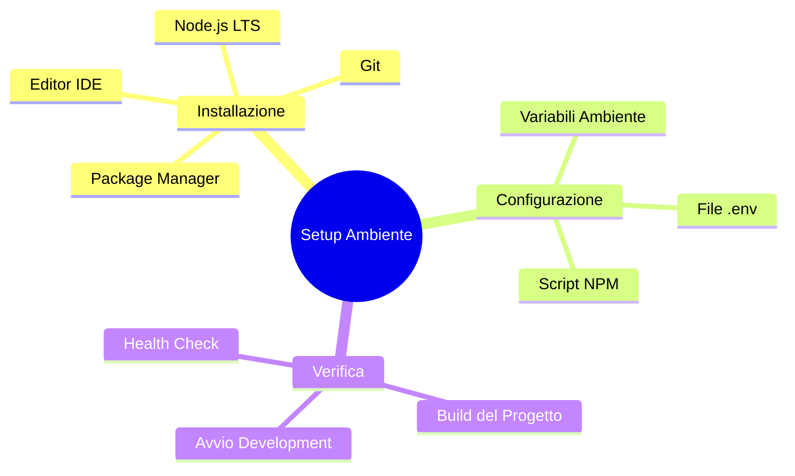

# 01 — Setup dell'Ambiente — Primo Avvio

## 🎯 Obiettivi del Modulo

Alla fine di questo modulo, sarai in grado di:
- **Configurare** l'ambiente di sviluppo locale
- **Comprendere** il ruolo di variabili d'ambiente e file di configurazione
- **Eseguire** il progetto in modalità sviluppo
- **Verificare** che tutto funzioni correttamente
- **Risolvere** problemi comuni di setup

**⏱️ Tempo stimato**: 2-3 ore di studio e pratica

**📋 Prerequisiti**: Aver completato il modulo 00 (Prerequisiti)

---

## 📚 Struttura del Modulo

1. **Installazione e Prerequisiti** - Verifica sistema e installazione dipendenze
2. **Configurazione** - Variabili d'ambiente e file di configurazione
3. **Avvio e Verifica** - Esecuzione progetto e debugging iniziale

### Mappa Concettuale



---

## 1. Installazione e Prerequisiti

> **🎯 Obiettivo**: Verificare che il tuo sistema sia pronto

### 1.0 Verifica Prerequisiti Sistema

#### 💡 Perché Serve Verifica?

Prima di iniziare, devi assicurarti che il tuo sistema abbia tutti gli strumenti necessari. Errori qui bloccano l'avvio.

**Componenti necessari:**
1. Node.js → Esecuzione JavaScript lato server
2. npm/pnpm → Gestione dipendenze
3. Git → Controllo versione
4. Editor (VS Code) → Sviluppo

---

#### 📚 Node.js: Esecuzione JavaScript

**Cosa è Node.js?**

Node.js è un runtime JavaScript basato su V8 che permette di eseguire JavaScript lato server.

**Perché serve LTS?**

- LTS (Long Term Support) = versioni stabili supportate
- Next.js richiede versioni specifiche
- Maggiore compatibilità con ecosistema npm

**Verifica installazione:**

```bash
# Verifica versione Node
node --version
# Output atteso: v20.x.x o v22.x.x

# Verifica versione npm
npm --version
# Output atteso: 10.x.x
```

**🔴 Se non funziona:**

1. Scarica da [nodejs.org](https://nodejs.org/)
2. Installa versione LTS
3. Riavvia terminale
4. Verifica di nuovo

---

#### 📚 Git: Controllo Versione

**Cosa è Git?**

Git è un sistema di versionamento distribuito per tracciare modifiche al codice.

**Perché serve?**

- Clonare repository progetti
- Tracciare modifiche
- Contribuire a progetti open-source
- Backup automatico del lavoro

**Verifica installazione:**

```bash
git --version
# Output atteso: git version 2.x.x
```

**🔴 Se non funziona:**

1. Windows: [git-scm.com](https://git-scm.com/)
2. macOS: `brew install git`
3. Linux: `sudo apt install git`

---

#### 📚 Editor: VS Code

**Perché VS Code?**

- ✅ Gratuito e Open Source
- ✅ Estensioni per TypeScript/React
- ✅ Debug integrato
- ✅ Terminale integrato
- ✅ Git integrato

**Installazione:**

1. Vai su [code.visualstudio.com](https://code.visualstudio.com/)
2. Scarica per il tuo sistema operativo
3. Installa

**Estensioni essenziali:**

```json
{
  "recommendations": [
    "dbaeumer.vscode-eslint",
    "esbenp.prettier-vscode",
    "bradlc.vscode-tailwindcss",
    "ms-vscode.vscode-typescript-next"
  ]
}
```

---

### 1.1 Clonazione del Repository

#### 💡 Clonare il Progetto

**Cosa succede quando cloni?**

1. Git scarica tutti i file del progetto
2. Scarica la cronologia completa (commit history)
3. Crea cartella locale del progetto
4. Inizializza repository Git locale

**Comando:**

```bash
# Clona repository
git clone https://github.com/elteo003/TheHustlePlace.git

# Entra nella cartella
cd TheHustlePlace

# Verifica struttura
ls -la
```

**Struttura attesa:**

```
TheHustlePlace/
├── app/              # Next.js App Router
├── components/       # React components
├── services/         # Business logic
├── public/           # Static files
├── .env.example      # Template variabili ambiente
├── package.json      # Dipendenze e script
└── tsconfig.json     # TypeScript config
```

---

#### 🧠 Esercizio di Ragionamento 1.1

**Domanda**: Perché ci sono file `package.json` e `package-lock.json`? 

**Cosa fanno?**

<details>
<summary>💭 Pensa...</summary>

- **package.json**: Definisce dipendenze e script (dichiarativo)
- **package-lock.json**: Blocca versioni esatte (lock file)

React ha **DUE** file simili perché lavora sia server che client!
</details>

---

## 2. Configurazione dell'Ambiente

> **🎯 Obiettivo**: Configurare variabili d'ambiente e script

### 2.0 Variabili d'Ambiente

#### 💡 Perché Serve `.env`?

**Il problema:**

```typescript
// ❌ SBAGLIATO: Hardcoded secrets
const API_KEY = "sk_live_secret123"

// Problemi:
// 1. Committable accidentalmente su Git
// 2. Esporto pubblico del secret
// 3. Impossibile usare chiavi diverse per dev/prod
```

**La soluzione:**

```typescript
// ✅ CORRETTO: Environment variables
const API_KEY = process.env.TMDB_API_KEY

// Vantaggi:
// 1. Non committable (in .gitignore)
// 2. Chiavi diverse per ambiente
// 3. Sicurezza
```

---

#### 📚 File `.env` e `.env.example`

**Cosa contiene `.env.example`?**

```bash
# .env.example
TMDB_API_KEY=your_tmdb_api_key_here
REDIS_URL=redis://localhost:6379
NEXT_PUBLIC_API_URL=http://localhost:3000
```

**Perché `.env.example`?**

- ✅ Template condiviso in repo (safe commit)
- ✅ Documentazione configurazioni necessarie
- ✅ Onboarding rapido nuovi dev

**Setup:**

```bash
# 1. Copia template
cp .env.example .env

# 2. Apri e modifica
code .env

# 3. Compila le chiavi
TMDB_API_KEY=tuachiaverealequi
```

---

#### 📚 Next.js e Variabili d'Ambiente

**Due tipi di variabili:**

**1. Server-only:**

```bash
# .env - Solo server (default)
TMDB_API_KEY=secret123
REDIS_URL=redis://localhost:6379
```

**Accesso:**

```typescript
// app/api/route.ts - Solo lato server!
const apiKey = process.env.TMDB_API_KEY
```

**2. Client-exposed:**

```bash
# .env - Esposta al browser
NEXT_PUBLIC_API_URL=http://localhost:3000
```

**Accesso:**

```typescript
// components/MyComponent.tsx - Anche nel browser!
const apiUrl = process.env.NEXT_PUBLIC_API_URL
```

**⚠️ Attenzione:** `NEXT_PUBLIC_*` è inclusa nel bundle client!

---

#### 🔬 Esercizio Pratico 2.0

**Obiettivo:** Configura le variabili d'ambiente

**Passi:**

1. Apri `.env.example` e leggi le variabili necessarie
2. Copia `.env.example` → `.env`
3. Per ogni variabile, determina:
   - Dove ottenerla (es: registrazione TMDB)
   - Se è necessaria per sviluppo
4. Compila `.env` con valori reali

**💡 Suggerimenti:**

<details>
<summary>Hint 1</summary>

Per ottenere TMDB_API_KEY:
1. Vai su [themoviedb.org](https://www.themoviedb.org/)
2. Registrati (gratuito)
3. Richiedi API key nel profilo
</details>

---

### 2.1 Script NPM

#### 💡 Cos'è `package.json`?

**File centrale del progetto:**

```json
{
  "name": "thehustleplace",
  "version": "1.0.0",
  "scripts": {
    "dev": "next dev",
    "build": "next build",
    "start": "next start"
  },
  "dependencies": {
    "next": "^14.0.0",
    "react": "^18.0.0"
  }
}
```

**Sezioni chiave:**

- **scripts**: Comandi eseguibili con `npm run <script>`
- **dependencies**: Librerie necessarie in produzione
- **devDependencies**: Librerie solo per sviluppo

---

#### 📚 Script Comuni

**`npm run dev`**

```bash
# Cosa fa:
# 1. Avvia Next.js development server
# 2. Hot reload per modifiche
# 3. Errore overlay nel browser
# 4. Compilazione incrementale veloce

npm run dev
```

**Output atteso:**

```
▲ Next.js 14.x.x
- Local:        http://localhost:3000
- Ready in 1.2s
```

**`npm run build`**

```bash
# Cosa fa:
# 1. Compila TypeScript
# 2. Ottimizza bundle
# 3. Genera pagine statiche
# 4. Prepara per produzione

npm run build
```

**`npm start`**

```bash
# Cosa fa:
# 1. Avvia server produzione
# 2. Serve build ottimizzato
# 3. Performance massime
```

---

## 3. Avvio e Verifica

> **🎯 Obiettivo**: Eseguire il progetto e verificare funzionamento

### 3.0 Installazione Dipendenze

#### 💡 Cosa Succede con `npm install`?

**Processo:**

```
1. Legge package.json
2. Scarica tutte le dependencies
3. Risolve dipendenze delle dipendenze
4. Installa in node_modules/
5. Genera package-lock.json
```

**Comando:**

```bash
npm install
```

**Tempo:** 2-5 minuti (dipende da connessione)

**Output finale:**

```
added 1847 packages, and audited 1848 packages in 3m
```

**✅ Checkpoint:** Dovresti vedere cartella `node_modules/` creata

---

### 3.1 Avvio Development Server

#### 💡 Modalità Sviluppo

**Caratteristiche:**

- ✅ **Hot Reload**: Modifiche visibili istantaneamente
- ✅ **Source Maps**: Debug con file originali
- ✅ **Error Overlay**: Errori nel browser
- ✅ **Fast Refresh**: React mantiene stato durante modifiche

**Comando:**

```bash
npm run dev
```

**Apri browser:** `http://localhost:3000`

**Verifica:**
- Homepage carica senza errori
- Console browser vuota (nessun errore JS)
- Terminale senza errori rossi

---

#### 🔬 Testing Health Check

**Endpoint `/api/health`:**

```bash
# Test da terminale
curl http://localhost:3000/api/health

# Output atteso:
{
  "status": "ok",
  "timestamp": "2024-01-15T10:30:00Z"
}
```

**Nel browser:**
Naviga su `http://localhost:3000/api/health`

**Cosa verifica:**
- ✅ Server Next.js attivo
- ✅ API Routes funzionanti
- ✅ Routing configurato correttamente

---

### 3.2 Risoluzione Problemi Comuni

#### ⚠️ Errore: "Port 3000 already in use"

**Causa:** Altro processo usa porta 3000

**Soluzione:**

```bash
# Opzione 1: Uccidi processo esistente
# Windows
netstat -ano | findstr :3000
taskkill /PID <PID> /F

# macOS/Linux
lsof -ti:3000 | xargs kill

# Opzione 2: Cambia porta
PORT=3001 npm run dev
```

---

#### ⚠️ Errore: "Module not found"

**Causa:** Dipendenze non installate correttamente

**Soluzione:**

```bash
# Rimuovi e re-installa
rm -rf node_modules package-lock.json
npm install
```

---

#### ⚠️ Errore: "Cannot find module '@/types'"

**Causa:** Path aliases non configurati

**Verifica:**

```json
// tsconfig.json
{
  "compilerOptions": {
    "paths": {
      "@/*": ["./*"]
    }
  }
}
```

Se manca, copia da `doc/studio/moduli/00-prerequisiti.md` Sezione TypeScript.

---

### 3.3 First Look al Progetto

#### 🔍 Esplorazione Struttura

**Esercizio guidato:**

1. **Apri `app/page.tsx`**
   - Che tipo di componente è? (Server o Client)
   - Cosa importa?
   - Quali componenti usa?

2. **Naviga la homepage**
   - Clicca su un film
   - Esplora sezione "Film Popolari"
   - Prova la barra di ricerca

3. **Apri Chrome DevTools**
   - Network Tab: Quante richieste?
   - Console: C'è qualche errore?
   - Elements: Da dove viene l'HTML?

---

## 📝 Esercizi Finali del Modulo

### Esercizio 1: Configurazione Completa

**Obiettivo:** Setup ambiente funzionante end-to-end

**Requisiti:**
- [ ] Node.js LTS installato e verificato
- [ ] Git installato
- [ ] VS Code con estensioni
- [ ] Repository clonato
- [ ] `.env` configurato con API key reali
- [ ] Dipendenze installate (`npm install`)
- [ ] Server avviato (`npm run dev`)
- [ ] Homepage accessibile senza errori
- [ ] Health check API risponde

**Rubrica:**
- Funzionamento: ✅/❌
- Variabili ambiente: ✅/❌
- Nessun errore: ✅/❌

---

### Esercizio 2: Debug Pratico

**Obiettivo:** Risolvere un problema simulato

**Scenario:** Un collega ha problemi:

```
Error: Cannot find module 'axios'
```

**Compito:**
1. Identifica la causa
2. Proponi soluzione step-by-step
3. Verifica che funzioni

---

## ✅ Checklist Finale

Verifica di aver compreso:

- [ ] Cosa è Node.js e perché serve
- [ ] Cosa è Git e come usarlo
- [ ] Differenza tra `.env` e `.env.example`
- [ ] Variabili `NEXT_PUBLIC_*` vs server-only
- [ ] Script `dev`, `build`, `start` e quando usarli
- [ ] Come risolvere porta occupata
- [ ] Come re-installare dipendenze
- [ ] Come verificare che tutto funzioni

---

## 📚 Risorse Aggiuntive

- **Node.js Docs**: https://nodejs.org/docs/
- **Next.js Config**: https://nextjs.org/docs/app/api-reference/next-config-js
- **Git Tutorial**: https://git-scm.com/docs/gittutorial
- **npm Docs**: https://docs.npmjs.com/

---

## 🔍 Domande Guida per l'Apprendimento

1. **Variabili ambiente**: Quali informazioni non dovrebbero MAI essere in `.env` ma committate?
2. **Build vs Dev**: Quali sono i 3 principali vantaggi della modalità sviluppo?
3. **Dipendenze**: Cosa succede se `package-lock.json` viene cancellato?

---

## 🔗 Collegamenti

- **Reference**: `doc/studio/reference/config/`
- **Modulo precedente**: 00 - Prerequisiti
- **Modulo successivo**: 02 - Architettura del Progetto

---

**Congratulazioni!** 🎉

Il tuo ambiente di sviluppo è configurato e funzionante. Prossimo modulo: Architettura del Progetto!
