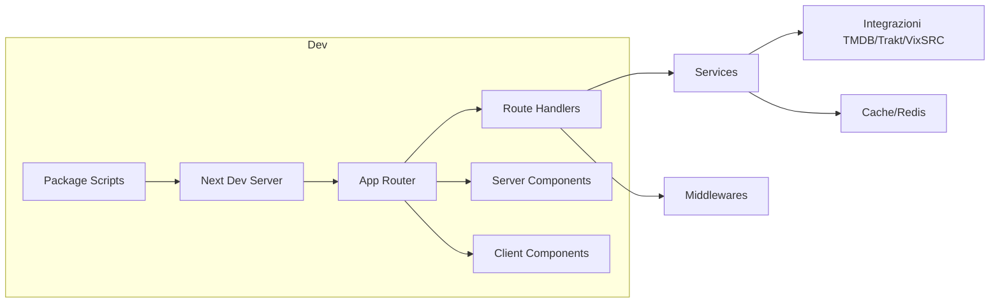

# 01 — Setup dell'Ambiente

## Obiettivi
- Preparare l'ambiente locale
- Comprendere variabili d'ambiente e script
- Eseguire il progetto e verificare la salute

## Passi pratici
1. Requisiti: Node LTS, pnpm/npm, Git.
2. Copia `.env.example` in `.env` e compila le chiavi API richieste.
3. Installa dipendenze: `npm install`.
4. Avvio dev: `npm run dev`.
5. Health check: visita `/api/health`.

## Flusso build/dev (Mermaid)

## Domande guida
- Quali variabili d’ambiente sono critiche all’avvio? Dove vengono lette?
- Qual è la differenza tra errori a build-time, runtime server e runtime client?

## Esercizio
- Aggiungi una variabile d’ambiente opzionale con default sicuro e usala in un punto del logging.
