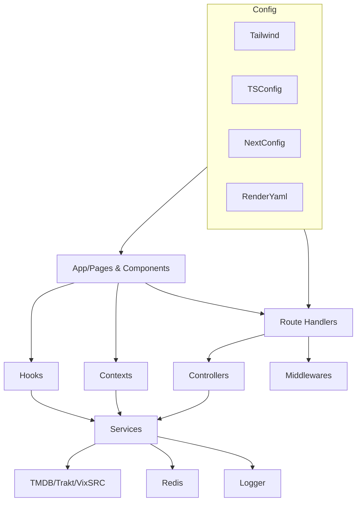

# 02 — Architettura del Progetto

## Obiettivi
- Leggere la mappa delle directory come mappa dei ruoli
- Capire i flussi dati end-to-end
- Riconoscere punti di estensione e confini

## Mappa architetturale (Mermaid)

## Teoria
- Separazione delle responsabilità: UI (presentazione), Hooks/Contexts (stato/riuso), Controller (orchestrazione), Services (accesso dati), Middlewares (policy trasversali).
- Dipendenze direzionali: UI → Hooks/Services; API → Controllers → Services; Services → Utils/Lib.

## Domande guida
- Se dovessi sostituire TMDB, quali moduli toccheresti minimizzando l’impatto?
- Dove implementeresti la deduplicazione delle richieste: hook, servizio o middleware?

## Esercizio
- Disegna una variante dell’architettura includendo un nuovo provider esterno e definisci i confini.
