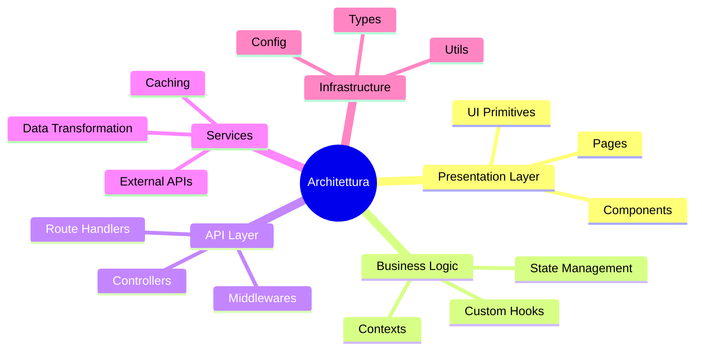
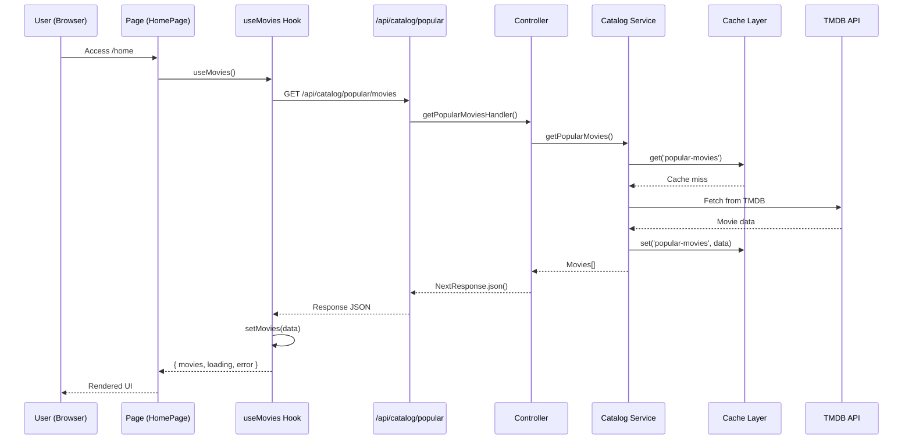
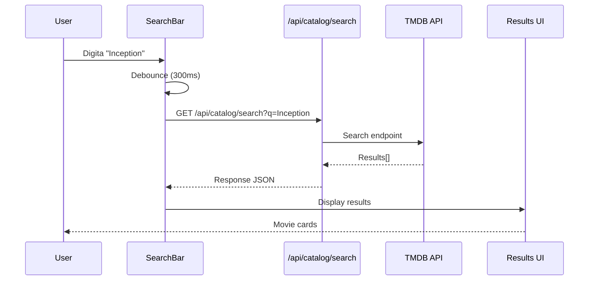
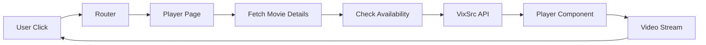

# 02 — Architettura del Progetto — Separazione delle Responsabilità

## 🎯 Obiettivi del Modulo

Alla fine di questo modulo, sarai in grado di:
- **Leggere** la struttura del progetto come mappa di responsabilità
- **Comprendere** i flussi dati end-to-end da UI a API esterne
- **Riconoscere** i pattern architetturali (MVC, Layered, Separation of Concerns)
- **Estendere** il progetto aggiungendo nuove funzionalità
- **Decidere** dove implementare logica (Component, Hook, Service, Controller)

**⏱️ Tempo stimato**: 4-6 ore di studio e pratica

**📋 Prerequisiti**: Aver completato i moduli 00 e 01

---

## 📚 Struttura del Modulo

1. **Mappa Architetturale** - Struttura fisica e responsabilità
2. **Pattern Architetturali** - Clean Architecture e Separation of Concerns
3. **Flussi Dati** - Come i dati si muovono nel sistema
4. **Punti di Estensione** - Dove e come aggiungere funzionalità

### Mappa Concettuale



---

## 1. Mappa Architetturale del Progetto

> **🎯 Obiettivo**: Capire la struttura fisica e le responsabilità di ogni layer

### 1.0 Struttura Directory

#### 💡 Perché Questa Struttura?

Next.js App Router impone una struttura specifica, ma la nostra **organizzazione logica** segue principi architetturali.

**Struttura fisica:**

```
TheHustlePlace/
├── app/                    # Next.js App Router (routing)
│   ├── page.tsx           # Landing page
│   ├── home/
│   │   └── page.tsx       # Homepage principale
│   ├── movies/
│   │   └── page.tsx       # Lista film
│   ├── api/               # API Routes (backend)
│   │   ├── catalog/       # Endpoint catalog
│   │   ├── tmdb/          # TMDB proxy
│   │   └── player/        # Player endpoints
│   └── layout.tsx         # Root layout
├── components/            # UI Components
│   ├── ui/               # Primitives (Button, Card, etc.)
│   ├── movie-card.tsx    # Business component
│   ├── hero-section.tsx  # Complex component
│   └── navbar.tsx        # Navigation
├── contexts/             # React Contexts
│   ├── MovieContext.tsx
│   └── NavbarContext.tsx
├── hooks/                # Custom React Hooks
│   ├── useMovies.ts
│   ├── useTrailerTimer.ts
│   └── useParallax.ts
├── services/             # Business Logic Layer
│   ├── catalog.service.ts    # Catalog business logic
│   ├── tmdb.service.ts       # TMDB API wrapper
│   ├── vixsrc-scraper.service.ts
│   └── player.service.ts
├── controllers/          # Request/Response Layer
│   ├── catalog.controller.ts
│   └── player.controller.ts
├── middlewares/          # Cross-cutting concerns
│   ├── rate-limit.middleware.ts
│   └── validation.middleware.ts
├── utils/                # Utility functions
│   ├── cache.ts
│   ├── logger.ts
│   └── hls-config.ts
├── types/                # TypeScript types
│   └── index.ts
├── lib/                  # Library wrappers
│   ├── tmdb.ts
│   └── utils.ts
└── public/               # Static assets
    └── images/
```

---

#### 📚 Responsabilità per Layer

**1. Presentation Layer (`app/`, `components/`):**

```typescript
// app/home/page.tsx - Client Component
'use client'

export default function HomePage() {
    // Responsabilità: Rendering UI, orchestrazione componenti
    return <HeroSection />
}
```

**Responsabilità:**
- ✅ Rendering UI
- ✅ Gestione interazioni utente
- ✅ Orchestrazione componenti
- ❌ NO business logic
- ❌ NO API calls diretti
- ❌ NO validazione

---

**2. Business Logic Layer (`contexts/`, `hooks/`):**

```typescript
// hooks/useMovies.ts
export function useMovies() {
    // Responsabilità: Logica riutilizzabile
    const [movies, setMovies] = useState([])
    
    useEffect(() => {
        fetchMovies().then(setMovies)
    }, [])
    
    return { movies }
}
```

**Responsabilità:**
- ✅ State management
- ✅ Side effects (fetch, subscriptions)
- ✅ Logica riutilizzabile
- ❌ NO rendering UI
- ❌ NO network layer

---

**3. API Layer (`app/api/`, `controllers/`):**

```typescript
// controllers/catalog.controller.ts
export async function getPopularMoviesHandler(req: NextRequest) {
    // Responsabilità: Orchestrazione request/response
    try {
        const movies = await catalogService.getPopularMovies()
        return NextResponse.json({ success: true, data: movies })
    } catch (error) {
        return NextResponse.json({ success: false, error }, { status: 500 })
    }
}
```

**Responsabilità:**
- ✅ HTTP request/response handling
- ✅ Status codes e headers
- ✅ Error handling HTTP
- ❌ NO business logic complessa
- ❌ NO chiamate API esterne dirette

---

**4. Services Layer (`services/`):**

```typescript
// services/catalog.service.ts
export class CatalogService {
    async getPopularMovies() {
        // Responsabilità: Business logic e API calls
        const cacheKey = 'popular-movies'
        const cached = await cache.get(cacheKey)
        if (cached) return cached
        
        const movies = await tmdbService.getPopularMovies()
        await cache.set(cacheKey, movies, { ttl: 3600 })
        return movies
    }
}
```

**Responsabilità:**
- ✅ Business logic
- ✅ Chiamate API esterne
- ✅ Data transformation
- ✅ Caching
- ❌ NO HTTP handling
- ❌ NO validation input

---

**5. Infrastructure Layer (`utils/`, `middlewares/`):**

```typescript
// utils/cache.ts
export const cache = {
    get: async (key: string) => { /* ... */ },
    set: async (key: string, value: any) => { /* ... */ }
}
```

**Responsabilità:**
- ✅ Utility functions riutilizzabili
- ✅ Cross-cutting concerns (logging, caching)
- ✅ Configurazione
- ❌ NO business logic

---

### 1.1 Flusso Dati End-to-End

#### 💡 Come Funziona il Flusso

**Esempio: Caricare film popolari**



**Analisi del flusso:**

1. **User** → chiede pagina
2. **Page** → usa custom hook
3. **Hook** → chiama API interna
4. **API Route** → delega a controller
5. **Controller** → orchestratore
6. **Service** → logica e cache
7. **Cache** → verifica hit/miss
8. **External API** → fetch se cache miss
9. **Return** → dati risalgono
10. **UI** → rendering

---

#### 🔬 Esempio dal Progetto

**Riferimento**: `app/home/page.tsx`, `hooks/useMoviesWithTrailers.ts`, `app/api/catalog/popular/movies/route.ts`

```1:100:app/home/page.tsx
'use client'

import { useState, useEffect } from 'react'
import { useRouter } from 'next/navigation'
import { Navbar } from '@/components/navbar'
import { HeroSection } from '@/components/hero-section'
import MovieGridIntegrated from '@/components/movie-grid-integrated'
import { ApiKeyError } from '@/components/api-key-error'
import { MovieProvider } from '@/contexts/MovieContext'

export default function HomePage() {
    const router = useRouter()
    const [hasApiKey, setHasApiKey] = useState(true)
    const [isCheckingApi, setIsCheckingApi] = useState(false)
    const [heroSectionLoaded, setHeroSectionLoaded] = useState(false)
    const [showUpcomingTrailers, setShowUpcomingTrailers] = useState(false)
    const [currentHeroMovieIndex, setCurrentHeroMovieIndex] = useState(0)
    const [pageLoaded, setPageLoaded] = useState(false)

    // La Hero Section ora gestisce internamente il caricamento dei film con trailer

    useEffect(() => {
        // Pre-carica altri dati in background (la Hero Section gestisce i suoi film internamente)
        const preloadData = async () => {
            try {
                // Pre-carica dati per le sezioni
                await Promise.all([
                    fetch('/api/catalog/popular/movies'),
                    fetch('/api/catalog/latest/movies'),
                    fetch('/api/catalog/popular/tv'),
                    fetch('/api/catalog/latest/tv'),
                    fetch('/api/catalog/top-10')
                ])
            } catch (error) {
                console.log('Pre-caricamento dati in background:', error)
            }
        }

        preloadData()
    }, [])


    // Gestisce il caricamento della Hero Section
    const handleHeroSectionLoaded = () => {
        setHeroSectionLoaded(true)
    }

    useEffect(() => {
        // Controllo API key in background, non blocca il rendering
        setIsCheckingApi(true)
        fetch('/api/test-api-key')
            .then(res => res.json())
            .then(data => setHasApiKey(data.hasApiKey))
            .catch(() => setHasApiKey(false))
            .finally(() => setIsCheckingApi(false))
    }, [])


    // Gestisce la fine del trailer nella Hero Section
    const handleTrailerEnded = () => {
        console.log('🎬 Trailer finito, mostrando prossimi trailer')
        setShowUpcomingTrailers(true)
    }


    // Gestisce il cambio di film nella Hero Section
    const handleHeroMovieChange = (index: number) => {
        setCurrentHeroMovieIndex(index)
    }

    // Gestisce la selezione di un film dai prossimi trailer
    const handleUpcomingMovieSelect = (index: number) => {
        console.log('🎬 Film selezionato dai prossimi trailer:', index)
        setShowUpcomingTrailers(false)
    }

    // Gestisce l'autoplay dei prossimi trailer
    const handleUpcomingAutoplay = () => {
        console.log('🎬 Autoplay prossimo film')
        // La Hero Section gestisce internamente l'indice del prossimo film
        if ((window as any).changeHeroMovie) {
            (window as any).changeHeroMovie(currentHeroMovieIndex + 1)
        }
    }

    // Animazione di entrata della pagina
    useEffect(() => {
        const timer = setTimeout(() => {
            setPageLoaded(true)
        }, 100)
        return () => clearTimeout(timer)
    }, [])

    const handlePlay = (id: number, type?: 'movie' | 'tv') => {
        if (type === 'tv') {
            router.push(`/series/${id}`)
        } else {
            router.push(`/player/movie/${id}`)
        }
    }
```

**🔍 Analisi guidata:**

**Linee 1-11**: Imports
- Come mai `'use client'`?
- Perché import separati?

**Linee 27-32**: Preload parallelo
- `Promise.all()`: vantaggi?
- Perché non sequele?

**Linee 43-46**: Handler callback
- Perché non state diretto?

**Linee 94-100**: Router use-case
- Router si usa lato client?

---

## 2. Pattern Architetturali

> **🎯 Obiettivo**: Capire i principi dietro le scelte architetturali

### 2.0 Separation of Concerns (SoC)

#### 💡 Il Principio Fondamentale

**Definizione:** Ogni modulo ha una responsabilità singola e ben definita.

**Problema senza SoC:**

```typescript
// ❌ SBAGLIATO: Tutto mescolato
export default function HomePage() {
    const [movies, setMovies] = useState([])
    
    useEffect(() => {
        // Fetch API
        fetch('/api/movies')
            .then(r => r.json())
            .then(data => {
                // Business logic
                const filtered = data.filter(m => m.vote_average > 7)
                const sorted = filtered.sort((a, b) => b.vote_average - a.vote_average)
                
                // Caching (??)
                localStorage.setItem('movies', JSON.stringify(sorted))
                
                setMovies(sorted)
            })
    }, [])
    
    // UI rendering
    return <div>{movies.map(m => <MovieCard movie={m} />)}</div>
}
```

**Problemi:**
- ❌ Componente difficile da testare
- ❌ Logica non riutilizzabile
- ❌ Violazione SRP (Single Responsibility Principle)
- ❌ Impossibile mockare

---

#### 📚 Soluzione: Layered Architecture

```typescript
// ✅ CORRETTO: SoC rispettata

// Layer 1: Presentation
export default function HomePage() {
    const { movies } = useMovies() // Hook gestisce state
    return <div>{movies.map(m => <MovieCard movie={m} />)}</div>
}

// Layer 2: Business Logic
export function useMovies() {
    const [movies, setMovies] = useState([])
    useEffect(() => {
        const data = await catalogService.getPopularMovies() // Service gestisce logica
        setMovies(data)
    }, [])
    return { movies }
}

// Layer 3: Service
export class CatalogService {
    async getPopularMovies() {
        const cached = await cache.get('popular-movies') // Cache gestita
        if (cached) return cached
        
        const response = await tmdbService.fetch() // External API
        const filtered = this.filterAndSort(response) // Business logic
        await cache.set('popular-movies', filtered)
        return filtered
    }
}
```

**Vantaggi:**
- ✅ Ogni layer testabile indipendentemente
- ✅ Logica riutilizzabile
- ✅ Facile sostituire implementation (es: cache)
- ✅ Debugging più semplice

---

### 2.1 MVC vs Layered Architecture

#### 📚 Confronto Pattern

**MVC (Model-View-Controller):**

```
User Action → Controller → Model → View
```

Nel nostro progetto:

```typescript
// Model = Services (business logic)
CatalogService.getPopularMovies()

// View = Components (UI)
<HomePage />

// Controller = Route Handlers + Controllers (orchestrazione)
getPopularMoviesHandler(request)
```

**Layered Architecture:**

```
Presentation → Business Logic → Data Access → Infrastructure
```

Nel nostro progetto:

```
Components/Pages → Hooks/Contexts → Services → Utils/Config
```

---

#### 🎓 Quando Usare Quale?

**MVC:**
- ✅ App tradizionali (PHP, Rails)
- ✅ Client-Server clear separation
- ✅ Rapid prototyping

**Layered:**
- ✅ Next.js full-stack
- ✅ Microservices
- ✅ Scalabilità a lungo termine

**Nel nostro progetto**: Layered con influenze MVC (Controllers per orchestrazione).

---

### 2.2 Dependency Injection (DI)

#### 💡 Ridurre Accoppiamento

**Problema senza DI:**

```typescript
// ❌ Accoppiamento forte
export class CatalogService {
    private tmdb = new TMDBService() // Hardcoded!
    private cache = new RedisCache()  // Hardcoded!
    
    async getMovies() {
        return await this.tmdb.fetch()
    }
}

// Problema: Impossibile testare con mock!
```

**Soluzione con DI:**

```typescript
// ✅ Iniezione dipendenze
export class CatalogService {
    constructor(
        private tmdb: TMDBService,     // Iniettato!
        private cache: CacheService    // Iniettato!
    ) {}
    
    async getMovies() {
        return await this.tmdb.fetch()
    }
}

// Utilizzo
const catalogService = new CatalogService(
    new TMDBService(),
    new RedisCache()
)

// Testing con mock
const mockService = new CatalogService(
    mockTMDBService,
    mockCacheService
)
```

**Nel progetto:**

```typescript
// controllers/catalog.controller.ts
export class CatalogController {
    private catalogService: CatalogService
    
    constructor() {
        this.catalogService = new CatalogService() // Simple instantiation
    }
}
```

Per ora istanziato direttamente. Si può passare a DI per testabilità e flessibilità.

---

### 2.3 Clean Architecture

#### 📚 Layer Circle (Robert Martin)

```
┌─────────────────────────┐
│    Entities & Types     │  ← Core business rules
├─────────────────────────┤
│   Use Cases / Services  │  ← Application logic
├─────────────────────────┤
│  Interface Adapters     │  ← Controllers, Presenters
├─────────────────────────┤
│    Frameworks & IO      │  ← DB, Web, External APIs
└─────────────────────────┘

Dependency Rule: Dependencies puntano VERSO L'INTERNO
```

**Nel nostro progetto:**

**Entities (`types/`):**
```typescript
// types/index.ts
export interface Movie {
    id: number
    title: string
    // ... business rules pure
}
```

**Use Cases (`services/`):**
```typescript
// services/catalog.service.ts
export class CatalogService {
    // Application logic
    async getPopularMovies(): Promise<Movie[]>
}
```

**Interface Adapters (`controllers/`, `hooks/`):**
```typescript
// controllers/catalog.controller.ts
// Adatta HTTP requests a business logic
```

**Frameworks (`app/`, external):**
```typescript
// app/api/...
// Next.js framework, TMDB API
```

---

## 3. Flussi Dati Dettagliati

> **🎯 Obiettivo**: Tracciare esattamente come i dati fluiscono

### 3.0 Flusso Homepage: Dettaglio Completo

#### 📚 Step-by-Step Breakdown

**Scenario:** Utente visita homepage

**Step 1: Browser Request**

```typescript
// Browser fa GET request
GET https://thehustleplace.com/home
```

**Step 2: Next.js SSR**

```typescript
// app/layout.tsx (Server Component)
export default function RootLayout({ children }) {
    return (
        <html>
            <body>
                <MovieProvider>{children}</MovieProvider>
            </body>
        </html>
    )
}
```

**Step 3: Page Rendering**

```typescript
// app/home/page.tsx
export default function HomePage() {
    // Client Component, hydration avviene dopo
    return (
        <MovieProvider> {/* Context */}
            <Navbar />
            <HeroSection /> {/* Fetch movies */}
            <MovieGrid /> {/* Display popular */}
        </MovieProvider>
    )
}
```

**Step 4: Data Fetching**

```typescript
// contexts/MovieContext.tsx
export const MovieProvider = ({ children }) => {
    const { movies, loading, error } = useMoviesWithTrailers()
    // Context fornisce movies a tutti i children
    return <MovieContext.Provider value={{ movies }}>{children}</MovieContext.Provider>
}
```

**Step 5: Hook Execution**

```typescript
// hooks/useMoviesWithTrailers.ts
export const useMoviesWithTrailers = () => {
    const [movies, setMovies] = useState([])
    
    useEffect(() => {
        const loadMovies = async () => {
            const response = await fetch('/api/catalog/popular/movies-with-trailers')
            const data = await response.json()
            setMovies(data.data) // State update
        }
        loadMovies()
    }, [])
    
    return { movies, loading, error }
}
```

**Step 6: API Route**

```typescript
// app/api/catalog/popular/movies-with-trailers/route.ts
export async function GET(request: NextRequest) {
    // API Route delega a controller
    return await getPopularMoviesWithTrailersHandler(request)
}
```

**Step 7: Controller**

```typescript
// controllers/catalog.controller.ts
export async function getPopularMoviesWithTrailersHandler(req: NextRequest) {
    const controller = new CatalogController()
    return await controller.getPopularMoviesWithTrailers(req)
}
```

**Step 8: Service**

```typescript
// services/catalog.service.ts
async getPopularMoviesWithTrailers(): Promise<Movie[]> {
    // Check cache
    const cached = await cache.get('movies-with-trailers')
    if (cached) return cached
    
    // Fetch from TMDB
    const tmdbMovies = await tmdbWrapperService.getPopularMovies(20)
    
    // Filter for movies with trailers
    const moviesWithTrailers = await this.filterMoviesWithTrailers(tmdbMovies)
    
    // Cache result
    await cache.set('movies-with-trailers', moviesWithTrailers, { ttl: 3600 })
    
    return moviesWithTrailers
}
```

**Step 9: Response Return**

```
Response salisce: Service → Controller → API Route → Hook → Component → UI
```

---

### 3.1 Flusso Ricerca: Interazione Utente



**Cosa accade:**

1. Utente digita → `onChange` event
2. Debounce → evita ricerca a ogni carattere
3. Fetch API → `/api/catalog/search?q=Inception`
4. Controller → delega a service
5. Service → chiama TMDB Search
6. Risultati → UI aggiornata

---

### 3.2 Flusso Player: Click-to-Play

**Scenario:** Utente clicca "Play" su un film



**Implementazione:**

```typescript
// components/movie-card.tsx
function MovieCard({ movie }) {
    const handleClick = () => {
        // Navigation
        window.location.href = `/player/movie/${movie.id}`
    }
    
    return <div onClick={handleClick}>Play</div>
}

// app/player/movie/[id]/page.tsx
export default async function PlayerPage({ params }) {
    const movie = await tmdbService.getMovie(params.id) // Fetch details
    const streamUrl = await playerService.generateUrl(params.id) // Get stream
    return <VideoPlayer movie={movie} streamUrl={streamUrl} />
}
```

---

## 4. Punti di Estensione e Confini

> **🎯 Obiettivo**: Capire dove aggiungere funzionalità senza rompere l'architettura

### 4.0 Dove Implementare Nuove Funzionalità?

#### 🔧 Esercizio: Aggiungere "Aggiungi ai Preferiti"

**Opzioni:**

**Opzione 1: Tutto nel Component (SBAGLIATO)**

```typescript
// ❌ Component overload
export function MovieCard({ movie }) {
    const handleFavorite = async () => {
        // Fetch API
        const response = await fetch('/api/favorites', {
            method: 'POST',
            body: JSON.stringify({ movieId: movie.id })
        })
        
        // Business logic
        if (response.ok) {
            const data = await response.json()
            if (data.success) {
                // Update local state
                updateFavorites()
                
                // Show notification
                toast.success('Aggiunto ai preferiti!')
            }
        }
    }
    
    return <button onClick={handleFavorite}>❤️</button>
}
```

---

**Opzione 2: Hook + Service (CORRETTO)**

```typescript
// ✅ Hook per riutilizzabilità
export function useFavorites() {
    const [favorites, setFavorites] = useState([])
    
    const addFavorite = async (movieId: number) => {
        const result = await favoritesService.add(movieId)
        if (result.success) {
            setFavorites([...favorites, result.data])
            toast.success('Aggiunto ai preferiti!')
        }
    }
    
    return { favorites, addFavorite }
}

// services/favorites.service.ts
export class FavoritesService {
    async add(movieId: number) {
        const response = await fetch('/api/favorites', {
            method: 'POST',
            body: JSON.stringify({ movieId })
        })
        return await response.json()
    }
}

// Component pulito
export function MovieCard({ movie }) {
    const { addFavorite } = useFavorites()
    
    return <button onClick={() => addFavorite(movie.id)}>❤️</button>
}
```

---

### 4.1 Sostituire Provider Esterni

#### 🔬 Esercizio: Sostituire TMDB con Altro Provider

**Domanda:** Se TMDB chiude, quale codice devi modificare?

**Analisi dell'impatto:**

```
❌ Componenti (app/home/page.tsx): NO (non importa TMDB)
❌ Hooks (hooks/useMovies.ts): NO (usa generic fetch)
❌ API Routes (app/api/catalog/...): NO (usa controller)
✅ Controller (controllers/catalog.controller.ts): NO (usa service)
✅✅ Service (services/catalog.service.ts): SÌ! (importa tmdbWrapperService)
✅✅✅ Wrapper (services/tmdb-wrapper.service.ts): SÌ! (implementazione TMDB)
```

**Soluzione: Strato di Astrazione**

```typescript
// services/movie-provider.interface.ts
export interface MovieProvider {
    getPopularMovies(): Promise<Movie[]>
    getMovieDetails(id: number): Promise<Movie>
    searchMovies(query: string): Promise<Movie[]>
}

// services/tmdb-wrapper.service.ts - Implementazione A
export class TMDBWrapperService implements MovieProvider {
    async getPopularMovies() { /* TMDB implementation */ }
}

// services/alternative-provider.service.ts - Implementazione B
export class AlternativeProviderService implements MovieProvider {
    async getPopularMovies() { /* Alternative implementation */ }
}

// services/catalog.service.ts - Usa interfaccia
export class CatalogService {
    constructor(private provider: MovieProvider) {}
    
    async getPopularMovies() {
        return await this.provider.getPopularMovies() // Provider agnostico!
    }
}
```

**Vantaggi:**
- ✅ Sostituzione provider = cambia solo implementazione
- ✅ Testing: mock provider facilmente
- ✅ Multi-provider support

---

### 4.2 Decisione: Hook, Service o Middleware?

#### 🎓 Quando Usare Cosa?

**Use Hook quando:**
- ✅ Logica React-specifica (state, effects)
- ✅ UI state management
- ✅ Logica riutilizzabile tra componenti
- ❌ NO business logic complessa
- ❌ NO chiamate API dirette (usa service)

**Esempio corretto:**

```typescript
// hooks/useMovies.ts
export function useMovies() {
    const [movies, setMovies] = useState([])
    
    useEffect(() => {
        // Delega a service
        movieService.getPopular().then(setMovies)
    }, [])
    
    return { movies }
}
```

---

**Use Service quando:**
- ✅ Business logic complessa
- ✅ Chiamate API esterne
- ✅ Data transformation
- ✅ Caching
- ❌ NO React-specific logic
- ❌ NO HTTP handling

**Esempio corretto:**

```typescript
// services/catalog.service.ts
export class CatalogService {
    async getPopularMovies() {
        // Business logic
        const cached = await cache.get('popular')
        if (cached) return cached
        
        // External API
        const data = await tmdbService.fetch()
        
        // Transformation
        const normalized = this.normalize(data)
        
        // Cache
        await cache.set('popular', normalized)
        return normalized
    }
}
```

---

**Use Middleware quando:**
- ✅ Cross-cutting concerns
- ✅ Request validation
- ✅ Authentication/Authorization
- ✅ Rate limiting
- ✅ Logging
- ❌ NO business logic
- ❌ NO data fetching

**Esempio corretto:**

```typescript
// middlewares/validation.middleware.ts
export function validateRequest(schema) {
    return (req) => {
        const { error } = schema.validate(req.body)
        if (error) {
            return NextResponse.json({ error: error.message }, { status: 400 })
        }
        // Passa al prossimo handler
    }
}
```

---

**Use Controller quando:**
- ✅ Orchestrazione request/response HTTP
- ✅ Mapping request a service calls
- ✅ Formatting response
- ✅ Error handling HTTP
- ❌ NO business logic

**Esempio corretto:**

```typescript
// controllers/catalog.controller.ts
export async function getMoviesHandler(req: NextRequest) {
    try {
        const movies = await catalogService.getMovies() // Delegate
        return NextResponse.json({ success: true, data: movies })
    } catch (error) {
        return NextResponse.json({ success: false, error }, { status: 500 })
    }
}
```

---

#### 🧠 Esercizio di Ragionamento 4.2

**Domanda**: Dove implementeresti la deduplicazione delle richieste API?

**Scenari:**

**A) Due componenti fetchano lo stesso film contemporaneamente**

<details>
<summary>💭 Pensa...</summary>

**Hook:** NO! Hook non ha visibilità su altri componenti

**Service:** SÌ! Service può cacheare richieste in corso:

```typescript
export class CatalogService {
    private pendingRequests = new Map<string, Promise<any>>()
    
    async getMovie(id: number) {
        const key = `movie-${id}`
        
        // Se già in corso, condividi la stessa Promise
        if (this.pendingRequests.has(key)) {
            return await this.pendingRequests.get(key)
        }
        
        const promise = this.fetchMovie(id)
        this.pendingRequests.set(key, promise)
        
        try {
            return await promise
        } finally {
            this.pendingRequests.delete(key)
        }
    }
}
```
</details>

**B) Tutti i componenti usano React Query o SWR**

<details>
<summary>💭 Pensa...</summary>

**Biblioteca:** React Query gestisce automaticamente la deduplicazione!

```typescript
// React Query caching
const { data } = useQuery({
    queryKey: ['movie', id],
    queryFn: () => fetchMovie(id)
})
// Multiple components con stesso queryKey → 1 sola request
```
</details>

---

## 📝 Esercizi Finali del Modulo

### Esercizio 1: Mappare i Flussi

**Obiettivo:** Tracciare un flusso completo

**Scenario:** Utente cerca "Avatar" e clicca Play

**Compito:**
1. Disegna sequence diagram dettagliato
2. Indica quali file tocca
3. Indica quali layer
4. Indica cache hit/miss

**Criteri:**
- ✅ Sequence diagram corretto
- ✅ File identificati correttamente
- ✅ Layer identificati correttamente

---

### Esercizio 2: Aggiungere Funzionalità

**Obiettivo:** Implementare "Cronologia Visualizzazioni"

**Requisiti:**
- Salva film guardati
- Mostra "Continuare a guardare"
- Persiste in localStorage

**Compito:**
1. Identifica DOVE implementare ogni parte
2. Spiega PERCHÉ quella scelta
3. Implementa (codice)

**Rubrica:**
- ✅ Architettura corretta (SoC rispettata)
- ✅ Layer appropriati
- ✅ Codice funzionante

---

### Esercizio 3: Refactoring

**Obiettivo:** Sostituire struttura attuale con Dependency Injection

**Compito:**
Refactor `CatalogController` per usare DI:

**Da:**
```typescript
export class CatalogController {
    private catalogService = new CatalogService()
}
```

**A:**
```typescript
export class CatalogController {
    constructor(private catalogService: CatalogService) {}
}
```

**Vantaggi identificati:**
- Testabilità migliorata
- Mocking facilitato

---

## ✅ Checklist Finale

Verifica di aver compreso:

- [ ] Struttura directory e responsabilità per layer
- [ ] Differenza tra Presentation, Business Logic, API, Services
- [ ] Flusso dati da UI a API esterne
- [ ] Pattern Separation of Concerns
- [ ] Differenza MVC vs Layered Architecture
- [ ] Quando usare Hook, Service, Controller, Middleware
- [ ] Come sostituire provider esterni
- [ ] Dove aggiungere nuove funzionalità

---

## 📚 Risorse Aggiuntive

- **Clean Architecture**: "Clean Architecture" di Robert C. Martin
- **SOLID Principles**: https://en.wikipedia.org/wiki/SOLID
- **Separation of Concerns**: https://en.wikipedia.org/wiki/Separation_of_concerns
- **Next.js Architecture**: https://nextjs.org/docs

---

## 🔍 Domande Guida per l'Apprendimento

1. **Dove metteresti la logica di "rilancia film simili"?**
2. **Come testeresti `CatalogService` senza chiamare TMDB reale?**
3. **Perché `MovieContext` è separato dai componenti che lo usano?**

---

## 🔗 Collegamenti

- **Reference**: `doc/studio/reference/controllers/`, `doc/studio/reference/services/`
- **Modulo precedente**: 01 - Setup Ambiente
- **Modulo successivo**: 03 - Routing e Layouts

---

**Congratulazioni!** 🎉

Hai compreso l'architettura TheHustlePlace. Prossimo modulo: Next.js Routing!
