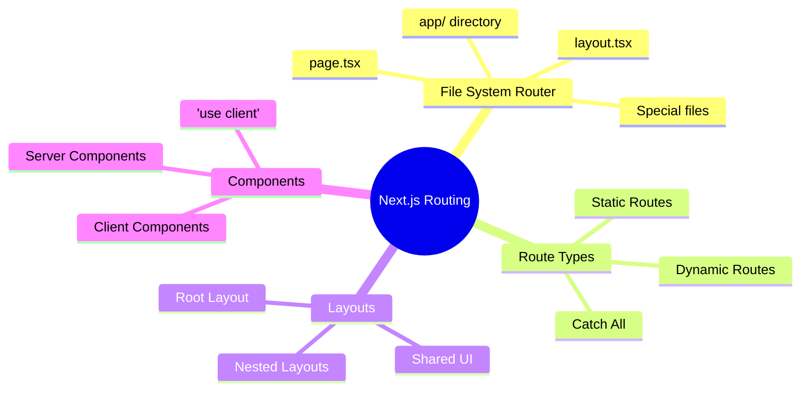

# 03 — Routing e Layouts (Next.js App Router) — Navigation e Struttura UI

## 🎯 Obiettivi del Modulo

Alla fine di questo modulo, sarai in grado di:
- **Comprendere** file-system routing basato su directory in Next.js 14
- **Usare** layouts condivisi e annidati per strutturare l'applicazione
- **Implementare** route dinamiche con parametri e query string
- **Gestire** Server vs Client Components nel routing
- **Configurare** metadata, loading e error boundaries per ogni route

**⏱️ Tempo stimato**: 4-5 ore di studio e pratica

**📋 Prerequisiti**: Aver completato i moduli 00, 01, 02

---

## 📚 Struttura del Modulo

Questo modulo è organizzato in sezioni **progressive**:

1. **File-System Routing** - Come Next.js mappa directory a URL
2. **Layouts e Nesting** - Strutturare interfaccia condivisa
3. **Route Dinamiche** - Parametri e query string
4. **Server vs Client** - Quando usare cosa

### Mappa Concettuale



---

## 1. File-System Routing: Next.js App Router

> **🎯 Obiettivo**: Capire come Next.js 14 trasforma la struttura file in URL

### 1.0 Come Funziona il Routing

#### 💡 Il Paradigma File-System

**Next.js App Router** usa una convenzione semplice ma potente:

```
File/Folder Structure          →        URL Route
───────────────────────────────────────────────────
app/page.tsx                   →        / (home)
app/about/page.tsx             →        /about
app/movies/page.tsx            →        /movies
app/player/movie/[id]/page.tsx →        /player/movie/123
```

**Principio**: **Ogni folder = Segmento URL, ogni `page.tsx` = Route renderizzabile**

---

### 1.1 Struttura Routing in TheHustlePlace

#### 📚 Struttura Completa

Dalla struttura del progetto TheHustlePlace:

```
app/
├── page.tsx                    → / (landing)
├── layout.tsx                  → Layout root (tutti i segmenti)
├── home/
│   └── page.tsx               → /home
├── movies/
│   └── page.tsx               → /movies
├── tv/
│   └── page.tsx               → /tv
├── search/
│   └── page.tsx               → /search?q=avatar
├── catalog/
│   └── page.tsx               → /catalog
├── player/
│   ├── [id]/
│   │   └── page.tsx           → /player/123 (catch-all)
│   ├── movie/
│   │   └── [id]/
│   │       └── page.tsx       → /player/movie/123
│   └── tv/
│       └── [id]/
│           └── page.tsx       → /player/tv/456
└── series/
    └── [id]/
        └── page.tsx           → /series/456
```

**🔬 Esempio dal Progetto:**

```12:100:app/home/page.tsx
'use client'

import { useState, useEffect } from 'react'
import { useRouter } from 'next/navigation'
import { Navbar } from '@/components/navbar'
import { HeroSection } from '@/components/hero-section'
import MovieGridIntegrated from '@/components/movie-grid-integrated'
import { ApiKeyError } from '@/components/api-key-error'
import { MovieProvider } from '@/contexts/MovieContext'

export default function HomePage() {
    const router = useRouter()
    const [hasApiKey, setHasApiKey] = useState(true)
    const [isCheckingApi, setIsCheckingApi] = useState(false)
    const [heroSectionLoaded, setHeroSectionLoaded] = useState(false)
    const [showUpcomingTrailers, setShowUpcomingTrailers] = useState(false)
    const [currentHeroMovieIndex, setCurrentHeroMovieIndex] = useState(0)
    const [pageLoaded, setPageLoaded] = useState(false)

    // La Hero Section ora gestisce internamente il caricamento dei film con trailer

    useEffect(() => {
        // Pre-carica altri dati in background (la Hero Section gestisce i suoi film internamente)
        const preloadData = async () => {
            try {
                // Pre-carica dati per le sezioni
                await Promise.all([
                    fetch('/api/catalog/popular/movies'),
                    fetch('/api/catalog/latest/movies'),
                    fetch('/api/catalog/popular/tv'),
                    fetch('/api/catalog/latest/tv'),
                    fetch('/api/catalog/top-10')
                ])
            } catch (error) {
                console.log('Pre-caricamento dati in background:', error)
            }
        }

        preloadData()
    }, [])


    // Gestisce il caricamento della Hero Section
    const handleHeroSectionLoaded = () => {
        setHeroSectionLoaded(true)
    }

    useEffect(() => {
        // Controllo API key in background, non blocca il rendering
        setIsCheckingApi(true)
        fetch('/api/test-api-key')
            .then(res => res.json())
            .then(data => setHasApiKey(data.hasApiKey))
            .catch(() => setHasApiKey(false))
            .finally(() => setIsCheckingApi(false))
    }, [])


    // Gestisce la fine del trailer nella Hero Section
    const handleTrailerEnded = () => {
        console.log('🎬 Trailer finito, mostrando prossimi trailer')
        setShowUpcomingTrailers(true)
    }


    // Gestisce il cambio di film nella Hero Section
    const handleHeroMovieChange = (index: number) => {
        setCurrentHeroMovieIndex(index)
    }

    // Gestisce la selezione di un film dai prossimi trailer
    const handleUpcomingMovieSelect = (index: number) => {
        console.log('🎬 Film selezionato dai prossimi trailer:', index)
        setShowUpcomingTrailers(false)
    }

    // Gestisce l'autoplay dei prossimi trailer
    const handleUpcomingAutoplay = () => {
        console.log('🎬 Autoplay prossimo film')
        // La Hero Section gestisce internamente l'indice del prossimo film
        if ((window as any).changeHeroMovie) {
            (window as any).changeHeroMovie(currentHeroMovieIndex + 1)
        }
    }

    // Animazione di entrata della pagina
    useEffect(() => {
        const timer = setTimeout(() => {
            setPageLoaded(true)
        }, 100)
        return () => clearTimeout(timer)
    }, [])

    const handlePlay = (id: number, type?: 'movie' | 'tv') => {
        if (type === 'tv') {
            router.push(`/series/${id}`)
        } else {
            router.push(`/player/movie/${id}`)
        }
    }
```

**🔍 Analisi guidata:**

**Linea 1:** `'use client'` - **Perché serve?**
- Questo component usa `useState`, `useEffect`, `useRouter` (React hooks)
- Necessario perché Next.js 14 ha **Server Components** di default
- Client Components = Interattività, state, event handlers

**Linee 94-100:** `handlePlay` function
- **Perché `useRouter().push()`?**
- Next.js Link vs Router.push: quando usare cosa?

---

### 1.2 Route Types

#### 📚 Static vs Dynamic Routes

**Static Routes** (Folder + `page.tsx`):

```typescript
// app/about/page.tsx
export default function AboutPage() {
    return <h1>About Us</h1>
}
// URL: /about (sempre lo stesso)
```

**Dynamic Routes** (Folder `[param]`):

```typescript
// app/player/movie/[id]/page.tsx
export default function MoviePlayerPage() {
    const params = useParams() // Client Component
    const movieId = params.id   // "123"
    
    return <div>Playing movie {movieId}</div>
}
// URL: /player/movie/123, /player/movie/456, /player/movie/789, etc.
```

**🔬 Esempio dal Progetto:**

```24:52:app/player/movie/[id]/page.tsx
export default function MoviePlayerPage() {
    const params = useParams()
    const router = useRouter()
    const movieId = params.id as string
    const videoRef = useRef<HTMLVideoElement>(null)
    const videoPlayerService = new VideoPlayerService()

    const [movie, setMovie] = useState<Movie | null>(null)
    const [videoSource, setVideoSource] = useState<VideoSource | null>(null)
    const [loading, setLoading] = useState(true)
    const [videoLoading, setVideoLoading] = useState(false)
    const [isPlaying, setIsPlaying] = useState(false)
    const [isMuted, setIsMuted] = useState(false)
    const [currentTime, setCurrentTime] = useState(0)
    const [duration, setDuration] = useState(0)
    const [useEmbed, setUseEmbed] = useState(false)
    const [iframeError, setIframeError] = useState(false)
    const [timeoutId, setTimeoutId] = useState<NodeJS.Timeout | null>(null)
    const [iframeLoaded, setIframeLoaded] = useState(false)

    useEffect(() => {
        fetchMovieDetails()
    }, [movieId])

    useEffect(() => {
        if (movie) {
            loadVideoSource()
        }
    }, [movie])
```

**🔍 Analisi:**

**Linee 25-27:** `useParams()` per parametri dinamici
- `params.id` viene da URL `/player/movie/[id]`
- Type-safe con `as string`

**Linee 44-52:** Fetch dati quando cambia `movieId`
- Dependency array: `[movieId]` → re-run effect quando cambia URL

---

### 1.3 Query Parameters

#### 📚 SearchParams in Next.js

**Query string** (es: `?q=avatar&page=1`):

```typescript
// Client Component
import { useSearchParams } from 'next/navigation'

export default function SearchPage() {
    const searchParams = useSearchParams()
    const query = searchParams.get('q') || ''
    
    return <div>Searching for: {query}</div>
}
// URL: /search?q=avatar
```

**🔬 Esempio dal Progetto:**

```18:20:app/search/page.tsx
function SearchContent() {
    const searchParams = useSearchParams()
    const query = searchParams.get('q') || ''
```

**🔍 Analisi:**
- `useSearchParams()` hook Next.js per query string
- `.get('q')` per valore specifico
- Fallback `|| ''` per sicurezza

---

## 2. Layouts e Nesting

> **🎯 Obiettivo**: Strutturare UI condivisa tra route

### 2.0 Root Layout

#### 💡 Il Layout Principale

**`app/layout.tsx`** wrappa **TUTTE** le pagine:

```1:54:app/layout.tsx
import type { Metadata } from 'next'
import { Inter } from 'next/font/google'
import './globals.css'
import { Toaster } from '@/components/ui/toaster'
import { HLSConfigProvider } from '@/components/hls-config-provider'
import { ConditionalLayout } from '@/components/conditional-layout'
import { NavbarProvider } from '@/contexts/NavbarContext'

const inter = Inter({ subsets: ['latin'] })

export const metadata: Metadata = {
  title: 'TheHustlePlace - Streaming Premium',
  description: 'La piattaforma di streaming più elegante e moderna. Guarda film e serie TV in alta qualità.',
  keywords: 'streaming, film, serie tv, entertainment, premium',
  authors: [{ name: 'TheHustlePlace Team' }],
  openGraph: {
    title: 'TheHustlePlace - Streaming Premium',
    description: 'La piattaforma di streaming più elegante e moderna',
    type: 'website',
    locale: 'it_IT',
  },
  twitter: {
    card: 'summary_large_image',
    title: 'TheHustlePlace - Streaming Premium',
    description: 'La piattaforma di streaming più elegante e moderna',
  },
}

export default function RootLayout({
  children,
}: {
  children: React.ReactNode
}) {
  return (
    <html lang="it" className="dark">
      <head>
        {/* CSS critico spostato in globals.css per evitare hydration mismatch */}
        <script src="https://www.youtube.com/iframe_api" async></script>
      </head>
      <body className={`${inter.className} scrollbar-vertical`} suppressHydrationWarning={true}>
        <HLSConfigProvider>
          <NavbarProvider>
            <div className="min-h-screen bg-black text-white">
              <ConditionalLayout>
                {children}
              </ConditionalLayout>
            </div>
            <Toaster />
          </NavbarProvider>
        </HLSConfigProvider>
      </body>
    </html>
  )
}
```

**🔍 Analisi guidata:**

**Linee 11-27:** `metadata` Export
- **Next.js 14** metadata API per SEO
- Open Graph → social sharing
- Twitter Cards → preview Twitter
- **Server Component** (default)

**Linee 34-53:** `RootLayout` Component
- **html + body tags** (solo nel root layout)
- **Providers globali** (HLSConfig, NavbarContext)
- **{children}** → pagina specifica
- **suppressHydrationWarning** → fix hydration mismatch

---

### 2.1 Conditional Layout Pattern

#### 💡 Pattern Avanzato: Layout Condizionale

**Problema**: Alcune pagine non devono mostrare Navbar (es: player fullscreen)

**Soluzione**: Layout condizionale basato su pathname

```1:41:components/conditional-layout.tsx
'use client'

import { usePathname } from 'next/navigation'
import { useEffect, useState } from 'react'
import { Navbar } from './navbar'

interface ConditionalLayoutProps {
    children: React.ReactNode
}

export function ConditionalLayout({ children }: ConditionalLayoutProps) {
    const pathname = usePathname()
    const [isClient, setIsClient] = useState(false)

    useEffect(() => {
        setIsClient(true)
    }, [])

    // Nascondi la navbar nelle pagine del player e nella homepage
    const isPlayerPage = pathname?.startsWith('/player/')
    const isHomePage = pathname === '/' || pathname === '/home'

    // Evita hydration mismatch mostrando layout base durante SSR
    if (!isClient) {
        return (
            <div className="min-h-screen bg-black text-white">
                {children}
            </div>
        )
    }

    return (
        <>
            {!isPlayerPage && !isHomePage && <Navbar />}
            <div className={!isPlayerPage && !isHomePage ? 'pt-20' : ''}>
                {children}
            </div>
        </>
    )
}
```

**🔍 Analisi:**

**Linee 12-17:** `isClient` check
- **Perché serve?**
- Hydration mismatch: server rendering vs client rendering
- `usePathname()` funziona solo client-side

**Linee 20-21:** Logica condizionale
- Nasconde navbar in `/player/*` e `/`/`/home`
- Soluzione per UI differenziata per route

**Linee 24-30:** SSR fallback
- Durante SSR, mostra layout base (nessuna navbar)
- Evita hydration mismatch

---

### 2.2 Nested Layouts

#### 📚 Layout Annidati

**Pattern**: Ogni folder può avere il suo `layout.tsx`

```
app/
├── layout.tsx           → Root layout (tutti)
├── dashboard/
│   ├── layout.tsx       → Dashboard layout (solo /dashboard/*)
│   │   ├── <Sidebar />  → Sidebar solo in dashboard
│   │   └── {children}   → Dashboard pages
│   └── page.tsx
```

**Nel progetto**: Al momento solo root layout. Possibile estendere.

---

## 3. Route Dinamiche e Parametri

> **🎯 Obiettivo**: Gestire URL dinamici con parametri

### 3.0 Single Dynamic Segment

#### 💡 Parametro Singolo

**Pattern**: `[param]` folder

```typescript
// app/api/tmdb/movies/[id]/route.ts
export async function GET(
    request: NextRequest,
    { params }: { params: Promise<{ id: string }> }
) {
    const { id } = await params // Next.js 16: params è Promise!
    const movieId = parseInt(id)
    
    // ...
}
```

**🔬 Esempio dal Progetto:**

```6:19:app/api/tmdb/movies/[id]/route.ts
export async function GET(
    request: NextRequest,
    { params }: { params: Promise<{ id: string }> }
) {
    try {
        const { id } = await params
        const movieId = parseInt(id)

        if (isNaN(movieId)) {
            return NextResponse.json({
                success: false,
                error: 'ID film non valido'
            }, { status: 400 })
        }
```

**🔍 Analisi:**

**Linea 8:** `params: Promise<{ id: string }>`
- **Next.js 16**: `params` è ora `Promise`
- **Deve essere `await params`** altrimenti errore TypeScript

**Linea 9:** `const { id } = await params`
- Destructuring da resolved promise
- Type: `{ id: string }`

**Linee 14-18:** Validazione
- Controlla se `id` è numerico
- Status 400 se invalido (bad request)

---

### 3.1 Multiple Dynamic Segments

#### 📚 Parametri Multipli

**Pattern**: `[id]/[season]/[episode]`

```typescript
// app/api/player/tv/[id]/[season]/[episode]/route.ts
export async function GET(
  request: NextRequest,
  { params }: { params: Promise<{ id: string; season: string; episode: string }> }
) {
  const { id, season, episode } = await params
  
  // ...
}
```

**🔬 Esempio dal Progetto:**

```4:12:app/api/player/tv/[id]/[season]/[episode]/route.ts
export async function GET(
  request: NextRequest,
  { params }: { params: Promise<{ id: string; season: string; episode: string }> }
) {
  // Aggiunge i parametri alla richiesta per la validazione
  const { id, season, episode } = await params
  const url = request.nextUrl
  url.pathname = `/api/player/tv/${id}/${season}/${episode}`
```

**🔍 Analisi:**

**Linea 6:** Multiple params
- `{ id, season, episode }` tutti string
- URL: `/api/player/tv/123/2/5` → `{ id: "123", season: "2", episode: "5" }`

**Linee 9-11:** URL manipulation
- Modifica URL per passare a handler
- Pattern: delegate a controller

---

### 3.2 Query Parameters

#### 📚 SearchParams

**Pattern**: Query string dopo `?`

```typescript
// Server Component o API Route
const url = request.nextUrl
const season = url.searchParams.get('season') || '1'
const episode = url.searchParams.get('episode') || '1'
```

**🔬 Esempio dal Progetto:**

```7:11:app/api/player/tv/[id]/route.ts
const { id: tvId } = await params
const url = request.nextUrl
const season = url.searchParams.get('season') || '1'
const episode = url.searchParams.get('episode') || '1'

const vixsrcUrl = `https://vixsrc.to/tv/${tvId}/${season}/${episode}`
```

**🔍 Analisi:**

**Linee 9-10:** Default values
- `|| '1'` se query param manca
- Comportamento sicuro

**Linea 19:** URL costruito
- Combina path params + query params
- Full URL per fetch esterno

---

## 4. Server vs Client Components

> **🎯 Obiettivo**: Scegliere quando usare Server o Client Components

### 4.0 Server Components (Default)

#### 💡 Rendering Lato Server

**Server Components** (default in Next.js 14):

```typescript
// app/layout.tsx - Server Component
import { Metadata } from 'next'

export const metadata: Metadata = { /* ... */ }

export default function RootLayout({ children }) {
    // ✅ Fetch diretto da Server
    // ✅ Accesso filesystem
    // ✅ Query databases
    // ❌ NO useState, useEffect
    // ❌ NO event handlers
    
    return <html>{children}</html>
}
```

**Vantaggi**:
- ✅ Zero bundle size (JS non inviato al client)
- ✅ Fetch diretto (no waterfall)
- ✅ SEO-friendly (HTML completo)
- ✅ Sicuro (API keys nascoste)

**Limitazioni**:
- ❌ Nessuna interattività
- ❌ Nessuno stato locale
- ❌ Nessun browser API

---

### 4.1 Client Components

#### 💡 Interattività Lato Client

**Client Components** (`'use client'`):

```typescript
'use client'

import { useState, useEffect } from 'react'
import { useRouter } from 'next/navigation'

export default function HomePage() {
    const [state, setState] = useState(false) // ✅ OK
    const router = useRouter()                 // ✅ OK
    
    useEffect(() => {                          // ✅ OK
        // Side effects
    }, [])
    
    return (
        <button onClick={() => setState(true)}> // ✅ OK
            Click me
        </button>
    )
}
```

**Vantaggi**:
- ✅ Interattività completa
- ✅ State management
- ✅ Event handlers
- ✅ Browser APIs

**Limitazioni**:
- ❌ Bundle JS inviato al client
- ❌ Hydration needed
- ❌ Possibili mismatch SSR/client

---

### 4.2 Decisione: Server vs Client?

#### 🎓 Quando Usare Cosa?

**Use Server Component quando**:
- ✅ Fetching data
- ✅ Layout/static UI
- ✅ Accesso secrets
- ✅ Heavy libraries
- ❌ NO interattività necessaria

**Use Client Component quando**:
- ✅ User input
- ✅ State management
- ✅ Event handlers
- ✅ Browser APIs
- ❌ NO data fetching critico

**Pattern**: **"Use Client by Exception"**

```typescript
// Default: Server Component
export default function MovieList() {
    const movies = await fetch('/api/movies') // ✅ Fetch server
    return <div>{/* Static UI */}</div>
}

// Exception: Client Component
'use client'
export default function MovieCard({ movie }) {
    const [liked, setLiked] = useState(false) // ✅ State
    return <button onClick={() => setLiked(true)}>❤️</button>
}
```

---

#### 🧠 Esercizio di Ragionamento 4.2

**Domanda**: Perché `MoviePlayerPage` è Client Component?

<details>
<summary>💭 Pensa...</summary>

**`MoviePlayerPage`** usa:
- ✅ `useState`, `useEffect` → state management
- ✅ `useRef` → DOM reference
- ✅ `videoRef` → video playback control
- ✅ Event handlers → user interaction

Quindi **DEVE** essere Client Component.
</details>

---

## 📝 Esercizi Finali del Modulo

### Esercizio 1: Crea Route Dinamica

**Obiettivo:** Aggiungi `/category/[slug]` per categorie dinamiche

**Requisiti**:
- [ ] Crea `app/category/[slug]/page.tsx`
- [ ] Usa `useParams` per ottenere `slug`
- [ ] Mostra contenuti diversi per ogni categoria
- [ ] Gestisci pagina non trovata

**💡 Suggerimenti:**

<details>
<summary>Hint 1</summary>

Usa pattern simile a `app/series/[id]/page.tsx`
</details>

<details>
<summary>Hint 2</summary>

Valida slug e mostra 404 se non valido
</details>

---

### Esercizio 2: Aggiungi Loading.tsx

**Obiettivo:** Implementa loading state per route lente

**Requisiti**:
- [ ] Crea `app/movies/loading.tsx`
- [ ] Mostra skeleton UI
- [ ] Usa animation skeleton
- [ ] Testa con slow 3G

**Rubrica**:
- ✅ Loading UI coerente
- ✅ Skeleton realistico
- ✅ Animazione fluida

---

### Esercizio 3: Metadata per SEO

**Obiettivo:** Aggiungi metadata dinamica per `/player/movie/[id]`

**Requisiti**:
- [ ] Genera metadata da movie data
- [ ] Open Graph image dinamica
- [ ] Title descrittivo
- [ ] Description SEO-friendly

---

## ✅ Checklist Finale

Verifica di aver compreso:

- [ ] Come file-system routing mappa directory a URL
- [ ] Differenza route statiche vs dinamiche
- [ ] Quando usare `params` vs `searchParams`
- [ ] Come implementare layout condivisi
- [ ] Quando Server Component vs Client Component
- [ ] Pattern conditional layout
- [ ] Metadata per SEO

---

## 📚 Risorse Aggiuntive

- **Next.js Routing**: https://nextjs.org/docs/app/building-your-application/routing
- **File Conventions**: https://nextjs.org/docs/app/building-your-application/routing/file-conventions
- **Server Components**: https://nextjs.org/docs/app/building-your-application/rendering/server-components

---

## 🔍 Domande Guida per l'Apprendimento

1. **Routing**: Come cambieresti `/player/movie/[id]` per supportare anche `/player/movie/[id]/season/[season]`?
2. **Components**: Perché `ConditionalLayout` usa `isClient` check?
3. **Performance**: Quali vantaggi hanno Server Components vs Client Components per SEO?

---

## 🔗 Collegamenti

- **Reference**: `app/layout.tsx`, `app/home/page.tsx`, `app/player/movie/[id]/page.tsx`
- **Modulo precedente**: 02 - Architettura del Progetto
- **Modulo successivo**: 04 - Design System e Tailwind

---

**Congratulazioni!** 🎉

Hai compreso il routing Next.js 14. Prossimo modulo: Design System!
