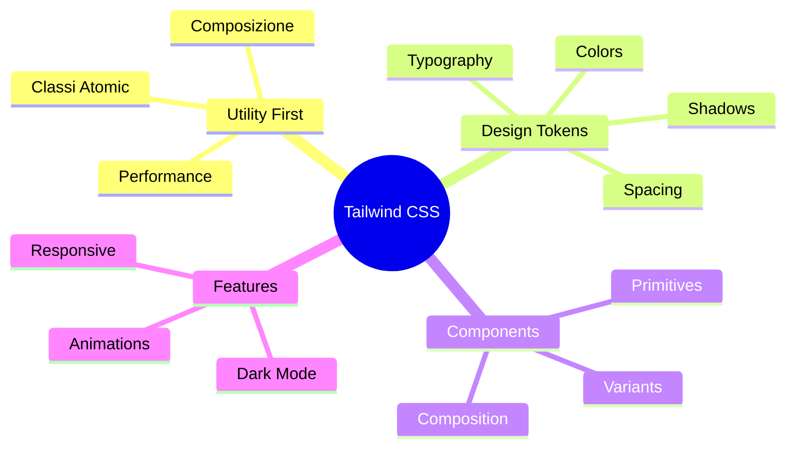
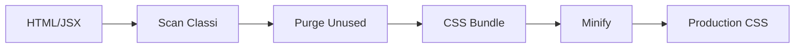

# 04 — Design System e Tailwind — Utility-First CSS Framework

## 🎯 Obiettivi del Modulo

Alla fine di questo modulo, sarai in grado di:
- **Comprendere** filosofia utility-first di Tailwind CSS
- **Usare** design tokens per coerenza visiva
- **Costruire** componenti UI riutilizzabili con varianti
- **Implementare** responsive design e dark mode
- **Ottimizzare** performance con classi Tailwind

**⏱️ Tempo stimato**: 5-6 ore di studio e pratica

**📋 Prerequisiti**: Aver completato i moduli 00, 01, 02, 03

---

## 📚 Struttura del Modulo

Questo modulo è organizzato in sezioni **progressive**:

1. **Filosofia Utility-First** - Approccio Tailwind vs tradizionale
2. **Design Tokens** - Sistema di design con CSS variables
3. **Componenti UI** - Building blocks riutilizzabili
4. **Responsive e Accessibility** - Mobile-first e A11y

### Mappa Concettuale



---

## 1. Filosofia Utility-First

> **🎯 Obiettivo**: Capire perché Tailwind è diverso dal CSS tradizionale

### 1.0 CSS Tradizionale vs Utility-First

#### 💡 Il Paradigma Shift

**CSS Tradizionale** (approccio classico):

```css
/* styles.css */
.movie-card {
    display: flex;
    flex-direction: column;
    padding: 24px;
    background-color: #1a1a1a;
    border-radius: 8px;
    box-shadow: 0 4px 6px rgba(0,0,0,0.1);
}

.movie-card:hover {
    transform: scale(1.05);
    box-shadow: 0 10px 25px rgba(0,0,0,0.3);
}
```

**Problemi**:
- ❌ File separati da logica
- ❌ Classi generiche (`.card` usata ovunque)
- ❌ Difficile riutilizzare stili parziali
- ❌ Bundle CSS cresce con features

**Utility-First** (Tailwind):

```jsx
<div className="flex flex-col p-6 bg-gray-900 rounded-lg shadow-md hover:scale-105 hover:shadow-2xl">
    {/* Content */}
</div>
```

**Vantaggi**:
- ✅ Stili accanto alla logica
- ✅ Componibilità: mix classi
- ✅ Performance: solo classi usate
- ✅ Coerenza: design tokens

---

### 1.1 Classi Atomiche Tailwind

#### 📚 Composizione di Classi

**Esempio**: Button con hover

```typescript
// className="bg-blue-500 hover:bg-blue-600 text-white px-4 py-2 rounded"
```

**Scomposizione**:
- `bg-blue-500` → background color
- `hover:bg-blue-600` → background on hover
- `text-white` → text color
- `px-4` → padding x-axis
- `py-2` → padding y-axis
- `rounded` → border radius

**Pattern**: **Modifiers** (hover:, focus:, sm:, dark:)

```typescript
className="bg-blue-500 hover:bg-blue-600 focus:ring-2 sm:text-lg dark:bg-blue-700"
```

---

### 1.2 Perché Utility-First è Veloce

#### 💡 Performance Tailwind

**Processo di build**:



**Risultato**: Bundle finale contiene **solo classi effettivamente usate**!

**Esempio pratico**:

```typescript
// Il progetto ha 10,000+ classi possibili
// Ma usa solo ~200 classi
// Bundle finale: ~15KB (vs 100KB+ tradizionale)
```

---

## 2. Design Tokens: CSS Variables

> **🎯 Obiettivo**: Implementare design system coerente

### 2.0 CSS Variables per Theming

#### 💡 Design Tokens Pattern

**Problema**: Come cambiare tema senza rebuild?

**Soluzione**: CSS Variables (custom properties)

```28:73:app/globals.css
@layer base {
    :root {
        --background: 0 0% 100%;
        --foreground: 222.2 84% 4.9%;
        --card: 0 0% 100%;
        --card-foreground: 222.2 84% 4.9%;
        --popover: 0 0% 100%;
        --popover-foreground: 222.2 84% 4.9%;
        --primary: 221.2 83.2% 53.3%;
        --primary-foreground: 210 40% 98%;
        --secondary: 210 40% 96%;
        --secondary-foreground: 222.2 84% 4.9%;
        --muted: 210 40% 96%;
        --muted-foreground: 215.4 16.3% 46.9%;
        --accent: 210 40% 96%;
        --accent-foreground: 222.2 84% 4.9%;
        --destructive: 0 84.2% 60.2%;
        --destructive-foreground: 210 40% 98%;
        --border: 214.3 31.8% 91.4%;
        --input: 214.3 31.8% 91.4%;
        --ring: 221.2 83.2% 53.3%;
        --radius: 0.5rem;
    }

    .dark {
        --background: 222.2 84% 4.9%;
        --foreground: 210 40% 98%;
        --card: 222.2 84% 4.9%;
        --card-foreground: 210 40% 98%;
        --popover: 222.2 84% 4.9%;
        --popover-foreground: 210 40% 98%;
        --primary: 217.2 91.2% 59.8%;
        --primary-foreground: 222.2 84% 4.9%;
        --secondary: 217.2 32.6% 17.5%;
        --secondary-foreground: 210 40% 98%;
        --muted: 217.2 32.6% 17.5%;
        --muted-foreground: 215 20.2% 65.1%;
        --accent: 217.2 32.6% 17.5%;
        --accent-foreground: 210 40% 98%;
        --destructive: 0 62.8% 30.6%;
        --destructive-foreground: 210 40% 98%;
        --border: 217.2 32.6% 17.5%;
        --input: 217.2 32.6% 17.5%;
        --ring: 224.3 76.3% 94.1%;
    }
}
```

**🔍 Analisi:**

**Linee 29-50:** Theme light (`:root`)
- Valori HSL: `hue saturation lightness`
- Esempio: `--primary: 221.2 83.2% 53.3%` → Blue vivido

**Linee 52-72:** Theme dark (`.dark`)
- Stesse variabili, valori diversi
- Switch tema = aggiungi classe `.dark` a `<html>`

---

### 2.1 Configurazione Tailwind

#### 📚 tailwind.config.js

```1:87:tailwind.config.js
/** @type {import('tailwindcss').Config} */
module.exports = {
  darkMode: ["class"],
  content: [
    './pages/**/*.{ts,tsx}',
    './components/**/*.{ts,tsx}',
    './app/**/*.{ts,tsx}',
    './src/**/*.{ts,tsx}',
  ],
  theme: {
    container: {
      center: true,
      padding: "2rem",
      screens: {
        "2xl": "1400px",
      },
    },
    extend: {
      colors: {
        border: "hsl(var(--border))",
        input: "hsl(var(--input))",
        ring: "hsl(var(--ring))",
        background: "hsl(var(--background))",
        foreground: "hsl(var(--foreground))",
        primary: {
          DEFAULT: "hsl(var(--primary))",
          foreground: "hsl(var(--primary-foreground))",
        },
        secondary: {
          DEFAULT: "hsl(var(--secondary))",
          foreground: "hsl(var(--secondary-foreground))",
        },
        destructive: {
          DEFAULT: "hsl(var(--destructive))",
          foreground: "hsl(var(--destructive-foreground))",
        },
        muted: {
          DEFAULT: "hsl(var(--muted))",
          foreground: "hsl(var(--muted-foreground))",
        },
        accent: {
          DEFAULT: "hsl(var(--accent))",
          foreground: "hsl(var(--accent-foreground))",
        },
        popover: {
          DEFAULT: "hsl(var(--popover))",
          foreground: "hsl(var(--popover-foreground))",
        },
        card: {
          DEFAULT: "hsl(var(--card))",
          foreground: "hsl(var(--card-foreground))",
        },
      },
      borderRadius: {
        lg: "var(--radius)",
        md: "calc(var(--radius) - 2px)",
        sm: "calc(var(--radius) - 4px)",
      },
      keyframes: {
        "accordion-down": {
          from: { height: 0 },
          to: { height: "var(--radix-accordion-content-height)" },
        },
        "accordion-up": {
          from: { height: "var(--radix-accordion-content-height)" },
          to: { height: 0 },
        },
        "fade-in": {
          "0%": { opacity: 0, transform: "translateY(20px)" },
          "100%": { opacity: 1, transform: "translateY(0)" },
        },
        "slide-in": {
          "0%": { transform: "translateX(-100%)" },
          "100%": { transform: "translateX(0)" },
        },
      },
      animation: {
        "accordion-down": "accordion-down 0.2s ease-out",
        "accordion-up": "accordion-up 0.2s ease-out",
        "fade-in": "fade-in 0.5s ease-out",
        "slide-in": "slide-in 0.3s ease-out",
      },
    },
  },
  plugins: [require("tailwindcss-animate")],
}
```

**🔍 Analisi:**

**Linea 3:** `darkMode: ["class"]`
- Toggle dark mode con classe `.dark`
- Alternativa: `"media"` usa `prefers-color-scheme`

**Linee 4-9:** `content`
- Percorsi da scansionare per classi usate
- Tailwind purga classi non trovate

**Linee 19-53:** `colors` extend
- Mappa a CSS variables
- Esempio: `bg-primary` → `hsl(var(--primary))`

**Linee 59-60:** `keyframes` custom
- Animazioni personalizzate
- Usate con `animate-*`

---

## 3. Componenti UI: Primitives

> **🎯 Obiettivo**: Costruire building blocks riutilizzabili

### 3.0 Button Component

#### 💡 Variants con class-variance-authority

**Pattern**: CVA (Class Variance Authority) per varianti type-safe

```1:56:components/ui/button.tsx
import * as React from "react"
import { Slot } from "@radix-ui/react-slot"
import { cva, type VariantProps } from "class-variance-authority"

import { cn } from "@/lib/utils"

const buttonVariants = cva(
    "inline-flex items-center justify-center whitespace-nowrap rounded-md text-sm font-medium ring-offset-background transition-colors focus-visible:outline-none focus-visible:ring-2 focus-visible:ring-ring focus-visible:ring-offset-2 disabled:pointer-events-none disabled:opacity-50",
    {
        variants: {
            variant: {
                default: "bg-primary text-primary-foreground hover:bg-primary/90",
                destructive:
                    "bg-destructive text-destructive-foreground hover:bg-destructive/90",
                outline:
                    "border border-input bg-background hover:bg-accent hover:text-accent-foreground",
                secondary:
                    "bg-secondary text-secondary-foreground hover:bg-secondary/80",
                ghost: "hover:bg-accent hover:text-accent-foreground",
                link: "text-primary underline-offset-4 hover:underline",
            },
            size: {
                default: "h-10 px-4 py-2",
                sm: "h-9 rounded-md px-3",
                lg: "h-11 rounded-md px-8",
                icon: "h-10 w-10",
            },
        },
        defaultVariants: {
            variant: "default",
            size: "default",
        },
    }
)

export interface ButtonProps
    extends React.ButtonHTMLAttributes<HTMLButtonElement>,
    VariantProps<typeof buttonVariants> {
    asChild?: boolean
}

const Button = React.forwardRef<HTMLButtonElement, ButtonProps>
    ({ className, variant, size, asChild = false, ...props }, ref) => {
        const Comp = asChild ? Slot : "button"
        return (
            <Comp
                className={cn(buttonVariants({ variant, size, className }))}
                ref={ref}
                {...props}
            />
        )
    }
)
Button.displayName = "Button"

export { Button, buttonVariants }
```

**🔍 Analisi guidata:**

**Linee 7-9:** CVA base classes
- Classe sempre applicate
- Focus states, transitions, disabled states

**Linee 10-21:** Varianti `variant`
- 6 varianti: default, destructive, outline, secondary, ghost, link
- **Combinazioni**: 6 variants × 4 sizes = 24 stili, ma 0 duplicazione!

**Linee 22-27:** Varianti `size`
- 4 dimensioni: default, sm, lg, icon
- Type-safe con TypeScript

**Linee 43-52:** Component implementation
- `forwardRef` per passare ref
- `cn()` utility merge classi
- `asChild` pattern (Radix UI)

---

#### 🧠 Esercizio di Ragionamento 3.0

**Domanda**: Perché `cn()` utility invece di template string?

<details>
<summary>💭 Pensa...</summary>

**`cn()`** fa merge intelligente:

```typescript
cn("px-4", className="px-2")
// Result: "px-2" (override, non duplicate)
```

**Template string** crea conflitti:

```typescript
`px-4 ${className}` // "px-4 px-2" ❌ Both applied!
```

**`cn()`** usa `twMerge` + `clsx` per:
- Deduplicazione
- Merge intelligente
- Type-safe combinazioni
</details>

---

### 3.1 Card Component

#### 📚 Composite Component Pattern

**Pattern**: Card = Container + Header + Content + Footer

```1:80:components/ui/card.tsx
import * as React from "react"

import { cn } from "@/lib/utils"

const Card = React.forwardRef<
    HTMLDivElement,
    React.HTMLAttributes<HTMLDivElement>
>(({ className, ...props }, ref) => (
    <div
        ref={ref}
        className={cn(
            "rounded-lg border bg-card text-card-foreground shadow-sm",
            className
        )}
        {...props}
    />
))
Card.displayName = "Card"

const CardHeader = React.forwardRef<
    HTMLDivElement,
    React.HTMLAttributes<HTMLDivElement>
>(({ className, ...props }, ref) => (
    <div
        ref={ref}
        className={cn("flex flex-col space-y-1.5 p-6", className)}
        {...props}
    />
))
CardHeader.displayName = "CardHeader"

const CardTitle = React.forwardRef<
    HTMLParagraphElement,
    React.HTMLAttributes<HTMLHeadingElement>
>(({ className, ...props }, ref) => (
    <h3
        ref={ref}
        className={cn(
            "text-2xl font-semibold leading-none tracking-tight",
            className
        )}
        {...props}
    />
))
CardTitle.displayName = "CardTitle"

const CardDescription = React.forwardRef<
    HTMLParagraphElement,
    React.HTMLAttributes<HTMLParagraphElement>
>(({ className, ...props }, ref) => (
    <p
        ref={ref}
        className={cn("text-sm text-muted-foreground", className)}
        {...props}
    />
))
CardDescription.displayName = "CardDescription"

const CardContent = React.forwardRef<
    HTMLDivElement,
    React.HTMLAttributes<HTMLDivElement>
>(({ className, ...props }, ref) => (
    <div ref={ref} className={cn("p-6 pt-0", className)} {...props} />
))
CardContent.displayName = "CardContent"

const CardFooter = React.forwardRef<
    HTMLDivElement,
    React.HTMLAttributes<HTMLDivElement>
>(({ className, ...props }, ref) => (
    <div
        ref={ref}
        className={cn("flex items-center p-6 pt-0", className)}
        {...props}
    />
))
CardFooter.displayName = "CardFooter"

export { Card, CardHeader, CardFooter, CardTitle, CardDescription, CardContent }
```

**Pattern**:
- ✅ Sub-componenti esportati insieme
- ✅ Ognuno configurabile con `className`
- ✅ Default styling coerente
- ✅ Override locali possibili

**Utilizzo**:

```typescript
<Card>
    <CardHeader>
        <CardTitle>Movie Title</CardTitle>
        <CardDescription>Rating: 8.5/10</CardDescription>
    </CardHeader>
    <CardContent>
        {/* Movie details */}
    </CardContent>
    <CardFooter>
        <Button>Play</Button>
    </CardFooter>
</Card>
```

---

### 3.2 Custom Classes: @layer

#### 📚 Tailwind Layers

**3 layers Tailwind**: `base`, `components`, `utilities`

```22:26:app/globals.css
@layer components {
    .card-hover {
        @apply transition-all duration-500 ease-out hover:scale-110 hover:z-10;
    }
}
```

**Pattern**: Custom utilities riutilizzabili

```86:117:app/globals.css
/* Custom styles for streaming platform */
@layer components {
    .hero-gradient {
        background: linear-gradient(135deg,
                rgba(0, 0, 0, 0.8) 0%,
                rgba(0, 0, 0, 0.4) 50%,
                rgba(0, 0, 0, 0.8) 100%);
    }

    .card-hover {
        @apply transition-all duration-300 ease-in-out;
    }

    .card-hover:hover {
        @apply transform scale-105 shadow-2xl;
    }

    .premium-button {
        @apply bg-gradient-to-r from-blue-500 to-purple-600 hover:from-blue-600 hover:to-purple-700 text-white font-semibold py-3 px-6 rounded-lg transition-all duration-300 transform hover:scale-105 shadow-lg hover:shadow-xl;
    }

    .glass-effect {
        @apply bg-white/10 backdrop-blur-md border border-white/20;
    }

    .text-gradient {
        @apply bg-gradient-to-r from-blue-400 to-purple-600 bg-clip-text text-transparent;
    }
```

**🔍 Analisi:**

**Linee 88-92:** `.hero-gradient`
- Custom gradient (non Tailwind standard)
- Layer `components` per riutilizzo

**Linee 103-104:** `.premium-button`
- Mix Tailwind utilities
- Composable e riutilizzabile

**Linee 107-108:** `.glass-effect`
- Modern glass morphism
- Backdrop blur + transparency

---

## 4. Responsive Design e Accessibility

> **🎯 Obiettivo**: Mobile-first e A11y best practices

### 4.0 Mobile-First Approach

#### 💡 Breakpoints Tailwind

**Default breakpoints**:

```typescript
sm: '640px'   // Mobile
md: '768px'   // Tablet
lg: '1024px'  // Desktop
xl: '1280px'  // Large
2xl: '1536px' // XLarge
```

**Pattern**: Mobile-first (default = mobile, bigger screens override)

```typescript
className="text-sm sm:text-base md:text-lg lg:text-xl"
// Mobile: text-sm
// >= 640px: text-base
// >= 768px: text-lg
// >= 1024px: text-xl
```

**🔬 Esempio dal Progetto:**

```18:28:components/ui/toast.tsx
const ToastViewport = React.forwardRef<
    React.ElementRef<typeof ToastPrimitives.Viewport>,
    React.ComponentPropsWithoutRef<typeof ToastPrimitives.Viewport>
>(({ className, ...props }, ref) => (
    <ToastPrimitives.Viewport
        ref={ref}
        className={cn(
            'fixed top-0 z-[100] flex max-h-screen w-full flex-col-reverse p-4 sm:bottom-0 sm:right-0 sm:top-auto sm:flex-col md:max-w-[420px]',
            className
        )}
        {...props}
    />
))
```

**Analisi**:
- Mobile: top-0, full-width, reverse column
- Desktop: bottom-right, max-width, column
- Senza media queries esplicite

---

### 4.1 Accessibility (A11y)

#### 💡 Focus e Keyboard Navigation

**Tailwind** integra A11y:

```typescript
// Focus visible (keyboard, non mouse)
focus-visible:outline-none
focus-visible:ring-2
focus-visible:ring-ring

// Disabled state
disabled:pointer-events-none
disabled:opacity-50
```

**🔬 Esempio Button**:

```7:9:components/ui/button.tsx
const buttonVariants = cva(
    "inline-flex items-center justify-center whitespace-nowrap rounded-md text-sm font-medium ring-offset-background transition-colors focus-visible:outline-none focus-visible:ring-2 focus-visible:ring-ring focus-visible:ring-offset-2 disabled:pointer-events-none disabled:opacity-50",
```

**Best Practices**:
- ✅ Focus ring per navigazione keyboard
- ✅ Contrasto sufficiente (WCAG)
- ✅ Disabled state chiaro

---

### 4.2 Dark Mode

#### 💡 Switching Temi

**Next.js 14** + Tailwind dark mode:

```35:35:app/layout.tsx
<html lang="it" className="dark">
```

**Toggle dinamicamente**:

```typescript
const toggleTheme = () => {
    document.documentElement.classList.toggle('dark')
}
```

**Tailwind** applica classi dark:

```typescript
className="bg-white dark:bg-gray-900 text-black dark:text-white"
```

---

## 📝 Esercizi Finali del Modulo

### Esercizio 1: Nuova Variante Button

**Obiettivo:** Aggiungi variante `premium` al Button

**Requisiti**:
- [ ] Aggiungi `premium` variant a `buttonVariants`
- [ ] Usa gradient: `from-blue-500 to-purple-600`
- [ ] Hover: scale + glow
- [ ] Verifica contrasto WCAG

**Rubrica**:
- ✅ Variante type-safe
- ✅ Gradients applicati
- ✅ Hover effects
- ✅ Accessibility OK

---

### Esercizio 2: Custom Component Utility

**Obiettivo:** Crea utility class `.movie-poster`

**Requisiti**:
- [ ] Aggiungi in `@layer components`
- [ ] Aspect ratio 2:3
- [ ] Hover scale + shadow
- [ ] Integra in existing cards

---

### Esercizio 3: Responsive Navigation

**Obiettivo:** Crea navbar responsive

**Requisiti**:
- [ ] Mobile: hamburger menu
- [ ] Desktop: horizontal nav
- [ ] Tablet: layout ibrido
- [ ] Touch-friendly (min 44px)

---

## ✅ Checklist Finale

Verifica di aver compreso:

- [ ] Filosofia utility-first vs CSS tradizionale
- [ ] Come funzionano design tokens con CSS variables
- [ ] CVA per varianti type-safe
- [ ] Pattern composite components
- [ ] @layer per custom utilities
- [ ] Mobile-first responsive
- [ ] Accessibility best practices
- [ ] Dark mode implementation

---

## 📚 Risorse Aggiuntive

- **Tailwind Docs**: https://tailwindcss.com/docs
- **shadcn/ui**: https://ui.shadcn.com/
- **CSS Variables**: https://developer.mozilla.org/en-US/docs/Web/CSS/Using_CSS_custom_properties
- **WCAG Guidelines**: https://www.w3.org/WAI/WCAG21/quickref/

---

## 🔍 Domande Guida per l'Apprendimento

1. **Performance**: Quali vantaggi ha Tailwind vs CSS-in-JS per bundle size?
2. **Variants**: Come centralizzavi regole focus/hover prima di CVA?
3. **Responsive**: Perché mobile-first è meglio di desktop-first?

---

## 🔗 Collegamenti

- **Reference**: `components/ui/`, `tailwind.config.js`, `app/globals.css`
- **Modulo precedente**: 03 - Routing e Layouts
- **Modulo successivo**: 05 - Componenti UI di Base

---

**Congratulazioni!** 🎉

Hai compreso Tailwind e Design System. Prossimo modulo: Componenti UI Base!
