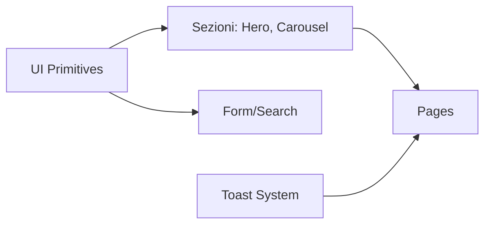

# 04 — Design System e Tailwind

## Obiettivi
- Comprendere tokens di stile e utilità Tailwind
- Usare componenti UI riutilizzabili (Button, Card, Input, ecc.)
- Garantire coerenza visiva e accessibilità

## Design tokens
- Colori, spaziature, tipografia, radius, ombre definiti in `tailwind.config.js`.
- Pattern: utility-first con classi composte tramite varianti.

## Componenti UI
- `components/ui/` contiene primitive (Button, Card, Input, Label, Toast/Toaster, useToast).
- Approccio: props minimaliste, varianti, forwarding di ref quando necessario.

## Diagramma uso UI (Mermaid)

## Domande guida
- Come bilanciare composizione e prop-variants per evitare duplicazioni?
- Dove centralizzare regole di focus/hover per A11y?

## Esercizio
- Introduci una nuova variante di `Button` con vincoli di contrasto e verifica coerenza.
