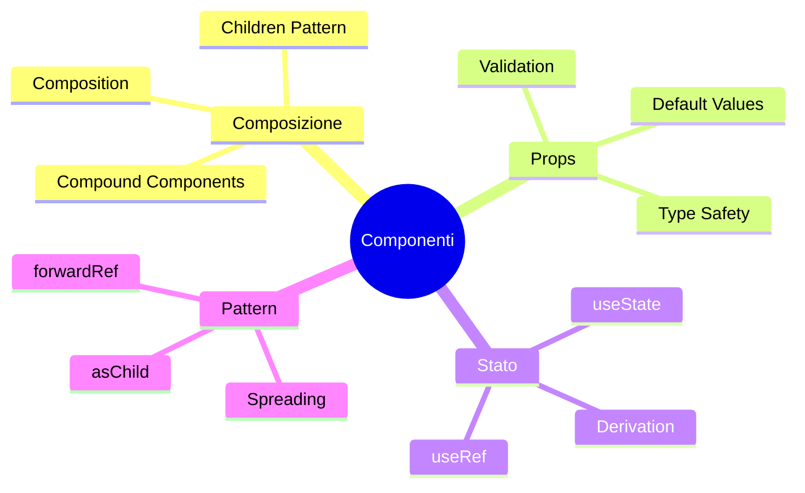

# 05 — Componenti UI di Base — Composizione e Props

## 🎯 Obiettivi del Modulo

Alla fine di questo modulo, sarai in grado di:
- **Comprendere** composizione vs ereditarietà in React
- **Progettare** componenti con props ben definite
- **Usare** pattern avanzati (forwardRef, asChild, spreading)
- **Gestire** stato locale e derivato
- **Costruire** componenti riutilizzabili e testabili

**⏱️ Tempo stimato**: 6-8 ore di studio e pratica

**📋 Prerequisiti**: Aver completato i moduli 00, 01, 02, 03, 04

---

## 📚 Struttura del Modulo

Questo modulo è organizzato in sezioni **progressive**:

1. **Composizione > Ereditarietà** - Pattern React fundamentali
2. **Props come Contratto** - Design API type-safe
3. **Stato Locale e Derivato** - State management in componenti
4. **Pattern Avanzati** - Ref forwarding, spreading, children

### Mappa Concettuale



---

## 1. Composizione > Ereditarietà

> **🎯 Obiettivo**: Capire perché React preferisce composizione

### 1.0 Il Principio Fondamentale

#### 💡 "Favor Composition Over Inheritance"

**Ereditarietà** (approccio classico, NON usato in React):

```typescript
// ❌ NO: React ha componenti funzionali, non classi
class BaseCard extends React.Component {
    render() {
        return <div className="card">{this.props.children}</div>
    }
}

class MovieCard extends BaseCard {
    render() {
        return <div className="movie-card">{this.props.movie}</div>
    }
}
```

**Problemi**:
- ❌ Rigida gerarchia
- ❌ Limitata flessibilità
- ❌ Overhead di classi

**Composizione** (approccio React):

```typescript
// ✅ SÌ: Componi componenti più piccoli
const MovieCard = ({ movie }) => (
    <Card className="movie-card">
        <CardHeader>
            <CardTitle>{movie.title}</CardTitle>
        </CardHeader>
        <CardContent>
            
        </CardContent>
    </Card>
)
```

**Vantaggi**:
- ✅ Flessibile: mix componenti
- ✅ Riusabile: Card in molti context
- ✅ Chiaro: struttura esplicita

---

### 1.1 Children Pattern

#### 📚 Composizione tramite Children

**Pattern**: Component parent wrappa children

```typescript
interface WrapperProps {
    children: React.ReactNode
    className?: string
}

function Wrapper({ children, className }: WrapperProps) {
    return (
        <div className={`wrapper ${className}`}>
            {children}
        </div>
    )
}

// Utilizzo
<Wrapper>
    <h1>Title</h1>
    <p>Content</p>
</Wrapper>
```

**🔬 Esempio dal Progetto:**

```5:17:components/ui/card.tsx
const Card = React.forwardRef<
    HTMLDivElement,
    React.HTMLAttributes<HTMLDivElement>
>(({ className, ...props }, ref) => (
    <div
        ref={ref}
        className={cn(
            "rounded-lg border bg-card text-card-foreground shadow-sm",
            className
        )}
        {...props}
    />
))
```

**🔍 Analisi:**

**Linea 5:** `React.HTMLAttributes<HTMLDivElement>`
- Estende HTML attrs standard
- Children incluso in props

**Linee 9-16:** Spreading `{...props}`
- Pass-through attrs HTML
- Flexibilità: onClick, onMouseEnter, etc.

---

### 1.2 Compound Components

#### 📚 Sub-componenti Esportati

**Pattern**: Group multi componenti insieme

```79:80:components/ui/card.tsx
export { Card, CardHeader, CardFooter, CardTitle, CardDescription, CardContent }
```

**Utilizzo**:

```typescript
<Card>
    <CardHeader> {/* Sub-component */}
        <CardTitle>Title</CardTitle>
        <CardDescription>Desc</CardDescription>
    </CardHeader>
    <CardContent>
        {/* Content */}
    </CardContent>
    <CardFooter>
        <Button>Action</Button>
    </CardFooter>
</Card>
```

**Vantaggi**:
- ✅ API chiara e semantica
- ✅ Layout coerente (spacing, typography)
- ✅ Override possibili con className

---

## 2. Props come Contratto

> **🎯 Obiettivo**: Design API type-safe e intuitive

### 2.0 Definicione Props

#### 💡 Type-Safe Interface

**Pattern**: Props come contratto formale

```9:16:components/movie-card.tsx
interface MovieCardProps {
    movie: TMDBMovie | Movie
    rank?: number
    showRank?: boolean
    showReleaseDate?: boolean
    className?: string
    type?: 'movie' | 'tv'
}
```

**🔍 Analisi:**

**Linea 10:** `movie: TMDBMovie | Movie`
- Union type per flessibilità
- Type-safe: due shape accettate

**Linee 12-16:** Optional props (`?`)
- Default values nel component
- API non bloccante

---

### 2.1 Default Values

#### 📚 Pattern: Destructuring con Defaults

**Approccio React standard**:

```18:25:components/movie-card.tsx
export function MovieCard({
    movie,
    rank,
    showRank = false,
    showReleaseDate = false,
    className = '',
    type = 'movie'
}: MovieCardProps) {
```

**Pattern**:
- ✅ `showRank = false` → default per boolean
- ✅ `className = ''` → default per string
- ✅ `type = 'movie'` → default per union

**Alternativa** (non usata qui):

```typescript
// Alternative con useMemo (perf optimization)
const showRank = props.showRank ?? false
```

---

### 2.2 Controlled vs Uncontrolled

#### 🎓 Pattern di Input

**Uncontrolled** (es: SearchBar):

```22:34:components/search-bar.tsx
export function SearchBar({ onFocusChange }: SearchBarProps) {
    const [query, setQuery] = useState('')
    const [results, setResults] = useState<SearchResult[]>([])
    const [isOpen, setIsOpen] = useState(false)
    const [isLoading, setIsLoading] = useState(false)
    const [isFocused, setIsFocused] = useState(false)
    const searchRef = useRef<HTMLDivElement>(null)
    const inputRef = useRef<HTMLInputElement>(null)

    // Gestisce il focus e comunica alla navbar
    useEffect(() => {
        onFocusChange?.(isFocused)
    }, [isFocused, onFocusChange])
```

**Pattern**:
- ✅ Component gestisce il suo stato
- ✅ Parent può dare callbacks (`onFocusChange`)
- ✅ State locale isolato

**Controlled** (es: Input form):

```typescript
interface ControlledInputProps {
    value: string
    onChange: (value: string) => void
}

function ControlledInput({ value, onChange }) {
    return <input value={value} onChange={(e) => onChange(e.target.value)} />
}
```

**Pattern**:
- ✅ Parent controlla valore
- ✅ Single source of truth
- ✅ Più prevedibile

---

#### 🧠 Esercizio di Ragionamento 2.2

**Domanda**: Perché SearchBar usa state locale invece di controlled?

<details>
<summary>💭 Pensa...</summary>

**SearchBar** è **uncontrolled** perché:
- ✅ Gestisce UI state internamente (isOpen, isLoading)
- ✅ Solo callback al parent (onFocusChange)
- ✅ Reduce prop drilling
- ✅ Encapsulation migliore

**Controlled** sarebbe se la SearchBar avesse `value` e `onValueChange` props (rare in questo caso).
</details>

---

## 3. Stato Locale e Derivato

> **🎯 Obiettivo**: Gestire state minimo necessario

### 3.0 Stato Locale Minimale

#### 💡 Principio: Keep State Local

**Pattern**: Stato solo se necessario

```26:31:components/movie-card.tsx
const [isHovered, setIsHovered] = useState(false)
const [isMounted, setIsMounted] = useState(false)

useEffect(() => {
    setIsMounted(true)
}, [])
```

**Linea 26:** `isHovered` → UI interaction local
**Linea 27:** `isMounted` → hydration check

**Quando salire?**
- ❌ Locale: UI state (hover, focus)
- ✅ Globale: Business state (user, movies)

---

### 3.1 Stato Derivato

#### 📚 Calcola Stato da Props

**Pattern**: Non memorizzare ciò che puoi calcolare

```typescript
// ❌ SBAGLIATO: stato duplicato
const [title, setTitle] = useState('')
useEffect(() => {
    setTitle(movie.title.toUpperCase())
}, [movie.title])

// ✅ CORRETTO: derivato
const displayTitle = movie.title.toUpperCase()
```

**🔬 Esempio dal Progetto:**

```56:64:components/movie-card.tsx
const formatReleaseDate = (dateString: string) => {
    if (!dateString) return ''
    const date = new Date(dateString)
    return date.toLocaleDateString('it-IT', {
        day: 'numeric',
        month: 'short',
        year: 'numeric'
    })
}
```

**Pattern**: Funzione pura invece di stato
- ✅ No re-render
- ✅ Recomputazione automatica
- ✅ Easier testing

---

### 3.2 useRef per Mutable State

#### 📚 Refs vs State

**Quando usare `useRef`?**

```1:49:components/search-bar.tsx
'use client'

import { useState, useEffect, useRef } from 'react'
import { Search, X } from 'lucide-react'
import { Movie, TVShow } from '@/types'
import { getTMDBImageUrl } from '@/lib/tmdb'

interface SearchResult {
    id: number
    tmdb_id?: number
    title: string
    type: 'movie' | 'tv'
    poster_path: string
    release_date?: string
    first_air_date?: string
}

interface SearchBarProps {
    onFocusChange?: (focused: boolean) => void
}

export function SearchBar({ onFocusChange }: SearchBarProps) {
    const [query, setQuery] = useState('')
    const [results, setResults] = useState<SearchResult[]>([])
    const [isOpen, setIsOpen] = useState(false)
    const [isLoading, setIsLoading] = useState(false)
    const [isFocused, setIsFocused] = useState(false)
    const searchRef = useRef<HTMLDivElement>(null)
    const inputRef = useRef<HTMLInputElement>(null)

    // Gestisce il focus e comunica alla navbar
    useEffect(() => {
        onFocusChange?.(isFocused)
    }, [isFocused, onFocusChange])

    // Chiudi dropdown quando clicchi fuori
    useEffect(() => {
        function handleClickOutside(event: MouseEvent) {
            if (searchRef.current && !searchRef.current.contains(event.target as Node)) {
                setIsOpen(false)
                setIsFocused(false)
            }
        }

        document.addEventListener('mousedown', handleClickOutside)
        return () => document.removeEventListener('mousedown', handleClickOutside)
    }, [])
```

**🔍 Analisi:**

**Linee 28-29:** `searchRef`, `inputRef`
- DOM references
- Non trigger re-render

**Linea 37:** Click outside detection
- Accede a DOM senza re-render
- Pattern comune per dropdowns

**Differenza**:

| useState | useRef |
|----------|--------|
| Trigger re-render | No re-render |
| Immutable | Mutable |
| UI updates | DOM access, values |
| Prev value | `.current` |

---

## 4. Pattern Avanzati

> **🎯 Obiettivo**: Tecniche avanzate per componenti robusti

### 4.0 forwardRef

#### 💡 Passare Ref a DOM

**Problema**: Come passare `ref` a component custom?

**Soluzione**: `forwardRef`

```42:53:components/ui/button.tsx
const Button = React.forwardRef<HTMLButtonElement, ButtonProps>
    ({ className, variant, size, asChild = false, ...props }, ref) => {
        const Comp = asChild ? Slot : "button"
        return (
            <Comp
                className={cn(buttonVariants({ variant, size, className }))}
                ref={ref}
                {...props}
            />
        )
    }
)
Button.displayName = "Button"
```

**Utilizzo**:

```typescript
const buttonRef = useRef<HTMLButtonElement>(null)

<Button ref={buttonRef}>Click</Button>
// ✅ Ref passa correttamente al DOM button
```

**🔍 Perché serve?**
- Accesso imperativo al DOM (focus, scrollIntoView)
- Libraries necessitano ref (form, animations)

---

### 4.1 asChild Pattern

#### 📚 Polimorfismo Composto

**Pattern Radix UI**: Trasforma Button in altro elemento

```typescript
import { Slot } from "@radix-ui/react-slot"

const Button = ({ asChild, ...props }) => {
    const Comp = asChild ? Slot : "button"
    return <Comp {...props} />
}

// Utilizzo
<Button asChild>
    <Link href="/home">Go Home</Link>
</Button>
// Result: Link ottiene styling Button
```

**Vantaggi**:
- ✅ Styling riutilizzabile
- ✅ Comportamento semantico corretto (`<a>` per navigation)
- ✅ Type-safe

---

### 4.2 Spreading Props

#### 📚 Pass-Through Attrs

**Pattern**: Forwarding HTML attributes

```36:56:components/ui/button.tsx
export interface ButtonProps
    extends React.ButtonHTMLAttributes<HTMLButtonElement>,
    VariantProps<typeof buttonVariants> {
    asChild?: boolean
}

const Button = React.forwardRef<HTMLButtonElement, ButtonProps>
    ({ className, variant, size, asChild = false, ...props }, ref) => {
        const Comp = asChild ? Slot : "button"
        return (
            <Comp
                className={cn(buttonVariants({ variant, size, className }))}
                ref={ref}
                {...props}
            />
        )
    }
)
```

**Linea 37-38:** `extends React.ButtonHTMLAttributes`
- Tutti standard HTML attrs disponibili
- TypeScript autocomplete funziona

**Linea 49:** `{...props}` spreading
- onClick, onMouseEnter, data-*, aria-*, etc.
- Flessibilità senza definire tutto

---

### 4.3 Composition Example: HeroSection

#### 🔬 Esempio Completo

**Component composition complesso**:

```16:49:components/hero-section.tsx
interface HeroSectionProps {
    onTrailerEnded?: () => void
    onMovieChange?: (index: number) => void
    showUpcomingTrailers?: boolean
    onLoaded?: () => void
    currentHeroMovieIndex?: number
    onUpcomingMovieSelect?: (index: number) => void
    // Rimuoviamo la dipendenza da popularMovies esterni
}

export function HeroSection({ onTrailerEnded, onMovieChange, showUpcomingTrailers = false, onLoaded, currentHeroMovieIndex = 0, onUpcomingMovieSelect }: HeroSectionProps) {
    // Usa il context per stato globale
    const { movies, currentIndex, featuredMovie, loading, error, changeToNextMovie, changeToMovie } = useMovieContext()

    // Hook personalizzati
    const { parallaxRef, scrollY } = useParallax()
    const { showControls, setShowControls, isHovered, setIsHovered, isScrolled, initialLoad, shouldShowControls } = useHeroControls()

    const { isHovered: smartHovered, hoverRef, handleMouseEnter, handleMouseLeave } = useSmartHover({
        delay: 1000, // Aumento il delay per dare più tempo
        onEnter: () => {
            setShowControls(true)
            setIsHovered(true)
        },
        onLeave: () => {
            setIsHovered(false)
            // La logica di nascondimento è gestita da useHeroControls
        }
    })

    // Stati locali semplificati
    const [trailer, setTrailer] = useState<string | null>(null)
    const [isMuted, setIsMuted] = useState(true)
    const iframeRef = useRef<HTMLIFrameElement>(null)
```

**🔍 Analisi Architetturale:**

**Linee 16-23:** Props interface
- 6 props, tutte optional
- Callbacks per comunication up

**Linea 26:** Destructuring con defaults
- `showUpcomingTrailers = false`
- `currentHeroMovieIndex = 0`

**Linee 28-32:** Multiple custom hooks
- Compositions of behavior
- Separazione concerns

**Linee 34-43:** Callback hooks
- `useSmartHover` con configurazione
- Inline handlers per callbacks

---

## 📝 Esercizi Finali del Modulo

### Esercizio 1: Compose Card Component

**Obiettivo:** Crea `ProductCard` usando Card primitive

**Requisiti**:
- [ ] Usa Card, CardHeader, CardContent, CardFooter
- [ ] Props: product, onAddToCart, variant
- [ ] Variant: 'compact' | 'full'
- [ ] Type-safe

**Rubrica**:
- ✅ Composizione corretta
- ✅ Props ben definite
- ✅ Variants funzionano
- ✅ Override className OK

---

### Esercizio 2: Ref Forwarding

**Obiettivo:** Crea `CustomInput` con ref forwarding

**Requisiti**:
- [ ] Forward ref a input nativo
- [ ] Props: label, error, helperText
- [ ] Focus programmaticamente
- [ ] Test con form validation

---

### Esercizio 3: Controlled vs Uncontrolled

**Obiettivo:** Implementa Toggle button ambedue patterns

**Requisiti**:
- [ ] Controlled: value + onChange
- [ ] Uncontrolled: defaultChecked
- [ ] Supporta ambedue
- [ ] Type guard automatico

**💡 Suggerimenti:**

<details>
<summary>Hint</summary>

Usa type narrowing:
```typescript
if ('value' in props) {
    // Controlled
} else {
    // Uncontrolled
}
```
</details>

---

## ✅ Checklist Finale

Verifica di aver compreso:

- [ ] Perché composizione > ereditarietà
- [ ] Come definire props type-safe
- [ ] Quando stato locale vs globle
- [ ] Come usare forwardRef
- [ ] asChild pattern e quando usare
- [ ] Controlled vs Uncontrolled
- [ ] Stato derivato vs memorizzato
- [ ] Spreading props pattern

---

## 📚 Risorse Aggiuntive

- **React Composition**: https://react.dev/learn/writing-markup-with-jsx
- **Component Design**: https://kentcdodds.com/blog/compound-components-with-react-hooks
- **TypeScript Props**: https://www.typescriptlang.org/docs/handbook/react.html

---

## 🔍 Domande Guida per l'Apprendimento

1. **Pattern**: Quando useresti asChild vs creare component separato?
2. **Props**: Come eviteresti boolean bloat in props?
3. **Refs**: Quando forwardRef è necessario vs nice-to-have?

---

## 🔗 Collegamenti

- **Reference**: `components/ui/`, `components/movie-card.tsx`, `components/hero-section.tsx`
- **Modulo precedente**: 04 - Design System e Tailwind
- **Modulo successivo**: 06 - Componenti Avanzati

---

**Congratulazioni!** 🎉

Hai compreso composizione React. Prossimo modulo: Componenti Avanzati!
