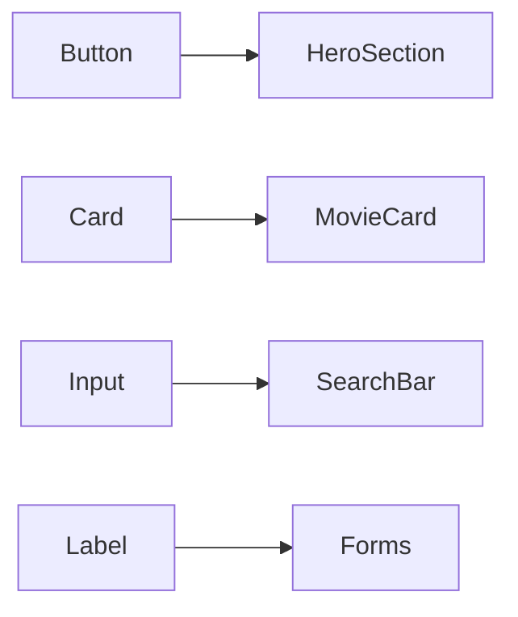

# 05 — Componenti UI di Base

## Obiettivi
- Comprendere la composizione di componenti e props
- Progettare primitive riutilizzabili coerenti col design system
- Gestire stato locale e derivato in componenti client

## Teoria
- Composizione > ereditarietà. Preferire composizione e children.
- Props come contratto. Nominare chiaramente, evitare boolean bloat.
- Stato locale: minimo necessario; derivare quando possibile.

## Esempi dal progetto
- `components/ui/button.tsx`, `components/ui/card.tsx`, `components/ui/input.tsx`, `components/ui/label.tsx` come primitive.
- Uso in `components/hero-section.tsx` e `components/content-carousel.tsx`.

## Diagramma d'uso (Mermaid)

## Domande guida
- Come esporre varianti senza esplodere combinazioni? (ad es. `variant`, `size`)
- Dove fermare la logica UI: quanto mettere nella primitiva vs nel composito?

## Esercizio
- Estendi `Button` con una variante "ghost-danger" con focus state accessibile e verifica che non rompa i call-site esistenti.
