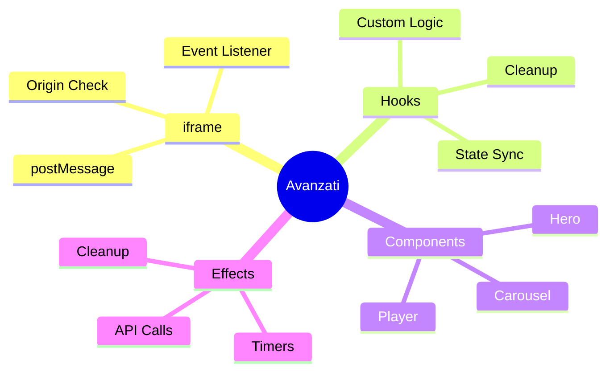
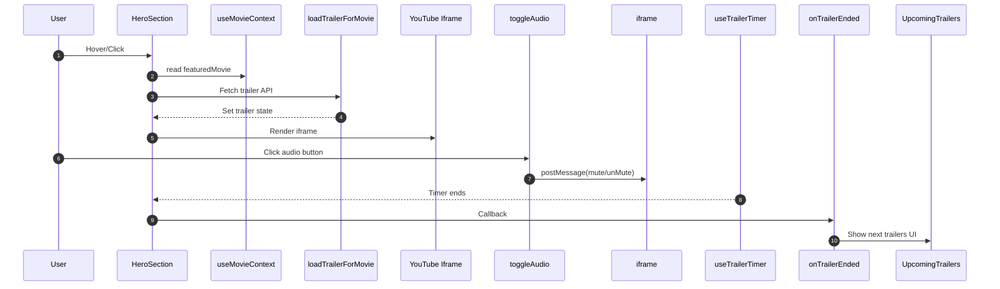

# 06 — Componenti Avanzati — Interazioni e Comunicazione

## 🎯 Obiettivi del Modulo

Alla fine di questo modulo, sarai in grado di:
- **Progettare** componenti compositi complessi (Hero, Carousel, Player)
- **Gestire** iframe e postMessage per comunicazione cross-origin
- **Isolare** complessità tramite custom hooks e cleanup
- **Sincronizzare** side effects, timers e listeners
- **Orchestrare** state locale e context globale

**⏱️ Tempo stimato**: 8-10 ore di studio e pratica

**📋 Prerequisiti**: Aver completato i moduli 00, 01, 02, 03, 04, 05

---

## 📚 Struttura del Modulo

Questo modulo è organizzato in sezioni **progressive**:

1. **Boundary di Responsabilità** - Separation of concerns nei componenti
2. **iframe e postMessage** - Comunicazione cross-origin sicura
3. **Custom Hooks e Cleanup** - Isolamento logica e gestione effetti
4. **Componenti Compositi** - Hero Section, Carousel, Video Player

### Mappa Concettuale



---

## 1. Boundary di Responsabilità

> **🎯 Obiettivo**: Separare render, orchestrazione e side effects

### 1.0 Tre Livelli di Responsabilità

#### 💡 Architettura Multi-Layer

**Component Responsibility**:

```
┌─────────────────────────────────┐
│  PRESENTATION                   │ ← Rendering UI
├─────────────────────────────────┤
│  ORCHESTRATION                  │ ← State, Callbacks
├─────────────────────────────────┤
│  SIDE EFFECTS                   │ ← API, Timers, Listeners
└─────────────────────────────────┘
```

**Esempio: HeroSection**

```26:49:components/hero-section.tsx
export function HeroSection({ onTrailerEnded, onMovieChange, showUpcomingTrailers = false, onLoaded, currentHeroMovieIndex = 0, onUpcomingMovieSelect }: HeroSectionProps) {
    // Usa il context per stato globale
    const { movies, currentIndex, featuredMovie, loading, error, changeToNextMovie, changeToMovie } = useMovieContext()

    // Hook personalizzati
    const { parallaxRef, scrollY } = useParallax()
    const { showControls, setShowControls, isHovered, setIsHovered, isScrolled, initialLoad, shouldShowControls } = useHeroControls()

    const { isHovered: smartHovered, hoverRef, handleMouseEnter, handleMouseLeave } = useSmartHover({
        delay: 1000, // Aumento il delay per dare più tempo
        onEnter: () => {
            setShowControls(true)
            setIsHovered(true)
        },
        onLeave: () => {
            setIsHovered(false)
            // La logica di nascondimento è gestita da useHeroControls
        }
    })

    // Stati locali semplificati
    const [trailer, setTrailer] = useState<string | null>(null)
    const [isMuted, setIsMuted] = useState(true)
    const iframeRef = useRef<HTMLIFrameElement>(null)
```

**🔍 Analisi Architetturale:**

**Linea 26:** Props interface (PRESENTATION boundary)
- Contratto esterno al componente
- Solo callbacks, nessun state

**Linee 28-32:** Custom hooks (ORCHESTRATION)
- Logica riutilizzabile isolata
- `useParallax`, `useHeroControls`, `useSmartHover`

**Linee 47-49:** State locale (ORCHESTRATION)
- Stato UI specifico
- Non elevato in context

**Linee 52-87:** Side effects (iframe commands)
- Comunicazione con iframe YouTube
- postMessage API

---

### 1.1 Separazione Concerns

#### 📚 Pattern: Custom Hooks

**Problema**: Come isolare logica riutilizzabile?

**Soluzione**: Custom hooks

```31:44:components/hero-section.tsx
const { parallaxRef, scrollY } = useParallax()
const { showControls, setShowControls, isHovered, setIsHovered, isScrolled, initialLoad, shouldShowControls } = useHeroControls()

const { isHovered: smartHovered, hoverRef, handleMouseEnter, handleMouseLeave } = useSmartHover({
    delay: 1000, // Aumento il delay per dare più tempo
    onEnter: () => {
        setShowControls(true)
        setIsHovered(true)
    },
    onLeave: () => {
        setIsHovered(false)
        // La logica di nascondimento è gestita da useHeroControls
    }
})
```

**Pattern**:
- ✅ `useParallax` → gestisce parallax scroll
- ✅ `useHeroControls` → gestisce controlli visibilità
- ✅ `useSmartHover` → gestisce hover delay logic

**Vantaggi**:
- ✅ Testabilità (hooks testabili in isolamento)
- ✅ Riutilizzabilità (stesso hook in altri componenti)
- ✅ Leggibilità (component UI-focused)

---

### 1.2 fetch: RSC vs Client

#### 🎓 Quando Fetchare Dati

**Server Component** (RSC fetch):

```typescript
// app/movies/page.tsx (Server Component)
async function MoviesPage() {
    const movies = await fetch(`${TMDB_BASE_URL}/movie/popular`)
    // ✅ Fetched at build/request time
    return <MovieGrid movies={movies} />
}
```

**Client Component** (useEffect fetch):

```121:144:components/hero-section.tsx
const loadTrailerForMovie = useCallback(async (movie: TMDBMovie) => {
    try {
        console.log(`🎬 Caricamento trailer per: ${movie.title}`)
        const response = await fetch(`/api/tmdb/movies/${movie.id}/videos`)
        const data = await response.json()

        if (data.success && data.data?.results?.length > 0) {
            const mainTrailer = findMainTrailer(data.data.results)
            if (mainTrailer) {
                setTrailer(mainTrailer.key)
                console.log(`✅ Trailer trovato: ${mainTrailer.key}`)
            } else {
                console.log(`⚠️ Nessun trailer valido per ${movie.title}`)
                setTrailer(null)
            }
        } else {
            console.log(`⚠️ Nessun video disponibile per ${movie.title}`)
            setTrailer(null)
        }
    } catch (error) {
        console.error(`❌ Errore caricamento trailer per ${movie.title}:`, error)
        setTrailer(null)
    }
}, [])
```

**Quando usare quale?**

| RSC Fetch | Client Fetch |
|-----------|--------------|
| Initial data | User interaction |
| Build/Request time | After render |
| No JS cost | Dynamic loading |
| SEO friendly | Loading states |

---

## 2. iframe e postMessage

> **🎯 Obiettivo**: Comunicazione sicura cross-origin

### 2.0 Se stesso-Origin Policy

#### 💡 Problema: Isolamento iframe

**SOP** (Same-Origin Policy): 
- Browsers blocca JS cross-origin
- iframe da youtube.com ≠ parent page
- Need: postMessage API

**Example**:

```typescript
// ❌ SBAGLIATO: Cross-origin access
iframe.contentWindow.document // Error!

// ✅ CORRETTO: postMessage
iframe.contentWindow.postMessage(command, origin)
```

---

### 2.1 postMessage Pattern

#### 📚 YouTube iframe API

**Pattern**: Parent → iframe communication

```51:87:components/hero-section.tsx
// Funzione per controllare l'audio senza riavviare il video
const toggleAudio = () => {
    if (iframeRef.current && iframeRef.current.contentWindow) {
        try {
            const command = isMuted ? 'unMute' : 'mute'
            
            // Prova diversi formati di comando
            const commands = [
                JSON.stringify({ event: 'command', func: command }),
                JSON.stringify({ event: 'command', func: command, args: '' }),
                `{"event":"command","func":"${command}"}`,
                `{"event":"command","func":"${command}","args":""}`
            ]
            
            commands.forEach(cmd => {
                iframeRef.current?.contentWindow?.postMessage(cmd, 'https://www.youtube.com')
            })
            
            // Fallback: aggiorna l'URL dell'iframe
            setTimeout(() => {
                if (iframeRef.current) {
                    const currentSrc = iframeRef.current.src
                    const newMuted = !isMuted
                    const newSrc = getYouTubeEmbedUrl(trailer!, true, newMuted)
                    if (currentSrc !== newSrc) {
                        iframeRef.current.src = newSrc
                    }
                }
            }, 100)
            
        } catch (error) {
            console.error('❌ Errore PostMessage:', error)
        }
    }
    
    setIsMuted(!isMuted)
}
```

**🔍 Analisi:**

**Linea 65-67:** postMessage multiple attempts
- Browser compatibility variations
- Fallback strategies

**Linea 66:** `'https://www.youtube.com'` origin
- **Security**: Solo YouTube può ricevere
- **Best practice**: Specific origin

**Linee 70-79:** Fallback URL update
- Se postMessage fallisce
- Re-render iframe con nuovo URL

---

### 2.2 Message Listener

#### 📚 iframe → Parent Communication

**Pattern**: Listen for messages

```71:129:components/video-player.tsx
const handlePlayerEvent = (event: MessageEvent) => {
    // Verifica origin per sicurezza
    if (event.origin !== 'https://vixsrc.to' && event.origin !== 'http://localhost:3000') {
        return
    }
    
    // Qui gestisci eventi dal player
    console.log('Evento ricevuto:', event.data)
    
    if (event.data.type === 'ready') {
        setIsLoading(false)
        setError(null)
    } else if (event.data.type === 'error') {
        setIsLoading(false)
        setError('Errore nel caricamento del video')
    } else if (event.data.type === 'play') {
        setIsPlaying(true)
        onPlay?.(event.data.time)
    } else if (event.data.type === 'pause') {
        setIsPlaying(false)
        onPause?.(event.data.time)
    } else if (event.data.type === 'timeupdate') {
        setCurrentTime(event.data.time)
        setDuration(event.data.duration)
        onTimeUpdate?.(event.data.time, event.data.duration)
    } else if (event.data.type === 'seeked') {
        setCurrentTime(event.data.time)
        onSeeked?.(event.data.time)
    } else if (event.data.type === 'ended') {
        setIsPlaying(false)
        onEnded?.()
    }
}

// Setup event listener per i messaggi
useEffect(() => {
    window.addEventListener('message', handlePlayerEvent)
    return () => window.removeEventListener('message', handlePlayerEvent)
}, [handlePlayerEvent])
```

**🔍 Analisi:**

**Linee 73-76:** Origin check
- **Security critical**: Whitelist origins
- Solo VixSRC e localhost accettati

**Linea 127-129:** Event listener cleanup
- `useEffect` con cleanup function
- Previne memory leaks

**Linea 128:** Dependency array includes handler
- Re-create listener se handler cambia
- Avoid stale closures

---

#### 🧠 Esercizio di Ragionamento 2.2

**Domanda**: Perché verificare `event.origin` nel listener?

<details>
<summary>💭 Pensa...</summary>

**Security**: Senza check, qualunque sito può postMessage:

```typescript
// ❌ Attacker site
window.postMessage({ type: 'malicious' }, '*')
// Matches listener: Vulnerability!
```

Con check:
```typescript
// ✅ Solo whitelisted origins
if (event.origin !== 'https://trusted.com') return
// Attacker blocked
```
</details>

---

### 2.3 YouTube API Commands

#### 📚 Comandi Iframe YouTube

**Supported commands**:

```typescript
// Mute/Unmute
postMessage({ event: 'command', func: 'mute' }, origin)
postMessage({ event: 'command', func: 'unMute' }, origin)

// Play/Pause
postMessage({ event: 'command', func: 'playVideo' }, origin)
postMessage({ event: 'command', func: 'pauseVideo' }, origin)

// Seek
postMessage({ event: 'command', func: 'seekTo', args: [60] }, origin)
```

**🔬 Esempio Dal Progetto:**

```51:87:components/hero-section.tsx
const toggleAudio = () => {
    if (iframeRef.current && iframeRef.current.contentWindow) {
        try {
            const command = isMuted ? 'unMute' : 'mute'
            
            // Prova diversi formati di comando
            const commands = [
                JSON.stringify({ event: 'command', func: command }),
                JSON.stringify({ event: 'command', func: command, args: '' }),
                `{"event":"command","func":"${command}"}`,
                `{"event":"command","func":"${command}","args":""}`
            ]
            
            commands.forEach(cmd => {
                iframeRef.current?.contentWindow?.postMessage(cmd, 'https://www.youtube.com')
            })
            
            // Fallback: aggiorna l'URL dell'iframe
            setTimeout(() => {
                if (iframeRef.current) {
                    const currentSrc = iframeRef.current.src
                    const newMuted = !isMuted
                    const newSrc = getYouTubeEmbedUrl(trailer!, true, newMuted)
                    if (currentSrc !== newSrc) {
                        iframeRef.current.src = newSrc
                    }
                }
            }, 100)
            
        } catch (error) {
            console.error('❌ Errore PostMessage:', error)
        }
    }
    
    setIsMuted(!isMuted)
}
```

**Multi-format strategy** per compatibilità browser.

---

## 3. Custom Hooks e Cleanup

> **🎯 Obiettivo**: Isolare logica e gestire cleanup

### 3.0 useTrailerTimer

#### 💡 Timer Hook Personalizzato

**Pattern**: Isolamento timer logic

```89:95:components/hero-section.tsx
const { trailerEnded, setTrailerEnded, resetTimer } = useTrailerTimer({
    trailer,
    onTrailerEnded: () => {
        setTrailer(null)
        onTrailerEnded?.()
    }
})
```

**Hook Implementation** (presumibilmente):

```typescript
// hooks/useTrailerTimer.ts
export function useTrailerTimer({ 
    trailer, 
    onTrailerEnded 
}: { 
    trailer: string | null
    onTrailerEnded?: () => void 
}) {
    const [trailerEnded, setTrailerEnded] = useState(false)
    const timerRef = useRef<NodeJS.Timeout>()

    useEffect(() => {
        if (!trailer) return

        timerRef.current = setTimeout(() => {
            setTrailerEnded(true)
            onTrailerEnded?.()
        }, 30000) // 30s trailer duration

        return () => {
            if (timerRef.current) {
                clearTimeout(timerRef.current)
            }
        }
    }, [trailer, onTrailerEnded])

    const resetTimer = useCallback(() => {
        if (timerRef.current) {
            clearTimeout(timerRef.current)
        }
        setTrailerEnded(false)
    }, [])

    return { trailerEnded, setTrailerEnded, resetTimer }
}
```

**Pattern**: Cleanup automatico con `useEffect` return

---

### 3.1 Effect Cleanup Pattern

#### 📚 When To Cleanup?

**Sempre cleanup** per:
- ✅ Timers (`setTimeout`, `setInterval`)
- ✅ Event listeners (`addEventListener`)
- ✅ Subscriptions (WebSocket, RxJS)
- ✅ Iframes con postMessage

**🔬 Esempio Dal Progetto:**

```125:129:components/video-player.tsx
useEffect(() => {
    window.addEventListener('message', handlePlayerEvent)
    return () => window.removeEventListener('message', handlePlayerEvent)
}, [handlePlayerEvent])
```

**Linea 127:** Cleanup function
- Removes listener on unmount
- Prevents memory leaks

**Linea 128:** Dependency array
- Re-subscribe se handler cambia
- Fresh closure

---

### 3.2 useCallback per Stabilizzzare Handlers

#### 📚 Handler Optimization

**Problema**: Funzioni ri-create ogni render → extra re-renders

**Soluzione**: `useCallback`

```121:144:components/hero-section.tsx
const loadTrailerForMovie = useCallback(async (movie: TMDBMovie) => {
    try {
        console.log(`🎬 Caricamento trailer per: ${movie.title}`)
        const response = await fetch(`/api/tmdb/movies/${movie.id}/videos`)
        const data = await response.json()

        if (data.success && data.data?.results?.length > 0) {
            const mainTrailer = findMainTrailer(data.data.results)
            if (mainTrailer) {
                setTrailer(mainTrailer.key)
                console.log(`✅ Trailer trovato: ${mainTrailer.key}`)
            } else {
                console.log(`⚠️ Nessun trailer valido per ${movie.title}`)
                setTrailer(null)
            }
        } else {
            console.log(`⚠️ Nessun video disponibile per ${movie.title}`)
            setTrailer(null)
        }
    } catch (error) {
        console.error(`❌ Errore caricamento trailer per ${movie.title}:`, error)
        setTrailer(null)
    }
}, [])
```

**Linea 121:** `useCallback` wrapper
- Reference stable across renders
- Dependency array empty (non dipende da props/state)

---

## 4. Componenti Compositi

> **🎯 Obiettivo**: Costruire UI avanzati interattivi

### 4.0 Content Carousel

#### 📚 Scroll Control Pattern

**Component**: Horizontal scrolling con controlli

```19:51:components/content-carousel.tsx
const scroll = (direction: 'left' | 'right') => {
    if (!scrollRef.current) return

    const scrollAmount = 300
    const currentScroll = scrollRef.current.scrollLeft
    const targetScroll = direction === 'left'
        ? currentScroll - scrollAmount
        : currentScroll + scrollAmount

    scrollRef.current.scrollTo({
        left: targetScroll,
        behavior: 'smooth'
    })

    // Update scroll state after animation
    setTimeout(() => {
        if (scrollRef.current) {
            setCanScrollLeft(scrollRef.current.scrollLeft > 0)
            setCanScrollRight(
                scrollRef.current.scrollLeft <
                scrollRef.current.scrollWidth - scrollRef.current.clientWidth
            )
        }
    }, 300)
}

const handleScroll = () => {
    if (!scrollRef.current) return

    const { scrollLeft, scrollWidth, clientWidth } = scrollRef.current
    setCanScrollLeft(scrollLeft > 0)
    setCanScrollRight(scrollLeft < scrollWidth - clientWidth)
}
```

**Pattern**:
- ✅ `scrollRef` per accesso DOM imperativo
- ✅ `scrollTo` con smooth behavior
- ✅ State sync dopo animation

---

### 4.1 Hero Section Sequence

#### 🔬 Flusso Interazione Completo

**Sequenza**:



**🔬 Implementazione Reale**:

```113:118:components/hero-section.tsx
useEffect(() => {
    if (featuredMovie) {
        loadTrailerForMovie(featuredMovie)
        resetTimer() // Reset timer quando cambia film
    }
}, [featuredMovie, resetTimer])
```

**Linea 113-118:** Effect triggers carica trailer
- Dipende da `featuredMovie`
- Reset timer per nuovo film

---

## 📝 Esercizi Finali del Modulo

### Esercizio 1: YouTube Control Hook

**Obiettivo:** Crea `useYouTubeControl` hook

**Requisiti**:
- [ ] Comandi: play, pause, mute, unmute, seek
- [ ] Fallback a URL update
- [ ] Type-safe API
- [ ] Error handling

---

### Esercizio 2: Video Player Keyboard

**Obiettivo:** Aggiungi controlli tastiera

**Requisiti**:
- [ ] Space → play/pause
- [ ] Arrow Left/Right → seek ±10s
- [ ] M → mute/unmute
- [ ] F → fullscreen
- [ ] Focus management
- [ ] Security: only when focused

---

### Esercizio 3: Auto-scroll Carousel

**Obiettivo:** Auto-scroll ogni 5s

**Requisiti**:
- [ ] Timer based auto-scroll
- [ ] Pausa su hover
- [ ] Cleanup su unmount
- [ ] Integrazione scroll state

---

## ✅ Checklist Finale

Verifica di aver compreso:

- [ ] Boundary di responsabilità (render vs orchestration vs effects)
- [ ] postMessage con origin check
- [ ] useEffect cleanup pattern
- [ ] useCallback optimization
- [ ] Custom hooks composition
- [ ] Scroll control imperative
- [ ] Iframe security

---

## 📚 Risorse Aggiuntive

- **postMessage MDN**: https://developer.mozilla.org/en-US/docs/Web/API/Window/postMessage
- **YouTube IFrame API**: https://developers.google.com/youtube/iframe_api_reference
- **React Cleanup**: https://react.dev/learn/synchronizing-with-effects#cleanup

---

## 🔍 Domande Guida per l'Apprendimento

1. **Security**: Cosa succede se non verifichi origin nel message listener?
2. **Cleanup**: Quando cleanup è opzionale vs obbligatorio?
3. **Hooks**: Perché useCallback anche se component è già memoized?

---

## 🔗 Collegamenti

- **Reference**: `components/hero-section.tsx`, `components/video-player.tsx`, `components/content-carousel.tsx`
- **Modulo precedente**: 05 - Componenti UI di Base
- **Modulo successivo**: 07 - State Management con Context

---

**Congratulazioni!** 🎉

Hai compreso componenti avanzati e postMessage. Prossimo modulo: State Management!
