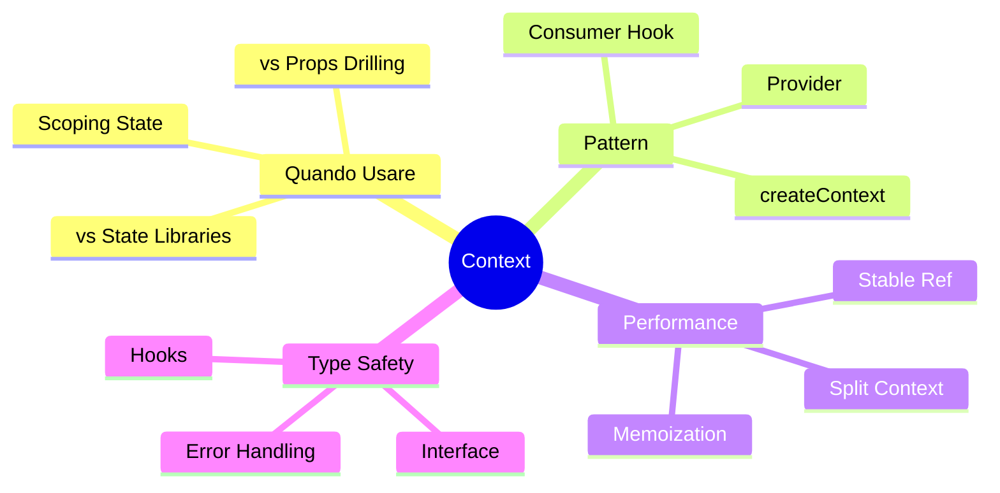

# 07 — State Management con React Context

## 🎯 Obiettivi del Modulo

Alla fine di questo modulo, sarai in grado di:
- **Comprendere** quando usare Context vs alternative
- **Progettare** provider e consumer con contratti type-safe
- **Ottimizzare** performance riducendo re-renders
- **Integrare** Context con Server Components e client
- **Gestire** error boundaries per context

**⏱️ Tempo stimato**: 6-8 ore di studio e pratica

**📋 Prerequisiti**: Aver completato i moduli 00, 01, 02, 03, 04, 05, 06

---

## 📚 Struttura del Modulo

Questo modulo è organizzato in sezioni **progressive**:

1. **Quando Usare Context** - Alternative e decisioni
2. **Provider Pattern** - CreateContext, Provider, Value
3. **Performance** - Memoization e ottimizzazioni
4. **Pattern Avanzati** - Multiple Context, Composition

### Mappa Concettuale



---

## 1. Quando Usare Context

> **🎯 Obiettivo**: Decidere quando Context è la soluzione giusta

### 1.0 Tre Opzioni di State Management

#### 💡 Props Drilling vs Context vs Libraries

**Decision Tree**:

```
State da condividere?
  ├─ Solo 1-2 livelli? → Props drilling ✅
  ├─ Molti livelli, state locale? → Context ✅
  ├─ Global, complesso, middleware? → Redux/Zustand ✅
  └─ Server state? → React Query/SWR ✅
```

**Props Drilling** (1-2 livelli):

```typescript
// ✅ OK per pochi livelli
function Parent() {
    const [count, setCount] = useState(0)
    return <Child count={count} setCount={setCount} />
}

function Child({ count, setCount }) {
    return <GrandChild count={count} setCount={setCount} />
}
```

**Context** (3+ livelli, state locale):

```typescript
// ✅ Better per molti livelli
const CountContext = createContext()

function Parent() {
    return (
        <CountProvider>
            <Child />
        </CountProvider>
    )
}

function GrandChild() {
    const { count, setCount } = useCountContext() // Skip 2 levels!
}
```

**State Libraries** (global, complesso):

```typescript
// ✅ Zustand/Redux per stato globale complesso
const useStore = create((set) => ({
    user: null,
    setUser: (user) => set({ user }),
    // Middleware, devtools, persistenza
}))
```

---

### 1.1 Problema: Props Drilling

#### 📚 Demo Problematico

**Prima di Context**:

```typescript
function App() {
    const [user, setUser] = useState(null)
    return <Page user={user} setUser={setUser} />
}

function Page({ user, setUser }) {
    return <Section user={user} setUser={setUser} />
}

function Section({ user, setUser }) {
    return <Card user={user} setUser={setUser} />
}

function Card({ user, setUser }) {
    return <Avatar user={user} setUser={setUser} />
}

function Avatar({ user, setUser }) {
    // Finalmente uso!
    return 
}
```

**Problemi**:
- ❌ Component intermedi non usano state
- ❌ API cambia se aggiungo props
- ❌ Verbosità e manutenibilità peggiori

**Con Context**:

```typescript
const UserContext = createContext()

function App() {
    return (
        <UserProvider>
            <Page />
        </UserProvider>
    )
}

function Page() {
    return <Section />
}

function Section() {
    return <Card />
}

function Card() {
    return <Avatar />
}

function Avatar() {
    const { user } = useUserContext() // Skip tutti!
    return 
}
```

---

### 1.2 Limiti di Context

#### ⚠️ Quando NON Usare Context

**Context NON va usato per**:
- ❌ Stato altamente dinamico/frequente
- ❌ Stato derivato complesso
- ❌ State con molti subscribers
- ❌ Store globali immensi

**Perché?** Re-rendering costoso!

```typescript
// ❌ BAD: Ogni setUser re-render tutti i consumers
const UserContext = createContext()
function UserProvider({ children }) {
    const [user, setUser] = useState(null)
    // Ogni update → tutti i componenti che usano UserContext re-render
    return <UserContext.Provider value={{ user, setUser }}>
        {children}
    </UserContext.Provider>
}
```

**Soluzione**: Split contexts o memoization

```typescript
// ✅ BETTER: Split stable functions
const UserContext = createContext()
const UserActionsContext = createContext()

function UserProvider({ children }) {
    const [user, setUser] = useState(null)
    const actions = useMemo(() => ({ setUser }), [])
    
    return (
        <UserContext.Provider value={user}>
            <UserActionsContext.Provider value={actions}>
                {children}
            </UserActionsContext.Provider>
        </UserContext.Provider>
    )
}
```

---

## 2. Provider Pattern

> **🎯 Obiettivo**: Implementare Context completa

### 2.0 Struttura Context

#### 📚 MovieContext Example

**Pattern Completo**:

```1:61:contexts/MovieContext.tsx
'use client'

import React, { createContext, useContext, ReactNode } from 'react'
import { TMDBMovie } from '@/lib/tmdb'
import { useMoviesWithTrailers } from '@/hooks/useMoviesWithTrailers'

interface MovieContextType {
    movies: TMDBMovie[]
    currentIndex: number
    setCurrentIndex: (index: number) => void
    loading: boolean
    error: string | null
    changeToNextMovie: () => void
    changeToMovie: (index: number) => void
    featuredMovie: TMDBMovie | null
}

const MovieContext = createContext<MovieContextType | undefined>(undefined)

interface MovieProviderProps {
    children: ReactNode
}

export const MovieProvider: React.FC<MovieProviderProps> = ({ children }) => {
    const {
        movies,
        currentIndex,
        setCurrentIndex,
        loading,
        error,
        changeToNextMovie,
        changeToMovie
    } = useMoviesWithTrailers()

    const featuredMovie = movies[currentIndex] || null

    const value: MovieContextType = {
        movies,
        currentIndex,
        setCurrentIndex,
        loading,
        error,
        changeToNextMovie,
        changeToMovie,
        featuredMovie
    }

    return (
        <MovieContext.Provider value={value}>
            {children}
        </MovieContext.Provider>
    )
}

export const useMovieContext = (): MovieContextType => {
    const context = useContext(MovieContext)
    if (context === undefined) {
        throw new Error('useMovieContext must be used within a MovieProvider')
    }
    return context
}
```

**🔍 Analisi guidata:**

**Linee 7-16:** Context interface
- Tutto type-safe
- Contratto formale per value

**Linea 18:** `createContext<MovieContextType | undefined>`
- `undefined` per default (nessun provider)
- Type check error se dimentichi provider

**Linee 20-22:** Provider props
- Solo `children` necessario
- Minimal contract

**Linee 24-33:** Provider implementation
- Usa custom hook `useMoviesWithTrailers`
- Logica isolata in hook

**Linee 37-46:** Value construction
- Inline object (va ottimizzato con useMemo)
- Include derived state (`featuredMovie`)

**Linee 55-61:** Custom hook consumer
- Error handling se usato fuori provider
- Type-safe return

---

### 2.1 Type-Safe Provider Hook

#### 📚 Error Handling Pattern

**Pattern**: Throw error se hook usato fuori provider

```55:61:contexts/MovieContext.tsx
export const useMovieContext = (): MovieContextType => {
    const context = useContext(MovieContext)
    if (context === undefined) {
        throw new Error('useMovieContext must be used within a MovieProvider')
    }
    return context
}
```

**Perché `undefined` check?**
- Debugging più facile: errore chiaro
- TypeScript type safety: `context` non può essere `undefined` dopo check

**Alternativa** (non usata qui):

```typescript
// Opzionale: default value
const MovieContext = createContext<MovieContextType>({ /* defaults */ })

// Ma perde benefit di error handling
```

---

### 2.2 Integration: Provider nel Layout

#### 📚 Layout Composition

**Provider placement in Next.js 14**:

```41:49:app/layout.tsx
<body className={`${inter.className} scrollbar-vertical`} suppressHydrationWarning={true}>
  <HLSConfigProvider>
    <NavbarProvider>
      <div className="min-h-screen bg-black text-white">
        <ConditionalLayout>
          {children}
        </ConditionalLayout>
      </div>
      <Toaster />
    </NavbarProvider>
  </HLSConfigProvider>
</body>
```

**🔍 Analisi:**

**Linee 41-49:** Multiple providers nested
- `HLSConfigProvider` (outer)
- `NavbarProvider` (middle)
- Nesting order importante

**Pattern**: Provider più global → outer
- `NavbarProvider` usato in tante pagine
- Wrapping root layout

---

### 2.3 Simple Context Example

#### 📚 NavbarContext

**Minimal context example**:

```1:43:contexts/NavbarContext.tsx
'use client'

import React, { createContext, useContext, ReactNode, useState } from 'react'

interface NavbarContextType {
    isVisible: boolean
    setIsVisible: (visible: boolean) => void
    isHovered: boolean
    setIsHovered: (hovered: boolean) => void
}

const NavbarContext = createContext<NavbarContextType | undefined>(undefined)

interface NavbarProviderProps {
    children: ReactNode
}

export const NavbarProvider: React.FC<NavbarProviderProps> = ({ children }) => {
    const [isVisible, setIsVisible] = useState(true)
    const [isHovered, setIsHovered] = useState(false)

    const value: NavbarContextType = {
        isVisible,
        setIsVisible,
        isHovered,
        setIsHovered
    }

    return (
        <NavbarContext.Provider value={value}>
            {children}
        </NavbarContext.Provider>
    )
}

export const useNavbarContext = (): NavbarContextType => {
    const context = useContext(NavbarContext)
    if (context === undefined) {
        throw new Error('useNavbarContext must be used within a NavbarProvider')
    }
    return context
}
```

**Pattern semplice**:
- ✅ State locale nel provider
- ✅ Direct useState
- ✅ Value construction inline
- ⚠️ Performance: no memoization

---

#### 🧠 Esercizio di Ragionamento 2.3

**Domanda**: Perché `NavbarContext` non usa `useMemo` mentre `MovieContext` lo richiede?

<details>
<summary>💭 Pensa...</summary>

**Frequenza di update:**
- `NavbarContext`: updates rari (show/hide navbar) → OK re-render
- `MovieContext`: updates frequenti (playlist, current index) → need memoization

**Performance tradeoff**: `useMemo` ha overhead. Usa solo se necessario.
</details>

---

## 3. Performance e Ottimizzazioni

> **🎯 Obiettivo**: Minimizzare re-renders

### 3.0 Il Problema delle Reference

#### 💡 Re-render Unnecessari

**Problema**: Value object nuova reference ogni render

```typescript
// ❌ BAD: Nuovo oggetto ogni render
function Provider({ children }) {
    const [count, setCount] = useState(0)
    return (
        <Context.Provider value={{ count, setCount }}>
            {children}
        </Context.Provider>
    )
}
// Ogni setCount → nuovo value object → tutti consumers re-render
```

**Soluzione**: `useMemo` o `useCallback`

```typescript
// ✅ GOOD: Stable reference
function Provider({ children }) {
    const [count, setCount] = useState(0)
    const value = useMemo(() => ({ count, setCount }), [count])
    return (
        <Context.Provider value={value}>
            {children}
        </Context.Provider>
    )
}
// setCount non cambia → value stabile → no re-render
```

---

### 3.1 Split Contexts

#### 📚 Separare State e Actions

**Pattern**: Context separati per frequenza update

```typescript
// State context (frequent updates)
const CountContext = createContext()
function CountProvider({ children }) {
    const [count, setCount] = useState(0)
    return <CountContext.Provider value={count}>
        {children}
    </CountContext.Provider>
}

// Actions context (stable)
const CountActionsContext = createContext()
function CountActionsProvider({ children }) {
    const setCount = useSetCount() // Custom hook
    return <CountActionsContext.Provider value={setCount}>
        {children}
    </CountActionsContext.Provider>
}
```

**Vantaggio**: 
- `count` cambia → solo CountContext consumers re-render
- `setCount` non cambia → no re-render per CountActionsContext

---

### 3.2 React.memo per Consumers

#### 📚 Memoizzazione Components

**Pattern**: Memo component che usa context

```typescript
const ExpensiveComponent = React.memo(() => {
    const { count } = useCountContext()
    // Component pesante
    return <div>{expensiveComputation(count)}</div>
})

// Solo re-render se count cambia, non se altro nel context cambia
```

---

## 4. Pattern Avanzati

> **🎯 Obiettivo**: Tecniche avanzate per Context

### 4.0 Multiple Contexts

#### 📚 Composition Pattern

**Scenario**: Multi context providers

```41:49:app/layout.tsx
<body className={`${inter.className} scrollbar-vertical`} suppressHydrationWarning={true}>
  <HLSConfigProvider>
    <NavbarProvider>
      <div className="min-h-screen bg-black text-white">
        <ConditionalLayout>
          {children}
        </ConditionalLayout>
      </div>
      <Toaster />
    </NavbarProvider>
  </HLSConfigProvider>
</body>
```

**Pattern**: Nest providers (order matters!)

---

### 4.1 Context Composition

#### 📚 Compound Providers

**Pattern**: Group related providers

```typescript
function AppProviders({ children }) {
    return (
        <ThemeProvider>
            <UserProvider>
                <CartProvider>
                    {children}
                </CartProvider>
            </UserProvider>
        </ThemeProvider>
    )
}

// Usage
<AppProviders>
    <App />
</AppProviders>
```

**Vantaggio**: Centralizzato, riutilizzabile

---

## 📝 Esercizi Finali del Modulo

### Esercizio 1: User Preferences Context

**Obiettivo:** Crea `UserPreferencesContext`

**Requisiti**:
- [ ] State: theme, autoplay, language
- [ ] Type-safe interface
- [ ] Custom hook consumer
- [ ] Error handling
- [ ] useMemo optimization

---

### Esercizio 2: Performance Measurement

**Obiettivo:** Misura re-render con/non useMemo

**Requisiti**:
- [ ] Crea context con valore volatile
- [ ] Misura re-render senza useMemo
- [ ] Aggiungi useMemo
- [ ] Confronta performance
- [ ] Documenta risultati

---

### Esercizio 3: Split Context

**Obiettivo:** Separa state da actions

**Requisiti**:
- [ ] Crea due contexts: `UserStateContext`, `UserActionsContext`
- [ ] State: frequente update
- [ ] Actions: stable
- [ ] Verifica meno re-render

---

## ✅ Checklist Finale

Verifica di aver compreso:

- [ ] Quando usare Context vs alternative
- [ ] Come creare createContext type-safe
- [ ] Provider pattern completo
- [ ] Custom hook consumer
- [ ] Error handling outside provider
- [ ] useMemo per performance
- [ ] Split contexts pattern
- [ ] Provider composition

---

## 📚 Risorse Aggiuntive

- **React Context**: https://react.dev/learn/passing-data-deeply-with-context
- **Performance**: https://kentcdodds.com/blog/how-to-optimize-your-context-value
- **Zustand**: https://github.com/pmndrs/zustand

---

## 🔍 Domande Guida per l'Apprendimento

1. **Performance**: Quando useMemo è overkill?
2. **Design**: Come decidere quali contexts creare?
3. **Scaling**: Quando Redux/Zustand invece di Context?

---

## 🔗 Collegamenti

- **Reference**: `contexts/MovieContext.tsx`, `contexts/NavbarContext.tsx`, `app/layout.tsx`
- **Modulo precedente**: 06 - Componenti Avanzati
- **Modulo successivo**: 08 - Custom Hooks

---

**Congratulazioni!** 🎉

Hai compreso state management con Context. Prossimo modulo: Custom Hooks!